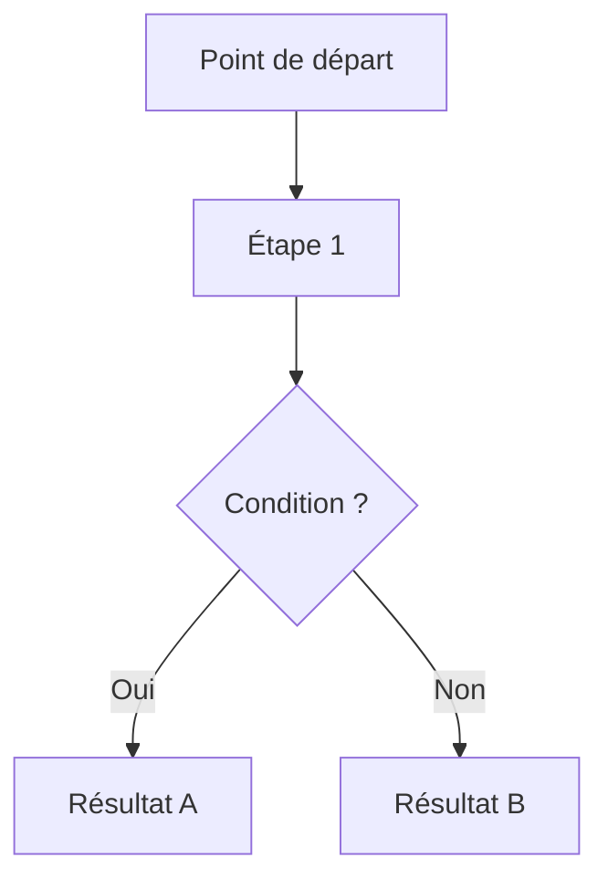

# CLAUDE.md

Ce fichier fournit à Claude Code les instructions permanentes pour travailler sur ce projet.
Il est lu automatiquement à chaque session. Ne pas modifier sans concertation de l'équipe.

---

## Vue d'ensemble du projet

Projet Unity 6000.3.5f2 — jeu de collecte de bugs sur grille dans le cadre d'une étude de recherche.
Le joueur se déplace sur une grille pour collecter des nuages de bugs en évitant des pièges.
Le projet intègre un pipeline complet de collecte de données de trial et une communication API.

**Fonctionnalités principales :**

- Mouvement sur grille via le New Input System de Unity
- Génération procédurale de niveaux (tuiles, couloirs, murs, nuages, pièges)
- Système de brouillard de guerre par texture masquée
- Spawn de nuages de bugs avec contraintes de distance Manhattan et double système de particules (vert/rouge)
- Placement dynamique des pièges en évitant les chemins optimaux
- Visualisation de pathfinding pour les routes de collecte optimales
- Pipeline de données de recherche (suivi des trials, logs de mouvement, communication API)

---

## Architecture des composants clés

### Ordre d'exécution

Les systèmes utilisent `[DefaultExecutionOrder]` pour garantir l'initialisation correcte :

| Ordre | Système                                              | Rôle                                             |
| :---- | :--------------------------------------------------- | :----------------------------------------------- |
| -300  | `LevelRegistry`                                      | Source de vérité unique pour l'état de la grille |
| -250  | `FogController`                                      | Texture masque du brouillard de guerre           |
| -240  | `TilesSpawner`                                       | Génération de la grille de tuiles au runtime     |
| -200  | `BugCloudSpawner`                                    | Placement des nuages de bugs                     |
| -100  | `BestPath`                                           | Calcul et réservation du chemin optimal          |
| -50   | `CorridorWallsGenerator`                             | Génération des couloirs et murs                  |
| -10   | `TrapSpawner`                                        | Placement des pièges sur cellules libres         |
| 0     | `GameManager`, `SessionManager`, `GridMoverNewInput` | Logique de jeu                                   |

### Systèmes centraux

**LevelRegistry** (Singleton) : Source de vérité pour la taille de grille, taille de cellule, origine et état des cellules. Utilise des `CellFlags` bitwise (`BugCloud`, `Trap`, `PathLeft`, `PathRight`, `Reserved`, `Visited`, `Wall`). Fournit les conversions `WorldToCell`/`CellToWorld`, les vérifications de marchabilité et un événement `OnCellChanged` pour le HUD.

**GameManager** (Singleton) : Suit l'état du jeu (steps, trapsHit, bugsCollected, adhérence au chemin). Gère le cycle de vie des rounds, l'UI de score et le panneau de game over. S'intègre avec `TrialManager` pour les données de recherche.

**FogController** (Singleton) : Génère une texture masque RGBA32 lue par un shader custom (`FogUnlitMask.shadergraph`). Révélation par brush avec rayon et feathering configurables.

### Mouvement et entités

**GridMoverNewInput** : Mouvement joueur sur grille via `Keyboard.current` avec `wasPressedThisFrame`. Interpolation fluide par coroutine. Valide les mouvements via `LevelRegistry.IsWalkable()`. Révèle le brouillard et marque les cellules visitées à chaque step.

**BugCloud** : Deux systèmes de particules (bugs verts/rouges). `totalBugs` et `greenRatio` configurables. Les collisions trigger la collecte via GameManager.

**Trap** : Collision trigger simple. GameManager applique une pénalité (-1 bug par cloud par piège touché).

### Systèmes de spawn

**BugCloudSpawner** (Awake, -200) : Place 2 nuages à distance Manhattan du joueur, un dans la moitié gauche, un dans la droite, même Y. Configure aléatoirement les counts de bugs (20-80) et ratios verts (0.4-0.8). Enregistre les nuages dans LevelRegistry et GameManager.

**BestPath** (Start, -100) : Calcule deux chemins Manhattan les plus courts (joueur → nuage gauche, joueur → nuage droit). Réserve les deux comme PathLeft/PathRight dans LevelRegistry. Visualise le chemin choisi avec des prefabs quad.

**CorridorWallsGenerator** (Start, -50) : Élargit les chemins réservés en couloirs de largeur configurable. Ajoute des connexions supplémentaires pour réduire les culs-de-sac. Marque les cellules restantes comme murs.

**TrapSpawner** (Start, -10) : Place les pièges sur les cellules passant `LevelRegistry.IsFreeForTrap()`. Count configurable via args de ligne de commande.

**TilesSpawner** (Awake, -240) : Génère la grille de tuiles au runtime. Calcule `LevelRegistry.originWorld` depuis la position du joueur (le joueur doit être centré en X, à z=0).

### Outils éditeur

**MapGenerator** (742 lignes) : Outil de prévisualisation éditeur-only complet. Commandes via menu contextuel : "Generate (Editor Preview)" / "Clear (Editor Preview)". Duplique la logique des spawners runtime pour produire une prévisualisation complète sans entrer en Play Mode.

### Pipeline de données de recherche

**SessionManager** : Parse les args de ligne de commande (`trapCount=N`, `sessionId=X`) et configure les objets de scène au démarrage.

**TrialManager** : Collecte les données de trial (log du chemin joueur, config de la map, choix, justesse). Poste les données de trial en batch vers une API REST (`/api/trials`) avec auth par token.

**TrialData / PlayerStep** : Structures de données sérialisables pour le suivi des trials (coordonnées grille + timestamps ISO).

---

## Structure du projet

```
Assets/
├── Game/
│   ├── Prefabs/          # BugCloud, Player, Tile, Trap, Wall, Quad, FogSurface, Ground
│   │   ├── Characters/   # Personnages modulaires SciFi
│   │   └── DesignProto/  # Proto V0 (Nature) / V1 (Alien) variantes de tuiles
│   ├── Scripts/          # 18 scripts C# du jeu
│   ├── Shaders/          # FogUnlitMask, CharacterOutlineUnlit, CorruptedTile (.shadergraph)
│   ├── Scenes/
│   │   ├── GameScenes/   # (vide — scènes production à venir)
│   │   └── Sandboxes/    # Florian/ (prototypes design) et Pierre/ (SampleScene, WebTestScene)
│   ├── Animations/, Audio/, Materials/, Textures/, UI/
├── External/             # Assets tiers
│   ├── Characters/       # FreeLowPolyRobot, LP_SciFiCharacters
│   ├── Environment/      # SimpleNaturePack, Sci-Fi Modular Pack, Alien Worlds
│   ├── VFX/              # Polygon Arsenal (effets particules)
│   └── Materials/, Animations/Mixamo/
├── Settings/             # Config pipeline URP
└── TextMesh Pro/         # Assets TMP
```

---

## Système de coordonnées grille

- **Coordonnées grille** (Vector2Int) : Origine (0,0) en bas à gauche. X croît vers la droite, Y croît vers l'avant.
- **Coordonnées monde** (Vector3) : Grille X → Monde X, Grille Y → Monde Z. Monde Y est l'élévation.
- **Taille de cellule** : 1 unité (configurable dans LevelRegistry).
- **Conversions** : `LevelRegistry.WorldToCell(Vector3)` / `LevelRegistry.CellToWorld(Vector2Int, float)`.

---

## Tâches de développement courantes

### Build du projet

Ouvrir dans Unity Editor 6000.3.5f2 et utiliser Build Settings (File > Build Settings).

### Dépendances clés

| Package                                | Version | Usage                                        |
| :------------------------------------- | :------ | :------------------------------------------- |
| `com.unity.inputsystem`                | 1.17.0  | New Input System                             |
| `com.unity.render-pipelines.universal` | 17.3.0  | Rendu URP                                    |
| `com.unity.ai.navigation`              | 2.0.9   | Navigation (importé, pas activement utilisé) |
| `com.unity.timeline`                   | 1.8.10  | Timeline/animation                           |

### Tests

Unity Test Framework (`com.unity.test-framework` : `1.6.0`). Pas de scripts de test custom pour l'instant.

---

## Style de code

- **Langue des commentaires et logs** : Français
- **Conventions de nommage** :

```csharp
// Classes et MonoBehaviours : PascalCase
public class LevelRegistry : MonoBehaviour { }

// Méthodes publiques : PascalCase, verbe d'action
public void RegisterCloud(BugCloud cloud) { }

// Variables privées : _camelCase avec underscore
private int _currentHealth;

// Variables sérialisées (visibles dans l'Inspector)
[SerializeField] private float _moveSpeed = 5f;

// Constantes : UPPER_SNAKE_CASE
private const int MAX_TRAP_COUNT = 10;

// Events : On + NomEvenement
public event Action<Vector2Int> OnCellChanged;
public event Action OnPlayerDied;

// Attributs Inspector
[Header("Configuration")]
[Tooltip("Description courte du rôle de ce champ")]
```

- **Patterns Singleton** : `LevelRegistry.Instance`, `GameManager.Instance`, `FogController.Instance`
- **Lifecycle MonoBehaviour** : Méthodes standard (Awake, Start, Update) en respectant l'ordre d'exécution documenté ci-dessus.

---

## Notes d'implémentation importantes

### Pipeline de spawn et génération

L'ordre d'exécution est critique : `LevelRegistry` → `FogController` → `TilesSpawner` → `BugCloudSpawner` → `BestPath` → `CorridorWallsGenerator` → `TrapSpawner` → `GameManager`. Tout état spatial transite par `LevelRegistry` — pas de références directes entre spawners.

### Contraintes spatiales

- Le joueur doit démarrer sur la première rangée (z=0), centré horizontalement
- Les nuages de bugs sont placés au minimum à z=5, distance Manhattan ≥3 depuis le joueur
- Les pièges ne peuvent pas se superposer aux chemins, nuages, murs ou cellule du joueur

### Système de mouvement

`GridMoverNewInput` utilise `wasPressedThisFrame` pour un mouvement discret step-by-step. Les inputs sont verrouillés quand `GameManager.inputLocked == true`.

### Flux de jeu

1. **Chargement de scène** : Les systèmes s'initialisent dans l'ordre d'exécution (Awake puis Start)
2. **SessionManager.Start()** : Parse les args de ligne de commande, appelle `GameManager.BeginFirstRound()`
3. **Gameplay** : Steps joueur → valider → déplacer → révéler brouillard → marquer visité → tracker dans TrialManager
4. **Fin de round** : Collision nuage → verrouiller inputs → calculer récompenses → envoyer données trial → afficher game over UI → rechargement de scène

---

## Protocole de documentation (TDD)

### Fichiers de référence

| Fichier                          | Rôle                                                            |
| :------------------------------- | :-------------------------------------------------------------- |
| `Docs/TDD_Template_MockUp.md`    | Structure de référence — ne jamais modifier ce fichier          |
| `Docs/TDD_Notice_Utilisation.md` | Guide détaillé de chaque section du TDD                         |
| `Docs/TDD.md`                    | Document vivant du projet — c'est ce fichier qui est mis à jour |

### Comment déclencher une mise à jour de documentation

La documentation est mise à jour **à la demande**, quand un développeur juge qu'un système est stable et validé. Il n'y a pas de mise à jour automatique sur du code expérimental.

**La demande peut être formulée librement en français**, par exemple :

- `!doc LevelRegistry`
- `"Mets à jour la doc pour le système de génération de niveaux"`
- `"Documente ce qu'on vient de faire sur le BugCloudSpawner et le BestPath"`
- `"La grille est stable, génère la section TDD pour LevelRegistry et GridMoverNewInput"`

Claude Code reconnaît toute formulation demandant une documentation de système et suit le protocole ci-dessous.

### Protocole d'exécution — étapes obligatoires

Quand une demande de documentation est détectée :

**1. Identifier les systèmes concernés**
Analyser la demande et lister explicitement les fichiers `.cs` et `ScriptableObjects` qui seront couverts. Demander confirmation si la liste semble incomplète ou ambiguë.

**2. Identifier les dépendances impactées**
Vérifier si d'autres systèmes déjà documentés dans `TDD.md` ont leur section "Dépendances" qui devrait être mise à jour suite à ce changement. Lister ces systèmes et demander si on les traite dans la même passe.

**3. Analyser le code source réel**
Lire les fichiers identifiés. Ne pas décrire ce que le dev a dit que le système fait — décrire ce que le code fait réellement.

**4. Générer le diagramme de flux en Mermaid**
Pour chaque système documenté, produire un diagramme `mermaid` représentant le data flow ou les transitions d'état principales. Ce diagramme va dans la section `X.X.4 Diagramme de flux` du TDD.



Utiliser `graph TD` pour les flux de données, `stateDiagram-v2` pour les machines à états.

**5. Produire le diff complet**
Générer le texte exact à insérer ou modifier dans `TDD.md`, en respectant la structure de `TDD_Template_MockUp.md` et les informations de `TDD_Notice_Utilisation.md`. Présenter le diff clairement avant toute écriture.

**6. Attendre la validation**
Ne jamais écrire dans `TDD.md` sans que le développeur ait validé le diff. Proposer des ajustements si demandé.

**7. Écrire et confirmer**
Après validation, écrire les changements dans `TDD.md` et confirmer les sections modifiées.

### Règles immuables

- **Ne jamais écraser les entrées existantes du Journal d'Implémentation** — uniquement append en bas du tableau.
- **Ne jamais supprimer une section existante** sans demande explicite et confirmation.
- **Ne jamais committer** le code et la doc ensemble sans que les deux aient été revus.
- **Les diagrammes Mermaid** remplacent les liens Figma dans les sections `X.X.4 Diagramme de flux`. Le lien Figma reste uniquement pour le diagramme d'architecture macro (section 2.2 du TDD).
- **Le template est la référence de structure** — si une section du TDD dévie du format de `TDD_Template_MockUp.md` et de l'utilisation `TDD_Notice_Utilisation.md`, signaler l'écart avant de continuer.

### Format du Journal d'Implémentation (section X.X.7)

Chaque entrée ajoutée automatiquement doit suivre ce format :

| Date     | Développeur | Note / Décision Technique                    |
| :------- | :---------- | :------------------------------------------- |
| JJ/MM/AA | @auteur     | Description de la décision ou du changement. |

Si le développeur ne précise pas son nom, utiliser `@auteur` comme placeholder et le signaler.

### Ce que Claude Code peut inférer automatiquement depuis le code

- Data Model : classes, variables publiques/sérialisées, méthodes publiques
- Dépendances : lectures des `using`, accès aux `.Instance`, paramètres des méthodes
- Points d'attention : commentaires `// TODO`, `// FIXME`, `// HACK`, `// ⚠️` dans le code
- Diagramme de flux : ordre d'appel des méthodes dans `Awake`/`Start`/`Update`, structure des coroutines

### Ce que Claude Code ne peut pas inférer — à compléter manuellement

- Les formules et règles métier si elles ne sont pas dans le code (ex : formules de scoring définies externellement)
- Les décisions d'architecture qui ont été abandonnées (la section "Alternatives évaluées" nécessite l'input du dev)
- Le contexte recherche / scientifique derrière les paramètres du jeu

---

## Workflow complet de documentation

```
Dev : "!doc [SystemName]" ou demande en langage naturel
         ↓
Claude Code identifie les fichiers concernés
         ↓
Claude Code vérifie les dépendances impactées dans TDD.md
         ↓
Claude Code génère : Data Model + Diagramme Mermaid + Dépendances + Points d'attention + entrée Journal
         ↓
Claude Code présente le diff complet pour review
         ↓
Dev valide ou demande des ajustements
         ↓
Claude Code écrit dans TDD.md
         ↓
Dev committe code + doc dans le même commit
```
