# Architecture runtime — BUGS (Unity)

> Diagramme de référence pour la documentation du projet.
> Décrit les 4 phases du cycle de vie d'un round, le rôle de chaque script,
> et les appels inter-scripts qui les lient.
>
> **MapGenerator** (outil éditeur) est volontairement exclu — il ne tourne pas en production.

---

## Légende des catégories

| Couleur | Catégorie | Rôle |
|:--------|:----------|:-----|
| 🔵 Bleu | **Système** | Singleton persistant, logique globale (état, score, données) |
| 🟠 Orange | **Spawner** | Génération procédurale, exécuté une seule fois au chargement de scène |
| 🟢 Vert | **Entité / Contrôleur** | Objet de gameplay instancié en jeu (joueur, nuages, pièges) |
| 🟣 Violet | **Donnée / Recherche** | Pipeline de collecte et d'envoi des données de trial |
| ⚪ Gris | **Debug** | Utilitaire de développement, absent en production |

---

## Diagramme d'architecture et de flux

```mermaid
flowchart TD

    %% ═══════════════════════════════════════════════════════════════
    %% SYSTÈMES CENTRAUX — Singletons persistants tout au long du round
    %% Colonne vertébrale du jeu : tous les Spawners et Entités
    %% lisent ou écrivent dans ces systèmes.
    %% ═══════════════════════════════════════════════════════════════

    subgraph SYS["SYSTÈMES — Singletons persistants"]
        direction LR

        LR["<b>LevelRegistry</b>
        Source de vérité unique de la grille.
        CellFlags bitwise par cellule,
        conversions World↔Cell,
        marchabilité, RNG déterministe."]

        GM["<b>GameManager</b>
        Score, steps, trapsHit, bugsCollected.
        Cycle de vie du round,
        verrouillage des inputs,
        UI score + game over."]

        FC["<b>FogController</b>
        Brouillard de guerre par
        texture masque RGBA32.
        Révélation par brush +
        feathering via shader."]

        SM["<b>SessionManager</b>
        Parse args CLI
        (seed, trapCount, sessionId).
        Applique la roundSeed,
        lance le premier round."]

        TM["<b>TrialManager</b>
        Collecte les données de manche
        (chemin, config, choix, justesse).
        Envoi batch API REST."]
    end

    %% ═══════════════════════════════════════════════════════════════
    %% PHASE 1 — INITIALISATION (Awake)
    %% Tous les Awake s'exécutent en premier, dans l'ordre
    %% défini par DefaultExecutionOrder.
    %% Objectif : poser l'infrastructure (grille, fog, seed, UI).
    %% ═══════════════════════════════════════════════════════════════

    subgraph P1["PHASE 1 — INITIALISATION · Awake"]
        direction TB

        P1_LR["LevelRegistry · Awake · –300
        Singleton + état grille vierge"]

        P1_FC["FogController · Awake · –250
        Singleton + crée texture masque"]

        P1_TS["TilesSpawner · Awake · –240
        Instancie la grille de tuiles,
        calcule originWorld
        pour centrer la grille sur le joueur"]

        P1_SM["SessionManager · Awake · 0
        Parse seed depuis args CLI,
        applique roundSeed"]

        P1_GM["GameManager · Awake · 0
        Singleton + initialise UI"]

        P1_LR --> P1_FC --> P1_TS --> P1_SM --> P1_GM
    end

    P1_TS -->|"écrit originWorld"| LR
    P1_SM -->|"SetRoundSeed()"| LR
    P1_FC ---|"lit gridSize"| LR

    %% ═══════════════════════════════════════════════════════════════
    %% PHASE 2 — GÉNÉRATION DE MAP (Start, séquentiel)
    %% Les Spawners s'exécutent dans un ordre strict garanti par
    %% DefaultExecutionOrder. Chaque Spawner lit l'état courant
    %% du LevelRegistry et y inscrit ses propres réservations.
    %% C'est la chaîne de dépendances qui construit la map.
    %% ═══════════════════════════════════════════════════════════════

    subgraph P2["PHASE 2 — GÉNÉRATION DE MAP · Start séquentiel"]
        direction TB

        PS["<b>PlayerSpawner</b> · –250
        Instancie le prefab joueur
        à la position de spawn.
        Enregistre sa case dans le registre."]

        BCS["<b>BugCloudSpawner</b> · –200
        Place 2 nuages sur une couronne
        Manhattan symétrique (L / R).
        Tire totalBugs + greenRatio
        avec gap de difficulté.
        Configure les particules."]

        BP["<b>BestPath</b> · –100
        Calcule 2 chemins Manhattan
        optimaux (joueur→L, joueur→R).
        Réserve les cellules des chemins.
        Visualise le chemin conseillé
        via quads, révèle le fog."]

        CWG["<b>CorridorWallsGenerator</b> · –50
        Génère un maze procédural, puis
        force l'ouverture des couloirs
        le long des chemins réservés.
        Connexions anti-cul-de-sac.
        Tout le reste → mur."]

        TRS["<b>TrapSpawner</b> · –10
        Place N pièges sur les cellules
        qui passent IsFreeForTrap
        (pas mur, pas réservée,
        pas nuage, pas départ joueur)."]

        SM_S["<b>SessionManager</b> · Start · 0
        Parse trapCount + sessionId.
        Lance GameManager.BeginFirstRound()."]

        PS --> BCS --> BP --> CWG --> TRS --> SM_S
    end

    %% Spawner → Système : inscriptions dans le registre
    PS -->|"RegisterPlayerStart(cell)"| LR
    BCS -->|"RegisterBugCloud(cell)"| LR
    BCS -->|"RegisterClouds(left, right)"| GM
    BP -->|"ReservePathLeft/Right(cells)"| LR
    BP -->|"SetChosenPath(cells)"| GM
    BP -->|"RevealCells(cells)"| FC
    CWG -->|"RegisterWall() ← IsOnAnyPath()"| LR
    TRS -->|"RegisterTrap() ← IsFreeForTrap()"| LR
    SM_S -->|"BeginFirstRound()"| GM

    P1 ==> P2

    %% ═══════════════════════════════════════════════════════════════
    %% PHASE 3 — GAMEPLAY (Update loop)
    %% Le joueur se déplace case par case. À chaque step,
    %% le GameManager applique les règles (pièges, chemin, score)
    %% et le TrialManager enregistre les données.
    %% La collecte d'un nuage déclenche la fin du round.
    %% ═══════════════════════════════════════════════════════════════

    subgraph P3["PHASE 3 — GAMEPLAY · Update loop"]
        direction TB

        GMI["<b>GridMoverNewInput</b>
        Lit les flèches clavier
        (wasPressedThisFrame).
        Valide la case cible
        via IsWalkable.
        Interpole le déplacement
        par coroutine SmoothStep.
        Révèle le fog,
        marque la cellule Visited."]

        BC["<b>BugCloud</b>
        2 systèmes de particules
        (vert / rouge).
        Nombre et ratio configurés
        par BugCloudSpawner.
        OnTriggerEnter Player
        → déclenche la collecte."]

        TRAP["<b>Trap</b>
        Trigger collision joueur.
        La pénalité réelle est
        gérée par GameManager."]
    end

    %% Gameplay → Systèmes
    GMI -->|"IsWalkable(cell)"| LR
    GMI -->|"MarkVisited(cell)"| LR
    GMI -->|"RevealCell(cell)"| FC
    GMI -->|"OnPlayerStep(cell)"| GM
    GM -->|"HasTrap(cell) vérifie piège"| LR
    GM -->|"Si piège : AddBugs(–1) sur chaque nuage"| BC
    GM -->|"RecordMove(cell)"| TM
    BC -->|"OnCloudCollected(this)"| GM

    P2 ==> P3

    %% ═══════════════════════════════════════════════════════════════
    %% PHASE 4 — FIN DE MANCHE & DONNÉES
    %% Déclenchée par la collecte d'un nuage.
    %% GameManager verrouille les inputs, calcule le résultat,
    %% puis délègue à TrialManager pour l'envoi des données.
    %% Le rechargement de scène relance tout depuis Phase 1.
    %% ═══════════════════════════════════════════════════════════════

    subgraph P4["PHASE 4 — FIN DE MANCHE & DONNÉES"]
        direction TB

        E1["<b>GameManager.OnCloudCollected</b>
        Verrouille les inputs.
        Calcule bugsCollected.
        Affiche le game over UI."]

        E2["<b>TrialManager.EndCurrentTrial</b>
        Enregistre choix (L/R),
        justesse, timestamp fin."]

        TD_S["<b>TrialData + PlayerStep</b>
        Structures sérialisables
        (session, block, path_log,
        map_config, seed…)"]

        E3["<b>TrialManager.SendTrials</b>
        Sérialise en JSON,
        POST /api/trials
        avec auth token."]

        RESTART["<b>GameManager.RestartRound</b>
        SceneManager.LoadScene()
        → recharge la scène entière."]

        E1 --> E2
        E2 --> E3
        E1 --> RESTART
        TM --- TD_S
    end

    GM -->|"EndCurrentTrial(choice, correct)"| E2
    GM -->|"SendTrials()"| E3
    RESTART -.->|"Recharge la scène → retour Phase 1"| P1

    P3 ==>|"Nuage collecté"| P4

    %% ═══════════════════════════════════════════════════════════════
    %% DEBUG / HUD (non présent en production)
    %% ═══════════════════════════════════════════════════════════════

    HUD["<b>LevelRegistryHUD</b> · Debug
    Affiche l'état des cellules
    et le chemin visité
    en temps réel."]
    HUD -.->|"OnCellChanged event"| LR

    %% ═══════════════════════════════════════════════════════════════
    %% STYLES PAR CATÉGORIE
    %% ═══════════════════════════════════════════════════════════════

    classDef sys fill:#3B82F6,stroke:#1E40AF,color:#fff,stroke-width:2px
    classDef spw fill:#F59E0B,stroke:#92400E,color:#fff,stroke-width:2px
    classDef ent fill:#10B981,stroke:#047857,color:#fff,stroke-width:2px
    classDef dat fill:#8B5CF6,stroke:#5B21B6,color:#fff,stroke-width:2px
    classDef dbg fill:#9CA3AF,stroke:#6B7280,color:#fff,stroke-width:1px

    class LR,FC,SM,GM,TM sys
    class P1_LR,P1_FC,P1_SM,P1_GM sys
    class P1_TS,PS,BCS,BP,CWG,TRS spw
    class SM_S sys
    class GMI,BC,TRAP ent
    class E1,RESTART ent
    class E2,E3,TD_S dat
    class HUD dbg
```

---

## Lecture du diagramme

### Flux principal

1. **Phase 1 → Phase 2** : Les Awake posent l'infrastructure (grille, fog, seed, UI), puis les Start des Spawners construisent la map dans un ordre strict garanti par `DefaultExecutionOrder`.

2. **Phase 2 (chaîne des Spawners)** : Chaque Spawner dépend de ce que le précédent a inscrit dans `LevelRegistry` :
   - `PlayerSpawner` → enregistre la case de départ (les suivants l'évitent).
   - `BugCloudSpawner` → place les nuages et réserve leurs cases.
   - `BestPath` → calcule les chemins optimaux en s'appuyant sur les nuages, réserve les cellules.
   - `CorridorWallsGenerator` → ouvre des couloirs autour des chemins réservés, mure le reste.
   - `TrapSpawner` → place les pièges uniquement sur les cellules encore libres.

3. **Phase 3 (boucle de gameplay)** : Le joueur se déplace case par case. À chaque pas, `GameManager` vérifie les pièges (pénalité sur les nuages), vérifie l'adhérence au chemin conseillé, et enregistre le mouvement dans `TrialManager`.

4. **Phase 4 (fin de manche)** : La collecte d'un nuage déclenche la clôture du trial, l'envoi des données à l'API, puis le rechargement de la scène (retour Phase 1).

### Rôle central de LevelRegistry

`LevelRegistry` est le **hub central** : tous les Spawners y inscrivent leurs réservations (`RegisterBugCloud`, `ReservePathLeft`, `RegisterWall`, `RegisterTrap`), et tous les systèmes de gameplay y lisent l'état (`IsWalkable`, `HasTrap`, `IsFreeForTrap`). Aucun spawner ne communique directement avec un autre — tout transite par le registre.

### Pipeline de données de recherche

`SessionManager` → `TrialManager` → `TrialData` → `API REST`. Les données de chaque manche (chemin du joueur, choix L/R, justesse, seed, config map) sont collectées en temps réel et envoyées en batch à la fin du round.

