# Architecture runtime — BUGS (Unity)

> Diagramme de référence pour la documentation du projet.
> Décrit les 4 phases du cycle de vie d'un round, le rôle de chaque script,
> et les appels inter-scripts qui les lient.
>
> **MapGenerator** (outil éditeur) est volontairement exclu — il ne tourne pas en production.
>
> Architecture refactorisée : *« Une entité sait ce qu'elle EST et ce qu'elle FAIT.
> Un manager sait ce que ça SIGNIFIE pour le jeu. »*

---

## Organisation des dossiers

```
Scripts/
├── Systems/        GameManager, SessionManager, TrialManager
├── Controllers/    FogController
├── Spawners/       TilesSpawner, PlayerSpawner, BugCloudSpawner,
│                   PathSpawner, CorridorWallsGenerator, TrapSpawner
├── Entities/       GridMover, BugCloud, Trap
├── Data/           TrialData, PlayerStep
├── UI/             RoundUI
├── Debug/          DebugHUD
└── EditorMapGenerator/  MapGenerator (éditeur uniquement)
```

---

## Légende des catégories

| Couleur | Catégorie | Rôle |
|:--------|:----------|:-----|
| 🔵 Bleu | **Système** | Singleton persistant, logique globale (état, score, données) |
| 🟠 Orange | **Spawner** | Génération procédurale, exécuté une seule fois au chargement de scène |
| 🟢 Vert | **Entité** | Objet de gameplay instancié (joueur, nuages, pièges) |
| 🔴 Rouge | **Contrôleur** | Singleton technique (fog of war) |
| 🟣 Violet | **Donnée / Recherche** | Pipeline de collecte et d'envoi des données de trial |
| 🟡 Jaune | **UI** | Affichage des informations au joueur |
| ⚪ Gris | **Debug** | Utilitaire de développement, absent en production |

---

## Diagramme d'architecture et de flux

```mermaid
flowchart TD

    %% ═══════════════════════════════════════════════════════════════
    %% SYSTÈMES CENTRAUX — Singletons persistants tout au long du round
    %% ═══════════════════════════════════════════════════════════════

    subgraph SYS["SYSTÈMES — Singletons persistants"]
        direction LR

        LR["<b>LevelRegistry</b> · Systems/
        Source de vérité unique de la grille.
        CellFlags bitwise par cellule,
        conversions World↔Cell,
        marchabilité, RNG déterministe."]

        GM["<b>GameManager</b> · Systems/
        Orchestre l'état d'un round :
        steps, trapsHit, bugsCollected.
        Cycle de vie, verrouillage inputs.
        Émet OnRoundEnded (pas d'UI ici)."]

        FC["<b>FogController</b> · Controllers/
        Brouillard de guerre par
        texture masque RGBA32.
        Révélation par brush +
        feathering via shader."]

        SM["<b>SessionManager</b> · Systems/
        Parse args CLI
        (seed, trapCount, sessionId).
        Applique la roundSeed,
        lance le premier round."]

        TM["<b>TrialManager</b> · Systems/
        Collecte les données de manche.
        SetMapConfig() construit le JSON.
        Envoi batch API REST."]
    end

    %% ═══════════════════════════════════════════════════════════════
    %% PHASE 1 — INITIALISATION (Awake)
    %% ═══════════════════════════════════════════════════════════════

    subgraph P1["PHASE 1 — INITIALISATION · Awake"]
        direction TB

        P1_LR["LevelRegistry · Awake · –300
        Singleton + état grille vierge"]

        P1_FC["FogController · Awake · –250
        Singleton + crée texture masque"]

        P1_TS["TilesSpawner · Awake · –240
        Instancie la grille de tuiles,
        calcule originWorld"]

        P1_SM["SessionManager · Awake · 0
        Parse seed depuis args CLI,
        applique roundSeed"]

        P1_GM["GameManager · Awake · 0
        Singleton"]

        P1_LR --> P1_FC --> P1_TS --> P1_SM --> P1_GM
    end

    P1_TS -->|"écrit originWorld"| LR
    P1_SM -->|"SetRoundSeed()"| LR
    P1_FC ---|"lit gridSize"| LR

    %% ═══════════════════════════════════════════════════════════════
    %% PHASE 2 — GÉNÉRATION DE MAP (Start, séquentiel)
    %% ═══════════════════════════════════════════════════════════════

    subgraph P2["PHASE 2 — GÉNÉRATION DE MAP · Start séquentiel"]
        direction TB

        PS["<b>PlayerSpawner</b> · –250
        Instancie le prefab joueur
        à la position de spawn."]

        BCS["<b>BugCloudSpawner</b> · –200
        Place 2 nuages sur couronne
        Manhattan symétrique (L / R).
        Configure totalBugs + greenRatio."]

        PAS["<b>PathSpawner</b> · –100
        Calcule 2 chemins Manhattan
        optimaux (joueur→L, joueur→R).
        Réserve cellules, visualise chemin,
        révèle le fog."]

        CWG["<b>CorridorWallsGenerator</b> · –50
        Maze procédural + couloirs forcés
        le long des chemins réservés.
        Tout le reste → mur."]

        TRS["<b>TrapSpawner</b> · –10
        Place N pièges sur cellules
        passant IsFreeForTrap."]

        SM_S["<b>SessionManager</b> · Start · 0
        Parse trapCount + sessionId.
        Lance BeginFirstRound()."]

        PS --> BCS --> PAS --> CWG --> TRS --> SM_S
    end

    %% Spawner → Système : inscriptions dans le registre
    PS -->|"RegisterPlayerStart(cell)"| LR
    BCS -->|"RegisterBugCloud(cell)"| LR
    BCS -->|"RegisterClouds(left, right)"| GM
    GM -->|"SetMapConfig(grid, cells, bugs)"| TM
    PAS -->|"ReservePathLeft/Right(cells)"| LR
    PAS -->|"SetChosenPath(cells)"| GM
    PAS -->|"RevealCells(cells)"| FC
    CWG -->|"RegisterWall() ← IsOnAnyPath()"| LR
    TRS -->|"RegisterTrap() ← IsFreeForTrap()"| LR
    SM_S -->|"BeginFirstRound()"| GM

    P1 ==> P2

    %% ═══════════════════════════════════════════════════════════════
    %% PHASE 3 — GAMEPLAY (Update loop)
    %% Principe : les Entités signalent, le GameManager arbitre.
    %% GridMover ne connaît que GameManager.
    %% Trap ne connaît que GameManager.
    %% ═══════════════════════════════════════════════════════════════

    subgraph P3["PHASE 3 — GAMEPLAY · Update loop"]
        direction TB

        GMI["<b>GridMover</b> · Entities/
        Lit les flèches clavier.
        Valide via IsWalkable.
        Interpole par coroutine.
        Signale OnPlayerStep(cell)
        au GameManager."]

        BC["<b>BugCloud</b> · Entities/
        2 systèmes de particules
        (vert / rouge).
        OnTriggerEnter Player
        → OnCloudCollected(this)."]

        TRAP["<b>Trap</b> · Entities/
        Trigger collision joueur.
        OnTriggerEnter → signale
        OnTrapTriggered() au GM.
        Guard _triggered évite
        les doubles déclenchements."]
    end

    %% Gameplay → Systèmes
    GMI -->|"IsWalkable(cell)"| LR
    GMI -->|"OnPlayerStep(cell)"| GM
    GM -->|"MarkVisited(cell)"| LR
    GM -->|"RevealCell(cell)"| FC
    GM -->|"RecordMove(cell)"| TM
    TRAP -->|"OnTrapTriggered()"| GM
    GM -->|"AddBugs(–1) si piège"| BC
    BC -->|"OnCloudCollected(this)"| GM

    P2 ==> P3

    %% ═══════════════════════════════════════════════════════════════
    %% PHASE 4 — FIN DE MANCHE & DONNÉES
    %% GameManager émet OnRoundEnded → RoundUI affiche le panneau.
    %% ═══════════════════════════════════════════════════════════════

    subgraph P4["PHASE 4 — FIN DE MANCHE & DONNÉES"]
        direction TB

        E1["<b>GameManager.OnCloudCollected</b>
        Verrouille les inputs.
        Calcule bugsCollected.
        Émet OnRoundEnded."]

        RUI["<b>RoundUI</b> · UI/
        Écoute OnRoundEnded.
        Affiche panneau game over
        avec stats du round.
        Bouton Restart."]

        E2["<b>TrialManager.EndCurrentTrial</b>
        Enregistre choix (L/R),
        justesse, timestamp fin."]

        TD_S["<b>TrialData + PlayerStep</b> · Data/
        Structures sérialisables
        (session, block, path_log,
        map_config, seed…)"]

        E3["<b>TrialManager.SendTrials</b>
        Sérialise en JSON,
        POST /api/trials
        avec auth token."]

        RESTART["<b>GameManager.RestartRound</b>
        SceneManager.LoadScene()
        → recharge la scène entière."]

        E1 --> E2
        E1 -->|"event OnRoundEnded"| RUI
        E2 --> E3
        RUI -->|"bouton Restart"| RESTART
        TM --- TD_S
    end

    GM -->|"EndCurrentTrial(choice, correct)"| E2
    GM -->|"SendTrials()"| E3
    RESTART -.->|"Recharge la scène → retour Phase 1"| P1

    P3 ==>|"Nuage collecté"| P4

    %% ═══════════════════════════════════════════════════════════════
    %% DEBUG / HUD (non présent en production)
    %% ═══════════════════════════════════════════════════════════════

    HUD["<b>DebugHUD</b> · Debug/
    Affiche l'état des cellules
    et le chemin visité
    en temps réel."]
    HUD -.->|"OnCellChanged event"| LR

    %% ═══════════════════════════════════════════════════════════════
    %% STYLES PAR CATÉGORIE
    %% ═══════════════════════════════════════════════════════════════

    classDef sys fill:#3B82F6,stroke:#1E40AF,color:#fff,stroke-width:2px
    classDef ctrl fill:#EF4444,stroke:#991B1B,color:#fff,stroke-width:2px
    classDef spw fill:#F59E0B,stroke:#92400E,color:#fff,stroke-width:2px
    classDef ent fill:#10B981,stroke:#047857,color:#fff,stroke-width:2px
    classDef dat fill:#8B5CF6,stroke:#5B21B6,color:#fff,stroke-width:2px
    classDef ui  fill:#EAB308,stroke:#854D0E,color:#fff,stroke-width:2px
    classDef dbg fill:#9CA3AF,stroke:#6B7280,color:#fff,stroke-width:1px

    class LR,SM,GM,TM sys
    class FC ctrl
    class P1_LR,P1_FC,P1_SM,P1_GM sys
    class P1_TS,PS,BCS,PAS,CWG,TRS spw
    class SM_S sys
    class GMI,BC,TRAP ent
    class E1,RESTART ent
    class RUI ui
    class E2,E3,TD_S dat
    class HUD dbg
```



---

## Lecture du diagramme

### Principe architectural

**« Une entité sait ce qu'elle EST et ce qu'elle FAIT. Un manager sait ce que ça SIGNIFIE pour le jeu. »**

- **GridMover** sait se déplacer — il signale `OnPlayerStep(cell)` au GameManager.
- **Trap** sait qu'elle a été touchée — elle signale `OnTrapTriggered()` au GameManager.
- **BugCloud** sait qu'elle a été collectée — elle signale `OnCloudCollected(this)` au GameManager.
- **GameManager** orchestre les conséquences : marquer visité, révéler le fog, appliquer les pénalités, enregistrer les données, émettre `OnRoundEnded`.
- **RoundUI** écoute `OnRoundEnded` et affiche le panneau de fin de round.

Les entités ne se connaissent pas entre elles. Elles ne connaissent que le GameManager.

### Flux principal

1. **Phase 1 → Phase 2** : Les Awake posent l'infrastructure (grille, fog, seed), puis les Start des Spawners construisent la map dans un ordre strict garanti par `DefaultExecutionOrder`.

2. **Phase 2 (chaîne des Spawners)** : Chaque Spawner dépend de ce que le précédent a inscrit dans `LevelRegistry` :
   - `PlayerSpawner` → enregistre la case de départ.
   - `BugCloudSpawner` → place les nuages et les enregistre auprès du GameManager.
   - `PathSpawner` → calcule les chemins optimaux, réserve les cellules, révèle le fog.
   - `CorridorWallsGenerator` → ouvre des couloirs, mure le reste.
   - `TrapSpawner` → place les pièges sur les cellules encore libres.

3. **Phase 3 (boucle de gameplay)** : Le joueur se déplace case par case. `GridMover` signale chaque pas au `GameManager` qui orchestre fog, visited, adhérence au chemin, et enregistrement dans `TrialManager`. Les `Trap` et `BugCloud` signalent directement au GameManager.

4. **Phase 4 (fin de manche)** : La collecte d'un nuage déclenche `OnRoundEnded` → `RoundUI` affiche le game over → `TrialManager` envoie les données → rechargement de la scène.

### Rôle central de LevelRegistry

`LevelRegistry` est le **hub central** : tous les Spawners y inscrivent leurs réservations, et tous les systèmes de gameplay y lisent l'état. Aucun spawner ne communique directement avec un autre — tout transite par le registre.

### Pipeline de données de recherche

`GameManager.RegisterClouds()` → `TrialManager.SetMapConfig()` (construit le JSON en interne) → `TrialData` → `API REST /api/trials`.

