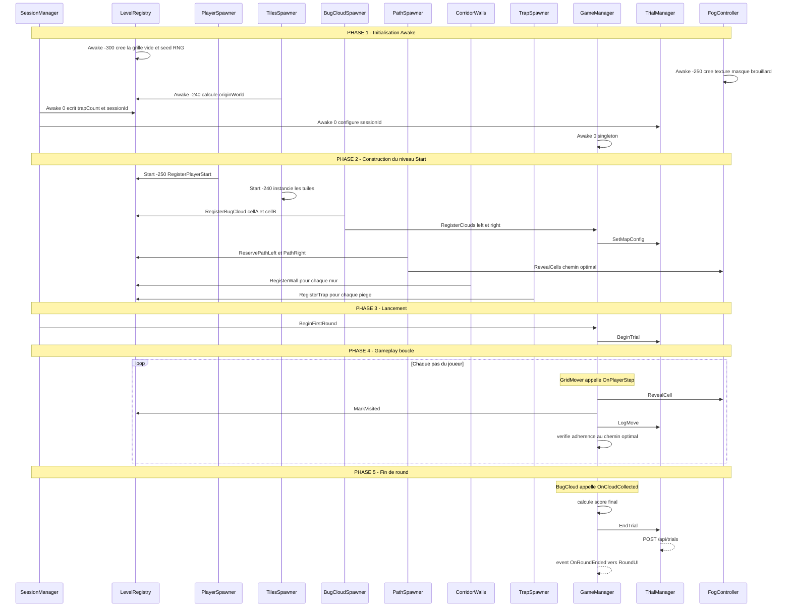

# Guide d'architecture — BUGS

> **Principe fondateur** : *Une entité sait ce qu'elle EST et ce qu'elle FAIT. Un manager sait ce que ça SIGNIFIE pour le jeu.*

---

## 1. Vue d'ensemble : les 5 couches

Le projet est organisé en **5 couches** qui ne communiquent que dans un seul sens (de bas en haut) :

```
┌─────────────────────────────────────────────────┐
│                    UI (RoundUI)                 │  ← Affiche, ne décide rien
├─────────────────────────────────────────────────┤
│              Controllers (FogController)        │  ← Exécute des ordres visuels
├─────────────────────────────────────────────────┤
│   Systems (GameManager, SessionManager,         │  ← Orchestrent le jeu
│            TrialManager, LevelRegistry)         │
├─────────────────────────────────────────────────┤
│   Spawners (PlayerSpawner, TilesSpawner,        │  ← Construisent le niveau
│             BugCloudSpawner, PathSpawner,        │
│             CorridorWallsGenerator, TrapSpawner) │
├─────────────────────────────────────────────────┤
│   Entities (GridMover, BugCloud, Trap)          │  ← Vivent dans le monde
└─────────────────────────────────────────────────┘
```

---

## 2. Diagramme d'architecture

```mermaid
graph TD
    subgraph BOOTSTRAP["Phase 0 - Bootstrap"]
        SM[SessionManager]
    end

    subgraph SYSTEMS["Systemes centraux"]
        REG[LevelRegistry]
        GM[GameManager]
        TM[TrialManager]
    end

    subgraph SPAWNERS["Spawners"]
        PS[PlayerSpawner -250]
        TS[TilesSpawner -240]
        BCS[BugCloudSpawner -200]
        PaS[PathSpawner -100]
        CWG[CorridorWallsGenerator -50]
        TrS[TrapSpawner -10]
    end

    subgraph ENTITIES["Entites"]
        GrM[GridMover - Joueur]
        BC[BugCloud]
        TR[Trap]
    end

    subgraph CONTROLLERS["Controleurs visuels"]
        FC[FogController]
    end

    subgraph UIGROUP["Interface utilisateur"]
        RU[RoundUI - Game Over]
    end

    SM -->|ecrit trapCount| REG
    SM -->|BeginFirstRound| GM
    SM -->|configure sessionId| TM

    PS -->|RegisterPlayerStart| REG
    TS -->|calcule originWorld| REG
    BCS -->|RegisterBugCloud| REG
    PaS -->|ReservePathLeft-Right| REG
    CWG -->|RegisterWall| REG
    TrS -->|RegisterTrap| REG

    BCS -->|RegisterClouds| GM

    TrS -.->|lit trapCount| REG

    GrM -->|OnPlayerStep| GM
    BC -->|OnCloudCollected| GM
    TR -->|OnTrapTriggered| GM

    GM -->|RevealCell| FC
    GM -->|MarkVisited| REG
    GM -->|LogMove - EndTrial| TM

    GM -.->|event OnRoundEnded| RU

    TM -->|POST api-trials| API[(API REST)]

    PaS -->|RevealCells| FC

    classDef system fill:#4a90d9,stroke:#2c5f8a,color:#fff
    classDef spawner fill:#7bc67e,stroke:#4a8a4d,color:#fff
    classDef entity fill:#f5a623,stroke:#c4841c,color:#fff
    classDef controller fill:#9b59b6,stroke:#7d3c98,color:#fff
    classDef ui fill:#e74c3c,stroke:#c0392b,color:#fff
    classDef bootstrap fill:#95a5a6,stroke:#7f8c8d,color:#fff
    classDef external fill:#bdc3c7,stroke:#95a5a6,color:#333

    class REG,GM,TM system
    class PS,TS,BCS,PaS,CWG,TrS spawner
    class GrM,BC,TR entity
    class FC controller
    class RU ui
    class SM bootstrap
    class API external
```



---

## 3. Flux de vie d'une partie



---

## 4. Marche à suivre pour comprendre le projet

### Étape 1 — Le hub central : `LevelRegistry`

Ouvre [LevelRegistry.cs](../Assets/Game/Scripts/Systems/LevelRegistry.cs). C'est le **cerveau passif** du projet : il ne décide rien, il stocke tout.

Questions-clés :
- Qu'est-ce que `CellFlags` ? → Un enum bitwise (`BugCloud`, `Trap`, `Wall`, `Visited`, `PathLeft`, `PathRight`…). Chaque case de la grille a ses flags.
- Comment convertir monde ↔ grille ? → `WorldToCell()` et `CellToWorld()`.
- D'où vient le hasard ? → `CreateRng(scope)` crée un `System.Random` déterministe par module (même seed = même niveau).

### Étape 2 — La construction du niveau (Spawners)

Lis les spawners **dans l'ordre d'exécution** (c'est l'ordre dans lequel Unity les appelle) :

| Ordre | Script | Ce qu'il fait | Ce qu'il écrit dans LevelRegistry |
|:------|:-------|:--------------|:----------------------------------|
| 1 | `PlayerSpawner` (-250) | Instancie le joueur | `RegisterPlayerStart(cell)` |
| 2 | `TilesSpawner` (-240) | Pose la grille visuelle | `originWorld` (position 0,0 du monde) |
| 3 | `BugCloudSpawner` (-200) | Place 2 nuages symétriques | `RegisterBugCloud(cell)` |
| 4 | `PathSpawner` (-100) | Trace les 2 chemins optimaux | `ReservePathLeft/Right(cells)` |
| 5 | `CorridorWallsGenerator` (-50) | Creuse un labyrinthe autour des chemins | `RegisterWall(cell)` |
| 6 | `TrapSpawner` (-10) | Place N pièges sur les cases libres | `RegisterTrap(cell)` |

**Règle d'or** : chaque spawner lit LevelRegistry pour savoir ce qui existe déjà, et y écrit son propre contenu. Aucun spawner ne parle directement à un autre.

### Étape 3 — Le gameplay (Entities → GameManager)

Trois entités vivent dans le monde. Elles ne connaissent qu'une seule chose : **signaler au GameManager**.

| Entité | Signal envoyé | Ce que GameManager en fait |
|:-------|:-------------|:---------------------------|
| `GridMover` (joueur) | `OnPlayerStep(cell)` | Révèle le fog, marque la case visitée, vérifie l'adhérence au chemin, log le mouvement |
| `BugCloud` | `OnCloudCollected(this)` | Calcule le score, termine le round |
| `Trap` | `OnTrapTriggered()` | Applique une pénalité (-1 bug par nuage par piège) |

**L'entité ne sait pas ce que son action signifie.** Le piège ne sait pas qu'il enlève des bugs. Le nuage ne sait pas qu'il termine le round. Seul GameManager le sait.

### Étape 4 — L'orchestration (GameManager)

Ouvre [GameManager.cs](../Assets/Game/Scripts/Systems/GameManager.cs). C'est le **chef d'orchestre** :

- Il reçoit les signaux des entités
- Il met à jour le score (`steps`, `trapsHit`, `bugsCollected`)
- Il délègue aux sous-systèmes : `FogController.RevealCell()`, `LevelRegistry.MarkVisited()`, `TrialManager.LogMove()`
- Il émet un **événement** `OnRoundEnded` quand le round est fini → `RoundUI` s'y abonne pour afficher l'écran de fin

**GameManager ne contient aucun code d'affichage.** Il dit "le round est fini, voici les stats" et c'est tout.

### Étape 5 — Le bootstrap (SessionManager)

Ouvre [SessionManager.cs](../Assets/Game/Scripts/Systems/SessionManager.cs). C'est le **starter** :

- Il lit les arguments de ligne de commande (`trapCount=N`, `sessionId=X`)
- Il injecte la config dans LevelRegistry et TrialManager
- Il appelle `GameManager.BeginFirstRound()` pour lancer la partie

Il ne tourne qu'une fois au démarrage, puis il ne fait plus rien.

### Étape 6 — Le pipeline de données (TrialManager)

Ouvre [TrialManager.cs](../Assets/Game/Scripts/Systems/TrialManager.cs). C'est le **collecteur scientifique** :

- GameManager lui dit quoi enregistrer (mouvements, config map, résultat)
- Il empaquette tout dans un objet `TrialData`
- Il l'envoie en POST à l'API REST (`/api/trials`)

Il ne prend aucune décision de jeu — il ne fait qu'observer et transmettre.

---

## 5. Résumé en une phrase par script

| Script | Rôle en une phrase |
|:-------|:-------------------|
| `LevelRegistry` | Stocke l'état de chaque case de la grille (flags, positions, seed). |
| `GameManager` | Reçoit les signaux des entités et orchestre le score, le fog et les données. |
| `SessionManager` | Lit la config CLI et lance la partie. |
| `TrialManager` | Enregistre les données de recherche et les envoie à l'API. |
| `FogController` | Gère la texture masque du brouillard de guerre. |
| `PlayerSpawner` | Instancie le joueur et enregistre sa position de départ. |
| `TilesSpawner` | Génère la grille visuelle de tuiles. |
| `BugCloudSpawner` | Place 2 nuages avec ratios de bugs aléatoires contrôlés. |
| `PathSpawner` | Calcule et réserve les chemins optimaux vers chaque nuage. |
| `CorridorWallsGenerator` | Creuse un labyrinthe et mure le reste. |
| `TrapSpawner` | Place les pièges sur les cases libres. |
| `GridMover` | Déplace le joueur case par case et signale chaque pas. |
| `BugCloud` | Détecte la collecte et signale au GameManager. |
| `Trap` | Détecte le déclenchement et signale au GameManager. |
| `RoundUI` | Affiche l'écran de fin de round (stats + bouton restart). |
