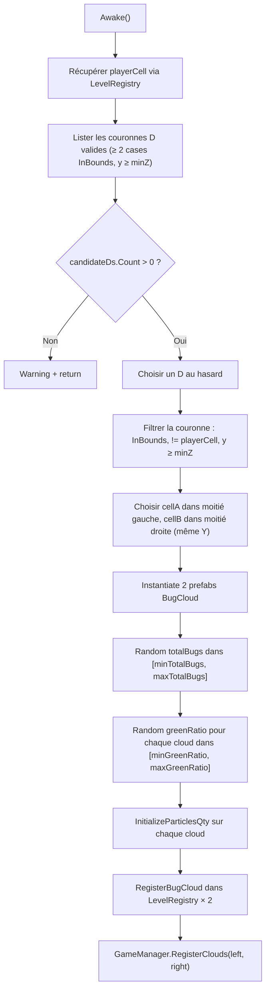
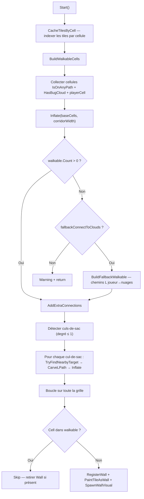
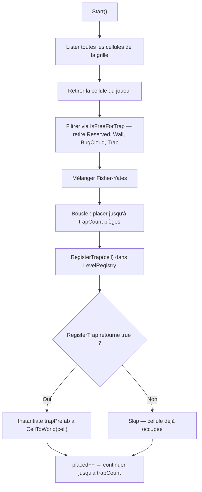
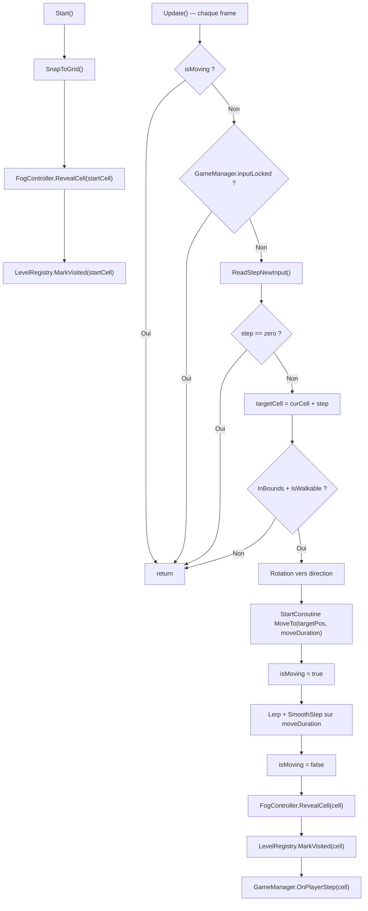
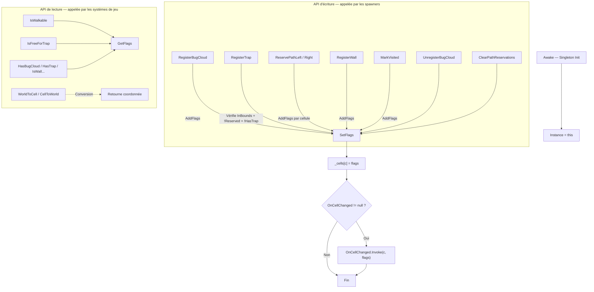
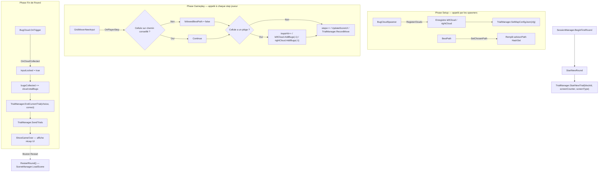
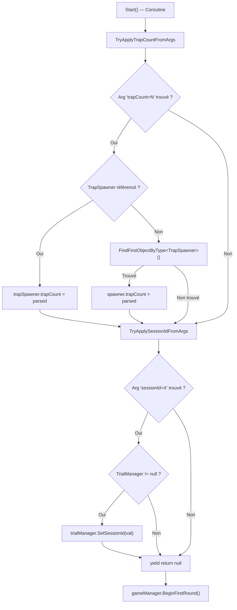
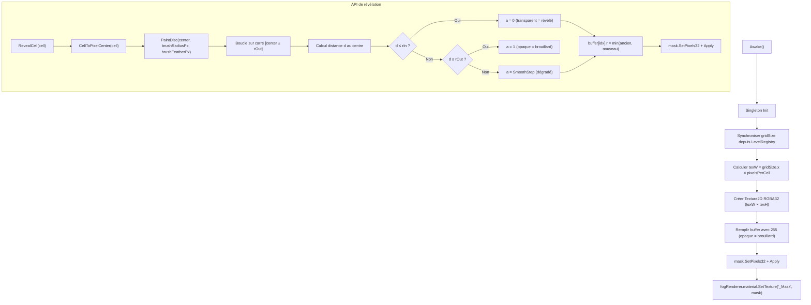
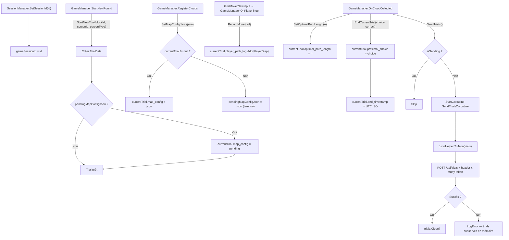

# Technical Design Document

| Nom du projet :    | BUGS                          |
| :----------------- | :---------------------------- |
| **Version :**      | 1.4                           |
| **Dernière MAJ :** | 17/02/26                      |
| **Auteur(s) :**    | @florian, @pierre             |
| **Moteur :**       | Unity 6000.3.5f2              |
| **Langage :**      | C#                            |

# 1. Vue d'ensemble du projet

## 1.1 Résumé technique

Jeu de collecte de bugs sur grille, développé dans le cadre d'une étude de recherche.
Le joueur se déplace en step-by-step sur une grille générée procéduralement pour collecter des nuages de bugs en évitant des pièges.
Basé sur Unity 6000.3.5f2 avec le pipeline URP. Architecture orientée Singletons avec un `LevelRegistry` comme source de vérité unique pour l'état spatial.
Intègre un pipeline complet de collecte de données de trial et de communication API.

## 1.2 Objectifs techniques prioritaires

- Performance : rendu fluide sur navigateur (WebGL build)
- Reproductibilité : chaque trial doit être traçable et ses données exploitables
- Modularité : systèmes de spawn découplés via `LevelRegistry` comme intermédiaire unique
- Maintenabilité : ordre d'exécution explicite via `[DefaultExecutionOrder]`

## 1.3 Contraintes techniques

- **Plateforme cible :** WebGL (navigateur)
- **Moteur :** Unity 6000.3.5f2 — pas de version antérieure
- **Input :** New Input System (`com.unity.inputsystem` 1.17.0)
- **Rendering :** URP (`com.unity.render-pipelines.universal` 17.3.0)

# 2. Architecture globale du projet

## 2.1 Structure des dossiers

```
Assets/
├── Game/
│   ├── Prefabs/          # BugCloud, Player, Tile, Trap, Wall, Quad, FogSurface, Ground
│   │   ├── Characters/   # Personnages modulaires SciFi
│   │   └── DesignProto/  # Proto V0 (Nature) / V1 (Alien) variantes de tuiles
│   ├── Scripts/          # 18 scripts C# du jeu
│   ├── Shaders/          # FogUnlitMask, CharacterOutlineUnlit, CorruptedTile (.shadergraph)
│   ├── Scenes/
│   │   ├── GameScenes/   # Scènes production
│   │   └── Sandboxes/    # Florian/ (prototypes design) et Pierre/ (SampleScene, WebTestScene)
│   ├── Animations/, Audio/, Materials/, Textures/, UI/
├── External/             # Assets tiers
│   ├── Characters/       # FreeLowPolyRobot, LP_SciFiCharacters
│   ├── Environment/      # SimpleNaturePack, Sci-Fi Modular Pack, Alien Worlds
│   ├── VFX/              # Polygon Arsenal (effets particules)
│   └── Materials/, Animations/Mixamo/
├── Settings/             # Config pipeline URP
└── TextMesh Pro/         # Assets TMP
```

## 2.2 Diagramme d'architecture système

**🔗 Lien Figma :** _À ajouter_

**Backup texte :**

```
                    ┌──────────────────┐
                    │  LevelRegistry   │ ← Singleton, source de vérité grille
                    └────────┬─────────┘
                             │ consulté par
       ┌──────────┬──────────┼──────────┬──────────┬──────────┐
       │          │          │          │          │          │
┌──────▼───┐ ┌───▼────┐ ┌───▼───┐ ┌────▼────┐ ┌───▼──┐ ┌────▼─────┐
│BugCloud  │ │BestPath│ │Corridor│ │  Trap   │ │ Fog  │ │  Game    │
│Spawner   │ │        │ │WallsGen│ │ Spawner │ │Ctrl  │ │ Manager  │
└──────────┘ └────────┘ └────────┘ └─────────┘ └──────┘ └──────────┘
```

## 2.3 Patterns utilisés

| Pattern             | Utilisation                                     | Justification                                                          |
| :------------------ | :---------------------------------------------- | :--------------------------------------------------------------------- |
| Singleton           | LevelRegistry, GameManager, FogController       | Accès global unique, point de vérité centralisé                        |
| Observer            | `OnCellChanged` event dans LevelRegistry        | Découplage HUD/debug du système spatial                                |
| Bitwise Flags       | `CellFlags` enum dans LevelRegistry             | Combinaison efficace de multiples états par cellule                    |
| Execution Order     | `[DefaultExecutionOrder]` sur tous les spawners | Garantir l'ordre d'initialisation sans dépendances directes           |

# 3. Systèmes de gameplay

## 3.1 BugCloudSpawner

### 3.1.1 Responsabilités

- Placer 2 nuages de bugs sur la grille à distance Manhattan égale du joueur
- Garantir un nuage dans la moitié gauche et un dans la moitié droite (même Y)
- Randomiser le nombre total de bugs et le ratio vert/rouge de chaque nuage
- Enregistrer les nuages dans LevelRegistry et GameManager

### 3.1.2 Composants clés (Data Model)

→ **BugCloudSpawner.cs** : MonoBehaviour, placement des 2 nuages à l'Awake. Ordre d'exécution : `-200`.

```csharp
[DefaultExecutionOrder(-200)]
public class BugCloudSpawner : MonoBehaviour
{
    [Header("Références")]
    public Transform player;
    public GameObject bugCloudPrefab;

    [Header("Placement")]
    public int minDistance = 3;
    public float spawnY = 0.5f;

    [Header("BugsCloud Parameters : Researchers Input")]
    [SerializeField] private int minTotalBugs = 20;
    [SerializeField] private int maxTotalBugs = 80;
    [SerializeField] private float minGreenBugsRatio = 0.4f;
    [SerializeField] private float maxGreenBugsRatio = 0.8f;
}
```

| Variable / Méthode                    | Type         | Description                                                                |
| :------------------------------------ | :----------- | :------------------------------------------------------------------------- |
| player                                | Transform    | Référence au joueur pour calculer les distances                            |
| bugCloudPrefab                        | GameObject   | Prefab du nuage de bugs (doit avoir BugCloud.cs)                           |
| minDistance                            | int          | Distance Manhattan minimale en cases depuis le joueur (défaut : 3)         |
| minZ (readonly)                       | int          | Z minimale pour le placement (hardcodé à 5)                               |
| spawnY                                | float        | Hauteur Y d'instanciation des nuages (défaut : 0.5)                       |
| minTotalBugs / maxTotalBugs           | int          | Range pour le tirage aléatoire du nombre total de bugs (défaut : 20-80)    |
| minGreenBugsRatio / maxGreenBugsRatio | float        | Range pour le ratio de bugs verts par nuage (défaut : 0.4-0.8)            |
| GetRingCells(Vector2Int, int)         | List (privé) | Retourne les cellules à distance Manhattan D (moitié supérieure seulement) |

### 3.1.3 Dépendances

- **Nécessite :** `LevelRegistry.Instance` (gridSize, WorldToCell, CellToWorld, RegisterBugCloud), `GameManager.Instance` (RegisterClouds)
- **Communique avec :** `BugCloud` (configure totalBugs, greenRatio, InitializeParticlesQty)
- **Déclenche :** Enregistrement des cellules nuage dans LevelRegistry + enregistrement des nuages dans GameManager

### 3.1.4 Diagramme de flux



### 3.1.5 Formules et règles métier

```
Distance Manhattan         = |dx| + |dy| entre joueur et nuage
Couronne D                 = ensemble des cellules à distance exacte D du joueur
                             (seule la moitié supérieure y ≥ playerCell.y est parcourue)
totalBugs par trial        = Random.Range(minTotalBugs, maxTotalBugs + 1) — partagé entre les 2 nuages
greenRatio par nuage       = Random.Range(minGreenBugsRatio, maxGreenBugsRatio) — indépendant
greenCount                 = RoundToInt(totalBugs × greenRatio)
redCount                   = totalBugs - greenCount
Contrainte placement       = cellA dans indices [0, count/2 - 1], cellB dans indices [count/2, count]
                             avec cellA.y == cellB.y (symétrie verticale)
```

### 3.1.6 Points d'attention

- **⚠️ Edge case :** La boucle `while (j == -1)` pour trouver une cellB avec le même Y que cellA peut boucler infiniment si aucune cellule dans la moitié droite n'a le même Y — peu probable avec des grilles larges mais risqué sur des grilles très petites
- **⚠️ Constraint :** `GetRingCells` ne parcourt que la moitié supérieure de l'anneau (`dz = D - |dx|`, jamais `-dz`) — les nuages sont toujours devant le joueur
- **⚠️ Couplage :** Les deux nuages ont le même `totalBugs` mais des `greenRatio` différents — c'est un choix de design recherche, pas un bug
- **🔧 À paramétrer :** `minZ = 5` est hardcodé en readonly — pourrait être exposé en Inspector si le protocole évolue

### 3.1.7 Journal d'implémentation

| Date     | Développeur | Note / Décision Technique                                                                         |
| :------- | :---------- | :------------------------------------------------------------------------------------------------ |
| 17/02/26 | @auteur     | Documentation initiale. Placement par couronne Manhattan avec contrainte gauche/droite et même Y. |

## 3.2 BestPath

### 3.2.1 Responsabilités

- Calculer deux chemins Manhattan les plus courts (joueur → nuage gauche, joueur → nuage droite)
- Réserver les deux chemins dans LevelRegistry (PathLeft, PathRight)
- Visualiser le chemin conseillé (celui vers le meilleur nuage) avec des quads
- Communiquer le chemin conseillé au GameManager pour le suivi de déviation
- Révéler les cellules du chemin conseillé dans le brouillard de guerre

### 3.2.2 Composants clés (Data Model)

→ **BestPath.cs** : MonoBehaviour, calcul et réservation des chemins au Start. Ordre d'exécution : `-100`.

```csharp
[DefaultExecutionOrder(-100)]
public class BestPath : MonoBehaviour
{
    [Header("Références")]
    public Transform player;
    public GameObject quadPrefab;

    [Header("Visibility")]
    public bool visible = true;
}
```

| Variable / Méthode | Type       | Description                                                          |
| :------------------ | :--------- | :------------------------------------------------------------------- |
| player              | Transform  | Référence au joueur (point de départ des chemins)                    |
| quadPrefab          | GameObject | Prefab quad pour la visualisation du chemin conseillé                 |
| visible             | bool       | Si `false`, aucun quad n'est instancié (défaut : true)               |

### 3.2.3 Dépendances

- **Nécessite :** `LevelRegistry.Instance` (WorldToCell, CellToWorld, ReservePathLeft, ReservePathRight, RegisterOptimalPath), `GameManager.Instance` (GetBestCloud, SetChosenPath), `FogController.Instance` (RevealCells)
- **Communique avec :** Nuages trouvés via `FindGameObjectsWithTag("BugCloud")`
- **Déclenche :** Réservation de chemins dans LevelRegistry, publication du chemin conseillé dans GameManager, révélation du brouillard

### 3.2.4 Diagramme de flux

```mermaid
graph TD
    A["Start()"] --> B["FindGameObjectsWithTag('BugCloud')"]
    B --> C{clouds.Length ≥ 2 ?}
    C -->|Non| D[Warning + return]
    C -->|Oui| E[Déterminer leftCloud / rightCloud par position X]

    E --> F[Calculer pathToLeftCloud — chemin Manhattan aléatoire]
    E --> G[Calculer pathToRightCloud — chemin Manhattan aléatoire]

    F --> H["reg.ReservePathLeft(leftCells)"]
    G --> I["reg.ReservePathRight(rightCells)"]

    H --> J{visible ?}
    I --> J
    J -->|Non| K[return]
    J -->|Oui| L{GameManager.GetBestCloud() != null ?}
    L -->|Oui| M[chosenPath = chemin vers le meilleur nuage]
    L -->|Non| N["chosenPath = Random 50/50"]
    M --> O["GameManager.SetChosenPath(advisorCells)"]
    N --> O
    O --> P["reg.RegisterOptimalPath(advisorCells)"]
    P --> Q["Instantiate quads le long du chosenPath"]
    Q --> R["FogController.RevealCells(chosenPath + playerCell)"]
```

### 3.2.5 Formules et règles métier

```
Longueur chemin Manhattan  = |playerCell.x - cloudCell.x| + |playerCell.y - cloudCell.y| + 1
Direction gauche           = currentPos.x-- (décrémente X vers la gauche)
Direction droite           = currentPos.x++ (incrémente X vers la droite)
Direction verticale        = currentPos.y++ (toujours vers le haut)
Randomisation du tracé     = à chaque step, si X != cible.X et Y != cible.Y → 50% chance horizontal/vertical
Choix du chemin affiché    = vers GetBestCloud() si non null, sinon 50/50 aléatoire
```

### 3.2.6 Points d'attention

- **⚠️ Edge case :** Si les deux nuages ont le même totalBugs, `GetBestCloud()` retourne `null` et le chemin affiché est choisi au hasard (50/50) — cohérent avec le design
- **⚠️ Performance :** `FindGameObjectsWithTag("BugCloud")` est utilisé plutôt qu'une référence directe — fonctionne car il n'y a que 2 nuages, mais fragile si d'autres objets portent le même tag
- **⚠️ Séquencement :** Les deux chemins sont TOUJOURS réservés dans LevelRegistry (gauche + droite), même si un seul est affiché — c'est voulu pour que CorridorWallsGenerator protège les deux
- **⚠️ Fog :** `RevealCells` n'est appelé que si `visible == true` — si `visible == false`, le chemin n'est pas révélé dans le brouillard

### 3.2.7 Journal d'implémentation

| Date     | Développeur | Note / Décision Technique                                                                          |
| :------- | :---------- | :------------------------------------------------------------------------------------------------- |
| 17/02/26 | @auteur     | Documentation initiale. Deux chemins Manhattan réservés, un seul affiché (vers le meilleur nuage). |

## 3.3 CorridorWallsGenerator

### 3.3.1 Responsabilités

- Construire les zones praticables (couloirs) à partir des chemins réservés par BestPath
- Élargir les couloirs à une largeur configurable via inflation
- Ajouter des connexions supplémentaires pour réduire les culs-de-sac
- Marquer toutes les cellules non-couloir comme murs dans LevelRegistry
- Instancier les visuels de mur (prefab ou cube fallback) et recolorer les tuiles

### 3.3.2 Composants clés (Data Model)

→ **CorridorWallsGenerator.cs** : MonoBehaviour, génération des couloirs et murs au Start. Ordre d'exécution : `-50`.

```csharp
[DefaultExecutionOrder(-50)]
public class CorridorWallsGenerator : MonoBehaviour
{
    [Header("Références")]
    public Transform player;
    public LevelRegistry registry;

    [Header("Couloirs")]
    [Min(1)] public int corridorWidth = 2;
    [Range(0, 100)] public int extraConnections = 10;
    public bool fallbackConnectToClouds = true;

    [Header("Visuel / Mur")]
    public GameObject wallPrefab;
    public Material wallMaterial;
    public float wallY = 0.5f;
    public float wallHeight = 1.0f;
    public float wallThickness = 1.0f;
    public bool clearPreviousChildren = true;
}
```

| Variable / Méthode                 | Type               | Description                                                            |
| :--------------------------------- | :----------------- | :--------------------------------------------------------------------- |
| player                             | Transform          | Position du joueur (toujours incluse dans les cellules walkable)       |
| registry                           | LevelRegistry      | Référence optionnelle, sinon `LevelRegistry.Instance`                  |
| corridorWidth                      | int                | Largeur des couloirs en cellules (défaut : 2, min : 1)                 |
| extraConnections                   | int                | Nombre max de connexions supplémentaires anti-cul-de-sac (défaut : 10) |
| fallbackConnectToClouds            | bool               | Si aucun chemin réservé, connecte joueur→nuages en L (défaut : true)   |
| wallPrefab                         | GameObject         | Prefab mur optionnel — si null, un Cube primitif est créé              |
| wallMaterial                       | Material           | Material optionnel appliqué aux tiles et cubes de mur                  |
| wallY / wallHeight / wallThickness | float              | Paramètres visuels du cube mur (défauts : 0.5 / 1.0 / 1.0)           |
| BuildWalkableCells(reg)            | HashSet (privé)    | Collecte chemins réservés + clouds + joueur, puis Inflate              |
| BuildFallbackWalkable(reg)         | HashSet (privé)    | Fallback : trace des chemins L entre joueur et nuages                  |
| AddExtraConnections(reg, walkable) | void (privé)       | Détecte les culs-de-sac et les relie à des cellules walkable proches   |
| Inflate(cells, width, reg)         | HashSet (statique) | Élargit un ensemble de cellules par un carré de côté `width`           |
| CarveLPath(a, b, into)            | void (statique)    | Trace un chemin en L (horizontal ou vertical d'abord, 50/50)          |

### 3.3.3 Dépendances

- **Nécessite :** `LevelRegistry` (IsOnAnyPath, HasBugCloud, InBounds, RegisterWall, UnregisterWall, IsWall, WorldToCell, CellToWorld), `BestPath` (doit avoir réservé les chemins avant — garanti par execution order -100 < -50)
- **Communique avec :** Tuiles trouvées via `FindGameObjectsWithTag("Tile")` (recoloration)
- **Déclenche :** `RegisterWall()` dans LevelRegistry pour toutes les cellules non-walkable

### 3.3.4 Diagramme de flux



### 3.3.5 Formules et règles métier

```
Inflate(cells, width)     = pour chaque cellule, ajouter un carré de côté `width` centré
                            width=2 → offsets [0,1], width=3 → offsets [-1,0,1]
                            left = (width-1)/2, right = (width-1) - left
Cul-de-sac                = cellule walkable avec ≤ 1 voisin walkable (Neighbors4)
Extra connection           = chemin L entre un cul-de-sac et une cellule walkable à distance [2..6]
CarveLPath                = chemin en L : 50% horizontal d'abord, 50% vertical d'abord
Mur                       = toute cellule de la grille qui n'est PAS dans walkable
```

### 3.3.6 Points d'attention

- **⚠️ Edge case :** Si `BestPath` est absent ou n'a réservé aucun chemin, le système bascule en fallback (chemins L directs joueur→nuages) — le résultat est un labyrinthe minimal
- **⚠️ Performance :** `FindGameObjectsWithTag("Tile")` est appelé une fois au Start pour indexer les tuiles — OK pour l'initialisation, mais O(n) sur le nombre de tuiles
- **⚠️ Visuels :** Si `wallPrefab` est null, des Cubes primitifs sont créés — fonctionnel mais coûteux en draw calls sur de grandes grilles
- **🔧 À surveiller :** `extraConnections` est un nombre de tentatives, pas un nombre garanti de connexions ajoutées — si les culs-de-sac n'ont pas de voisins proches, moins de connexions seront créées

### 3.3.7 Journal d'implémentation

| Date     | Développeur | Note / Décision Technique                                                                         |
| :------- | :---------- | :------------------------------------------------------------------------------------------------ |
| 17/02/26 | @auteur     | Documentation initiale. Couloirs par inflation des chemins réservés + connexions anti-cul-de-sac. |

## 3.4 TrapSpawner

### 3.4.1 Responsabilités

- Placer un nombre configurable de pièges sur les cellules libres de la grille
- Respecter les contraintes spatiales (pas sur les chemins, nuages, murs, cellule joueur)
- Enregistrer chaque piège dans LevelRegistry

### 3.4.2 Composants clés (Data Model)

→ **TrapSpawner.cs** : MonoBehaviour, placement des pièges au Start. Ordre d'exécution : `-10`.

```csharp
[DefaultExecutionOrder(-10)]
public class TrapSpawner : MonoBehaviour
{
    [Header("Références")]
    public Transform player;
    public GameObject trapPrefab;

    [Header("Placement")]
    public int trapCount = 10;
    public float trapYOffset = 0.5f;
}
```

| Variable / Méthode | Type       | Description                                                   |
| :------------------ | :--------- | :------------------------------------------------------------ |
| player              | Transform  | Référence au joueur (sa cellule est exclue des candidates)    |
| trapPrefab          | GameObject | Prefab du piège (doit avoir Trap.cs + BoxCollider IsTrigger)  |
| trapCount           | int        | Nombre de pièges à placer (défaut : 10, configurable via CLI) |
| trapYOffset         | float      | Hauteur Y d'instanciation (défaut : 0.5)                     |

### 3.4.3 Dépendances

- **Nécessite :** `LevelRegistry.Instance` (gridSize, WorldToCell, CellToWorld, IsFreeForTrap, RegisterTrap)
- **Est configuré par :** `SessionManager` (injecte trapCount depuis les arguments CLI)
- **Déclenche :** `RegisterTrap()` dans LevelRegistry pour chaque piège placé

### 3.4.4 Diagramme de flux



### 3.4.5 Formules et règles métier

```
Cellule éligible   = IsFreeForTrap(cell) = InBounds && !IsReserved && !IsWall && !HasTrap
                     + cell != playerCell
Placement          = Fisher-Yates shuffle puis sélection des N premières cellules valides
trapCount          = valeur Inspector par défaut (10), overridable via arg CLI "trapCount=N"
```

### 3.4.6 Points d'attention

- **⚠️ Edge case :** Si le nombre de cellules libres est inférieur à `trapCount`, moins de pièges seront placés — comportement silencieux (log `placed/trapCount`)
- **⚠️ Séquencement :** TrapSpawner (-10) s'exécute après CorridorWallsGenerator (-50) — les murs sont déjà en place, donc `IsFreeForTrap` exclut correctement les cellules murées
- **⚠️ Double vérification :** `IsFreeForTrap` est appelé en amont pour filtrer les candidates, puis `RegisterTrap` re-vérifie au moment de l'enregistrement — ceinture et bretelles pour éviter les doublons

### 3.4.7 Journal d'implémentation

| Date     | Développeur | Note / Décision Technique                                                                  |
| :------- | :---------- | :----------------------------------------------------------------------------------------- |
| 17/02/26 | @auteur     | Documentation initiale. Placement par shuffle + filtre IsFreeForTrap, configurable via CLI. |

## 3.5 GridMoverNewInput

### 3.5.1 Responsabilités

- Capturer les inputs clavier (flèches + ZQSD) via le New Input System
- Valider le mouvement cible via LevelRegistry (InBounds, IsWalkable)
- Interpoler le déplacement du joueur par coroutine avec SmoothStep
- Révéler le brouillard de guerre et marquer les cellules visitées à chaque pas
- Notifier GameManager de chaque déplacement terminé

### 3.5.2 Composants clés (Data Model)

→ **GridMover.cs** (classe `GridMoverNewInput`) : MonoBehaviour sur le GameObject joueur. Ordre d'exécution : `0` (défaut).

```csharp
public class GridMoverNewInput : MonoBehaviour
{
    [Header("Grille")]
    public float cellSize = 1f;

    [Header("Déplacement")]
    public float moveDuration = 0.15f;
    public bool rotateToDirection = true;

    [Header("Validation de la case cible")]
    public LayerMask tileLayer;
    public float raycastStartHeight = 2f;
    public float raycastDistance = 5f;

    bool isMoving = false;
}
```

| Variable / Méthode    | Type               | Description                                                                       |
| :--------------------- | :----------------- | :-------------------------------------------------------------------------------- |
| cellSize               | float              | Taille d'une case en unités monde — ignoré si LevelRegistry présent (défaut : 1) |
| moveDuration           | float              | Durée de l'interpolation en secondes (défaut : 0.15)                              |
| rotateToDirection      | bool               | Rotation du joueur vers la direction du mouvement (défaut : true)                 |
| tileLayer              | LayerMask          | Layer pour le raycast de validation (fallback sans LevelRegistry)                 |
| isMoving               | bool (privé)       | Verrou empêchant un nouveau mouvement pendant l'interpolation                     |
| ReadStepNewInput()     | Vector2Int (privé) | Lit un pas discret depuis `Keyboard.current.wasPressedThisFrame`                  |
| MoveTo(Vector3, float) | Coroutine (privé)  | Interpolation SmoothStep + callbacks post-mouvement                               |
| SnapToGrid()           | void               | Aligne la position du joueur au centre de la cellule la plus proche               |

### 3.5.3 Dépendances

- **Nécessite :** `LevelRegistry.Instance` (WorldToCell, CellToWorld, InBounds, IsWalkable, MarkVisited, SnapWorldToCellCenter), `FogController.Instance` (RevealCell, WorldToCell), `GameManager.Instance` (inputLocked, OnPlayerStep)
- **Est utilisé par :** Aucun — composant terminal sur le GameObject joueur
- **Package requis :** `com.unity.inputsystem` 1.17.0 (`using UnityEngine.InputSystem`)

### 3.5.4 Diagramme de flux



### 3.5.5 Formules et règles métier

```
Input mapping      = Flèches ←→↑↓ + QZSD (layout AZERTY)
                     wasPressedThisFrame → 1 step par appui (pas de repeat)
Mouvement          = 1 case par input, 4 directions cardinales
Interpolation      = Vector3.Lerp(start, target, SmoothStep(0, 1, t))
                     t += deltaTime / moveDuration
Validation         = LevelRegistry.InBounds(targetCell) && LevelRegistry.IsWalkable(targetCell)
Verrouillage       = isMoving (pendant interpolation) || GameManager.inputLocked (fin de round)
```

### 3.5.6 Points d'attention

- **⚠️ Input :** Les touches QZSD correspondent au layout AZERTY — pas de WASD. Si le jeu cible un public international, un rebinding sera nécessaire
- **⚠️ Fallback :** Si `LevelRegistry.Instance` est null, le système bascule sur un snap local sans validation de marchabilité — le joueur peut sortir de la grille
- **⚠️ Performance :** `Keyboard.current.*.wasPressedThisFrame` est appelé chaque frame dans Update — pas de coût significatif mais pourrait être migré vers un Input Action pour plus de flexibilité
- **🔧 Legacy :** Les champs `tileLayer`, `raycastStartHeight`, `raycastDistance` sont déclarés mais non utilisés dans le code actuel — vestiges d'une validation par raycast abandonnée

### 3.5.7 Journal d'implémentation

| Date     | Développeur | Note / Décision Technique                                                                         |
| :------- | :---------- | :------------------------------------------------------------------------------------------------ |
| 17/02/26 | @auteur     | Documentation initiale. Mouvement discret par coroutine SmoothStep, validation via LevelRegistry. |

# 4. Systèmes Core

## 4.1 LevelRegistry

### 4.1.1 Responsabilités

- Maintenir l'état spatial de chaque cellule de la grille via des flags bitwise (`CellFlags`)
- Fournir les conversions coordonnées grille ↔ monde (`WorldToCell`, `CellToWorld`)
- Valider la marchabilité des cellules pour le mouvement joueur (`IsWalkable`)
- Valider la disponibilité des cellules pour le spawn de pièges (`IsFreeForTrap`)
- Enregistrer et désenregistrer les entités spatiales (nuages, pièges, murs, chemins)
- Notifier les observateurs des changements d'état via l'event `OnCellChanged`

### 4.1.2 Composants clés (Data Model)

→ **LevelRegistry.cs** : Singleton MonoBehaviour, source de vérité unique pour l'état de la grille. Ordre d'exécution : `-300`.

```csharp
[DefaultExecutionOrder(-300)]
public class LevelRegistry : MonoBehaviour
{
    public static LevelRegistry Instance { get; private set; }

    public Vector2Int gridSize = new(10, 10);
    public float cellSize = 1f;
    public Vector3 originWorld = Vector3.zero;
    public int optimalPathLength;

    [Flags]
    public enum CellFlags
    {
        None      = 0,
        BugCloud  = 1 << 0,
        Trap      = 1 << 1,
        PathLeft  = 1 << 2,
        PathRight = 1 << 3,
        Reserved  = 1 << 4,
        Visited   = 1 << 5,
        Wall      = 1 << 6,
    }

    readonly Dictionary<Vector2Int, CellFlags> _cells = new();
    public event Action<Vector2Int, CellFlags> OnCellChanged;
}
```

| Variable / Méthode                        | Type                               | Description                                                                 |
| :---------------------------------------- | :--------------------------------- | :-------------------------------------------------------------------------- |
| Instance                                  | LevelRegistry                      | Référence statique globale (Singleton)                                      |
| gridSize                                  | Vector2Int                         | Dimensions de la grille (défaut : 10×10)                                    |
| cellSize                                  | float                              | Taille d'une case en unités monde (défaut : 1)                              |
| originWorld                               | Vector3                            | Position monde (X,Z) de la case (0,0)                                       |
| optimalPathLength                         | int                                | Longueur du chemin optimal enregistré par BestPath                          |
| OnCellChanged                             | Action\<Vector2Int, CellFlags\>    | Event déclenché à chaque modification de flags d'une cellule                |
| InBounds(Vector2Int)                      | bool                               | Vérifie si une coordonnée est dans la grille                                |
| GetFlags(Vector2Int)                      | CellFlags                          | Retourne les flags de la cellule (None si absente)                          |
| MarkVisited(Vector2Int)                   | void                               | Ajoute le flag `Visited` à la cellule                                       |
| RegisterBugCloud(Vector2Int)              | void                               | Ajoute `BugCloud + Reserved`                                                |
| UnregisterBugCloud(Vector2Int)            | void                               | Retire `BugCloud`, retire `Reserved` si aucun chemin ne passe               |
| RegisterTrap(Vector2Int)                  | bool                               | Ajoute `Trap` si la cellule est libre — retourne false sinon                |
| RegisterOptimalPath(List\<Vector2Int\>)   | void                               | Enregistre la longueur du chemin optimal                                    |
| UnregisterTrap(Vector2Int)                | void                               | Retire le flag `Trap`                                                       |
| ReservePathLeft(IEnumerable\<Vector2Int\>)  | void                             | Marque les cellules comme `PathLeft + Reserved`                             |
| ReservePathRight(IEnumerable\<Vector2Int\>) | void                             | Marque les cellules comme `PathRight + Reserved`                            |
| ClearPathReservations()                   | void                               | Retire `PathLeft`, `PathRight` et `Reserved` de toutes les cellules         |
| RegisterWall(Vector2Int)                  | void                               | Ajoute le flag `Wall` (bloque déplacement et spawn)                         |
| IsWalkable(Vector2Int)                    | bool                               | `InBounds && !IsWall` — utilisé par GridMoverNewInput                       |
| IsFreeForTrap(Vector2Int)                 | bool                               | `InBounds && !IsReserved && !IsWall && !HasTrap`                            |
| WorldToCell(Vector3)                      | Vector2Int                         | Conversion position monde → coordonnée grille (RoundToInt)                  |
| CellToWorld(Vector2Int, float)            | Vector3                            | Conversion coordonnée grille → position monde                               |
| SnapWorldToCellCenter(Vector3)            | Vector3                            | Snap une position monde au centre de la cellule la plus proche              |

### 4.1.3 Dépendances

- **Est utilisé par :** `TilesSpawner`, `BugCloudSpawner`, `BestPath`, `CorridorWallsGenerator`, `TrapSpawner`, `GameManager`, `GridMoverNewInput`, `FogController`, `BugCloud`, `MapGenerator`, `LevelRegistryHUD`
- **Ne dépend de :** Rien (système fondation sans dépendance entrante)
- **Déclenche :** `OnCellChanged(Vector2Int, CellFlags)` — consommé par `LevelRegistryHUD`

### 4.1.4 Diagramme de flux



### 4.1.5 Approche retenue & alternatives évaluées

**Pattern retenu :** Singleton + Dictionary bitwise flags

| Approche                                  | Avantages                                                                 | Inconvénients                                                    |
| :---------------------------------------- | :------------------------------------------------------------------------ | :--------------------------------------------------------------- |
| ✅ **Singleton + Dictionary\<CellFlags\>** | Accès global simple, combinaison d'états par bitwise, allocation à la demande | Non testable unitairement, état mutable global                   |
| Tableau 2D `CellFlags[,]`                | Accès O(1) sans hash, mémoire prévisible                                 | Alloue toute la grille même si peu de cellules sont utilisées    |
| ECS (Entity Component System)             | Scalable, parallélisable, data-oriented                                  | Sur-ingénierie massive pour une grille 10×10, complexité Unity DOTS |

### 4.1.6 Points d'attention

- **⚠️ Edge case :** `UnregisterBugCloud` ne retire `Reserved` que si la cellule n'appartient à aucun chemin — logique couplée entre entités
- **⚠️ Ordre d'exécution :** `LevelRegistry` doit s'initialiser avant tous les autres systèmes (`-300`). Si un spawner appelle `Instance` dans son `Awake` avec un ordre ≤ -300, NullRef possible
- **⚠️ Thread safety :** `_cells` Dictionary non thread-safe — pas de problème en single-threaded Unity, mais à surveiller si des Jobs sont introduits

### 4.1.7 Journal d'implémentation

| Date     | Développeur | Note / Décision Technique                                                                                   |
| :------- | :---------- | :---------------------------------------------------------------------------------------------------------- |
| 17/02/26 | @auteur     | Documentation initiale du système. LevelRegistry stable — source de vérité grille avec CellFlags bitwise.   |

## 4.2 GameManager

### 4.2.1 Responsabilités

- Suivre l'état du round en cours (steps, trapsHit, bugsCollected, followedBestPath)
- Gérer le cycle de vie des rounds (démarrage, fin de manche sur collecte de nuage, restart)
- Enregistrer les deux nuages du round et déterminer le nuage optimal
- Détecter les déviations du joueur par rapport au chemin conseillé
- Appliquer les pénalités de pièges sur les nuages (-1 bug par nuage par piège)
- Coordonner avec TrialManager pour la collecte de données de recherche
- Gérer l'UI de score en temps réel et le panneau de game over

### 4.2.2 Composants clés (Data Model)

→ **GameManager.cs** : Singleton MonoBehaviour orchestrant l'état du jeu et le cycle de vie des rounds. Ordre d'exécution : `0` (défaut).

```csharp
public class GameManager : MonoBehaviour
{
    public static GameManager Instance { get; private set; }
    public TrialManager trialManager;
    public int blockId = 1;

    [Header("UI Score")]
    public TMP_Text scoreText;

    [Header("Round / Score")]
    public int steps = 0;
    public int trapsHit = 0;
    public int bugsCollected = 0;
    public bool followedBestPath = true;

    [Header("Game Over UI")]
    public GameObject gameOverUI;
    public TMP_Text gameOverStats;

    public bool inputLocked { get; private set; } = false;
}
```

| Variable / Méthode                          | Type         | Description                                                                       |
| :------------------------------------------ | :----------- | :-------------------------------------------------------------------------------- |
| Instance                                    | GameManager  | Référence statique globale (Singleton)                                            |
| trialManager                                | TrialManager | Référence au TrialManager pour l'envoi des données de recherche                   |
| blockId                                     | int          | Identifiant du bloc de trials en cours (défaut : 1)                               |
| steps                                       | int          | Nombre de pas effectués dans le round courant                                     |
| trapsHit                                    | int          | Nombre de pièges déclenchés dans le round courant                                 |
| bugsCollected                               | int          | Total cumulé de bugs collectés                                                    |
| followedBestPath                            | bool         | `true` tant que le joueur reste sur le chemin conseillé                           |
| inputLocked                                 | bool (get)   | Verrouille les inputs joueur quand `true` (fin de round)                          |
| BeginFirstRound()                           | Méthode      | Point d'entrée appelé par SessionManager — lance le premier round                 |
| RegisterClouds(BugCloud, BugCloud)          | Méthode      | Enregistre les 2 nuages du round (gauche/droite), envoie config map au TrialManager |
| SetChosenPath(IEnumerable\<Vector2Int\>)    | Méthode      | Reçoit le chemin conseillé de BestPath pour détecter les déviations               |
| OnPlayerStep(Vector2Int)                    | Méthode      | Appelé à chaque pas : incrémente steps, vérifie piège, vérifie déviation          |
| OnCloudCollected(BugCloud)                  | Méthode      | Fin de round : calcule résultats, finalise le trial, déclenche game over          |
| GetBestCloud()                              | BugCloud     | Retourne le nuage avec le plus de bugs, `null` si égalité                         |
| RestartRound()                              | Méthode      | Recharge la scène active (appelé par le bouton UI)                                |

→ **MiniMapCfg** / **CloudInfo** : DTOs internes sérialisables pour la transmission de la config de map au TrialManager.

```csharp
[System.Serializable]
struct MiniMapCfg
{
    public int grid_w, grid_h;
    public CloudInfo cloud_left, cloud_right;
}
[System.Serializable]
struct CloudInfo { public int x, y, bugs; }
```

### 4.2.3 Dépendances

- **Nécessite :** `LevelRegistry.Instance` (vérification pièges, longueur chemin optimal), `TrialManager` (collecte données), `BugCloud` (nuages du round), `BestPath` (chemin conseillé)
- **Est utilisé par :** `SessionManager` (lance `BeginFirstRound()`), `GridMoverNewInput` (appelle `OnPlayerStep()`), `BugCloud` (appelle `OnCloudCollected()`), `BestPath` (appelle `SetChosenPath()`)
- **Communique avec :** UI (scoreText, gameOverUI, gameOverStats via TMP_Text)

### 4.2.4 Diagramme de flux



### 4.2.5 Formules et règles métier

```
Pénalité piège    = -1 bug dans CHAQUE nuage (leftCloud + rightCloud) par piège déclenché
Bugs collectés    = max(0, cloud.totalBugs) au moment de la collecte
Meilleur nuage    = celui avec le plus de totalBugs ; null si égalité
Choix correct     = le joueur a collecté le meilleur nuage (GetBestCloud)
followedBestPath  = true tant que TOUS les pas du joueur sont dans advisorPath
```

### 4.2.6 Points d'attention

- **⚠️ Edge case :** Si `leftCloud.totalBugs == rightCloud.totalBugs`, `GetBestCloud()` retourne `null` et `choice_correct` sera toujours `false` — à valider si c'est le comportement souhaité pour l'étude
- **⚠️ Edge case :** Le `bugsCollected` est cumulé entre les rounds (pas réinitialisé dans `RestartRound()`), mais `RestartRound()` recharge la scène, ce qui détruit le singleton — donc le cumul ne persiste qu'au sein d'un même round
- **⚠️ Séquencement :** `RegisterClouds` peut être appelé avant `StartNewRound` (à cause de l'ordre d'exécution BugCloudSpawner -200 vs GameManager 0). Le `SetMapConfigJson` est géré via un tampon dans TrialManager pour couvrir ce cas
- **🔧 À clarifier :** `blockId` est hardcodé à 1 et `screenType` toujours "forest" — à paramétriser quand le protocole de recherche intègrera plusieurs blocs

### 4.2.7 Journal d'implémentation

| Date     | Développeur | Note / Décision Technique                                                                                     |
| :------- | :---------- | :------------------------------------------------------------------------------------------------------------ |
| 17/02/26 | @auteur     | Documentation initiale. GameManager stable — gestion complète du cycle de round avec intégration TrialManager. |

## 4.3 SessionManager

### 4.3.1 Responsabilités

- Parser les arguments de ligne de commande au démarrage (`trapCount=N`, `sessionId=X`)
- Configurer le `TrapSpawner` avec le nombre de pièges reçu en paramètre
- Injecter l'identifiant de session dans le `TrialManager`
- Déclencher le début du jeu via `GameManager.BeginFirstRound()`

### 4.3.2 Composants clés (Data Model)

→ **SessionManager.cs** : MonoBehaviour de configuration au démarrage. Ordre d'exécution : `0` (défaut). Utilise une coroutine `Start()` pour garantir un frame de délai avant le lancement du jeu.

```csharp
public class SessionManager : MonoBehaviour
{
    [Header("Refs")]
    public TrialManager trialManager;
    public GameManager gameManager;
    public TrapSpawner trapSpawner;

    [Header("Session meta (optionnel)")]
    public long randomizationSeed = 0;
    public string buildVersion = "1.0.0";
}
```

| Variable / Méthode          | Type         | Description                                                                |
| :-------------------------- | :----------- | :------------------------------------------------------------------------- |
| trialManager                | TrialManager | Référence pour injecter le sessionId                                       |
| gameManager                 | GameManager  | Référence pour déclencher `BeginFirstRound()`                              |
| trapSpawner                 | TrapSpawner  | Référence optionnelle pour configurer `trapCount` via args                 |
| randomizationSeed           | long         | Seed de randomisation (réservé, non utilisé actuellement)                  |
| buildVersion                | string       | Version du build (réservée, non utilisée actuellement — défaut : "1.0.0") |
| Start()                     | IEnumerator  | Coroutine : parse args → `yield return null` → `BeginFirstRound()`        |
| TryApplyTrapCountFromArgs() | void (privé) | Parse `trapCount=N` depuis les args et l'assigne au TrapSpawner            |
| TryApplySessionIdFromArgs() | void (privé) | Parse `sessionId=X` depuis les args et l'injecte dans TrialManager         |

### 4.3.3 Dépendances

- **Nécessite :** `GameManager` (appelle `BeginFirstRound()`), `TrialManager` (injecte sessionId), `TrapSpawner` (configure trapCount)
- **Est utilisé par :** Aucun — point d'entrée du flux de jeu
- **Source de données :** Arguments de ligne de commande (`System.Environment.GetCommandLineArgs()`)

### 4.3.4 Diagramme de flux



### 4.3.5 Approche retenue & alternatives évaluées

**Approche retenue :** Arguments de ligne de commande + injection directe dans les composants

| Approche                                 | Avantages                                                    | Inconvénients                                       |
| :--------------------------------------- | :----------------------------------------------------------- | :-------------------------------------------------- |
| ✅ **Args CLI + injection directe**      | Simple, compatible WebGL/Desktop, pas de dépendance serveur  | Parsing manuel, pas de validation de schéma          |
| URL query parameters (WebGL)             | Plus standard pour le web                                    | Pas compatible Desktop, nécessite un bridge JS→Unity |
| API call (POST /api/session côté Unity)  | Session créée dynamiquement, plus flexible                   | Latence réseau, point de défaillance supplémentaire  |

### 4.3.6 Points d'attention

- **⚠️ Edge case :** Si `trapCount` n'est pas fourni en argument, le `TrapSpawner` garde sa valeur par défaut Inspector — comportement silencieux par design
- **⚠️ Edge case :** Si `sessionId` n'est pas fourni, `TrialManager.StartNewTrial()` logguera une erreur et ignorera la manche — les données de recherche seront perdues
- **⚠️ WebGL :** `System.Environment.GetCommandLineArgs()` fonctionne en WebGL uniquement si les arguments sont passés via le template HTML Unity — à vérifier avec le dashboard
- **🔧 À utiliser :** `randomizationSeed` et `buildVersion` sont déclarés mais non exploités — prévus pour le protocole de recherche

### 4.3.7 Journal d'implémentation

| Date     | Développeur | Note / Décision Technique                                                                                           |
| :------- | :---------- | :------------------------------------------------------------------------------------------------------------------ |
| 17/02/26 | @auteur     | Documentation initiale. SessionManager stable — bootstrap par args CLI avec injection dans TrapSpawner/TrialManager. |

## 4.4 FogController

### 4.4.1 Responsabilités

- Générer et maintenir une texture masque RGBA32 pour le brouillard de guerre
- Fournir une API de révélation par cellule avec brush circulaire et feathering
- Alimenter le shader custom (`FogUnlitMask.shadergraph`) via la property `_Mask`

### 4.4.2 Composants clés (Data Model)

→ **FogController.cs** : Singleton MonoBehaviour, `[RequireComponent(typeof(Renderer))]`. Ordre d'exécution : `-250`.

```csharp
[RequireComponent(typeof(Renderer))]
[DefaultExecutionOrder(-250)]
public class FogController : MonoBehaviour
{
    public static FogController Instance { get; private set; }

    [Header("Grille")]
    public Vector2Int gridSize = new(10, 10);

    [Header("Masque")]
    public int pixelsPerCell = 32;
    public int brushRadiusPx = 14;
    public int brushFeatherPx = 6;

    Renderer fogRenderer;
    Texture2D mask;
    Color32[] buffer;
    int texW, texH;
}
```

| Variable / Méthode                     | Type          | Description                                                          |
| :------------------------------------- | :------------ | :------------------------------------------------------------------- |
| Instance                               | FogController | Référence statique globale (Singleton)                               |
| gridSize                               | Vector2Int    | Dimensions de la grille — synchronisé depuis LevelRegistry à l'Awake |
| pixelsPerCell                          | int           | Résolution du masque par case (défaut : 32 — doux ; 1 — net)        |
| brushRadiusPx                          | int           | Rayon extérieur du pinceau de révélation en pixels (défaut : 14)     |
| brushFeatherPx                         | int           | Largeur du dégradé doux au bord du pinceau en pixels (défaut : 6)   |
| mask                                   | Texture2D     | Texture RGBA32 générée au runtime (canal R utilisé par le shader)    |
| buffer                                 | Color32[]     | Buffer RAM modifié puis poussé vers la texture GPU                   |
| RevealCell(Vector2Int)                 | void          | Révèle une cellule en peignant un disque dans le masque              |
| RevealCells(IEnumerable\<Vector2Int\>) | void          | Révèle plusieurs cellules (appelle RevealCell en boucle)             |
| WorldToCell(Vector3)                   | Vector2Int    | Délègue à LevelRegistry si disponible, sinon RoundToInt fallback    |
| PaintDisc(center, rOut, feather)       | void (privé)  | Peint un disque avec dégradé SmoothStep dans le buffer — révèle uniquement |

### 4.4.3 Dépendances

- **Nécessite :** `LevelRegistry.Instance` (gridSize à l'Awake, WorldToCell pour la conversion), `Renderer` sur le même GameObject (pour assigner `_Mask`), Shader `FogUnlitMask.shadergraph` (property reference `_Mask`)
- **Est utilisé par :** `GridMoverNewInput` (RevealCell à chaque pas), `BestPath` (RevealCells pour le chemin conseillé)
- **Ne déclenche :** Aucun event

### 4.4.4 Diagramme de flux



### 4.4.5 Approche retenue & alternatives évaluées

**Approche retenue :** Texture masque RGBA32 modifiée en RAM + Shader Graph custom

| Approche                             | Avantages                                                                        | Inconvénients                                                     |
| :----------------------------------- | :------------------------------------------------------------------------------- | :---------------------------------------------------------------- |
| ✅ **Texture masque + Shader Graph** | Contrôle pixel-perfect, feathering doux, pas de GameObjects supplémentaires      | Coût mémoire texture (320×320 px pour grille 10×10 à 32 ppx)     |
| Tiles individuelles avec alpha       | Simple, pas de shader custom                                                     | Pas de dégradé doux, 100+ GameObjects pour une grille 10×10      |
| Render Texture + caméra secondaire   | Rendu dynamique, effet volumétrique possible                                     | Coût GPU, complexité de setup, overkill pour une grille 2D       |

### 4.4.6 Points d'attention

- **⚠️ Performance :** `mask.Apply()` est appelé à chaque `RevealCell` — un seul apply par frame serait plus efficace si plusieurs cellules sont révélées dans le même frame (ex: `RevealCells` appelle `RevealCell` en boucle → N apply au lieu de 1)
- **⚠️ Mono-directionnelle :** Le `PaintDisc` ne fait que révéler (`min` entre ancien et nouveau) — impossible de "re-brouiller" une cellule déjà révélée
- **⚠️ Résolution :** `pixelsPerCell = 32` donne une texture 320×320 pour une grille 10×10 — si la grille grandit à 50×50, la texture atteint 1600×1600 (mémoire à surveiller en WebGL)
- **⚠️ Shader :** Le shader `FogUnlitMask.shadergraph` doit exposer une property `_Mask` de type Texture2D — si le shader change, la liaison se casse silencieusement

### 4.4.7 Journal d'implémentation

| Date     | Développeur | Note / Décision Technique                                                                      |
| :------- | :---------- | :--------------------------------------------------------------------------------------------- |
| 17/02/26 | @auteur     | Documentation initiale. Texture masque RGBA32 avec révélation par brush circulaire SmoothStep. |

## 4.5 TrialManager

### 4.5.1 Responsabilités

- Créer et gérer les objets `TrialData` pour chaque manche de jeu
- Enregistrer le chemin du joueur step par step (coordonnées grille + timestamp ISO)
- Stocker la configuration de la carte (map_config JSON) dans le trial courant
- Finaliser les résultats de manche (choix du joueur, justesse, longueur du chemin optimal)
- Envoyer les trials accumulés en batch vers l'API REST (`POST /api/trials`) avec auth par token

### 4.5.2 Composants clés (Data Model)

→ **TrialManager.cs** : MonoBehaviour gérant le cycle de vie des données de recherche. Pas de Singleton — référencé via Inspector par GameManager et SessionManager.

```csharp
public class TrialManager : MonoBehaviour
{
    [Header("API Settings")]
    public string apiBaseUrl = "http://localhost:3000";
    public string studyToken = "ensstudytoken";

    [Header("Session Info")]
    public string gameSessionId;

    private List<TrialData> trials = new();
    private TrialData currentTrial;
    private bool isSending = false;
    private string pendingMapConfigJson;
}
```

| Variable / Méthode                      | Type                      | Description                                                                              |
| :-------------------------------------- | :------------------------ | :--------------------------------------------------------------------------------------- |
| apiBaseUrl                              | string                    | URL de base de l'API backend (défaut : `http://localhost:3000`)                          |
| studyToken                              | string                    | Token d'authentification envoyé en header `x-study-token`                                |
| gameSessionId                           | string                    | ID de session injecté par SessionManager — requis pour créer des trials                  |
| trials                                  | List\<TrialData\> (privé) | Accumulation locale des manches avant envoi en batch                                     |
| currentTrial                            | TrialData (privé)         | Manche en cours de jeu                                                                   |
| isSending                               | bool (privé)              | Verrou empêchant les envois concurrents                                                  |
| pendingMapConfigJson                    | string (privé)            | Tampon pour la config map reçue avant que le trial ne soit créé                          |
| SetSessionId(string)                    | void                      | Injecte l'ID de session (appelé par SessionManager)                                      |
| StartNewTrial(int, int, string)         | void                      | Crée un nouveau TrialData et l'ajoute à la liste — applique le tampon map_config si présent |
| RecordMove(Vector2Int)                  | void                      | Ajoute un PlayerStep (position + timestamp ISO) au trial courant                         |
| EndCurrentTrial(string, bool)           | void                      | Finalise le trial : choix du joueur, justesse, timestamp de fin                          |
| SetOptimalPathLength(int)               | void                      | Enregistre la longueur du chemin optimal dans le trial courant                           |
| SetMapConfigJson(string)                | void                      | Stocke la config map dans le trial courant ou dans le tampon si trial pas encore créé    |
| SendTrials()                            | void                      | Lance l'envoi asynchrone des trials accumulés                                            |
| SendTrialsCoroutine()                   | IEnumerator (privé)       | POST JSON vers `apiBaseUrl/api/trials`, clear local si succès                            |

→ **JsonHelper** : Classe utilitaire statique pour sérialiser un tableau en JSON Unity-friendly (wrapper `{ "Items": [...] }`).

```csharp
public static class JsonHelper
{
    public static string ToJson<T>(T[] array, bool prettyPrint = false);
}
```

### 4.5.3 Dépendances

- **Nécessite :** `TrialData` (structure de données sérialisable), `PlayerStep` (structure de données sérialisable), `UnityWebRequest` (envoi HTTP)
- **Est utilisé par :** `GameManager` (StartNewTrial, RecordMove, EndCurrentTrial, SetMapConfigJson, SetOptimalPathLength, SendTrials), `SessionManager` (SetSessionId)
- **Communique avec :** API REST externe (`POST /api/trials` avec header `x-study-token`)

### 4.5.4 Diagramme de flux



### 4.5.5 Approche retenue & alternatives évaluées

**Approche retenue :** Accumulation locale + envoi batch par coroutine HTTP

| Approche                            | Avantages                                                   | Inconvénients                                           |
| :---------------------------------- | :---------------------------------------------------------- | :------------------------------------------------------ |
| ✅ **Batch local + POST coroutine** | Simple, pas de dépendance externe, compatible WebGL         | Données perdues si le joueur ferme avant l'envoi        |
| WebSocket persistant                | Temps réel, pas de perte de données                         | Complexité serveur, pas supporté nativement par WebGL   |
| PlayerPrefs comme cache de secours  | Survit aux crashes/fermetures                               | Limité en taille, format clé-valeur inadapté aux trials |

### 4.5.6 Points d'attention

- **⚠️ Perte de données :** Si le joueur ferme le navigateur avant `SendTrials()`, les trials en mémoire sont perdus — pas de persistance locale
- **⚠️ Séquencement :** `SetMapConfigJson` peut être appelé avant `StartNewTrial` (BugCloudSpawner Awake -200 vs GameManager.StartNewRound appelé depuis SessionManager.Start). Le tampon `pendingMapConfigJson` gère ce cas
- **⚠️ Concurrence :** `isSending` empêche les envois concurrents mais ne met pas en queue les demandes — si `SendTrials()` est appelé pendant un envoi, il est silencieusement ignoré
- **⚠️ Sérialisation :** `JsonHelper` wrappe le tableau dans `{ "Items": [...] }` — le backend doit s'attendre à ce format, pas un tableau JSON pur
- **🔧 À sécuriser :** `studyToken` est en clair dans l'Inspector — acceptable pour un prototype de recherche, à migrer vers un mécanisme plus sécurisé en production

### 4.5.7 Journal d'implémentation

| Date     | Développeur | Note / Décision Technique                                                                                       |
| :------- | :---------- | :-------------------------------------------------------------------------------------------------------------- |
| 17/02/26 | @auteur     | Documentation initiale. Pipeline de collecte trial complet avec tampon map_config et envoi batch par coroutine. |

# 5. Gestion des données

## 5.1 Structures de données de recherche

### TrialData

→ **TrialData.cs** : Classe `[Serializable]` représentant une manche complète de jeu. Créée par TrialManager au début de chaque round, enrichie pendant le gameplay, sérialisée en JSON pour l'envoi API.

```csharp
[Serializable]
public class TrialData
{
    public string session_id;
    public int block_id;
    public int screen_id;
    public string screen_type;
    public string timestamp;
    public float base_reward;
    public string advisor_type;
    public string map_config;
    public string true_cloud;
    public int optimal_path_length;
    public List<PlayerStep> player_path_log = new();
    public string proximal_choice;
    public bool choice_correct;
    public string end_timestamp;
}
```

| Champ               | Type               | Rempli par                   | Description                                                    |
| :------------------ | :----------------- | :--------------------------- | :------------------------------------------------------------- |
| session_id          | string             | Constructeur                 | ID de session (injecté depuis les args CLI via SessionManager) |
| block_id            | int                | Constructeur                 | Identifiant du bloc de trials (défaut : 1)                     |
| screen_id           | int                | Constructeur                 | Numéro séquentiel de la manche dans le bloc                    |
| screen_type         | string             | Constructeur                 | Type d'écran (ex : "forest")                                   |
| timestamp           | string             | Constructeur                 | Date ISO 8601 UTC du début de la manche                        |
| base_reward         | float              | _Non utilisé_                | Récompense de base (réservé pour le protocole de recherche)    |
| advisor_type        | string             | _Non utilisé_                | Type de conseiller (réservé pour le protocole de recherche)    |
| map_config          | string             | GameManager.RegisterClouds   | JSON de la config carte (grille, positions/bugs des nuages)    |
| true_cloud          | string             | _Non utilisé_                | Nuage correct (réservé)                                        |
| optimal_path_length | int                | GameManager.OnCloudCollected | Longueur du chemin optimal enregistré par BestPath             |
| player_path_log     | List\<PlayerStep\> | TrialManager.RecordMove      | Séquence ordonnée des pas du joueur avec timestamps            |
| proximal_choice     | string             | TrialManager.EndCurrentTrial | Choix du joueur : "left", "right" ou "unknown"                 |
| choice_correct      | bool               | TrialManager.EndCurrentTrial | `true` si le joueur a collecté le nuage optimal                |
| end_timestamp       | string             | TrialManager.EndCurrentTrial | Date ISO 8601 UTC de fin de manche                             |

### PlayerStep

→ **PlayerStep.cs** : Classe `[Serializable]` représentant un pas du joueur sur la grille.

```csharp
[Serializable]
public class PlayerStep
{
    public int x;
    public int y;
    public string t;

    public PlayerStep(Vector2Int pos, string time);
}
```

| Champ | Type   | Description                                     |
| :---- | :----- | :---------------------------------------------- |
| x     | int    | Coordonnée grille X du pas                      |
| y     | int    | Coordonnée grille Y du pas                      |
| t     | string | Timestamp ISO 8601 UTC du moment du déplacement |

### Format JSON envoyé à l'API

```json
{
  "Items": [
    {
      "session_id": "abc-123",
      "block_id": 1,
      "screen_id": 1,
      "screen_type": "forest",
      "timestamp": "2026-02-17T14:30:00.000Z",
      "map_config": "{\"grid_w\":10,\"grid_h\":10,\"cloud_left\":{\"x\":2,\"y\":7,\"bugs\":45},\"cloud_right\":{\"x\":7,\"y\":7,\"bugs\":45}}",
      "optimal_path_length": 12,
      "player_path_log": [
        {"x": 5, "y": 0, "t": "2026-02-17T14:30:01.000Z"},
        {"x": 5, "y": 1, "t": "2026-02-17T14:30:01.500Z"}
      ],
      "proximal_choice": "left",
      "choice_correct": true,
      "end_timestamp": "2026-02-17T14:30:15.000Z"
    }
  ]
}
```

### Points d'attention sur les données

- **⚠️ Champs réservés :** `base_reward`, `advisor_type`, `true_cloud` sont déclarés mais jamais remplis — prévus pour l'évolution du protocole de recherche
- **⚠️ Format wrapper :** `JsonHelper.ToJson` produit `{ "Items": [...] }` et non un tableau JSON pur — le backend doit parser ce format
- **⚠️ Timestamps :** Tous les timestamps utilisent `DateTime.UtcNow.ToString("o")` (ISO 8601 UTC) — pas de timezone locale, cohérent pour l'analyse

# 6. Optimisations et performance

_Section à compléter._

# 7. Pipeline et outils

## 7.1 Outils de développement

- **IDE :** Rider / Visual Studio
- **Version control :** Git + GitHub
- **Diagrammes :** Figma (architecture), Mermaid (flux dans le TDD)
- **IA assistée :** Claude Code (documentation et développement)

## 7.2 Conventions de code

```csharp
// Classes et MonoBehaviours : PascalCase
public class LevelRegistry : MonoBehaviour { }

// Méthodes publiques : PascalCase, verbe d'action
public void RegisterCloud(BugCloud cloud) { }

// Variables privées : _camelCase avec underscore
private int _currentHealth;

// Variables sérialisées (visibles dans l'Inspector)
[SerializeField] private float _moveSpeed = 5f;

// Constantes : UPPER_SNAKE_CASE
private const int MAX_TRAP_COUNT = 10;

// Events : On + NomEvenement
public event Action<Vector2Int> OnCellChanged;

// Langue des commentaires et logs : Français
```

## 7.3 Tests

- **Unit tests :** Unity Test Framework (`com.unity.test-framework` 1.6.0) — pas de tests custom pour l'instant
- **Play mode tests :** À définir

# 8. Risques techniques et mitigations

_Section à compléter._

# 9. Roadmap technique

_Section à compléter._

# 10. Références et ressources

## Documentation Unity

- [New Input System](https://docs.unity3d.com/Packages/com.unity.inputsystem@latest)
- [URP](https://docs.unity3d.com/Packages/com.unity.render-pipelines.universal@latest)

## Packages utilisés

| Package                                | Version | Usage                    |
| :------------------------------------- | :------ | :----------------------- |
| `com.unity.inputsystem`               | 1.17.0  | New Input System         |
| `com.unity.render-pipelines.universal` | 17.3.0  | Rendu URP                |
| `com.unity.ai.navigation`             | 2.0.9   | Navigation (non utilisé) |
| `com.unity.timeline`                   | 1.8.10  | Timeline/animation       |
| `com.unity.test-framework`            | 1.6.0   | Tests unitaires          |

## Glossaire technique

- **CellFlags :** Enum bitwise représentant les états combinables d'une cellule de grille
- **Execution Order :** Attribut Unity `[DefaultExecutionOrder(N)]` contrôlant l'ordre d'appel des lifecycle methods
- **SO :** ScriptableObject
- **Manhattan distance :** Distance en nombre de cases (|dx| + |dy|), utilisée pour les contraintes de placement

# Changelog du document

| Date     | Version | Changements                                               |
| :------- | :------ | :-------------------------------------------------------- |
| 17/02/26 | 1.0     | Création initiale — sections 1, 2, 4.1 (LevelRegistry)                   |
| 17/02/26 | 1.1     | Ajout sections 4.2 (GameManager) et 4.3 (SessionManager)                 |
| 17/02/26 | 1.2     | Ajout sections 3.1-3.4 (BugCloudSpawner, BestPath, CorridorWallsGenerator, TrapSpawner) |
| 17/02/26 | 1.3     | Ajout sections 3.5 (GridMoverNewInput) et 4.4 (FogController)                           |
| 17/02/26 | 1.4     | Ajout section 4.5 (TrialManager) et section 5.1 (TrialData, PlayerStep, format JSON)    |
