# Technical Design Document

| Nom du projet :    | BUGS                          |
| :----------------- | :---------------------------- |
| **Version :**      | 2.0                           |
| **Dernière MAJ :** | 27/02/26                      |
| **Auteur(s) :**    | @florian, @pierre             |
| **Moteur :**       | Unity 6000.3.5f2              |
| **Langage :**      | C#                            |

# 1. Vue d'ensemble du projet

## 1.1 Résumé technique

Jeu de collecte de bugs sur grille, développé dans le cadre d'une étude de recherche.
Le joueur se déplace en step-by-step sur une grille générée procéduralement pour collecter des nuages de bugs en évitant des pièges.
Basé sur Unity 6000.3.5f2 avec le pipeline URP. Architecture orientée Singletons avec un `LevelRegistry` comme source de vérité unique pour l'état spatial.
Intègre un pipeline complet de collecte de données de trial et de communication API.

## 1.2 Objectifs techniques prioritaires

- Performance : rendu fluide sur navigateur (WebGL build)
- Reproductibilité : chaque trial doit être traçable et ses données exploitables
- Modularité : systèmes de spawn découplés via `LevelRegistry` comme intermédiaire unique
- Maintenabilité : ordre d'exécution explicite via `[DefaultExecutionOrder]`

## 1.3 Contraintes techniques

- **Plateforme cible :** WebGL (navigateur)
- **Moteur :** Unity 6000.3.5f2 — pas de version antérieure
- **Input :** New Input System (`com.unity.inputsystem` 1.17.0)
- **Rendering :** URP (`com.unity.render-pipelines.universal` 17.3.0)

# 2. Architecture globale du projet

## 2.1 Structure des dossiers

```
Assets/
├── Game/
│   ├── Prefabs/          # BugCloud, Player, Tile, Trap, Wall, Quad, FogSurface, Ground
│   │   ├── Characters/   # Personnages modulaires SciFi
│   │   └── DesignProto/  # Proto V0 (Nature) / V1 (Alien) variantes de tuiles
│   ├── Scripts/          # 18 scripts C# du jeu
│   ├── Utils/
│   │   └── Maze/         # MazeGenerator (DFS backtracker) + MazeGrid
│   ├── Shaders/          # FogUnlitMask, CharacterOutlineUnlit, CorruptedTile (.shadergraph)
│   ├── Scenes/
│   │   ├── GameScenes/   # Scènes production
│   │   └── Sandboxes/    # Florian/ (prototypes design) et Pierre/ (SampleScene, WebTestScene)
│   ├── Animations/, Audio/, Materials/, Textures/, UI/
├── External/             # Assets tiers
│   ├── Characters/       # FreeLowPolyRobot, LP_SciFiCharacters
│   ├── Environment/      # SimpleNaturePack, Sci-Fi Modular Pack, Alien Worlds
│   ├── VFX/              # Polygon Arsenal (effets particules)
│   └── Materials/, Animations/Mixamo/
├── Settings/             # Config pipeline URP
└── TextMesh Pro/         # Assets TMP
```

## 2.2 Diagramme d'architecture système

**🔗 Lien Figma :** https://www.figma.com/design/DKXzCclcecu74D0y3dsoEi/BUGS?node-id=78-2&p=f&t=jedqtLr14p5CTG6u-0

**Backup texte :**

```
                         ┌──────────────────┐
                         │  LevelRegistry   │ ← Singleton, source de verite grille
                         └────────┬─────────┘
                                  │ consulte par
  ┌────────┬──────────┬───────────┼───────────┬──────────┬──────────┬──────────┐
  │        │          │           │           │          │          │          │
┌─▼──────┐┌▼────────┐┌▼─────────┐┌▼─────────┐┌▼────────┐┌▼────────┐┌▼────────┐
│Player  ││BugCloud ││Path      ││Corridor  ││Trap     ││Fog      ││Game     │
│Spawner ││Spawner  ││Spawner   ││WallsGen  ││Spawner  ││Ctrl     ││Manager  │
└────────┘└─────────┘└──────────┘└──────────┘└─────────┘└─────────┘└─────────┘

          Entites (signalent au GameManager) :
          GridMover ─┐
          BugCloud  ─┼──► GameManager ──► TrialManager ──► API REST
          Trap      ─┘         │
                               ▼
                            RoundUI
```

## 2.3 Patterns utilisés

| Pattern | Où dans le code | Pourquoi ce choix |
| :--- | :--- | :--- |
| **Singleton** | `LevelRegistry.Instance`, `GameManager.Instance`, `FogController.Instance` | Permet aux spawners d'accéder à l'état global sans injection — chaque singleton a un rôle unique et non-substituable |
| **CellFlags bitwise** | `LevelRegistry.CellFlags` (8 flags : `BugCloud`, `Trap`, `PathLeft`, `PathRight`, `Reserved`, `Visited`, `Wall`, `PlayerStart`) | Chaque cellule cumule plusieurs états en un seul int, testé par masque `&` — ex: une case peut être `PathLeft \| Reserved` |
| **Execution Order pipeline** | `[DefaultExecutionOrder(N)]` sur 9 scripts (de -300 à 0) | Garantit Awake(-300→-240) puis Start(-250→-10→0) sans couplage direct entre spawners — chaque script lit l'état posé par le précédent via LevelRegistry |
| **Entity → Manager signaling** | `GridMover` → `GameManager.OnPlayerStep`, `BugCloud` → `OnCloudCollected`, `Trap` → `OnTrapTriggered` | Les entités savent ce qu'elles sont et signalent ce qui leur arrive. Le GameManager interprète ces signaux (fog, score, trial). Aucune entité ne connaît les règles du jeu |
| **Event-driven UI** | `GameManager.OnRoundEnded` (event `Action<RoundEndInfo>`) → `RoundUI.HandleRoundEnded` | L'UI s'abonne à un événement typé — le GameManager ne référence aucun objet UI, RoundUI est autonome |
| **Seeded deterministic RNG** | `LevelRegistry.CreateRng(scope)` — hash FNV-1a 64-bit sur `(roundSeed + scopeName)` | Chaque spawner obtient un `System.Random` dérivé d'une seed globale + nom de scope → même seed = même map, même si l'ordre d'appel varie |
| **PlayerStart registration** | `PlayerSpawner` → `LevelRegistry.RegisterPlayerStart(cell, world)` → spawners lisent `TryGetPlayerStartCell()` | Les spawners n'ont plus de `Transform player` en Inspector — ils interrogent LevelRegistry. Découple le placement du joueur de la construction de la map |

# 3. Systèmes de gameplay

## 3.1 BugCloudSpawner

### 3.1.1 Responsabilités

- Placer 2 nuages de bugs sur la grille à distance Manhattan égale du joueur
- Garantir un nuage dans la moitié gauche et un dans la moitié droite (même Y)
- Tirer un nombre total de bugs partagé, puis deux ratios verts avec un écart contrôlé (difficulté de discrimination)
- Enregistrer les nuages dans LevelRegistry et GameManager

### 3.1.2 Composants clés (Data Model)

→ **BugCloudSpawner.cs** : MonoBehaviour, placement des 2 nuages au Start. Ordre d'exécution : `-200`.

```csharp
[DefaultExecutionOrder(-200)]
public class BugCloudSpawner : MonoBehaviour
{
    [Header("Références")]
    public GameObject bugCloudPrefab;

    [Header("Placement")]
    public int minDistance = 3;
    readonly int minZ = 5;
    public float spawnY = 0.5f;

    [Header("BugsCloud Parameters : Researchers Input")]
    [SerializeField] private int minTotalBugs = 20;
    [SerializeField] private int maxTotalBugs = 80;

    [Header("Green Ratio Bounds")]
    [SerializeField] private float minGreenBugsRatio = 0.4f;
    [SerializeField] private float maxGreenBugsRatio = 0.8f;

    [Header("Discrimination Difficulty Control")]
    [SerializeField] private float gapMin = 0.1f;
    [SerializeField] private float gapMax = 0.3f;
}
```

| Variable / Méthode                    | Type         | Description                                                                |
| :------------------------------------ | :----------- | :------------------------------------------------------------------------- |
| bugCloudPrefab                        | GameObject   | Prefab du nuage de bugs (doit avoir BugCloud.cs)                           |
| minDistance                            | int          | Distance Manhattan minimale en cases depuis le joueur (défaut : 3)         |
| minZ (readonly)                       | int          | Z minimale pour le placement (hardcodé à 5)                               |
| spawnY                                | float        | Hauteur Y d'instanciation des nuages (défaut : 0.5)                       |
| minTotalBugs / maxTotalBugs           | int          | Range pour le tirage aléatoire du nombre total de bugs (défaut : 20-80)    |
| minGreenBugsRatio / maxGreenBugsRatio | float        | Bornes pour le premier tirage de ratio vert (défaut : 0.4-0.8)            |
| gapMin / gapMax                       | float        | Écart min/max entre les ratios verts des 2 nuages (défaut : 0.1-0.3). Plus petit = discrimination difficile |
| GetRingCells(Vector2Int, int)         | List (privé) | Retourne les cellules à distance Manhattan D (moitié supérieure seulement) |

### 3.1.3 Dépendances

- **Nécessite :** `LevelRegistry.Instance` (gridSize, InBounds, CellToWorld, RegisterBugCloud, TryGetPlayerStartCell, CreateRng), `GameManager.Instance` (RegisterClouds)
- **Communique avec :** `BugCloud` (configure totalBugs, greenRatio, InitializeParticlesQty)
- **Déclenche :** Enregistrement des cellules nuage dans LevelRegistry + enregistrement des nuages dans GameManager

### 3.1.4 Diagramme de flux

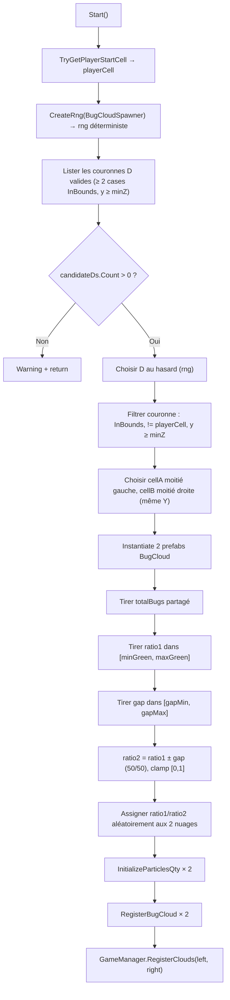
```mermaid
graph TD
    A["Start()"] --> B["TryGetPlayerStartCell → playerCell"]
    B --> C["CreateRng(BugCloudSpawner) → rng déterministe"]
    C --> D["Lister les couronnes D valides (≥ 2 cases InBounds, y ≥ minZ)"]
    D --> E{candidateDs.Count > 0 ?}
    E -->|Non| F[Warning + return]
    E -->|Oui| G["Choisir D au hasard (rng)"]
    G --> H["Filtrer couronne : InBounds, != playerCell, y ≥ minZ"]
    H --> I["Choisir cellA moitié gauche, cellB moitié droite (même Y)"]
    I --> J["Instantiate 2 prefabs BugCloud"]
    J --> K["Tirer totalBugs partagé"]
    K --> L["Tirer ratio1 dans [minGreen, maxGreen]"]
    L --> M["Tirer gap dans [gapMin, gapMax]"]
    M --> N["ratio2 = ratio1 ± gap (50/50), clamp [0,1]"]
    N --> O["Assigner ratio1/ratio2 aléatoirement aux 2 nuages"]
    O --> P["InitializeParticlesQty × 2"]
    P --> Q["RegisterBugCloud × 2"]
    Q --> R["GameManager.RegisterClouds(left, right)"]
```

### 3.1.5 Formules et règles métier

```
Distance Manhattan         = |dx| + |dy| entre joueur et nuage
Couronne D                 = ensemble des cellules à distance exacte D du joueur
                             (seule la moitié supérieure y ≥ playerCell.y est parcourue)
totalBugs par trial        = rng.Next(minTotalBugs, maxTotalBugs + 1) — PARTAGÉ entre les 2 nuages
ratio1                     = Lerp(minGreenBugsRatio, maxGreenBugsRatio, rng.NextDouble())
gap                        = Lerp(gapMin, gapMax, rng.NextDouble())
ratio2                     = Clamp01(ratio1 ± gap)  — direction aléatoire 50/50
Assignment                 = ratio1 et ratio2 assignés aléatoirement aux 2 nuages (pas de biais spatial)
greenCount                 = RoundToInt(totalBugs × greenRatio)
redCount                   = totalBugs - greenCount
Contrainte placement       = cellA dans indices [0, count/2 - 1], cellB dans indices [count/2, count]
                             avec cellA.y == cellB.y (symétrie verticale)
```

### 3.1.6 Points d'attention

- **⚠️ Edge case :** La boucle `while (j == -1)` pour trouver une cellB avec le même Y que cellA peut boucler infiniment si aucune cellule dans la moitié droite n'a le même Y — peu probable avec des grilles larges mais risqué sur des grilles très petites
- **⚠️ Constraint :** `GetRingCells` ne parcourt que la moitié supérieure de l'anneau (`dz = D - |dx|`, jamais `-dz`) — les nuages sont toujours devant le joueur
- **⚠️ Gap clamp :** Si `ratio1 + gap > 1.0` ou `ratio1 - gap < 0.0`, le Clamp01 réduit l'écart effectif — l'écart réel peut être inférieur à `gapMin`
- **🔧 À paramétrer :** `minZ = 5` est hardcodé en readonly — pourrait être exposé en Inspector si le protocole évolue

### 3.1.7 Journal d'implémentation

| Date     | Développeur | Note / Décision Technique                                                                         |
| :------- | :---------- | :------------------------------------------------------------------------------------------------ |
| 17/02/26 | @auteur     | Documentation initiale. Placement par couronne Manhattan avec contrainte gauche/droite et même Y. |
| 27/02/26 | @pierre     | Refacto : phase Awake→Start, suppression champ player (TryGetPlayerStartCell), seeded RNG, algorithme green ratio gap-based avec gapMin/gapMax pour contrôle de discrimination. |

## 3.2 PathSpawner

### 3.2.1 Responsabilités

- Calculer deux chemins Manhattan les plus courts (joueur → nuage gauche, joueur → nuage droite)
- Réserver les deux chemins dans LevelRegistry (PathLeft, PathRight)
- Visualiser le chemin conseillé (celui vers le meilleur nuage) avec des quads
- Communiquer le chemin conseillé au GameManager pour le suivi de déviation
- Révéler les cellules du chemin conseillé dans le brouillard de guerre

### 3.2.2 Composants clés (Data Model)

→ **PathSpawner.cs** : MonoBehaviour, calcul et réservation des chemins au Start. Ordre d'exécution : `-100`.

```csharp
[DefaultExecutionOrder(-100)]
public class PathSpawner : MonoBehaviour
{
    [Header("Références")]
    public GameObject quadPrefab;

    [Header("Visibility")]
    public bool visible = true;
}
```

| Variable / Méthode | Type       | Description                                                          |
| :------------------ | :--------- | :------------------------------------------------------------------- |
| quadPrefab          | GameObject | Prefab quad pour la visualisation du chemin conseillé                 |
| visible             | bool       | Si `false`, aucun quad n'est instancié et le fog n'est pas révélé (défaut : true) |

### 3.2.3 Dépendances

- **Nécessite :** `LevelRegistry.Instance` (TryGetPlayerStartCell, WorldToCell, CellToWorld, ReservePathLeft, ReservePathRight, RegisterOptimalPath, CreateRng), `GameManager.Instance` (GetBestCloud, SetChosenPath), `FogController.Instance` (RevealCells)
- **Communique avec :** Nuages trouvés via `FindGameObjectsWithTag("BugCloud")`
- **Déclenche :** Réservation de chemins dans LevelRegistry, publication du chemin conseillé dans GameManager, révélation du brouillard

### 3.2.4 Diagramme de flux

```mermaid
graph TD
    A["Start()"] --> A2["TryGetPlayerStartCell → playerCell"]
    A2 --> A3["CreateRng(PathSpawner) → rng déterministe"]
    A3 --> B["FindGameObjectsWithTag('BugCloud')"]
    B --> C{clouds.Length ≥ 2 ?}
    C -->|Non| D[Warning + return]
    C -->|Oui| E[Déterminer leftCloud / rightCloud par position X]

    E --> F["Calculer pathToLeftCloud — chemin Manhattan aléatoire (rng)"]
    E --> G["Calculer pathToRightCloud — chemin Manhattan aléatoire (rng)"]

    F --> H["reg.ReservePathLeft(leftCells)"]
    G --> I["reg.ReservePathRight(rightCells)"]

    H --> J{visible ?}
    I --> J
    J -->|Non| K[return]
    J -->|Oui| L{GameManager.GetBestCloud() != null ?}
    L -->|Oui| M[chosenPath = chemin vers le meilleur nuage]
    L -->|Non| N["chosenPath = Random 50/50 (rng)"]
    M --> O["GameManager.SetChosenPath(advisorCells)"]
    N --> O
    O --> P["reg.RegisterOptimalPath(advisorCells)"]
    P --> Q["Instantiate quads le long du chosenPath"]
    Q --> R["FogController.RevealCells(chosenPath + playerCell)"]
```

### 3.2.5 Formules et règles métier

```
Longueur chemin Manhattan  = |playerCell.x - cloudCell.x| + |playerCell.y - cloudCell.y| + 1
Direction gauche           = currentPos.x-- (décrémente X vers la gauche)
Direction droite           = currentPos.x++ (incrémente X vers la droite)
Direction verticale        = currentPos.y++ (toujours vers le haut)
Randomisation du tracé     = à chaque step, si X != cible.X et Y != cible.Y → 50% chance horizontal/vertical (rng)
Choix du chemin affiché    = vers GetBestCloud() si non null, sinon 50/50 aléatoire (rng)
```

### 3.2.6 Points d'attention

- **⚠️ Edge case :** Si les deux nuages ont le même totalBugs, `GetBestCloud()` retourne `null` et le chemin affiché est choisi au hasard (50/50) — cohérent avec le design
- **⚠️ Performance :** `FindGameObjectsWithTag("BugCloud")` est utilisé plutôt qu'une référence directe — fonctionne car il n'y a que 2 nuages, mais fragile si d'autres objets portent le même tag
- **⚠️ Séquencement :** Les deux chemins sont TOUJOURS réservés dans LevelRegistry (gauche + droite), même si un seul est affiché — c'est voulu pour que CorridorWallsGenerator protège les deux
- **⚠️ Fog :** Les cellules du chemin ne sont révélées que si `visible == true`

### 3.2.7 Journal d'implémentation

| Date     | Développeur | Note / Décision Technique                                                                          |
| :------- | :---------- | :------------------------------------------------------------------------------------------------- |
| 17/02/26 | @auteur     | Documentation initiale. Deux chemins Manhattan réservés, un seul affiché (vers le meilleur nuage). |
| 27/02/26 | @pierre     | Refacto : renommé BestPath→PathSpawner, suppression champ player (TryGetPlayerStartCell), seeded RNG. |

## 3.3 CorridorWallsGenerator

### 3.3.1 Responsabilités

- Générer un labyrinthe (DFS backtracker via `MazeGenerator`) sur toute la grille
- Forcer l'ouverture des cellules des chemins réservés par PathSpawner + cellules des nuages + cellule joueur
- Élargir les couloirs à une largeur configurable via inflation
- Ajouter des connexions supplémentaires pour réduire les culs-de-sac
- Marquer toutes les cellules non-walkable comme murs dans LevelRegistry
- Instancier les visuels de mur (prefab ou cube fallback) et recolorer les tuiles

### 3.3.2 Composants clés (Data Model)

→ **CorridorWallsGenerator.cs** : MonoBehaviour, génération des couloirs et murs au Start. Ordre d'exécution : `-50`.

```csharp
[DefaultExecutionOrder(-50)]
public class CorridorWallsGenerator : MonoBehaviour
{
    [Header("Références")]
    public LevelRegistry registry;

    [Header("Couloirs")]
    [Min(1)] public int corridorWidth = 1;

    [Header("Maze")]
    [Range(0, 200)] public int mazeExtraOpenings = 0;
    [Range(0, 100)] public int extraConnections = 16;
    public bool fallbackConnectToClouds = true;

    [Header("Visuel / Mur")]
    public GameObject wallPrefab;
    public Material wallMaterial;
    public float wallY = 0.5f;
    public float wallHeight = 1.0f;
    public float wallThickness = 1.0f;
    public bool clearPreviousChildren = true;
}
```

| Variable / Méthode                 | Type               | Description                                                            |
| :--------------------------------- | :----------------- | :--------------------------------------------------------------------- |
| registry                           | LevelRegistry      | Référence optionnelle, sinon `LevelRegistry.Instance`                  |
| corridorWidth                      | int                | Largeur des couloirs en cellules (défaut : 1, min : 1)                 |
| mazeExtraOpenings                  | int                | Nombre d'ouvertures supplémentaires dans le maze (crée des boucles, défaut : 0) |
| extraConnections                   | int                | Nombre max de connexions anti-cul-de-sac (défaut : 16)                 |
| fallbackConnectToClouds            | bool               | Si aucun chemin réservé, connecte joueur→nuages en L (défaut : true)   |
| wallPrefab                         | GameObject         | Prefab mur optionnel — si null, un Cube primitif est créé              |
| wallMaterial                       | Material           | Material optionnel appliqué aux tiles et cubes de mur                  |
| wallY / wallHeight / wallThickness | float              | Paramètres visuels du cube mur (défauts : 0.5 / 1.0 / 1.0)           |
| BuildWalkableCells(reg, seed)      | HashSet (privé)    | Génère le maze DFS, force les chemins réservés, puis Inflate           |
| BuildFallbackWalkable(reg)         | HashSet (privé)    | Fallback : trace des chemins L entre joueur et nuages                  |
| AddExtraConnections(reg, w, rng)   | void (privé)       | Détecte les culs-de-sac et les relie à des cellules walkable proches   |
| Inflate(cells, width, reg)         | HashSet (statique) | Élargit un ensemble de cellules par un carré de côté `width`           |
| CarveLPath(a, b, into)            | void (statique)    | Trace un chemin en L (horizontal ou vertical d'abord, 50/50)          |

### 3.3.3 Dépendances

- **Nécessite :** `LevelRegistry` (IsOnAnyPath, HasBugCloud, InBounds, RegisterWall, UnregisterWall, IsWall, CellToWorld, TryGetPlayerStartCell, CreateRng, DeriveSeed), `MazeGenerator` + `MazeGrid` (DFS backtracker), `PathSpawner` (doit avoir réservé les chemins avant — garanti par execution order -100 < -50)
- **Communique avec :** Tuiles trouvées via `FindGameObjectsWithTag("Tile")` (recoloration)
- **Déclenche :** `RegisterWall()` dans LevelRegistry pour toutes les cellules non-walkable

### 3.3.4 Diagramme de flux

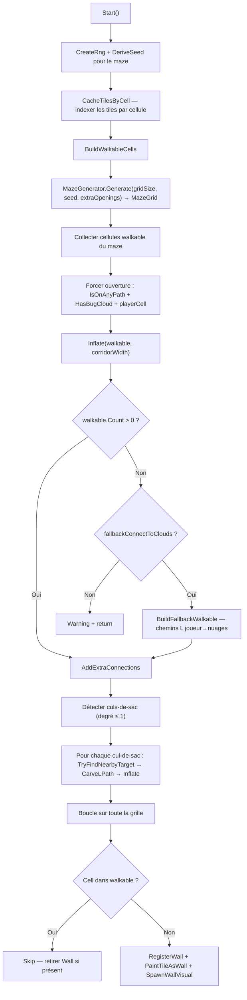
```mermaid
graph TD
    A["Start()"] --> B["CreateRng + DeriveSeed pour le maze"]
    B --> C[CacheTilesByCell — indexer les tiles par cellule]
    C --> D[BuildWalkableCells]
    D --> D1["MazeGenerator.Generate(gridSize, seed, extraOpenings) → MazeGrid"]
    D1 --> D2["Collecter cellules walkable du maze"]
    D2 --> D3["Forcer ouverture : IsOnAnyPath + HasBugCloud + playerCell"]
    D3 --> E["Inflate(walkable, corridorWidth)"]
    E --> F{walkable.Count > 0 ?}
    F -->|Non| G{fallbackConnectToClouds ?}
    G -->|Oui| H["BuildFallbackWalkable — chemins L joueur→nuages"]
    G -->|Non| I[Warning + return]
    F -->|Oui| J[AddExtraConnections]
    H --> J

    J --> K["Détecter culs-de-sac (degré ≤ 1)"]
    K --> L["Pour chaque cul-de-sac : TryFindNearbyTarget → CarveLPath → Inflate"]

    L --> M["Boucle sur toute la grille"]
    M --> N{Cell dans walkable ?}
    N -->|Oui| O[Skip — retirer Wall si présent]
    N -->|Non| P["RegisterWall + PaintTileAsWall + SpawnWallVisual"]
```

### 3.3.5 Formules et règles métier

```
Maze base              = MazeGenerator.Generate(width, height, seed, extraOpenings)
                         DFS backtracker classique, seed déterministe
Force paths            = union(maze walkable, chemins réservés, nuages, joueur)
Inflate(cells, width)  = pour chaque cellule, ajouter un carré de côté `width` centré
                         width=1 → pas d'élargissement, width=2 → offsets [0,1]
Cul-de-sac             = cellule walkable avec ≤ 1 voisin walkable (Neighbors4)
Extra connection        = chemin L entre un cul-de-sac et une cellule walkable à distance [2..6]
Mur                    = toute cellule de la grille qui n'est PAS dans walkable
```

### 3.3.6 Points d'attention

- **⚠️ Edge case :** Si `PathSpawner` est absent ou n'a réservé aucun chemin, le système bascule en fallback (chemins L directs joueur→nuages) — le résultat est un labyrinthe minimal sans garantie de couloirs
- **⚠️ Maze generation :** Le maze est généré par `MazeGenerator` (DFS backtracker) sous `Assets/Game/Utils/Maze/`. La seed est dérivée de la seed globale via `DeriveSeed("CorridorWallsGenerator.Maze")` — reproductible
- **⚠️ Performance :** `FindGameObjectsWithTag("Tile")` est appelé une fois au Start pour indexer les tuiles — OK pour l'initialisation, mais O(n) sur le nombre de tuiles
- **⚠️ Visuels :** Si `wallPrefab` est null, des Cubes primitifs sont créés — fonctionnel mais coûteux en draw calls sur de grandes grilles
- **🔧 À surveiller :** `extraConnections` est un nombre de tentatives, pas un nombre garanti de connexions ajoutées — si les culs-de-sac n'ont pas de voisins proches, moins de connexions seront créées

### 3.3.7 Journal d'implémentation

| Date     | Développeur | Note / Décision Technique                                                                         |
| :------- | :---------- | :------------------------------------------------------------------------------------------------ |
| 17/02/26 | @auteur     | Documentation initiale. Couloirs par inflation des chemins réservés + connexions anti-cul-de-sac. |
| 27/02/26 | @pierre     | Refacto : suppression champ player (TryGetPlayerStartCell), seeded RNG, intégration MazeGenerator DFS backtracker, corridorWidth default 2→1, ajout mazeExtraOpenings. |

## 3.4 TrapSpawner

### 3.4.1 Responsabilités

- Placer un nombre configurable de pièges sur les cellules libres de la grille
- Respecter les contraintes spatiales (pas sur les chemins, nuages, murs, cellule joueur)
- Lire le nombre de pièges depuis `LevelRegistry.trapCount` (configuré par SessionManager)
- Utiliser le RNG seedé pour un placement reproductible
- Enregistrer chaque piège dans LevelRegistry

### 3.4.2 Composants clés (Data Model)

→ **TrapSpawner.cs** : MonoBehaviour, placement des pièges au Start. Ordre d'exécution : `-10`.

```csharp
[DefaultExecutionOrder(-10)]
public class TrapSpawner : MonoBehaviour
{
    [Header("Références")]
    public GameObject trapPrefab;
    [SerializeField] private LevelRegistry registry;

    [Header("Placement")]
    public float trapYOffset = 0.5f;
}
```

| Variable / Méthode | Type          | Description                                                             |
| :------------------ | :------------ | :---------------------------------------------------------------------- |
| trapPrefab          | GameObject    | Prefab du piège (doit avoir Trap.cs + BoxCollider IsTrigger)            |
| registry            | LevelRegistry | Référence sérialisée, sinon `LevelRegistry.Instance`                   |
| trapYOffset         | float         | Hauteur Y d'instanciation (défaut : 0.5)                               |
| _trapCount          | int (privé)   | Lu depuis `registry.trapCount` au Start — pas de champ Inspector       |

### 3.4.3 Dépendances

- **Nécessite :** `LevelRegistry` (trapCount, gridSize, CellToWorld, IsFreeForTrap, RegisterTrap, TryGetPlayerStartCell, CreateRng)
- **Est configuré par :** `SessionManager` → écrit dans `LevelRegistry.trapCount` au Awake (avant le Start de TrapSpawner)
- **Déclenche :** `RegisterTrap()` dans LevelRegistry pour chaque piège placé

### 3.4.4 Diagramme de flux

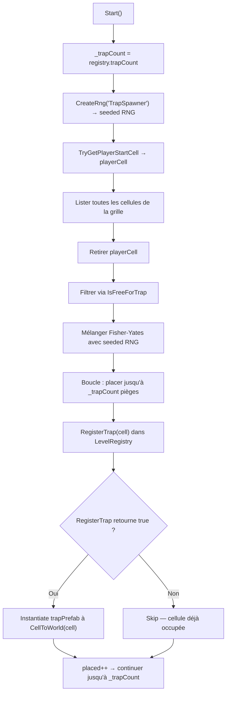
```mermaid
graph TD
    A["Start()"] --> A1["_trapCount = registry.trapCount"]
    A1 --> A2["CreateRng('TrapSpawner') → seeded RNG"]
    A2 --> B["TryGetPlayerStartCell → playerCell"]
    B --> C["Lister toutes les cellules de la grille"]
    C --> D["Retirer playerCell"]
    D --> E["Filtrer via IsFreeForTrap"]
    E --> F["Mélanger Fisher-Yates avec seeded RNG"]
    F --> G["Boucle : placer jusqu'à _trapCount pièges"]
    G --> H["RegisterTrap(cell) dans LevelRegistry"]
    H --> I{RegisterTrap retourne true ?}
    I -->|Oui| J["Instantiate trapPrefab à CellToWorld(cell)"]
    I -->|Non| K[Skip — cellule déjà occupée]
    J --> L["placed++ → continuer jusqu'à _trapCount"]
    K --> L
```

### 3.4.5 Formules et règles métier

```
Cellule éligible   = IsFreeForTrap(cell) = InBounds && !IsReserved && !IsWall && !HasTrap
                     + cell != playerCell
Placement          = Fisher-Yates shuffle (seeded RNG) puis N premières cellules valides
trapCount          = SessionManager écrit dans LevelRegistry.trapCount au Awake
                     Valeur par défaut : 10, overridable via arg CLI "trapCount=N"
Reproductibilité   = seed dérivée via CreateRng("TrapSpawner") — même seed globale → même placement
```

### 3.4.6 Points d'attention

- **⚠️ Edge case :** Si le nombre de cellules libres est inférieur à `_trapCount`, moins de pièges seront placés — comportement silencieux (log `placed/_trapCount`)
- **⚠️ Séquencement :** TrapSpawner (-10) s'exécute après CorridorWallsGenerator (-50) — les murs sont déjà en place, donc `IsFreeForTrap` exclut correctement les cellules murées
- **⚠️ Plus de champ player :** La cellule joueur est obtenue via `TryGetPlayerStartCell()` — pas de référence Transform dans l'Inspector
- **⚠️ trapCount :** Pas de champ `trapCount` sur TrapSpawner — la valeur est lue depuis `LevelRegistry.trapCount` au Start. Le pipeline est : CLI arg → SessionManager.Awake → LevelRegistry.trapCount → TrapSpawner.Start

### 3.4.7 Journal d'implémentation

| Date     | Développeur | Note / Décision Technique                                                                  |
| :------- | :---------- | :----------------------------------------------------------------------------------------- |
| 17/02/26 | @auteur     | Documentation initiale. Placement par shuffle + filtre IsFreeForTrap, configurable via CLI. |
| 27/02/26 | @pierre     | Refacto : suppression champ player (TryGetPlayerStartCell), trapCount lu depuis registry, seeded RNG. |

## 3.5 GridMover

### 3.5.1 Responsabilités

- Capturer les inputs clavier (flèches directionnelles) via le New Input System
- Valider le mouvement cible via LevelRegistry (InBounds, IsWalkable)
- Interpoler le déplacement du joueur par coroutine avec SmoothStep
- Notifier GameManager de chaque déplacement terminé via `OnPlayerStep(cell)`
- **Ne gère pas** le brouillard ni le marquage des cellules visitées — c'est la responsabilité de GameManager

### 3.5.2 Composants clés (Data Model)

→ **GridMover.cs** (classe `GridMover`) : MonoBehaviour sur le GameObject joueur. Ordre d'exécution : `0` (défaut).

```csharp
public class GridMover : MonoBehaviour
{
    [Header("Grille")]
    public float cellSize = 1f;

    [Header("Déplacement")]
    public float moveDuration = 0.15f;
    public bool rotateToDirection = true;

    private bool _isMoving = false;
}
```

| Variable / Méthode    | Type               | Description                                                                       |
| :--------------------- | :----------------- | :-------------------------------------------------------------------------------- |
| cellSize               | float              | Taille d'une case en unités monde — ignoré si LevelRegistry présent (défaut : 1) |
| moveDuration           | float              | Durée de l'interpolation en secondes (défaut : 0.15)                              |
| rotateToDirection      | bool               | Rotation du joueur vers la direction du mouvement (défaut : true)                 |
| _isMoving              | bool (privé)       | Verrou empêchant un nouveau mouvement pendant l'interpolation                     |
| ReadStep()             | Vector2Int (privé) | Lit un pas discret depuis les flèches via `Keyboard.current.wasPressedThisFrame` (flèches uniquement) |
| MoveTo(Vector3, float) | Coroutine (privé)  | Interpolation SmoothStep + appel `GameManager.OnPlayerStep(cell)` à la fin        |
| SnapToGrid()           | void               | Aligne la position du joueur au centre de la cellule la plus proche               |

### 3.5.3 Dépendances

- **Nécessite :** `LevelRegistry.Instance` (WorldToCell, CellToWorld, InBounds, IsWalkable, SnapWorldToCellCenter), `GameManager.Instance` (inputLocked, OnPlayerStep)
- **Ne dépend plus de :** `FogController` (la révélation du brouillard et le marquage visited sont gérés par `GameManager.OnPlayerStep`)
- **Est utilisé par :** Aucun — composant terminal sur le GameObject joueur
- **Package requis :** `com.unity.inputsystem` 1.17.0 (`using UnityEngine.InputSystem`)

### 3.5.4 Diagramme de flux

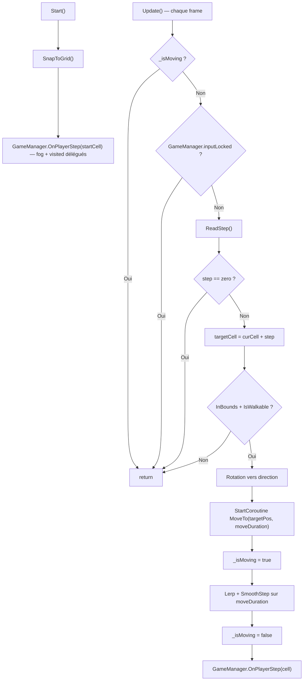
```mermaid
graph TD
    A["Start()"] --> B["SnapToGrid()"]
    B --> C["GameManager.OnPlayerStep(startCell) — fog + visited délégués"]

    E["Update() — chaque frame"] --> F{_isMoving ?}
    F -->|Oui| G[return]
    F -->|Non| H{GameManager.inputLocked ?}
    H -->|Oui| G
    H -->|Non| I["ReadStep()"]
    I --> J{step == zero ?}
    J -->|Oui| G
    J -->|Non| K["targetCell = curCell + step"]
    K --> L{InBounds + IsWalkable ?}
    L -->|Non| G
    L -->|Oui| M["Rotation vers direction"]
    M --> N["StartCoroutine MoveTo(targetPos, moveDuration)"]

    N --> O["_isMoving = true"]
    O --> P["Lerp + SmoothStep sur moveDuration"]
    P --> Q["_isMoving = false"]
    Q --> R["GameManager.OnPlayerStep(cell)"]
```

### 3.5.5 Formules et règles métier

```
Input mapping      = Flèches ←→↑↓ uniquement
                     wasPressedThisFrame → 1 step par appui (pas de repeat)
Mouvement          = 1 case par input, 4 directions cardinales
Interpolation      = Vector3.Lerp(start, target, SmoothStep(0, 1, t))
                     t += deltaTime / moveDuration
Validation         = LevelRegistry.InBounds(targetCell) && LevelRegistry.IsWalkable(targetCell)
Verrouillage       = _isMoving (pendant interpolation) || GameManager.inputLocked (fin de round)
Signalisation      = OnPlayerStep(cell) → GameManager gère fog, visited, trial log
```

### 3.5.6 Points d'attention

- **⚠️ Input :** Seules les flèches directionnelles sont supportées — pas de WASD/ZQSD. Si des contrôles alternatifs sont requis, un rebinding ou un Input Action Map sera nécessaire
- **⚠️ Fallback :** Si `LevelRegistry.Instance` est null, le système bascule sur un snap local sans validation de marchabilité — le joueur peut sortir de la grille
- **⚠️ Séparation des responsabilités :** GridMover ne sait rien du brouillard, des cellules visitées, ni du trial log. Il se contente de déplacer le joueur et signaler le pas au GameManager. C'est un design « entité signale, manager interprète ».
- **⚠️ Champs nettoyés :** Les anciens champs `tileLayer`, `raycastStartHeight`, `raycastDistance` (vestiges de validation par raycast) ont été supprimés dans la refacto

### 3.5.7 Journal d'implémentation

| Date     | Développeur | Note / Décision Technique                                                                         |
| :------- | :---------- | :------------------------------------------------------------------------------------------------ |
| 17/02/26 | @auteur     | Documentation initiale. Mouvement discret par coroutine SmoothStep, validation via LevelRegistry. |
| 17/02/26 | @auteur     | Suppression des touches ZQSD/WASD. Seules les flèches directionnelles restent comme contrôles de mouvement. |
| 27/02/26 | @pierre     | Refacto : renommage GridMoverNewInput→GridMover, suppression champs raycast legacy, fog+visited déplacés vers GameManager.OnPlayerStep. |

# 4. Systèmes Core

## 4.1 LevelRegistry

### 4.1.1 Responsabilités

- Maintenir l'état spatial de chaque cellule de la grille via des flags bitwise (`CellFlags`)
- Fournir les conversions coordonnées grille ↔ monde (`WorldToCell`, `CellToWorld`)
- Valider la marchabilité des cellules pour le mouvement joueur (`IsWalkable`)
- Valider la disponibilité des cellules pour le spawn de pièges (`IsFreeForTrap`)
- Enregistrer et désenregistrer les entités spatiales (nuages, pièges, murs, chemins, position de départ joueur)
- Gérer le système de seed reproductible (RNG déterministe par scope via FNV-1a 64-bit)
- Stocker les données globales de round (`trapCount`, `optimalPathLength`) accessibles par tous les systèmes

### 4.1.2 Composants clés (Data Model)

→ **LevelRegistry.cs** : Singleton MonoBehaviour, source de vérité unique pour l'état de la grille. Ordre d'exécution : `-300`.

```csharp
[DefaultExecutionOrder(-300)]
public class LevelRegistry : MonoBehaviour
{
    public static LevelRegistry Instance { get; private set; }

    public Vector2Int gridSize = new(10, 10);
    public float cellSize = 1f;
    public Vector3 originWorld = Vector3.zero;

    [HideInInspector] public int optimalPathLength;
    [HideInInspector] public int trapCount;

    long _roundSeed;
    bool _hasRoundSeed;

    [Flags]
    public enum CellFlags
    {
        None        = 0,
        BugCloud    = 1 << 0,
        Trap        = 1 << 1,
        PathLeft    = 1 << 2,
        PathRight   = 1 << 3,
        Reserved    = 1 << 4,
        Visited     = 1 << 5,
        Wall        = 1 << 6,
        PlayerStart = 1 << 7,
    }

    readonly Dictionary<Vector2Int, CellFlags> _cells = new();

    bool _hasPlayerStart;
    bool _hasPlayerStartWorld;
    Vector2Int _playerStartCell;
    Vector3 _playerStartWorld;
}
```

| Variable / Méthode                          | Type                               | Description                                                                 |
| :------------------------------------------ | :--------------------------------- | :-------------------------------------------------------------------------- |
| Instance                                    | LevelRegistry                      | Référence statique globale (Singleton)                                      |
| gridSize                                    | Vector2Int                         | Dimensions de la grille (défaut : 10×10)                                    |
| cellSize                                    | float                              | Taille d'une case en unités monde (défaut : 1, min : 0.0001)               |
| originWorld                                 | Vector3                            | Position monde (X,Z) de la case (0,0) — initialisée par TilesSpawner       |
| optimalPathLength                           | int [HideInInspector]              | Longueur du chemin optimal enregistré par PathSpawner                       |
| trapCount                                   | int [HideInInspector]              | Nombre de pièges — écrit par SessionManager, lu par TrapSpawner             |
| **Système RNG**                             |                                    |                                                                             |
| SetRoundSeed(long)                          | void                               | Définit la seed du round (appelé par SessionManager)                        |
| TryGetRoundSeed(out long)                   | bool                               | Récupère la seed du round si elle a été définie                             |
| CreateRng(string scope)                     | System.Random                      | Crée un RNG déterministe — si pas de seed, en génère une automatiquement    |
| DeriveSeed(string scope)                    | int                                | Dérive un seed int depuis roundSeed+scope via FNV-1a 64-bit                |
| **Système PlayerStart**                     |                                    |                                                                             |
| RegisterPlayerStart(Vector2Int, Vector3)    | void                               | Enregistre la cellule et position monde du joueur + flags PlayerStart+Reserved |
| UnregisterPlayerStart(Vector2Int)           | void                               | Retire PlayerStart+Reserved, efface les données de position                 |
| TryGetPlayerStartCell(out Vector2Int)       | bool                               | Récupère la cellule de départ du joueur si enregistrée                      |
| TryGetPlayerStartWorld(out Vector3)         | bool                               | Récupère la position monde de départ du joueur si enregistrée               |
| **API d'écriture — Entités spatiales**      |                                    |                                                                             |
| MarkVisited(Vector2Int)                     | void                               | Ajoute le flag `Visited` à la cellule                                       |
| RegisterBugCloud(Vector2Int)                | void                               | Ajoute `BugCloud + Reserved`                                                |
| UnregisterBugCloud(Vector2Int)              | void                               | Retire `BugCloud`, retire `Reserved` si ni chemin ni PlayerStart            |
| RegisterTrap(Vector2Int)                    | bool                               | Ajoute `Trap` si !Reserved && !PlayerStart && !HasTrap — retourne false sinon |
| RegisterOptimalPath(List\<Vector2Int\>)     | void                               | Enregistre la longueur du chemin optimal                                    |
| UnregisterTrap(Vector2Int)                  | void                               | Retire le flag `Trap`                                                       |
| ReservePathLeft(IEnumerable\<Vector2Int\>)  | void                               | Marque les cellules comme `PathLeft + Reserved`                             |
| ReservePathRight(IEnumerable\<Vector2Int\>) | void                               | Marque les cellules comme `PathRight + Reserved`                            |
| ClearPathReservations()                     | void                               | Retire `PathLeft`, `PathRight` et `Reserved` de toutes les cellules         |
| RegisterWall(Vector2Int)                    | void                               | Ajoute le flag `Wall` (bloque déplacement et spawn)                         |
| **API de lecture**                          |                                    |                                                                             |
| InBounds(Vector2Int)                        | bool                               | Vérifie si une coordonnée est dans la grille                                |
| GetFlags(Vector2Int)                        | CellFlags                          | Retourne les flags de la cellule (None si absente)                          |
| IsWalkable(Vector2Int)                      | bool                               | `InBounds && !IsWall` — utilisé par GridMover                               |
| IsFreeForTrap(Vector2Int)                   | bool                               | `InBounds && !IsReserved && !IsWall && !HasTrap`                            |
| HasBugCloud / HasTrap / IsWall / etc.       | bool                               | Helpers de lecture par flag individuel                                       |
| WorldToCell(Vector3)                        | Vector2Int                         | Conversion position monde → coordonnée grille (RoundToInt)                  |
| CellToWorld(Vector2Int, float)              | Vector3                            | Conversion coordonnée grille → position monde                               |
| SnapWorldToCellCenter(Vector3)              | Vector3                            | Snap une position monde au centre de la cellule la plus proche              |

### 4.1.3 Dépendances

- **Est utilisé par :** `PlayerSpawner` (RegisterPlayerStart), `TilesSpawner` (originWorld), `BugCloudSpawner` (RegisterBugCloud, CreateRng, TryGetPlayerStartCell), `PathSpawner` (ReservePathLeft/Right, RegisterOptimalPath, TryGetPlayerStartCell, CreateRng), `CorridorWallsGenerator` (RegisterWall, IsOnAnyPath, HasBugCloud, TryGetPlayerStartCell, CreateRng), `TrapSpawner` (trapCount, RegisterTrap, IsFreeForTrap, TryGetPlayerStartCell, CreateRng), `GameManager` (MarkVisited, optimalPathLength, TryGetRoundSeed), `GridMover` (WorldToCell, CellToWorld, InBounds, IsWalkable), `FogController` (gridSize, WorldToCell), `SessionManager` (SetRoundSeed, trapCount), `MapGenerator` (prévisualisation éditeur)
- **Ne dépend de :** Rien (système fondation sans dépendance entrante)
- **Ne déclenche :** Aucun event (`OnCellChanged` a été supprimé — les flags sont écrits silencieusement)

### 4.1.4 Diagramme de flux

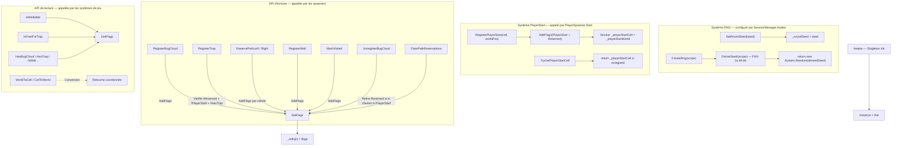
```mermaid
graph TD
    A[Awake — Singleton Init] --> B[Instance = this]

    subgraph "Système RNG — configuré par SessionManager.Awake"
        R1["SetRoundSeed(seed)"] --> R2["_roundSeed = seed"]
        R3["CreateRng(scope)"] --> R4["DeriveSeed(scope) — FNV-1a 64-bit"]
        R4 --> R5["return new System.Random(derivedSeed)"]
    end

    subgraph "Système PlayerStart — appelé par PlayerSpawner.Start"
        P1["RegisterPlayerStart(cell, worldPos)"] --> P2["AddFlags(PlayerStart + Reserved)"]
        P2 --> P3["Stocker _playerStartCell + _playerStartWorld"]
        P4["TryGetPlayerStartCell"] --> P5["return _playerStartCell si enregistré"]
    end

    subgraph "API d'écriture — appelée par les spawners"
        C1[RegisterBugCloud] -->|AddFlags| D[SetFlags]
        C2[RegisterTrap] -->|"Vérifie !Reserved + !PlayerStart + !HasTrap"| D
        C3[ReservePathLeft / Right] -->|AddFlags par cellule| D
        C4[RegisterWall] -->|AddFlags| D
        C5[MarkVisited] -->|AddFlags| D
        C6[UnregisterBugCloud] -->|"Retire Reserved si ni chemin ni PlayerStart"| D
        C7[ClearPathReservations] --> D
    end

    D --> E["_cells[c] = flags"]

    subgraph "API de lecture — appelée par les systèmes de jeu"
        L1[IsWalkable] --> L0[GetFlags]
        L2[IsFreeForTrap] --> L0
        L3[HasBugCloud / HasTrap / IsWall...] --> L0
        L4[WorldToCell / CellToWorld] -.->|Conversion| L5[Retourne coordonnée]
    end
```

### 4.1.5 Approche retenue & alternatives évaluées

**Pattern retenu :** Singleton + Dictionary bitwise flags + RNG déterministe par scope

| Approche                                  | Avantages                                                                 | Inconvénients                                                    |
| :---------------------------------------- | :------------------------------------------------------------------------ | :--------------------------------------------------------------- |
| ✅ **Singleton + Dictionary\<CellFlags\>** | Accès global simple, combinaison d'états par bitwise, allocation à la demande | Non testable unitairement, état mutable global                   |
| Tableau 2D `CellFlags[,]`                | Accès O(1) sans hash, mémoire prévisible                                 | Alloue toute la grille même si peu de cellules sont utilisées    |
| ECS (Entity Component System)             | Scalable, parallélisable, data-oriented                                  | Sur-ingénierie massive pour une grille 10×10, complexité Unity DOTS |

| Approche RNG                              | Avantages                                                                 | Inconvénients                                                    |
| :---------------------------------------- | :------------------------------------------------------------------------ | :--------------------------------------------------------------- |
| ✅ **FNV-1a 64-bit + scope string**       | Reproductible, chaque système a son propre stream, cross-platform         | Dépend de System.Random (pas crypto-safe, non requis ici)        |
| UnityEngine.Random                        | API simple, intégré Unity                                                 | État global partagé, non reproductible entre systèmes            |
| Seed par composant (champ Inspector)      | Isolation totale                                                          | Pas de seed globale, chaque système doit être configuré manuellement |

### 4.1.6 Points d'attention

- **⚠️ Edge case :** `UnregisterBugCloud` ne retire `Reserved` que si la cellule n'appartient à aucun chemin ET n'est pas `PlayerStart` — logique couplée entre entités
- **⚠️ Edge case :** `RegisterTrap` refuse la cellule de départ du joueur (`PlayerStart` flag), même si elle n'est pas réservée par un chemin
- **⚠️ Ordre d'exécution :** `LevelRegistry` doit s'initialiser avant tous les autres systèmes (`-300`). Si un spawner appelle `Instance` dans son `Awake` avec un ordre ≤ -300, NullRef possible
- **⚠️ RNG auto-seed :** Si `CreateRng()` est appelé sans `SetRoundSeed()` préalable, une seed est générée automatiquement (DateTime + Guid) — le run ne sera pas reproductible
- **⚠️ Thread safety :** `_cells` Dictionary non thread-safe — pas de problème en single-threaded Unity, mais à surveiller si des Jobs sont introduits
- **🔧 trapCount / optimalPathLength :** Ces champs sont `[HideInInspector]` — ils servent de canal de communication entre SessionManager/PathSpawner et TrapSpawner, pas de valeurs Inspector

### 4.1.7 Journal d'implémentation

| Date     | Développeur | Note / Décision Technique                                                                                   |
| :------- | :---------- | :---------------------------------------------------------------------------------------------------------- |
| 17/02/26 | @auteur     | Documentation initiale du système. LevelRegistry stable — source de vérité grille avec CellFlags bitwise.   |
| 27/02/26 | @pierre     | Refacto : ajout CellFlag PlayerStart, système RNG (FNV-1a + CreateRng/DeriveSeed), système PlayerStart (RegisterPlayerStart/TryGetPlayerStartCell), suppression OnCellChanged, ajout trapCount [HideInInspector]. |

## 4.2 GameManager

### 4.2.1 Responsabilités

- Suivre l'état du round en cours (steps, trapsHit, bugsCollected, followedBestPath)
- Gérer le cycle de vie des rounds (démarrage, fin de manche sur collecte de nuage, restart)
- Enregistrer les deux nuages du round et déterminer le nuage optimal
- Orchestrer les callbacks d'entités : `OnPlayerStep` (GridMover), `OnTrapTriggered` (Trap), `OnCloudCollected` (BugCloud)
- À chaque pas joueur : révéler le brouillard, marquer la cellule visitée, vérifier l'adhérence au chemin conseillé, enregistrer dans le trial
- Appliquer les pénalités de pièges sur les nuages (-1 bug par nuage par piège)
- Émettre `OnRoundEnded` pour l'UI (RoundUI) — **pas de référence UI directe**
- Coordonner avec TrialManager pour la collecte de données de recherche

### 4.2.2 Composants clés (Data Model)

→ **GameManager.cs** : Singleton MonoBehaviour orchestrant l'état du jeu et le cycle de vie des rounds. Ordre d'exécution : `0` (défaut).

```csharp
public class GameManager : MonoBehaviour
{
    public static GameManager Instance { get; private set; }

    [Header("Références")]
    public TrialManager trialManager;

    [Header("Session")]
    public int blockId = 1;
    int _screenCounter = 0;

    [Header("Round / Score")]
    public int steps = 0;
    public int trapsHit = 0;
    public int bugsCollected = 0;
    public bool followedBestPath = true;

    public bool inputLocked { get; private set; } = false;
    bool _roundOver = false;

    BugCloud _leftCloud, _rightCloud;
    readonly HashSet<Vector2Int> _advisorPath = new();

    [Serializable]
    public struct RoundEndInfo
    {
        public int bugsCollected;
        public int trapsHit;
        public int steps;
        public bool followedBestPath;
        public int leftCloudBugs;
        public int rightCloudBugs;
    }

    public event Action<RoundEndInfo> OnRoundEnded;
}
```

| Variable / Méthode                          | Type                    | Description                                                                       |
| :------------------------------------------ | :---------------------- | :-------------------------------------------------------------------------------- |
| Instance                                    | GameManager             | Référence statique globale (Singleton)                                            |
| trialManager                                | TrialManager            | Référence au TrialManager pour l'envoi des données de recherche                   |
| blockId                                     | int                     | Identifiant du bloc de trials en cours (défaut : 1)                               |
| _screenCounter                              | int (privé)             | Compteur séquentiel de manches dans la session                                    |
| steps / trapsHit / bugsCollected            | int                     | Compteurs du round courant                                                        |
| followedBestPath                            | bool                    | `true` tant que le joueur reste sur le chemin conseillé                           |
| inputLocked                                 | bool (get)              | Verrouille les inputs joueur quand `true` (fin de round)                          |
| _roundOver                                  | bool (privé)            | Empêche les callbacks d'entités après fin de round                                |
| _advisorPath                                | HashSet (privé)         | Cellules du chemin conseillé (reçu de PathSpawner)                                |
| RoundEndInfo                                | struct                  | Données transmises via OnRoundEnded (bugs, traps, steps, chemin, bugs L/R)        |
| OnRoundEnded                                | event Action\<RoundEndInfo\> | Émis à la fin du round — RoundUI s'y abonne                                 |
| BeginFirstRound()                           | void                    | Point d'entrée appelé par SessionManager — lance le premier round                 |
| RegisterClouds(BugCloud, BugCloud)          | void                    | Enregistre les 2 nuages, transmet la config map à TrialManager via `SetMapConfig` |
| SetChosenPath(IEnumerable\<Vector2Int\>)    | void                    | Reçoit le chemin conseillé de PathSpawner pour détecter les déviations            |
| OnPlayerStep(Vector2Int)                    | void                    | Appelé par GridMover — fog, visited, déviation, trial log                         |
| OnTrapTriggered()                           | void                    | Appelé par Trap — trapsHit++, -1 bug sur chaque nuage                            |
| OnCloudCollected(BugCloud)                  | void                    | Fin de round — calcule résultats, finalise trial, émet OnRoundEnded               |
| GetBestCloud()                              | BugCloud                | Retourne le nuage avec le plus de bugs, `null` si égalité                         |
| RestartRound()                              | void                    | Recharge la scène active (appelé par RoundUI)                                     |

### 4.2.3 Dépendances

- **Nécessite :** `LevelRegistry.Instance` (MarkVisited, optimalPathLength, TryGetRoundSeed), `FogController.Instance` (RevealCell), `TrialManager` (StartNewTrial, RecordMove, SetMapConfig, SetOptimalPathLength, EndCurrentTrial, SendTrials), `BugCloud` (nuages du round), `PathSpawner` (chemin conseillé)
- **Est utilisé par :** `SessionManager` (lance `BeginFirstRound()`), `GridMover` (appelle `OnPlayerStep()`), `BugCloud` (appelle `OnCloudCollected()`), `Trap` (appelle `OnTrapTriggered()`), `PathSpawner` (appelle `SetChosenPath()`)
- **Communique avec l'UI via :** `event OnRoundEnded` → `RoundUI` (pas de références UI directes)

### 4.2.4 Diagramme de flux

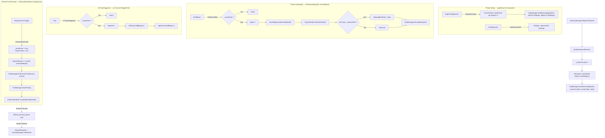
```mermaid
graph TD
    A[SessionManager.BeginFirstRound] --> B["StartNewRound('forest')"]
    B --> B1["_screenCounter++"]
    B1 --> B2["Récupérer roundSeed depuis LevelRegistry"]
    B2 --> C["TrialManager.StartNewTrial(blockId, screenCounter, screenType, seed)"]

    subgraph "Phase Setup — appelé par les spawners"
        D[BugCloudSpawner] -->|RegisterClouds| E[Trie leftCloud / rightCloud par position X]
        E --> F["TrialManager.SetMapConfig(gridSize, leftCell, leftBugs, rightCell, rightBugs)"]
        G[PathSpawner] -->|SetChosenPath| H[Remplit _advisorPath HashSet]
    end

    subgraph "Phase Gameplay — OnPlayerStep(cell) via GridMover"
        I[GridMover] -->|OnPlayerStep| I1{_roundOver ?}
        I1 -->|Oui| I2[return]
        I1 -->|Non| J["steps++"]
        J --> J0["LevelRegistry.MarkVisited(cell)"]
        J0 --> J1["FogController.RevealCell(cell)"]
        J1 --> J2{Cell dans _advisorPath ?}
        J2 -->|Non| K[followedBestPath = false]
        J2 -->|Oui| L[Continue]
        K --> M["TrialManager.RecordMove(cell)"]
        L --> M
    end

    subgraph "OnTrapTriggered — via Trap.OnTriggerEnter"
        T0[Trap] -->|OnTrapTriggered| T1{_roundOver ?}
        T1 -->|Oui| T2[return]
        T1 -->|Non| T3["trapsHit++"]
        T3 --> T4["leftCloud.AddBugs(-1)"]
        T4 --> T5["rightCloud.AddBugs(-1)"]
    end

    subgraph "Phase Fin de Round — OnCloudCollected via BugCloud"
        P[BugCloud.OnTrigger] -->|OnCloudCollected| Q["_roundOver = true, inputLocked = true"]
        Q --> R["bugsCollected += max(0, cloud.totalBugs)"]
        R --> S["TrialManager.EndCurrentTrial(choice, correct)"]
        S --> S1["TrialManager.SendTrials()"]
        S1 --> U["OnRoundEnded?.Invoke(RoundEndInfo)"]
    end

    U -.->|RoundUI écoute| V["Afficher panneau game over"]
    V -.->|Bouton Restart| W["RestartRound() — SceneManager.LoadScene"]
```

### 4.2.5 Formules et règles métier

```
Pénalité piège    = -1 bug dans CHAQUE nuage (leftCloud + rightCloud) par piège déclenché
Bugs collectés    = max(0, cloud.totalBugs) au moment de la collecte
Meilleur nuage    = celui avec le plus de totalBugs ; null si égalité
Choix correct     = le joueur a collecté le meilleur nuage (GetBestCloud)
followedBestPath  = true tant que TOUS les pas du joueur sont dans _advisorPath
Fog + Visited     = gérés par OnPlayerStep (pas par GridMover)
```

### 4.2.6 Points d'attention

- **⚠️ Séparation UI :** GameManager n'a AUCUNE référence UI directe — il émet `OnRoundEnded` et RoundUI s'y abonne. C'est un design « manager émet, UI écoute »
- **⚠️ Edge case :** Si `leftCloud.totalBugs == rightCloud.totalBugs`, `GetBestCloud()` retourne `null` et `choice_correct` sera toujours `false` — à valider si c'est le comportement souhaité pour l'étude
- **⚠️ Fog centralisé :** La révélation du brouillard et le marquage visited sont faits dans `OnPlayerStep()`, pas dans GridMover — un seul point de vérité pour ce qui se passe quand le joueur bouge
- **⚠️ Séquencement :** `RegisterClouds` peut être appelé avant `StartNewRound` (BugCloudSpawner Start -200 vs GameManager Start 0). Le tampon `pendingMapConfigJson` dans TrialManager gère ce cas
- **🔧 À clarifier :** `blockId` est hardcodé à 1 et `screenType` toujours "forest" — à paramétriser quand le protocole de recherche intègrera plusieurs blocs

### 4.2.7 Journal d'implémentation

| Date     | Développeur | Note / Décision Technique                                                                                     |
| :------- | :---------- | :------------------------------------------------------------------------------------------------------------ |
| 17/02/26 | @auteur     | Documentation initiale. GameManager stable — gestion complète du cycle de round avec intégration TrialManager. |
| 27/02/26 | @pierre     | Refacto : suppression champs UI (scoreText, gameOverUI, gameOverStats), ajout event OnRoundEnded + RoundEndInfo, ajout OnTrapTriggered, fog+visited centralisés dans OnPlayerStep, SetMapConfig structuré (plus de JSON brut dans GameManager), StartNewTrial passe la seed, suppression DTOs MiniMapCfg/CloudInfo (déplacés dans TrialManager). |

## 4.3 SessionManager

### 4.3.1 Responsabilités

- Gérer la seed de randomisation pour le round (génération ou parsing CLI)
- Écrire la seed dans `LevelRegistry.SetRoundSeed()` pour que tous les spawners l'utilisent
- Parser `trapCount=N` depuis les arguments CLI et l'écrire dans `LevelRegistry.trapCount`
- Parser `sessionId=X` depuis les arguments CLI et l'injecter dans TrialManager
- Déclencher le début du jeu via `GameManager.BeginFirstRound()` après un frame de délai

### 4.3.2 Composants clés (Data Model)

→ **SessionManager.cs** : MonoBehaviour de configuration au démarrage. Ordre d'exécution : `0` (défaut). Awake configure seed + trapCount + sessionId. Start est une coroutine qui lance le jeu après un frame.

```csharp
public class SessionManager : MonoBehaviour
{
    [Header("Refs")]
    public TrialManager trialManager;
    public GameManager gameManager;

    [Header("Session meta (optionnel)")]
    public long randomizationSeed = 0;
    public string buildVersion = "1.0.0";

    [Header("Configuration de la map")]
    [SerializeField] private int trapCount = 10;
}
```

| Variable / Méthode          | Type         | Description                                                                       |
| :-------------------------- | :----------- | :-------------------------------------------------------------------------------- |
| trialManager                | TrialManager | Référence pour injecter le sessionId                                              |
| gameManager                 | GameManager  | Référence pour déclencher `BeginFirstRound()`                                     |
| randomizationSeed           | long         | Seed de randomisation — 0 = auto-généré, sinon utilisé tel quel                   |
| buildVersion                | string       | Version du build (réservée, non utilisée actuellement — défaut : "1.0.0")         |
| trapCount                   | int [SerializeField] | Nombre de pièges (défaut : 10) — overridable via CLI `trapCount=N`        |
| Awake()                     | void         | Pipeline séquentiel : seed → trapCount CLI → trapCount registry → sessionId       |
| Start()                     | IEnumerator  | Coroutine : `yield return null` → `BeginFirstRound()`                             |
| ApplySeedForThisRound()     | void (privé) | Parse `seed=` CLI, sinon génère depuis DateTime+Guid, écrit dans LevelRegistry    |
| TryApplyTrapCountFromArgs() | void (privé) | Parse `trapCount=N` depuis les args CLI                                           |
| ApplyTrapCountToRegistry()  | void (privé) | Écrit `trapCount` dans `LevelRegistry.trapCount`                                  |
| TryApplySessionIdFromArgs() | void (privé) | Parse `sessionId=X` depuis les args et l'injecte dans TrialManager                |

### 4.3.3 Dépendances

- **Nécessite :** `LevelRegistry.Instance` (SetRoundSeed, trapCount), `GameManager` (appelle `BeginFirstRound()`), `TrialManager` (injecte sessionId)
- **Est utilisé par :** Aucun — point d'entrée du flux de jeu
- **Source de données :** Arguments de ligne de commande (`System.Environment.GetCommandLineArgs()`)
- **Ne référence plus :** `TrapSpawner` (le trapCount transite par LevelRegistry)

### 4.3.4 Diagramme de flux

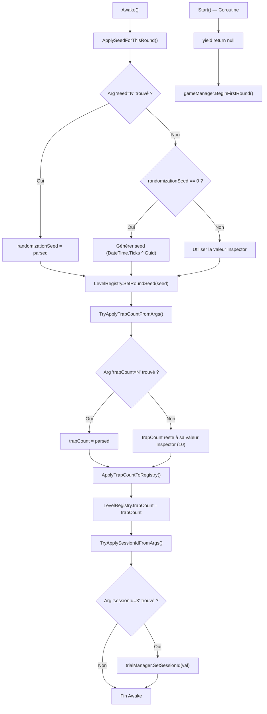
```mermaid
graph TD
    A["Awake()"] --> B["ApplySeedForThisRound()"]
    B --> B1{Arg 'seed=N' trouvé ?}
    B1 -->|Oui| B2["randomizationSeed = parsed"]
    B1 -->|Non| B3{randomizationSeed == 0 ?}
    B3 -->|Oui| B4["Générer seed (DateTime.Ticks ^ Guid)"]
    B3 -->|Non| B5["Utiliser la valeur Inspector"]
    B2 --> B6["LevelRegistry.SetRoundSeed(seed)"]
    B4 --> B6
    B5 --> B6

    B6 --> C["TryApplyTrapCountFromArgs()"]
    C --> C1{Arg 'trapCount=N' trouvé ?}
    C1 -->|Oui| C2["trapCount = parsed"]
    C1 -->|Non| C3["trapCount reste à sa valeur Inspector (10)"]
    C2 --> D["ApplyTrapCountToRegistry()"]
    C3 --> D
    D --> D1["LevelRegistry.trapCount = trapCount"]

    D1 --> E["TryApplySessionIdFromArgs()"]
    E --> E1{Arg 'sessionId=X' trouvé ?}
    E1 -->|Oui| E2["trialManager.SetSessionId(val)"]
    E1 -->|Non| F["Fin Awake"]
    E2 --> F

    G["Start() — Coroutine"] --> H["yield return null"]
    H --> I["gameManager.BeginFirstRound()"]
```

### 4.3.5 Approche retenue & alternatives évaluées

**Approche retenue :** Arguments de ligne de commande + écriture dans LevelRegistry (pas d'injection directe dans les spawners)

| Approche                                 | Avantages                                                           | Inconvénients                                       |
| :--------------------------------------- | :------------------------------------------------------------------ | :-------------------------------------------------- |
| ✅ **Args CLI → LevelRegistry**          | Découplé des spawners, un seul point de vérité, compatible WebGL    | Parsing manuel, pas de validation de schéma          |
| Injection directe dans TrapSpawner       | Simple et explicite                                                 | Couplage SessionManager↔TrapSpawner, fragile si le spawner change |
| URL query parameters (WebGL)             | Plus standard pour le web                                           | Pas compatible Desktop, nécessite un bridge JS→Unity |

### 4.3.6 Points d'attention

- **⚠️ Awake, pas Start :** Toute la configuration (seed, trapCount, sessionId) est faite en Awake pour garantir que les spawners (qui tournent en Start avec des ordres négatifs) aient accès aux bonnes valeurs
- **⚠️ Seed reproductible :** Si `seed=` est fourni en CLI ou si `randomizationSeed` est défini dans l'Inspector (≠ 0), le run est entièrement reproductible. Si = 0, une seed unique est générée à chaque lancement
- **⚠️ Edge case :** Si `trapCount` n'est pas fourni en argument, la valeur par défaut Inspector (10) est utilisée — comportement silencieux par design
- **⚠️ Edge case :** Si `sessionId` n'est pas fourni, `TrialManager.StartNewTrial()` logguera une erreur et ignorera la manche — les données de recherche seront perdues
- **⚠️ WebGL :** `System.Environment.GetCommandLineArgs()` fonctionne en WebGL uniquement si les arguments sont passés via le template HTML Unity — à vérifier avec le dashboard
- **🔧 buildVersion :** Déclaré mais non exploité — prévu pour le protocole de recherche

### 4.3.7 Journal d'implémentation

| Date     | Développeur | Note / Décision Technique                                                                                           |
| :------- | :---------- | :------------------------------------------------------------------------------------------------------------------ |
| 17/02/26 | @auteur     | Documentation initiale. SessionManager stable — bootstrap par args CLI avec injection dans TrapSpawner/TrialManager. |
| 27/02/26 | @pierre     | Refacto : suppression référence TrapSpawner, SessionManager possède trapCount (SerializeField), pipeline seed (ApplySeedForThisRound → LevelRegistry.SetRoundSeed), trapCount écrit dans LevelRegistry.trapCount, ajout parsing CLI seed=N. |

## 4.4 FogController

### 4.4.1 Responsabilités

- Générer et maintenir une texture masque RGBA32 pour le brouillard de guerre
- Fournir une API de révélation par cellule avec brush circulaire et feathering
- Alimenter le shader custom (`FogUnlitMask.shadergraph`) via la property `_Mask`

### 4.4.2 Composants clés (Data Model)

→ **FogController.cs** : Singleton MonoBehaviour, `[RequireComponent(typeof(Renderer))]`. Ordre d'exécution : `-250`.

```csharp
[RequireComponent(typeof(Renderer))]
[DefaultExecutionOrder(-250)]
public class FogController : MonoBehaviour
{
    public static FogController Instance { get; private set; }

    [Header("Grille")]
    public Vector2Int gridSize = new(10, 10);

    [Header("Masque")]
    public int pixelsPerCell = 32;
    public int brushRadiusPx = 14;
    public int brushFeatherPx = 6;

    Renderer fogRenderer;
    Texture2D mask;
    Color32[] buffer;
    int texW, texH;
}
```

| Variable / Méthode                     | Type          | Description                                                          |
| :------------------------------------- | :------------ | :------------------------------------------------------------------- |
| Instance                               | FogController | Référence statique globale (Singleton)                               |
| gridSize                               | Vector2Int    | Dimensions de la grille — synchronisé depuis LevelRegistry à l'Awake |
| pixelsPerCell                          | int           | Résolution du masque par case (défaut : 32 — doux ; 1 — net)        |
| brushRadiusPx                          | int           | Rayon extérieur du pinceau de révélation en pixels (défaut : 14)     |
| brushFeatherPx                         | int           | Largeur du dégradé doux au bord du pinceau en pixels (défaut : 6)   |
| mask                                   | Texture2D     | Texture RGBA32 générée au runtime (canal R utilisé par le shader)    |
| buffer                                 | Color32[]     | Buffer RAM modifié puis poussé vers la texture GPU                   |
| RevealCell(Vector2Int)                 | void          | Révèle une cellule en peignant un disque dans le masque              |
| RevealCells(IEnumerable\<Vector2Int\>) | void          | Révèle plusieurs cellules (appelle RevealCell en boucle)             |
| WorldToCell(Vector3)                   | Vector2Int    | Délègue à LevelRegistry si disponible, sinon RoundToInt fallback    |
| PaintDisc(center, rOut, feather)       | void (privé)  | Peint un disque avec dégradé SmoothStep dans le buffer — révèle uniquement |

### 4.4.3 Dépendances

- **Nécessite :** `LevelRegistry.Instance` (gridSize à l'Awake, WorldToCell pour la conversion), `Renderer` sur le même GameObject (pour assigner `_Mask`), Shader `FogUnlitMask.shadergraph` (property reference `_Mask`)
- **Est utilisé par :** `GameManager.OnPlayerStep` (RevealCell à chaque pas joueur), `PathSpawner` (RevealCells pour le chemin conseillé)
- **Ne déclenche :** Aucun event

### 4.4.4 Diagramme de flux

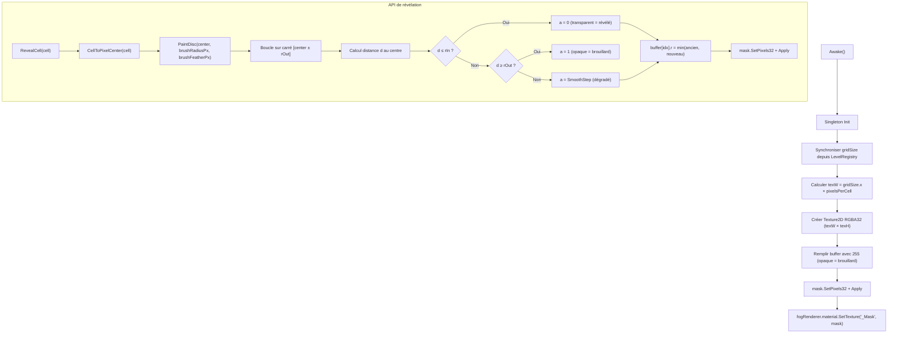
```mermaid
graph TD
    A["Awake()"] --> B[Singleton Init]
    B --> C["Synchroniser gridSize depuis LevelRegistry"]
    C --> D["Calculer texW = gridSize.x × pixelsPerCell"]
    D --> E["Créer Texture2D RGBA32 (texW × texH)"]
    E --> F["Remplir buffer avec 255 (opaque = brouillard)"]
    F --> G["mask.SetPixels32 + Apply"]
    G --> H["fogRenderer.material.SetTexture('_Mask', mask)"]

    subgraph "API de révélation"
        I["RevealCell(cell)"] --> J["CellToPixelCenter(cell)"]
        J --> K["PaintDisc(center, brushRadiusPx, brushFeatherPx)"]
        K --> L["Boucle sur carré [center ± rOut]"]
        L --> M["Calcul distance d au centre"]
        M --> N{d ≤ rIn ?}
        N -->|Oui| O["a = 0 (transparent = révélé)"]
        N -->|Non| P{d ≥ rOut ?}
        P -->|Oui| Q["a = 1 (opaque = brouillard)"]
        P -->|Non| R["a = SmoothStep (dégradé)"]
        O --> S["buffer[idx].r = min(ancien, nouveau)"]
        R --> S
        S --> T["mask.SetPixels32 + Apply"]
    end
```

### 4.4.5 Approche retenue & alternatives évaluées

**Approche retenue :** Texture masque RGBA32 modifiée en RAM + Shader Graph custom

| Approche                             | Avantages                                                                        | Inconvénients                                                     |
| :----------------------------------- | :------------------------------------------------------------------------------- | :---------------------------------------------------------------- |
| ✅ **Texture masque + Shader Graph** | Contrôle pixel-perfect, feathering doux, pas de GameObjects supplémentaires      | Coût mémoire texture (320×320 px pour grille 10×10 à 32 ppx)     |
| Tiles individuelles avec alpha       | Simple, pas de shader custom                                                     | Pas de dégradé doux, 100+ GameObjects pour une grille 10×10      |
| Render Texture + caméra secondaire   | Rendu dynamique, effet volumétrique possible                                     | Coût GPU, complexité de setup, overkill pour une grille 2D       |

### 4.4.6 Points d'attention

- **⚠️ Performance :** `mask.Apply()` est appelé à chaque `RevealCell` — un seul apply par frame serait plus efficace si plusieurs cellules sont révélées dans le même frame (ex: `RevealCells` appelle `RevealCell` en boucle → N apply au lieu de 1)
- **⚠️ Mono-directionnelle :** Le `PaintDisc` ne fait que révéler (`min` entre ancien et nouveau) — impossible de "re-brouiller" une cellule déjà révélée
- **⚠️ Résolution :** `pixelsPerCell = 32` donne une texture 320×320 pour une grille 10×10 — si la grille grandit à 50×50, la texture atteint 1600×1600 (mémoire à surveiller en WebGL)
- **⚠️ Shader :** Le shader `FogUnlitMask.shadergraph` doit exposer une property `_Mask` de type Texture2D — si le shader change, la liaison se casse silencieusement

### 4.4.7 Journal d'implémentation

| Date     | Développeur | Note / Décision Technique                                                                      |
| :------- | :---------- | :--------------------------------------------------------------------------------------------- |
| 17/02/26 | @auteur     | Documentation initiale. Texture masque RGBA32 avec révélation par brush circulaire SmoothStep. |

## 4.5 TrialManager

### 4.5.1 Responsabilités

- Créer et gérer les objets `TrialData` pour chaque manche de jeu
- Enregistrer le chemin du joueur step par step (coordonnées grille + timestamp ISO)
- Stocker la configuration de la carte via une API structurée (`SetMapConfig`) — construit le JSON en interne
- Stocker la seed du trial dans les données de recherche
- Finaliser les résultats de manche (choix du joueur, justesse, longueur du chemin optimal)
- Envoyer les trials accumulés en batch vers l'API REST (`POST /api/trials`) avec auth par token

### 4.5.2 Composants clés (Data Model)

→ **TrialManager.cs** : MonoBehaviour gérant le cycle de vie des données de recherche. Pas de Singleton — référencé via Inspector par GameManager et SessionManager.

```csharp
public class TrialManager : MonoBehaviour
{
    [Header("API Settings")]
    public string apiBaseUrl = "http://localhost:3000";
    public string studyToken = "ensstudytoken";

    [Header("Session Info")]
    public string gameSessionId;

    private List<TrialData> trials = new();
    private TrialData currentTrial;
    private bool isSending = false;
    private string pendingMapConfigJson;
}
```

→ **DTOs internes** pour la config map (privés à TrialManager) :

```csharp
[Serializable]
private struct CloudInfo
{
    public int x, y, totalBugs;
}

[Serializable]
private struct MiniMapCfg
{
    public int gridWidth, gridHeight;
    public CloudInfo leftCloud, rightCloud;
}
```

| Variable / Méthode                                    | Type                      | Description                                                                              |
| :---------------------------------------------------- | :------------------------ | :--------------------------------------------------------------------------------------- |
| apiBaseUrl                                            | string                    | URL de base de l'API backend (défaut : `http://localhost:3000`)                          |
| studyToken                                            | string                    | Token d'authentification envoyé en header `x-study-token`                                |
| gameSessionId                                         | string                    | ID de session injecté par SessionManager — requis pour créer des trials                  |
| trials                                                | List\<TrialData\> (privé) | Accumulation locale des manches avant envoi en batch                                     |
| currentTrial                                          | TrialData (privé)         | Manche en cours de jeu                                                                   |
| pendingMapConfigJson                                  | string (privé)            | Tampon pour la config map reçue avant que le trial ne soit créé                          |
| SetSessionId(string)                                  | void                      | Injecte l'ID de session (appelé par SessionManager)                                      |
| StartNewTrial(int, int, string, **long trialSeed**)   | void                      | Crée un TrialData, stocke la seed, applique le tampon map_config si présent              |
| RecordMove(Vector2Int)                                | void                      | Ajoute un PlayerStep (position + timestamp ISO) au trial courant                         |
| EndCurrentTrial(string, bool)                         | void                      | Finalise le trial : choix du joueur, justesse, timestamp de fin                          |
| SetOptimalPathLength(int)                             | void                      | Enregistre la longueur du chemin optimal dans le trial courant                           |
| **SetMapConfig(gridSize, leftCell, leftBugs, rightCell, rightBugs)** | void       | API structurée — construit le JSON MiniMapCfg en interne                                 |
| SetMapConfigJson(string)                              | void                      | Stocke le JSON brut dans le trial courant ou dans le tampon                              |
| SendTrials()                                          | void                      | Lance l'envoi asynchrone des trials accumulés                                            |
| SendTrialsCoroutine()                                 | IEnumerator (privé)       | POST JSON vers `apiBaseUrl/api/trials`, clear local si succès                            |

→ **JsonHelper** : Classe utilitaire statique pour sérialiser un tableau en JSON Unity-friendly (wrapper `{ "Items": [...] }`).

### 4.5.3 Dépendances

- **Nécessite :** `TrialData` (structure de données sérialisable), `PlayerStep` (structure de données sérialisable), `UnityWebRequest` (envoi HTTP)
- **Est utilisé par :** `GameManager` (StartNewTrial, RecordMove, EndCurrentTrial, SetMapConfig, SetOptimalPathLength, SendTrials), `SessionManager` (SetSessionId)
- **Communique avec :** API REST externe (`POST /api/trials` avec header `x-study-token`)
- **Possède en interne :** DTOs `MiniMapCfg` / `CloudInfo` (privés — étaient dans GameManager avant la refacto)

### 4.5.4 Diagramme de flux

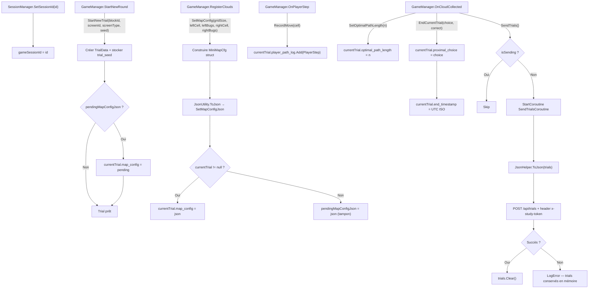
```mermaid
graph TD
    A["SessionManager.SetSessionId(id)"] --> B["gameSessionId = id"]

    C["GameManager.StartNewRound"] -->|"StartNewTrial(blockId, screenId, screenType, seed)"| D["Créer TrialData + stocker trial_seed"]
    D --> E{pendingMapConfigJson ?}
    E -->|Oui| F["currentTrial.map_config = pending"]
    E -->|Non| G[Trial prêt]
    F --> G

    H["GameManager.RegisterClouds"] -->|"SetMapConfig(gridSize, leftCell, leftBugs, rightCell, rightBugs)"| H1["Construire MiniMapCfg struct"]
    H1 --> H2["JsonUtility.ToJson → SetMapConfigJson"]
    H2 --> I{currentTrial != null ?}
    I -->|Oui| J["currentTrial.map_config = json"]
    I -->|Non| K["pendingMapConfigJson = json (tampon)"]

    L["GameManager.OnPlayerStep"] -->|"RecordMove(cell)"| M["currentTrial.player_path_log.Add(PlayerStep)"]

    N["GameManager.OnCloudCollected"] -->|"SetOptimalPathLength(n)"| O["currentTrial.optimal_path_length = n"]
    N -->|"EndCurrentTrial(choice, correct)"| P["currentTrial.proximal_choice = choice"]
    P --> Q["currentTrial.end_timestamp = UTC ISO"]

    N -->|"SendTrials()"| R{isSending ?}
    R -->|Oui| S[Skip]
    R -->|Non| T["StartCoroutine SendTrialsCoroutine"]
    T --> U["JsonHelper.ToJson(trials)"]
    U --> V["POST /api/trials + header x-study-token"]
    V --> W{Succès ?}
    W -->|Oui| X["trials.Clear()"]
    W -->|Non| Y["LogError — trials conservés en mémoire"]
```

### 4.5.5 Approche retenue & alternatives évaluées

**Approche retenue :** Accumulation locale + envoi batch par coroutine HTTP + API structurée SetMapConfig

| Approche                            | Avantages                                                   | Inconvénients                                           |
| :---------------------------------- | :---------------------------------------------------------- | :------------------------------------------------------ |
| ✅ **Batch local + POST coroutine** | Simple, pas de dépendance externe, compatible WebGL         | Données perdues si le joueur ferme avant l'envoi        |
| WebSocket persistant                | Temps réel, pas de perte de données                         | Complexité serveur, pas supporté nativement par WebGL   |
| PlayerPrefs comme cache de secours  | Survit aux crashes/fermetures                               | Limité en taille, format clé-valeur inadapté aux trials |

| Approche config map                  | Avantages                                                    | Inconvénients                                          |
| :----------------------------------- | :----------------------------------------------------------- | :----------------------------------------------------- |
| ✅ **SetMapConfig structuré**        | Type-safe, pas de construction JSON côté GameManager         | Un niveau d'indirection supplémentaire                 |
| SetMapConfigJson(string) direct      | Flexible, accepte n'importe quel format                      | GameManager doit construire le JSON, couplage au format |

### 4.5.6 Points d'attention

- **⚠️ Perte de données :** Si le joueur ferme le navigateur avant `SendTrials()`, les trials en mémoire sont perdus — pas de persistance locale
- **⚠️ Séquencement :** `SetMapConfig` peut être appelé avant `StartNewTrial` (BugCloudSpawner Start -200 vs GameManager Start 0). Le tampon `pendingMapConfigJson` gère ce cas
- **⚠️ Concurrence :** `isSending` empêche les envois concurrents mais ne met pas en queue les demandes — si `SendTrials()` est appelé pendant un envoi, il est silencieusement ignoré
- **⚠️ Sérialisation :** `JsonHelper` wrappe le tableau dans `{ "Items": [...] }` — le backend doit s'attendre à ce format, pas un tableau JSON pur
- **⚠️ Noms de champs JSON :** Les DTOs utilisent `gridWidth`/`gridHeight` et `totalBugs` (pas `grid_w`/`grid_h` ni `bugs` comme avant)
- **🔧 À sécuriser :** `studyToken` est en clair dans l'Inspector — acceptable pour un prototype de recherche, à migrer vers un mécanisme plus sécurisé en production

### 4.5.7 Journal d'implémentation

| Date     | Développeur | Note / Décision Technique                                                                                       |
| :------- | :---------- | :-------------------------------------------------------------------------------------------------------------- |
| 17/02/26 | @auteur     | Documentation initiale. Pipeline de collecte trial complet avec tampon map_config et envoi batch par coroutine. |
| 27/02/26 | @pierre     | Refacto : StartNewTrial prend 4 params (ajout trialSeed), nouveau SetMapConfig structuré (construit JSON en interne), DTOs MiniMapCfg/CloudInfo déplacés de GameManager vers TrialManager, noms de champs changés (gridWidth/gridHeight, totalBugs). |

## 4.6 TilesSpawner

### 4.6.1 Responsabilités

- Générer la grille de tuiles au runtime à partir du prefab tile
- Calculer et initialiser `LevelRegistry.originWorld` depuis la position du joueur
- Garantir que le joueur se retrouve centré en X sur la première rangée (z=0)
- Organiser les tuiles instanciées sous un GameObject root dédié

### 4.6.2 Composants clés (Data Model)

→ **TilesSpawner.cs** : MonoBehaviour, génération de la grille à l'Awake. Ordre d'exécution : `-240`.

```csharp
[DefaultExecutionOrder(-240)]
public class TilesSpawner : MonoBehaviour
{
    [Header("Tiles")]
    public GameObject tilePrefab;

    [Header("Placement")]
    public Transform playerPosition;
    public float tilesY = 0f;

    private Transform root;
}
```

| Variable / Méthode                          | Type              | Description                                                              |
| :------------------------------------------ | :---------------- | :----------------------------------------------------------------------- |
| tilePrefab                                  | GameObject        | Prefab de tuile à instancier pour chaque cellule de la grille            |
| playerPosition                              | Transform         | Transform de référence pour le calcul de l'origine (position du joueur)  |
| tilesY                                      | float             | Hauteur Y de génération de la grille (défaut : 0)                        |
| root                                        | Transform (privé) | GameObject parent regroupant toutes les tuiles instanciées               |
| Spawn()                                     | void (public)     | Méthode principale : calcule l'origine, crée le root, instancie les tuiles |
| ComputeOriginFromPlayer(registry, worldPos) | Vector3 (statique)| Calcule l'origine grille pour centrer le joueur sur la cellule médiane   |
| EnsureRoot()                                | void (privé)      | Crée le GameObject "TilesRootRuntime" comme enfant du TilesSpawner       |
| ClearRuntime()                              | void (privé)      | Détruit tous les enfants du root (nettoyage avant régénération)          |

### 4.6.3 Dépendances

- **Nécessite :** `LevelRegistry.Instance` (gridSize, cellSize — lecture ; originWorld — écriture)
- **Est utilisé par :** Aucun système directement — produit les GameObjects tuiles taggés "Tile" consommés par `CorridorWallsGenerator`
- **Déclenche :** Initialisation de `LevelRegistry.originWorld`

### 4.6.4 Diagramme de flux

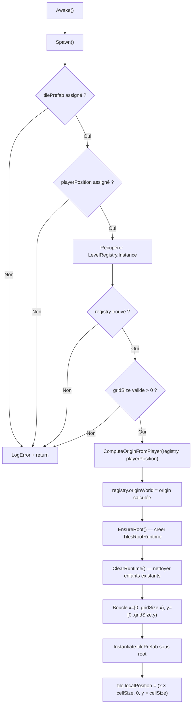
```mermaid
graph TD
    A["Awake()"] --> B["Spawn()"]
    B --> C{tilePrefab assigné ?}
    C -->|Non| D["LogError + return"]
    C -->|Oui| E{playerPosition assigné ?}
    E -->|Non| D
    E -->|Oui| F["Récupérer LevelRegistry.Instance"]
    F --> G{registry trouvé ?}
    G -->|Non| D
    G -->|Oui| H{gridSize valide > 0 ?}
    H -->|Non| D
    H -->|Oui| I["ComputeOriginFromPlayer(registry, playerPosition)"]
    I --> J["registry.originWorld = origin calculée"]
    J --> K["EnsureRoot() — créer TilesRootRuntime"]
    K --> L["ClearRuntime() — nettoyer enfants existants"]
    L --> M["Boucle x=[0..gridSize.x), y=[0..gridSize.y)"]
    M --> N["Instantiate tilePrefab sous root"]
    N --> O["tile.localPosition = (x × cellSize, 0, y × cellSize)"]
```

### 4.6.5 Formules et règles métier

```
midX                = gridSize.x / 2 (division entière)
originWorld.x       = playerPosition.x - (midX × cellSize)
originWorld.z       = playerPosition.z
originWorld.y       = 0

Tile localPosition  = (x × cellSize, 0, y × cellSize)  pour x ∈ [0, gridSize.x), y ∈ [0, gridSize.y)

Contrainte joueur   = le joueur doit se retrouver sur la cellule (midX, 0) après calcul de l'origine
```

### 4.6.6 Points d'attention

- **⚠️ Écriture dans LevelRegistry :** TilesSpawner est le seul système qui écrit `originWorld` — tous les autres systèmes le lisent. Si TilesSpawner ne s'exécute pas, toutes les conversions WorldToCell/CellToWorld seront faussées
- **⚠️ Ordre d'exécution :** `-240` s'exécute après LevelRegistry (-300) et FogController (-250), mais avant BugCloudSpawner (-200) — l'origine doit être calculée avant tout placement d'entité
- **⚠️ Fallback :** Si `LevelRegistry.Instance` est null, tente `FindFirstObjectByType<LevelRegistry>()` — couverture du cas où l'ordre Awake n'est pas garanti
- **⚠️ cellSize guard :** `Mathf.Max(0.0001f, cellSize)` empêche une division par zéro ou un espacement nul des tuiles

### 4.6.7 Journal d'implémentation

| Date     | Développeur | Note / Décision Technique                                                                                          |
| :------- | :---------- | :----------------------------------------------------------------------------------------------------------------- |
| 17/02/26 | @auteur     | Documentation initiale. Génération runtime de la grille avec calcul d'origine centré sur le joueur.                |

## 4.7 PlayerSpawner

### 4.7.1 Responsabilités

- Instancier le prefab joueur au runtime à une position et rotation définies par un Transform de spawn
- Enregistrer la cellule et la position monde de départ du joueur dans `LevelRegistry.RegisterPlayerStart()`
- Permettre aux autres spawners de récupérer la position joueur via `TryGetPlayerStartCell()` sans référence Transform directe

### 4.7.2 Composants clés (Data Model)

→ **PlayerSpawner.cs** : MonoBehaviour, instanciation du joueur au Start. Ordre d'exécution : **`-250`** (premier spawner en Start, après que TilesSpawner.Awake ait posé `originWorld`).

```csharp
[DefaultExecutionOrder(-250)]
public class PlayerSpawner : MonoBehaviour
{
    [Header("Références")]
    [SerializeField] private GameObject playerPrefab;
    [SerializeField] private Transform spawnTransform;
}
```

| Variable / Méthode | Type       | Description                                                           |
| :------------------ | :--------- | :-------------------------------------------------------------------- |
| playerPrefab        | GameObject | Prefab du joueur à instancier (doit avoir GridMover, etc.)            |
| spawnTransform      | Transform  | Transform définissant la position et rotation de spawn du joueur      |

### 4.7.3 Dépendances

- **Nécessite :** `LevelRegistry.Instance` (WorldToCell, RegisterPlayerStart)
- **Est utilisé par :** Aucun système directement — mais tous les spawners accèdent à la position joueur via `LevelRegistry.TryGetPlayerStartCell()` / `TryGetPlayerStartWorld()` (rendu possible par l'enregistrement fait ici)
- **Déclenche :** `RegisterPlayerStart(cell, worldPos)` dans LevelRegistry (ajoute les flags `PlayerStart + Reserved`)

### 4.7.4 Diagramme de flux

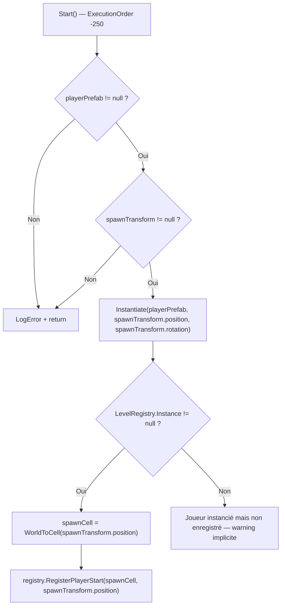
```mermaid
graph TD
    A["Start() — ExecutionOrder -250"] --> B{playerPrefab != null ?}
    B -->|Non| C["LogError + return"]
    B -->|Oui| D{spawnTransform != null ?}
    D -->|Non| C
    D -->|Oui| E["Instantiate(playerPrefab, spawnTransform.position, spawnTransform.rotation)"]
    E --> F{LevelRegistry.Instance != null ?}
    F -->|Oui| G["spawnCell = WorldToCell(spawnTransform.position)"]
    G --> H["registry.RegisterPlayerStart(spawnCell, spawnTransform.position)"]
    F -->|Non| I["Joueur instancié mais non enregistré — warning implicite"]
```

### 4.7.5 Points d'attention

- **⚠️ Ordre d'exécution :** `-250` garantit que PlayerSpawner tourne en Start avant tous les autres spawners (BugCloudSpawner -200, PathSpawner -100, etc.) — la cellule joueur est donc disponible via `TryGetPlayerStartCell()` quand ils en ont besoin
- **⚠️ RegisterPlayerStart :** L'enregistrement ajoute les flags `PlayerStart + Reserved` à la cellule — aucun piège ne pourra y être placé, et `UnregisterBugCloud` ne retirera pas `Reserved` de cette cellule
- **⚠️ Découplage :** Les autres spawners n'ont plus de champ `Transform player` dans l'Inspector — ils passent par `LevelRegistry.TryGetPlayerStartCell()`. Cela supprime les références croisées et simplifie le setup de scène

### 4.7.6 Journal d'implémentation

| Date     | Développeur | Note / Décision Technique                                                                           |
| :------- | :---------- | :-------------------------------------------------------------------------------------------------- |
| 17/02/26 | @auteur     | Documentation initiale. Spawner simple — instanciation du joueur à un point de spawn configurable. |
| 27/02/26 | @pierre     | Refacto : ajout [DefaultExecutionOrder(-250)], appel RegisterPlayerStart(cell, worldPos) après Instantiate, suppression Update() vide. Les spawners accèdent au joueur via TryGetPlayerStartCell au lieu de Transform Inspector. |

# 5. Gestion des données

## 5.1 Structures de données de recherche

### TrialData

→ **TrialData.cs** : Classe `[Serializable]` représentant une manche complète de jeu. Créée par TrialManager au début de chaque round, enrichie pendant le gameplay, sérialisée en JSON pour l'envoi API.

```csharp
[Serializable]
public class TrialData
{
    public string session_id;
    public int block_id;
    public int screen_id;
    public string screen_type;
    public string timestamp;
    public float base_reward;
    public string advisor_type;
    public string map_config;
    public string true_cloud;
    public int optimal_path_length;
    public long trial_seed;
    public List<PlayerStep> player_path_log = new();
    public string proximal_choice;
    public bool choice_correct;
    public string end_timestamp;
}
```

| Champ               | Type               | Rempli par                   | Description                                                    |
| :------------------ | :----------------- | :--------------------------- | :------------------------------------------------------------- |
| session_id          | string             | Constructeur                 | ID de session (injecté depuis les args CLI via SessionManager) |
| block_id            | int                | Constructeur                 | Identifiant du bloc de trials (défaut : 1)                     |
| screen_id           | int                | Constructeur                 | Numéro séquentiel de la manche dans le bloc                    |
| screen_type         | string             | Constructeur                 | Type d'écran (ex : "forest")                                   |
| timestamp           | string             | Constructeur                 | Date ISO 8601 UTC du début de la manche                        |
| base_reward         | float              | _Non utilisé_                | Récompense de base (réservé pour le protocole de recherche)    |
| advisor_type        | string             | _Non utilisé_                | Type de conseiller (réservé pour le protocole de recherche)    |
| map_config          | string             | TrialManager.SetMapConfig    | JSON de la config carte (grille, positions/bugs des nuages)    |
| true_cloud          | string             | _Non utilisé_                | Nuage correct (réservé)                                        |
| optimal_path_length | int                | GameManager.OnCloudCollected | Longueur du chemin optimal enregistré par PathSpawner          |
| **trial_seed**      | **long**           | **TrialManager.StartNewTrial** | **Seed de randomisation du round — permet la reproductibilité** |
| player_path_log     | List\<PlayerStep\> | TrialManager.RecordMove      | Séquence ordonnée des pas du joueur avec timestamps            |
| proximal_choice     | string             | TrialManager.EndCurrentTrial | Choix du joueur : "left", "right" ou "unknown"                 |
| choice_correct      | bool               | TrialManager.EndCurrentTrial | `true` si le joueur a collecté le nuage optimal                |
| end_timestamp       | string             | TrialManager.EndCurrentTrial | Date ISO 8601 UTC de fin de manche                             |

### PlayerStep

→ **PlayerStep.cs** : Classe `[Serializable]` représentant un pas du joueur sur la grille.

```csharp
[Serializable]
public class PlayerStep
{
    public int x;
    public int y;
    public string t;

    public PlayerStep(Vector2Int pos, string time);
}
```

| Champ | Type   | Description                                     |
| :---- | :----- | :---------------------------------------------- |
| x     | int    | Coordonnée grille X du pas                      |
| y     | int    | Coordonnée grille Y du pas                      |
| t     | string | Timestamp ISO 8601 UTC du moment du déplacement |

### Format JSON envoyé à l'API

```json
{
  "Items": [
    {
      "session_id": "abc-123",
      "block_id": 1,
      "screen_id": 1,
      "screen_type": "forest",
      "timestamp": "2026-02-17T14:30:00.000Z",
      "map_config": "{\"gridWidth\":10,\"gridHeight\":10,\"leftCloud\":{\"x\":2,\"y\":7,\"totalBugs\":45},\"rightCloud\":{\"x\":7,\"y\":7,\"totalBugs\":45}}",
      "optimal_path_length": 12,
      "trial_seed": 8234567890123456789,
      "player_path_log": [
        {"x": 5, "y": 0, "t": "2026-02-17T14:30:01.000Z"},
        {"x": 5, "y": 1, "t": "2026-02-17T14:30:01.500Z"}
      ],
      "proximal_choice": "left",
      "choice_correct": true,
      "end_timestamp": "2026-02-17T14:30:15.000Z"
    }
  ]
}
```

### Points d'attention sur les données

- **⚠️ Champs réservés :** `base_reward`, `advisor_type`, `true_cloud` sont déclarés mais jamais remplis — prévus pour l'évolution du protocole de recherche
- **⚠️ Format wrapper :** `JsonHelper.ToJson` produit `{ "Items": [...] }` et non un tableau JSON pur — le backend doit parser ce format
- **⚠️ Timestamps :** Tous les timestamps utilisent `DateTime.UtcNow.ToString("o")` (ISO 8601 UTC) — pas de timezone locale, cohérent pour l'analyse

# 6. Interface utilisateur

## 6.1 RoundUI

### 6.1.1 Responsabilités

- Afficher le panneau de fin de round (game over) quand `GameManager.OnRoundEnded` est émis
- Formater et présenter les statistiques de la manche (bugs collectés, pièges, pas, chemin optimal)
- Fournir le bouton de restart qui appelle `GameManager.RestartRound()`
- Masquer le panneau au démarrage

### 6.1.2 Composants clés (Data Model)

→ **RoundUI.cs** : MonoBehaviour, composant UI. Pas d'ordre d'exécution spécifique (défaut : `0`).

```csharp
public class RoundUI : MonoBehaviour
{
    [Header("Game Over")]
    [SerializeField] private GameObject _gameOverPanel;
    [SerializeField] private TMP_Text _gameOverStats;
}
```

| Variable / Méthode           | Type          | Description                                                          |
| :--------------------------- | :------------ | :------------------------------------------------------------------- |
| _gameOverPanel               | GameObject    | Panel UI masqué au Start, activé à la fin du round                   |
| _gameOverStats               | TMP_Text      | Texte affichant les stats de la manche (bugs, traps, steps, chemin)  |
| HandleRoundEnded(RoundEndInfo) | void (privé) | Callback de l'event OnRoundEnded — active le panel et formate les stats |
| OnRestartClicked()           | void (public) | Appelé par le bouton UI — délègue à `GameManager.RestartRound()`     |

### 6.1.3 Dépendances

- **Nécessite :** `GameManager.Instance` (s'abonne à `OnRoundEnded`, appelle `RestartRound()`)
- **Est utilisé par :** Aucun — composant terminal d'affichage
- **Package requis :** TextMeshPro (TMP_Text)

### 6.1.4 Diagramme de flux

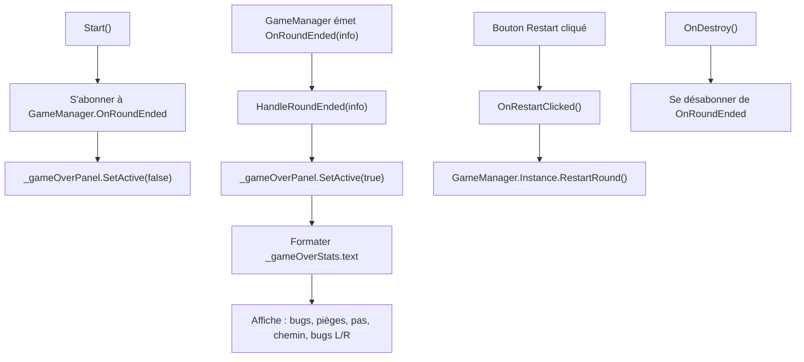
```mermaid
graph TD
    A["Start()"] --> B["S'abonner à GameManager.OnRoundEnded"]
    B --> C["_gameOverPanel.SetActive(false)"]

    D["GameManager émet OnRoundEnded(info)"] --> E["HandleRoundEnded(info)"]
    E --> F["_gameOverPanel.SetActive(true)"]
    F --> G["Formater _gameOverStats.text"]
    G --> H["Affiche : bugs, pièges, pas, chemin, bugs L/R"]

    I["Bouton Restart cliqué"] --> J["OnRestartClicked()"]
    J --> K["GameManager.Instance.RestartRound()"]

    L["OnDestroy()"] --> M["Se désabonner de OnRoundEnded"]
```

### 6.1.5 Points d'attention

- **⚠️ Pattern Observer :** RoundUI s'abonne à `OnRoundEnded` dans `Start()` et se désabonne dans `OnDestroy()` — pas de référence UI dans GameManager, découplage propre
- **⚠️ Null-safe :** Tous les accès à `_gameOverPanel` et `_gameOverStats` sont protégés par des null-checks
- **⚠️ Format texte :** Le texte affiché inclut `followedBestPath` (Oui/Non) et les bugs restants dans chaque nuage — utile pour le debriefing joueur

### 6.1.6 Journal d'implémentation

| Date     | Développeur | Note / Décision Technique                                                                         |
| :------- | :---------- | :------------------------------------------------------------------------------------------------ |
| 27/02/26 | @pierre     | Création. UI extraite de GameManager vers un composant dédié. S'abonne à OnRoundEnded. |

# 7. Optimisations et performance

_Section à compléter._

# 8. Pipeline et outils

## 8.1 Outils de développement

- **IDE :** Rider / Visual Studio
- **Version control :** Git + GitHub
- **Diagrammes :** Figma (architecture), Mermaid (flux dans le TDD)
- **IA assistée :** Claude Code (documentation et développement)

## 8.2 Conventions de code

```csharp
// Classes et MonoBehaviours : PascalCase
public class LevelRegistry : MonoBehaviour { }

// Méthodes publiques : PascalCase, verbe d'action
public void RegisterCloud(BugCloud cloud) { }

// Variables privées : _camelCase avec underscore
private int _currentHealth;

// Variables sérialisées (visibles dans l'Inspector)
[SerializeField] private float _moveSpeed = 5f;

// Constantes : UPPER_SNAKE_CASE
private const int MAX_TRAP_COUNT = 10;

// Events : On + NomEvenement
public event Action<Vector2Int> OnCellChanged;

// Langue des commentaires et logs : Français
```

## 8.3 Tests

- **Unit tests :** Unity Test Framework (`com.unity.test-framework` 1.6.0) — pas de tests custom pour l'instant
- **Play mode tests :** À définir

# 9. Risques techniques et mitigations

_Section à compléter._

# 10. Roadmap technique

_Section à compléter._

# 11. Références et ressources

## 11.1 Documentation Unity

- [New Input System](https://docs.unity3d.com/Packages/com.unity.inputsystem@latest)
- [URP](https://docs.unity3d.com/Packages/com.unity.render-pipelines.universal@latest)

## 11.2 Packages utilisés

| Package                                | Version | Usage                    |
| :------------------------------------- | :------ | :----------------------- |
| `com.unity.inputsystem`               | 1.17.0  | New Input System         |
| `com.unity.render-pipelines.universal` | 17.3.0  | Rendu URP                |
| `com.unity.ai.navigation`             | 2.0.9   | Navigation (non utilisé) |
| `com.unity.timeline`                   | 1.8.10  | Timeline/animation       |
| `com.unity.test-framework`            | 1.6.0   | Tests unitaires          |

## 11.3 Glossaire technique

- **CellFlags :** Enum bitwise représentant les états combinables d'une cellule de grille
- **Execution Order :** Attribut Unity `[DefaultExecutionOrder(N)]` contrôlant l'ordre d'appel des lifecycle methods
- **SO :** ScriptableObject
- **Manhattan distance :** Distance en nombre de cases (|dx| + |dy|), utilisée pour les contraintes de placement

# Changelog du document

| Date     | Version | Changements                                               |
| :------- | :------ | :-------------------------------------------------------- |
| 17/02/26 | 1.0     | Création initiale — sections 1, 2, 4.1 (LevelRegistry)                   |
| 17/02/26 | 1.1     | Ajout sections 4.2 (GameManager) et 4.3 (SessionManager)                 |
| 17/02/26 | 1.2     | Ajout sections 3.1-3.4 (BugCloudSpawner, BestPath, CorridorWallsGenerator, TrapSpawner) |
| 17/02/26 | 1.3     | Ajout sections 3.5 (GridMoverNewInput) et 4.4 (FogController)                           |
| 17/02/26 | 1.4     | Ajout section 4.5 (TrialManager) et section 5.1 (TrialData, PlayerStep, format JSON)    |
| 17/02/26 | 1.5     | MAJ section 3.5 (GridMoverNewInput) — suppression support ZQSD, flèches uniquement      |
| 17/02/26 | 1.6     | Ajout sections 4.6 (TilesSpawner) et 4.7 (PlayerSpawner)                                |
| 27/02/26 | 2.0     | Mise à jour post-refacto : sections 2.1 (Utils/Maze/), 2.3 (patterns concrets), 3.1-3.5 (renommages PathSpawner/GridMover, seeded RNG, TryGetPlayerStartCell, MazeGenerator DFS), 4.1-4.7 (LevelRegistry RNG+PlayerStart, GameManager OnRoundEnded+OnTrapTriggered, SessionManager seed+trapCount pipeline, TrialManager SetMapConfig structuré, PlayerSpawner RegisterPlayerStart), 5.1 (trial_seed + JSON), nouvelle section 6 (RoundUI). |
