# Technical Design Document

| Nom du projet :    | BUGS              |
| :----------------- | :---------------- |
| **Version :**      | 3.0               |
| **Dernière MAJ :** | 23/03/26          |
| **Auteur(s) :**    | @florian, @pierre |
| **Moteur :**       | Unity 6000.3.5f2  |
| **Langage :**      | C#                |

# 1. Vue d'ensemble du projet

## 1.1 Résumé technique

Jeu de collecte de bugs sur grille, développé dans le cadre d'une étude de recherche.
Le joueur se déplace en step-by-step sur une grille générée procéduralement pour collecter des nuages de bugs en évitant des pièges.
Basé sur Unity 6000.3.5f2 avec le pipeline URP.

**Architecture multi-scènes** : un `FlowController` persistant (DontDestroyOnLoad) orchestre le déroulement complet de la session expérimentale à travers 9 scènes dédiées (Boot → Welcome → Consent → Intro → AdvisorChoice → DistalChoice → Proximal → Questionnaire → EndSession). La configuration de session est récupérée depuis un backend Supabase via `ApiClient` (également DDOL). La scène `ProximalScene` conserve l'architecture orientée Singletons avec `LevelRegistry` comme source de vérité unique pour l'état spatial de la grille.
Intègre un pipeline complet de collecte de données de trial et de communication API REST (Supabase).

## 1.2 Objectifs techniques prioritaires

- Performance : rendu fluide sur navigateur (WebGL build)
- Reproductibilité : chaque trial doit être traçable et ses données exploitables
- Modularité : systèmes de spawn découplés via `LevelRegistry` comme intermédiaire unique
- Maintenabilité : ordre d'exécution explicite via `[DefaultExecutionOrder]`

## 1.3 Contraintes techniques

- **Plateforme cible :** WebGL (navigateur)
- **Moteur :** Unity 6000.3.5f2 — pas de version antérieure
- **Input :** New Input System (`com.unity.inputsystem` 1.17.0)
- **Rendering :** URP (`com.unity.render-pipelines.universal` 17.3.0)

# 2. Architecture globale du projet

## 2.1 Structure des dossiers

```
Assets/
├── Game/
│   ├── Prefabs/          # BugCloud, Player, Tile, Trap, Wall, Quad, FogSurface, Ground
│   │   ├── Characters/   # Personnages modulaires SciFi
│   │   └── DesignProto/  # Proto V0 (Nature) / V1 (Alien) variantes de tuiles
│   ├── Scripts/
│   │   ├── Controllers/  # FadeTransition
│   │   ├── Data/         # FlowDataModels, FlowSerializationUtility, TutorialSessionFactory
│   │   ├── Entities/     # BugCloud, Trap
│   │   ├── Network/      # ApiClient
│   │   ├── Spawners/     # BugCloudSpawner, PathSpawner, CorridorWallsGenerator, TrapSpawner, TilesSpawner, PlayerSpawner, FogSpawner
│   │   ├── Systems/      # FlowController, GameManager, SessionManager, TrialManager, LevelRegistry, GridMover, MotorAdviceController
│   │   └── UI/           # RoundUI, MotorAdviceUI, AdvisorChoiceUI, ConsentUI, DistalChoiceUI, FlowContinueScreenUI, QuestionnaireUI
│   ├── Utils/
│   │   └── Maze/         # MazeGenerator (DFS backtracker) + MazeGrid
│   ├── Shaders/          # FogUnlitMask, CharacterOutlineUnlit, CorruptedTile (.shadergraph)
│   ├── Scenes/
│   │   ├── GameScenes/   # BootScene, WelcomeScene, ConsentScene, IntroScene, AdvisorChoiceScene, DistalChoiceScene, ProximalScene, QuestionnaireScene, EndSessionScene
│   │   └── Sandboxes/    # Florian/ (prototypes design) et Pierre/ (SampleScene, WebTestScene)
│   ├── Animations/, Audio/, Materials/, Textures/, UI/
├── External/             # Assets tiers
│   ├── Characters/       # FreeLowPolyRobot, LP_SciFiCharacters
│   ├── Environment/      # SimpleNaturePack, Sci-Fi Modular Pack, Alien Worlds
│   ├── VFX/              # Polygon Arsenal (effets particules)
│   └── Materials/, Animations/Mixamo/
├── Settings/             # Config pipeline URP
└── TextMesh Pro/         # Assets TMP
```

## 2.2 Diagramme d'architecture système

**🔗 Lien Figma :** https://www.figma.com/design/DKXzCclcecu74D0y3dsoEi/BUGS?node-id=78-2&p=f&t=jedqtLr14p5CTG6u-0

### Vue A — Pipeline d'initialisation

Répond à : "Dans quel ordre les systèmes démarrent-ils ?"

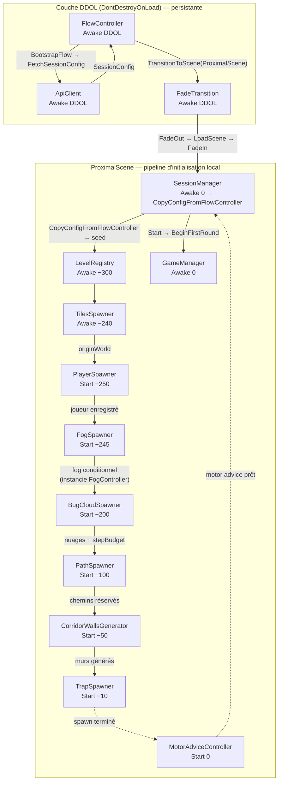
```mermaid
graph TD
    subgraph "Couche DDOL (DontDestroyOnLoad) — persistante"
        FC["FlowController\nAwake DDOL"]
        AC["ApiClient\nAwake DDOL"]
        FT["FadeTransition\nAwake DDOL"]
    end

    subgraph "ProximalScene — pipeline d'initialisation local"
        LR["LevelRegistry\nAwake −300"]
        TS["TilesSpawner\nAwake −240"]
        GM["GameManager\nAwake 0"]
        PS["PlayerSpawner\nStart −250"]
        FS["FogSpawner\nStart −245"]
        BCS["BugCloudSpawner\nStart −200"]
        PaS["PathSpawner\nStart −100"]
        CWG["CorridorWallsGenerator\nStart −50"]
        TrS["TrapSpawner\nStart −10"]
        MAC["MotorAdviceController\nStart 0"]
        SM["SessionManager\nAwake 0 → CopyConfigFromFlowController"]
    end

    FC -->|"BootstrapFlow → FetchSessionConfig"| AC
    AC -->|"SessionConfig"| FC
    FC -->|"TransitionToScene(ProximalScene)"| FT
    FT -->|"FadeOut → LoadScene → FadeIn"| SM

    SM -->|"CopyConfigFromFlowController → seed"| LR
    LR --> TS
    TS -->|originWorld| PS
    PS -->|joueur enregistré| FS
    FS -->|"fog conditionnel\n(instancie FogController)"| BCS
    BCS -->|nuages + stepBudget| PaS
    PaS -->|chemins réservés| CWG
    CWG -->|murs générés| TrS
    TrS -.->|spawn terminé| MAC
    MAC -.->|"motor advice prêt"| SM
    SM -->|"Start → BeginFirstRound"| GM
```

### Vue B — Data Flow

Répond à : "Qui communique avec qui et comment ?"

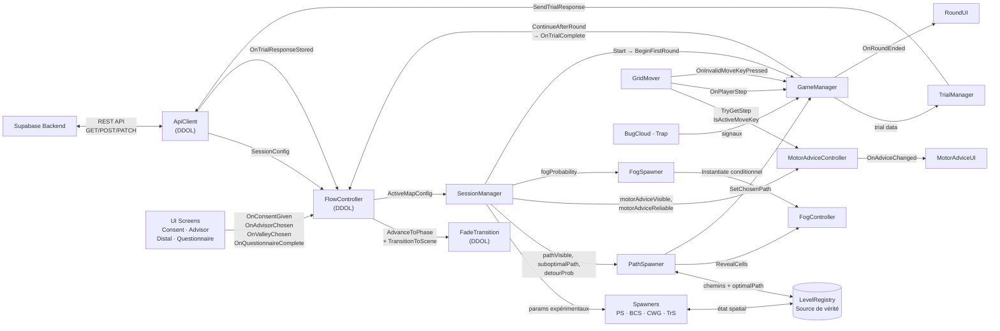
```mermaid
graph LR
    SUPA["Supabase Backend"]
    AC["ApiClient\n(DDOL)"]
    FC["FlowController\n(DDOL)"]
    FT["FadeTransition\n(DDOL)"]
    SM["SessionManager"]
    LR[("LevelRegistry\nSource de vérité")]
    FS["FogSpawner"]
    FOG["FogController"]
    GEN["Spawners\nPS · BCS · CWG · TrS"]
    PaS["PathSpawner"]
    GM["GameManager"]
    GR["GridMover"]
    MAC["MotorAdviceController"]
    MAUI["MotorAdviceUI"]
    ENT["BugCloud · Trap"]
    TM["TrialManager"]
    UI_R["RoundUI"]
    UI_FLOW["UI Screens\nConsent · Advisor\nDistal · Questionnaire"]

    SUPA <-->|"REST API\nGET/POST/PATCH"| AC
    AC -->|"SessionConfig"| FC
    AC -->|"OnTrialResponseStored"| FC
    FC -->|"AdvanceToPhase\n+ TransitionToScene"| FT
    FC -->|"ActiveMapConfig"| SM
    UI_FLOW -->|"OnConsentGiven\nOnAdvisorChosen\nOnValleyChosen\nOnQuestionnaireComplete"| FC
    SM -->|params expérimentaux| GEN
    SM -->|"pathVisible, suboptimalPath,\ndetourProb"| PaS
    SM -->|"motorAdviceVisible,\nmotorAdviceReliable"| MAC
    SM -->|fogProbability| FS
    SM -->|"Start → BeginFirstRound"| GM
    FS -->|"Instantiate conditionnel"| FOG
    GEN <-->|état spatial| LR
    PaS <-->|chemins + optimalPath| LR
    PaS -->|RevealCells| FOG
    PaS -->|SetChosenPath| GM
    GR -->|"TryGetStep\nIsActiveMoveKey"| MAC
    GR -->|OnPlayerStep| GM
    GR -->|OnInvalidMoveKeyPressed| GM
    MAC -->|OnAdviceChanged| MAUI
    ENT -->|signaux| GM
    GM -->|trial data| TM
    TM -->|"SendTrialResponse"| AC
    GM -->|"ContinueAfterRound\n→ OnTrialComplete"| FC
    GM -->|OnRoundEnded| UI_R
```

### Vue D — Cycle de vie d'une session (séquence)

Répond à : "Que se passe-t-il dans le temps, de bout en bout ?"

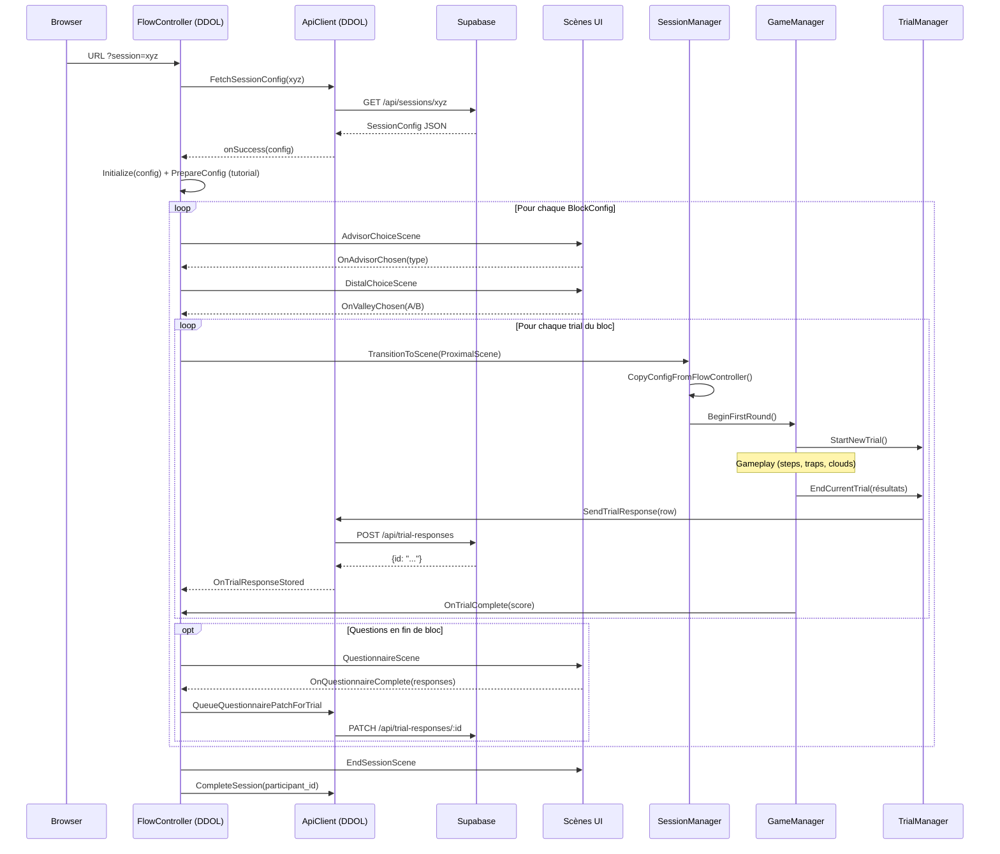
```mermaid
sequenceDiagram
    participant B as Browser
    participant FC as FlowController (DDOL)
    participant AC as ApiClient (DDOL)
    participant SUPA as Supabase
    participant SC as Scènes UI
    participant SM as SessionManager
    participant GM as GameManager
    participant TM as TrialManager

    B->>FC: URL ?session=xyz
    FC->>AC: FetchSessionConfig(xyz)
    AC->>SUPA: GET /api/sessions/xyz
    SUPA-->>AC: SessionConfig JSON
    AC-->>FC: onSuccess(config)
    FC->>FC: Initialize(config) + PrepareConfig (tutorial)

    loop Pour chaque BlockConfig
        FC->>SC: AdvisorChoiceScene
        SC-->>FC: OnAdvisorChosen(type)
        FC->>SC: DistalChoiceScene
        SC-->>FC: OnValleyChosen(A/B)

        loop Pour chaque trial du bloc
            FC->>SM: TransitionToScene(ProximalScene)
            SM->>SM: CopyConfigFromFlowController()
            SM->>GM: BeginFirstRound()
            GM->>TM: StartNewTrial()
            Note over GM: Gameplay (steps, traps, clouds)
            GM->>TM: EndCurrentTrial(résultats)
            TM->>AC: SendTrialResponse(row)
            AC->>SUPA: POST /api/trial-responses
            SUPA-->>AC: {id: "..."}
            AC-->>FC: OnTrialResponseStored
            GM->>FC: OnTrialComplete(score)
        end

        opt Questions en fin de bloc
            FC->>SC: QuestionnaireScene
            SC-->>FC: OnQuestionnaireComplete(responses)
            FC->>AC: QueueQuestionnairePatchForTrial
            AC->>SUPA: PATCH /api/trial-responses/:id
        end
    end

    FC->>SC: EndSessionScene
    FC->>AC: CompleteSession(participant_id)
```

## 2.3 Patterns utilisés

| Pattern                          | Où dans le code                                                                                                                                                                                                    | Pourquoi ce choix                                                                                                                                                                                                                                                                                                                                                                                                                               |
| :------------------------------- | :----------------------------------------------------------------------------------------------------------------------------------------------------------------------------------------------------------------- | :---------------------------------------------------------------------------------------------------------------------------------------------------------------------------------------------------------------------------------------------------------------------------------------------------------------------------------------------------------------------------------------------------------------------------------------------- | ----- | ------------------------------------------------------------------------------------------------------------------------------------------------------- |
| **Singleton**                    | `LevelRegistry.Instance`, `GameManager.Instance`, `FogController.Instance` (dynamique), `SessionManager.Instance`, `FlowController.Instance` (DDOL), `ApiClient.Instance` (DDOL), `FadeTransition.Instance` (DDOL) | Permet aux spawners d'accéder à l'état global sans injection — chaque singleton a un rôle unique et non-substituable. `SessionManager` ajouté comme Singleton pour exposer les paramètres de protocole expérimental directement aux spawners. `FogController.Instance` est instancié dynamiquement par `FogSpawner` — peut être `null` si le brouillard est désactivé ce round. Les singletons DDOL survivent aux changements de scène          |
| **CellFlags bitwise**            | `LevelRegistry.CellFlags` (8 flags : `BugCloud`, `Trap`, `PathLeft`, `PathRight`, `Reserved`, `Visited`, `Wall`, `PlayerStart`)                                                                                    | Chaque cellule cumule plusieurs états en un seul int, testé par masque `&` — ex: une case peut être `PathLeft \| Reserved`                                                                                                                                                                                                                                                                                                                      |
| **Execution Order pipeline**     | `[DefaultExecutionOrder(N)]` sur 9 scripts (de -300 à 0)                                                                                                                                                           | Garantit Awake(-300→-240) puis Start(-250→-10→0) sans couplage direct entre spawners — chaque script lit l'état posé par le précédent via LevelRegistry. `FogController` n'a plus de `DefaultExecutionOrder` — il est instancié dynamiquement par `FogSpawner` (Start -245) et son `Awake` se déclenche immédiatement à l'`Instantiate`                                                                                                         |
| **Entity → Manager signaling**   | `GridMover` → `GameManager.OnPlayerStep`, `BugCloud` → `OnCloudCollected`, `Trap` → `OnTrapTriggered`                                                                                                              | Les entités savent ce qu'elles sont et signalent ce qui leur arrive. Le GameManager interprète ces signaux (fog, score, trial). Aucune entité ne connaît les règles du jeu                                                                                                                                                                                                                                                                      |
| **Event-driven UI**              | `GameManager.OnRoundEnded` (event `Action<RoundEndInfo>`) → `RoundUI.HandleRoundEnded`                                                                                                                             | L'UI s'abonne à un événement typé — le GameManager ne référence aucun objet UI, RoundUI est autonome                                                                                                                                                                                                                                                                                                                                            |
| **Seeded deterministic RNG**     | `LevelRegistry.CreateRng(scope)` — hash FNV-1a 64-bit sur `(roundSeed + scopeName)`                                                                                                                                | Chaque spawner obtient un `System.Random` dérivé d'une seed globale + nom de scope → même seed = même map, même si l'ordre d'appel varie                                                                                                                                                                                                                                                                                                        |
| **PlayerStart registration**     | `PlayerSpawner` → `LevelRegistry.RegisterPlayerStart(cell, world)` → spawners lisent `TryGetPlayerStartCell()`                                                                                                     | Les spawners n'ont plus de `Transform player` en Inspector — ils interrogent LevelRegistry. Découple le placement du joueur de la construction de la map                                                                                                                                                                                                                                                                                        |
| **Research Parameter Pipeline**  | `SessionManager.Instance` (Singleton, propriétaire unique) → Spawners `.Start()` (lecture directe)                                                                                                                 | Distinction claire entre **paramètre de protocole expérimental** (contrôlé par le chercheur, injectable via args CLI `key=value`, possédé par `SessionManager`) et **paramètre de game design** (fixé par le designer, reste sur le script qui l'utilise). Les spawners lisent directement `SessionManager.Instance.paramName` — les paramètres recherche ne transitent plus par LevelRegistry. Voir section 4.3 pour le détail du pipeline CLI |
| **Step Budget Penalty**          | `GameManager.OnPlayerStep` → `OnStepBudgetExceeded`, `LevelRegistry.stepBudget`, `BugCloudSpawner.RegisterStepBudget`                                                                                              | Même pattern que `OnTrapTriggered` : quand le joueur dépasse la distance Manhattan (budget de pas enregistré par BugCloudSpawner), chaque pas supplémentaire retire 1 bug de chaque nuage. La donnée brute `cloud_distance` est transmise aux chercheurs via TrialData                                                                                                                                                                          |
| **Motor Advice**                 | `MotorAdviceController.Instance` (Singleton) → `GridMover.ReadStep()` + `GridMover.IsActiveMoveKey()`                                                                                                              | Tirage seedé d'un jeu de touches actif (ZQSD/TFGH/IJKL) avec advice visible/fiable configurable par SessionManager. GridMover délègue la lecture d'input et la validation des touches actives à MotorAdviceController                                                                                                                                                                                                                           |
| **Invalid Key Penalty**          | `GridMover.IsAnyNonActiveMoveKeyPressedThisFrame()` → `GameManager.OnInvalidMoveKeyPressed()`                                                                                                                      | Toute touche pressée hors du set actif déclenche une pénalité de -1 bug vert dans chaque nuage (même barème que le piège). Détection via itération `Keyboard.current.allKeys`                                                                                                                                                                                                                                                                   |
| **Suboptimal Trap Placement**    | `TrapSpawner.PlaceSuboptimalTraps()` → `SessionManager.Instance` (suboptimalTrapProbability, minSuboptimalTraps, maxSuboptimalTraps)                                                                               | Permet de placer des pièges spécifiquement sur le chemin suboptimal (avant les pièges normaux). Le nombre de pièges suboptimaux est tiré dans [min, max] et compte dans le budget total `trapCount`                                                                                                                                                                                                                                             |
| **Scene Flow State Machine**     | `FlowController.AdvanceToPhase(GamePhase)` — enum `GamePhase` à 10 états (Boot → Welcome → Consent → Intro → Tutorial → AdvisorChoice → DistalChoice → Proximal → Questionnaire → EndSession)                      | Chaque phase correspond à une scène Unity. `FlowController` est DDOL : il survit aux `LoadScene` et orchestre les transitions. Les scènes UI appellent des callbacks typés (`OnConsentGiven`, `OnAdvisorChosen`, `OnValleyChosen`, `OnQuestionnaireComplete`) sans connaître la logique de séquencement                                                                                                                                         |
| **DDOL Persistent Layer**        | `FlowController`, `ApiClient`, `FadeTransition` — tous `DontDestroyOnLoad` + Singleton avec guard `Destroy(gameObject)` si doublon                                                                                 | Couche persistante qui survit aux transitions de scène. Permet d'accumuler l'état de session (`PlayerSessionState`), de maintenir les connexions API et d'enchaîner les transitions visuelles. Les scènes locales (ProximalScene) ont leurs propres singletons non-DDOL (`GameManager`, `SessionManager`, `LevelRegistry`)                                                                                                                      |
| **Backend Config Pipeline**      | `FlowController.BootstrapFlow()` → `ApiClient.FetchSessionConfig(sessionId)` → `Initialize(SessionConfig)` → `SessionManager.CopyConfigFromFlowController()`                                                       | La configuration expérimentale vient du backend Supabase, pas des args CLI. `SessionConfig` contient une liste de `BlockConfig`, chaque bloc contient deux `MapGenConfig` (valley_a / valley_b). `SessionManager` copie le `MapGenConfig` actif dans ses champs publics pour que les spawners lisent toujours `SessionManager.Instance.paramName` — le pattern Research Parameter Pipeline est préservé                                         |
| **Valley Choice → MapGenConfig** | `FlowController.ActiveMapConfig` → computed property : `State.valley_choice == ValleyChoice.B ? block.valley_b : block.valley_a` + injection de `CurrentTrialSeed`                                                 | Le choix distal du joueur (vallée A ou B) détermine quel `MapGenConfig` sera utilisé pour générer la grille du trial. La seed du trial est injectée dans le clone pour garantir la reproductibilité                                                                                                                                                                                                                                             |
| **Queued Trial Upload**          | `ApiClient._pendingTrialRequests` (Queue) + `_storedTrialIdsByKey` (Dictionary) + `_pendingQuestionnairePatches` (Dictionary)                                                                                      | Les envois de trial sont mis en queue avec retry automatique (max 3 tentatives). Quand un trial est stocké, son `id` Supabase est mémorisé par clé `participant                                                                                                                                                                                                                                                                                 | block | trial`. Les patchs de questionnaire sont mis en attente jusqu'à ce que le `trialResponseId` correspondant soit disponible, puis flushés automatiquement |

# 3. Systèmes de gameplay

## 3.1 BugCloudSpawner

### 3.1.1 Responsabilités

- Placer 2 nuages de bugs sur la grille à distance Manhattan égale du joueur
- Garantir un nuage dans la moitié gauche et un dans la moitié droite (même Y)
- Tirer un nombre total de bugs partagé, puis deux ratios verts avec un écart contrôlé (difficulté de discrimination)
- Enregistrer les nuages dans LevelRegistry et GameManager
- Enregistrer le budget de pas (distance Manhattan = chosenD) dans LevelRegistry pour la mécanique de pénalité de dépassement

### 3.1.2 Composants clés (Data Model)

→ **BugCloudSpawner.cs** : MonoBehaviour, placement des 2 nuages au Start. Ordre d'exécution : `-200`.

> **Note architecture :** Les paramètres de protocole expérimental (minDistance, totalBugs, greenRatio, gap) sont lus directement depuis `SessionManager.Instance` (Singleton). Ce script ne possède que les paramètres de game design. Voir pattern **Research Parameter Pipeline** (section 2.3).

```csharp
[DefaultExecutionOrder(-200)]
public class BugCloudSpawner : MonoBehaviour
{
    [Header("Références")]
    public GameObject bugCloudPrefab;

    // Source de vérité spatiale: LevelRegistry (gridSize/cellSize/originWorld)
    // Source de vérité protocole: SessionManager.Instance (paramètres recherche)

    [Header("Placement (visuel)")]
    readonly int minZ = 5;
    public float spawnY = 0.5f;
}
```

| Variable / Méthode                         | Type         | Description                                                                                                                                                                        |
| :----------------------------------------- | :----------- | :--------------------------------------------------------------------------------------------------------------------------------------------------------------------------------- |
| bugCloudPrefab                             | GameObject   | Prefab du nuage de bugs (doit avoir BugCloud.cs)                                                                                                                                   |
| minZ (readonly)                            | int          | Z minimale pour le placement (hardcodé à 5) — **game design**                                                                                                                      |
| spawnY                                     | float        | Hauteur Y d'instanciation des nuages (défaut : 0.5) — **game design**                                                                                                              |
| _Lecture depuis SessionManager.Instance :_ |              | `minDistance`, `maxDistance`, `minTotalBugs`, `maxTotalBugs`, `minGreenBugsRatio`, `maxGreenBugsRatio`, `gapMin`, `gapMax` — **paramètres recherche** (Singleton, lecture directe) |
| GetRingCells(Vector2Int, int)              | List (privé) | Retourne les cellules à distance Manhattan D (moitié supérieure seulement)                                                                                                         |

### 3.1.3 Dépendances

- **Nécessite :** `LevelRegistry.Instance` (gridSize, InBounds, CellToWorld, RegisterBugCloud, RegisterStepBudget, TryGetPlayerStartCell, CreateRng), `SessionManager.Instance` (**paramètres recherche** : minDistance, maxDistance, minTotalBugs, maxTotalBugs, minGreenBugsRatio, maxGreenBugsRatio, gapMin, gapMax), `GameManager.Instance` (RegisterClouds)
- **Est configuré par :** `SessionManager.Instance` (lecture directe des paramètres recherche — voir section 2.3)
- **Communique avec :** `BugCloud` (configure totalBugs, greenRatio, InitializeParticlesQty)
- **Déclenche :** Enregistrement des cellules nuage dans LevelRegistry + enregistrement des nuages dans GameManager + enregistrement du budget de pas (stepBudget) dans LevelRegistry

### 3.1.4 Diagramme de flux

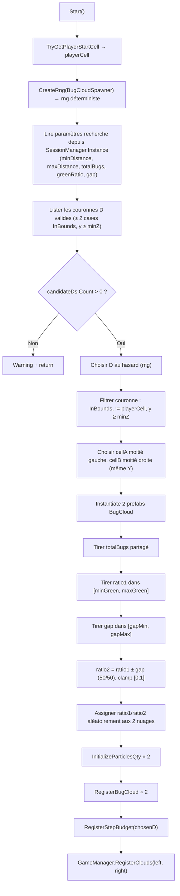
```mermaid
graph TD
    A["Start()"] --> B["TryGetPlayerStartCell → playerCell"]
    B --> C["CreateRng(BugCloudSpawner) → rng déterministe"]
    C --> C2["Lire paramètres recherche depuis SessionManager.Instance<br/>(minDistance, maxDistance, totalBugs, greenRatio, gap)"]
    C2 --> D["Lister les couronnes D valides (≥ 2 cases InBounds, y ≥ minZ)"]
    D --> E{candidateDs.Count > 0 ?}
    E -->|Non| F[Warning + return]
    E -->|Oui| G["Choisir D au hasard (rng)"]
    G --> H["Filtrer couronne : InBounds, != playerCell, y ≥ minZ"]
    H --> I["Choisir cellA moitié gauche, cellB moitié droite (même Y)"]
    I --> J["Instantiate 2 prefabs BugCloud"]
    J --> K["Tirer totalBugs partagé"]
    K --> L["Tirer ratio1 dans [minGreen, maxGreen]"]
    L --> M["Tirer gap dans [gapMin, gapMax]"]
    M --> N["ratio2 = ratio1 ± gap (50/50), clamp [0,1]"]
    N --> O["Assigner ratio1/ratio2 aléatoirement aux 2 nuages"]
    O --> P["InitializeParticlesQty × 2"]
    P --> Q["RegisterBugCloud × 2"]
    Q --> Q2["RegisterStepBudget(chosenD)"]
    Q2 --> R["GameManager.RegisterClouds(left, right)"]
```

### 3.1.5 Formules et règles métier

```
Distance Manhattan         = |dx| + |dy| entre joueur et nuage
Couronne D                 = ensemble des cellules à distance exacte D du joueur
                             (seule la moitié supérieure y ≥ playerCell.y est parcourue)
totalBugs par trial        = rng.Next(minTotalBugs, maxTotalBugs + 1) — PARTAGÉ entre les 2 nuages
ratio1                     = Lerp(minGreenBugsRatio, maxGreenBugsRatio, rng.NextDouble())
gap                        = Lerp(gapMin, gapMax, rng.NextDouble())
ratio2                     = Clamp01(ratio1 ± gap)  — direction aléatoire 50/50
Assignment                 = ratio1 et ratio2 assignés aléatoirement aux 2 nuages (pas de biais spatial)
greenCount                 = RoundToInt(totalBugs × greenRatio)
redCount                   = totalBugs - greenCount
Contrainte placement       = cellA dans indices [0, count/2 - 1], cellB dans indices [count/2, count]
                             avec cellA.y == cellB.y (symétrie verticale)
```

### 3.1.6 Points d'attention

- **⚠️ Edge case :** La boucle `while (j == -1)` pour trouver une cellB avec le même Y que cellA peut boucler infiniment si aucune cellule dans la moitié droite n'a le même Y — peu probable avec des grilles larges mais risqué sur des grilles très petites
- **⚠️ Constraint :** `GetRingCells` ne parcourt que la moitié supérieure de l'anneau (`dz = D - |dx|`, jamais `-dz`) — les nuages sont toujours devant le joueur
- **⚠️ Gap clamp :** Si `ratio1 + gap > 1.0` ou `ratio1 - gap < 0.0`, le Clamp01 réduit l'écart effectif — l'écart réel peut être inférieur à `gapMin`
- **🔧 À paramétrer :** `minZ = 5` est hardcodé en readonly — pourrait être exposé en Inspector si le protocole évolue

### 3.1.7 Journal d'implémentation

| Date     | Développeur | Note / Décision Technique                                                                                                                                                                                                      |
| :------- | :---------- | :----------------------------------------------------------------------------------------------------------------------------------------------------------------------------------------------------------------------------- |
| 17/02/26 | @auteur     | Documentation initiale. Placement par couronne Manhattan avec contrainte gauche/droite et même Y.                                                                                                                              |
| 27/02/26 | @pierre     | Refacto : phase Awake→Start, suppression champ player (TryGetPlayerStartCell), seeded RNG, algorithme green ratio gap-based avec gapMin/gapMax pour contrôle de discrimination.                                                |
| 02/03/26 | @pierre     | Migration paramètres recherche (minDistance, totalBugs, greenRatio, gap) vers SessionManager → LevelRegistry. BugCloudSpawner ne possède plus que les paramètres game design (bugCloudPrefab, minZ, spawnY).                   |
| 02/03/26 | @pierre     | Refacto SRP : les paramètres recherche ne transitent plus par LevelRegistry. BugCloudSpawner lit directement `SessionManager.Instance` (nouveau Singleton). LevelRegistry recentré sur l'état spatial de la grille uniquement. |
| 02/03/26 | @pierre     | Ajout enregistrement du budget de pas (chosenD) via `RegisterStepBudget` dans LevelRegistry. La distance Manhattan joueur→nuages sert de seuil pour la pénalité de dépassement.                                                |

## 3.2 PathSpawner

### 3.2.1 Responsabilités

- Calculer deux chemins Manhattan les plus courts (joueur → nuage gauche, joueur → nuage droite)
- Réserver les deux chemins dans LevelRegistry (PathLeft, PathRight)
- **Tirer la fiabilité de l'advice proximal** (`rng.NextDouble() < proximalAdviceReliableProbability`) : un advice non fiable désigne le mauvais nuage (le moins de bugs verts). Bypassé si proximal forced (fiabilité = le nuage imposé est-il le meilleur). Le tirage réalisé remonte via `GameManager.SetProximalAdviceReliable` → `trial_responses.proximal_advice_reliable`
- **Déterminer si le chemin affiché est suboptimal** (tirage `rng.NextDouble() < suboptimalPathProbability`) — le tracé suboptimal vise le nuage conseillé (le meilleur si l'advice est fiable)
- **Si suboptimal sans détour** : tracer un chemin Manhattan alternatif (même longueur, tracé différent — pièges possibles)
- **Si suboptimal avec détour** : construire un chemin en « U » ouvert vers la cible — crochet horizontal à l'opposé du nuage, séparation verticale de 2 cases, retour prolongé jusqu'à l'axe de la cible, puis arrivée verticale. Le tracé garantit un surplus réel de steps et refuse tout contact entre cases non consécutives
- Visualiser le chemin conseillé (optimal ou suboptimal) avec des quads
- Communiquer le chemin affiché et son statut (optimal/suboptimal) au GameManager
- Révéler les cellules joueur + les deux nuages dans le brouillard de guerre (toujours, même si le chemin est caché), et les cellules du chemin affiché si visible

### 3.2.2 Composants clés (Data Model)

→ **PathSpawner.cs** : MonoBehaviour, calcul et réservation des chemins au Start. Ordre d'exécution : `-100`.

> **Note architecture :** Le paramètre `visible` (condition advisor) est lu directement depuis `SessionManager.Instance.pathVisible` (Singleton). Ce script possède `quadPrefab` ainsi que les bornes de crochet `detourMin`/`detourMax` (game design). Voir pattern **Research Parameter Pipeline** (section 2.3).

```csharp
[DefaultExecutionOrder(-100)]
public class PathSpawner : MonoBehaviour
{
    [Header("Références")]
    public GameObject quadPrefab;

    [Header("Chemin suboptimal (debug)")]
    [Min(1)] public int detourMin = 2;
    [Min(2)] public int detourMax = 5;
}
```

| Variable / Méthode                         | Type       | Description                                                                                                                                                                                                                                                                                                                                                                                                                                                       |
| :----------------------------------------- | :--------- | :---------------------------------------------------------------------------------------------------------------------------------------------------------------------------------------------------------------------------------------------------------------------------------------------------------------------------------------------------------------------------------------------------------------------------------------------------------------- |
| quadPrefab                                 | GameObject | Prefab quad pour la visualisation du chemin conseillé — **game design**                                                                                                                                                                                                                                                                                                                                                                                           |
| detourMin                                  | int        | Taille min du crochet horizontal en cases (défaut : 2, min : 1) — **game design**                                                                                                                                                                                                                                                                                                                                                                                 |
| detourMax                                  | int        | Taille max du crochet horizontal en cases, exclusif (défaut : 5, min : 2) — **game design**                                                                                                                                                                                                                                                                                                                                                                       |
| _Lecture depuis SessionManager.Instance :_ |            | `pathVisible` (float, 0-1) — probabilité que le chemin soit visible. `proximalAdviceReliableProbability` (float, 0-1) — probabilité que le chemin conseillé désigne le meilleur nuage. `suboptimalPathProbability` (float, 0-1) — probabilité que le chemin affiché soit suboptimal. `detourProbability` (float, 0-1) — probabilité que le chemin suboptimal inclue un détour en « U ». Tirages seeded RNG. **Paramètres recherche** (Singleton, lecture directe) |

### 3.2.3 Dépendances

- **Nécessite :** `LevelRegistry.Instance` (TryGetPlayerStartCell, WorldToCell, CellToWorld, InBounds, ReservePathLeft, ReservePathRight, RegisterOptimalPath, RegisterSuboptimalPath, CreateRng), `SessionManager.Instance` (**paramètres recherche** : pathVisible, proximalAdviceReliableProbability, suboptimalPathProbability, detourProbability), `GameManager.Instance` (GetBestCloud, SetChosenPath, SetPathIsSuboptimal, SetProximalAdviceReliable), `FlowController.Instance` (proximal forced : `proximal_choice_is_forced`, `proximal_choice_forced_value`, `proximal_choice_forced_was_optimal`), `FogController.Instance` (RevealCells)
- **Est configuré par :** `SessionManager.Instance` (lecture directe de pathVisible, proximalAdviceReliableProbability, suboptimalPathProbability, detourProbability — voir section 2.3)
- **Communique avec :** Nuages trouvés via `FindGameObjectsWithTag("BugCloud")`
- **Déclenche :** Réservation de chemins dans LevelRegistry (PathLeft, PathRight + optionnel SuboptimalPath), publication du chemin affiché et de son statut dans GameManager, révélation du brouillard (playerCell + 2 nuages toujours, chemin si visible)

### 3.2.4 Diagramme de flux

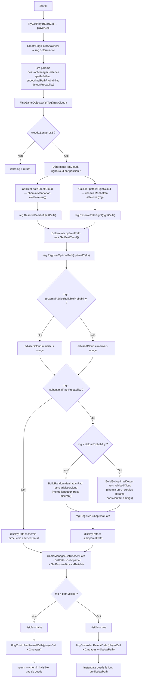
```mermaid
graph TD
    A["Start()"] --> A2["TryGetPlayerStartCell → playerCell"]
    A2 --> A3["CreateRng(PathSpawner) → rng déterministe"]
    A3 --> A4["Lire params SessionManager.Instance<br/>(pathVisible, suboptimalPathProbability, detourProbability)"]
    A4 --> B["FindGameObjectsWithTag('BugCloud')"]
    B --> C{clouds.Length ≥ 2 ?}
    C -->|Non| D[Warning + return]
    C -->|Oui| E[Déterminer leftCloud / rightCloud par position X]

    E --> F["Calculer pathToLeftCloud — chemin Manhattan aléatoire (rng)"]
    E --> G["Calculer pathToRightCloud — chemin Manhattan aléatoire (rng)"]

    F --> H["reg.ReservePathLeft(leftCells)"]
    G --> I["reg.ReservePathRight(rightCells)"]

    H --> J["Déterminer optimalPath vers GetBestCloud()"]
    I --> J
    J --> K["reg.RegisterOptimalPath(optimalCells)"]

    K --> K2{"rng < proximalAdviceReliableProbability ?"}
    K2 -->|Oui| K3["advisedCloud = meilleur nuage"]
    K2 -->|Non| K4["advisedCloud = mauvais nuage"]
    K3 --> L{"rng < suboptimalPathProbability ?"}
    K4 --> L
    L -->|Non| M["displayPath = chemin direct vers advisedCloud"]
    L -->|Oui| N{"rng < detourProbability ?"}
    N -->|Non| O["BuildRandomManhattanPath vers advisedCloud<br/>(même longueur, tracé différent)"]
    N -->|Oui| P["BuildSuboptimalDetour vers advisedCloud<br/>(chemin en U, surplus garanti,<br/>sans contact ambigu)"]
    O --> Q["reg.RegisterSuboptimalPath"]
    P --> Q
    Q --> R["displayPath = suboptimalPath"]

    M --> S["GameManager.SetChosenPath + SetPathIsSuboptimal<br/>+ SetProximalAdviceReliable"]
    R --> S
    S --> T{"rng < pathVisible ?"}
    T -->|Non| U["visible = false"]
    T -->|Oui| U2["visible = true"]
    U --> V1["FogController.RevealCells(playerCell + 2 nuages)"]
    U2 --> V2["FogController.RevealCells(playerCell + 2 nuages + displayPath)"]
    V2 --> W["Instantiate quads le long du displayPath"]
    V1 --> X["return — chemin invisible, pas de quads"]
```

#### Diagramme détaillé — BuildSuboptimalDetour (Vue F micro)

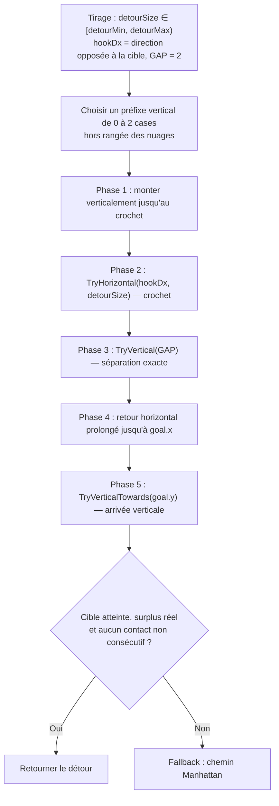
```mermaid
graph TD
    D1["Tirage : detourSize ∈ [detourMin, detourMax)<br/>hookDx = direction opposée à la cible, GAP = 2"] --> D2["Choisir un préfixe vertical de 0 à 2 cases<br/>hors rangée des nuages"]
    D2 --> D3["Phase 1 : monter verticalement jusqu'au crochet"]
    D3 --> D4["Phase 2 : TryHorizontal(hookDx, detourSize) — crochet"]
    D4 --> D5["Phase 3 : TryVertical(GAP) — séparation exacte"]
    D5 --> D6["Phase 4 : retour horizontal prolongé jusqu'à goal.x"]
    D6 --> D7["Phase 5 : TryVerticalTowards(goal.y) — arrivée verticale"]
    D7 --> D8{"Cible atteinte, surplus réel<br/>et aucun contact non consécutif ?"}
    D8 -->|Oui| D9["Retourner le détour"]
    D8 -->|Non| D10["Fallback : chemin Manhattan"]
```

### 3.2.5 Formules et règles métier

```
Longueur chemin Manhattan  = |playerCell.x - cloudCell.x| + |playerCell.y - cloudCell.y| + 1
Direction gauche           = currentPos.x-- (décrémente X vers la gauche)
Direction droite           = currentPos.x++ (incrémente X vers la droite)
Direction verticale        = currentPos.y++ pour les chemins Manhattan ; le raccord final du détour peut monter ou descendre vers goal.y
Randomisation du tracé     = à chaque step, si X != cible.X et Y != cible.Y → 50% chance horizontal/vertical (rng)
Choix du chemin optimal    = vers GetBestCloud() si non null, sinon 50/50 aléatoire (rng)

--- Fiabilité de l'advice proximal ---
Tirage fiabilité           = rng.NextDouble() < SessionManager.Instance.proximalAdviceReliableProbability
Nuage conseillé            = fiable ? meilleur nuage : autre nuage — cible de tous les chemins affichés (direct ou suboptimal)
path_is_suboptimal         = tracé suboptimal OU advice non fiable
Proximal forced            = pas de tirage : fiabilité réalisée = proximal_choice_forced_was_optimal

--- Chemin suboptimal ---
Tirage suboptimal          = rng.NextDouble() < SessionManager.Instance.suboptimalPathProbability
Tirage détour              = rng.NextDouble() < SessionManager.Instance.detourProbability

Sans détour (BuildRandomManhattanPath) :
  Longueur                 = identique à l'optimal (Manhattan)
  Tracé                    = aléatoire indépendant → non réservé → pièges possibles
  Suboptimalité            = les murs NE protègent PAS ce chemin → pièges peuvent spawn dessus

Avec détour (BuildSuboptimalDetour — chemin en « U » ouvert vers la cible) :
  detourSize               = min(rng.Next(detourMin, detourMax), espace disponible)
  hookDx                   = -sign(goal.x - start.x)             // côté opposé à la cible
  GAP                      = 2                                    // 1 rangée vide
  normalSteps              = 0 à 2 pas verticaux, hors rangée des nuages

  Phase 1 : préfixe uniquement vertical
  Phase 2 : TryHorizontal(hookDx, detourSize) — crochet opposé à la cible
  Phase 3 : TryVertical(GAP) — séparation exacte des 2 portions horizontales
  Phase 4 : retour horizontal sans changement de sens jusqu'à goal.x
  Phase 5 : TryVerticalTowards(goal.y) — arrivée purement verticale

  Garanties :
  - Le crochet ajoute 2 × detourSize pas au minimum par rapport au Manhattan
  - Il n'existe que 2 portions horizontales, séparées par GAP = 2
  - HasNonConsecutiveAdjacentCells refuse tout faux embranchement/raccourci visuel
  - visited HashSet empêche tout retour sur une case déjà traversée
  - Toute géométrie impossible ou ambiguë bascule sur BuildRandomManhattanPath
```

### 3.2.6 Points d'attention

- **⚠️ Edge case :** Si les deux nuages ont le même totalBugs, `GetBestCloud()` retourne `null` et le chemin affiché est choisi au hasard (50/50) — cohérent avec le design
- **⚠️ Performance :** `FindGameObjectsWithTag("BugCloud")` est utilisé plutôt qu'une référence directe — fonctionne car il n'y a que 2 nuages, mais fragile si d'autres objets portent le même tag
- **⚠️ Séquencement :** Les deux chemins optimaux sont TOUJOURS réservés dans LevelRegistry (gauche + droite), même si le chemin affiché est suboptimal — c'est voulu pour que CorridorWallsGenerator protège les deux. Le chemin suboptimal est enregistré séparément via `RegisterSuboptimalPath`
- **⚠️ Fog :** Les cellules joueur et des deux nuages sont **toujours** révélées dans le brouillard (même si le chemin est invisible). Les cellules du chemin ne sont révélées que si le tirage `rng.NextDouble() < pathVisible` est positif. `FogController.Instance` peut être `null` (brouillard désactivé par `FogSpawner`) — les null-checks existants gèrent ce cas
- **⚠️ Détour en U :** Le crochet part toujours à l'opposé de la cible. Le retour peut ainsi continuer sur la même ligne jusqu'à `goal.x`, sans demi-tour supplémentaire ni troisième portion horizontale
- **⚠️ GAP constant :** `GAP = 2` est hardcodé — garantit une rangée vide entre les deux seules portions horizontales du détour
- **⚠️ Bounds safety :** `detourSize` est borné par l'espace horizontal disponible et le préfixe par la hauteur de grille. Le détour peut monter au-dessus de la rangée du nuage, puis `TryVerticalTowards` le rejoint verticalement
- **⚠️ Validation visuelle :** Toute paire de cases adjacentes mais non consécutives invalide le détour. Le générateur utilise alors un chemin Manhattan alternatif et rapporte `détour=false`
- **⚠️ Suboptimal sans détour :** `BuildRandomManhattanPath` produit un chemin de même longueur Manhattan que l'optimal. La suboptimalité vient du fait qu'il n'est PAS réservé → les pièges et murs peuvent s'y trouver

### 3.2.7 Journal d'implémentation

| Date     | Développeur | Note / Décision Technique                                                                                                                                                                                                                                                                                                                                                                                                                                                                                                          |
| :------- | :---------- | :--------------------------------------------------------------------------------------------------------------------------------------------------------------------------------------------------------------------------------------------------------------------------------------------------------------------------------------------------------------------------------------------------------------------------------------------------------------------------------------------------------------------------------- |
| 17/02/26 | @auteur     | Documentation initiale. Deux chemins Manhattan réservés, un seul affiché (vers le meilleur nuage).                                                                                                                                                                                                                                                                                                                                                                                                                                 |
| 27/02/26 | @pierre     | Refacto : renommé BestPath→PathSpawner, suppression champ player (TryGetPlayerStartCell), seeded RNG.                                                                                                                                                                                                                                                                                                                                                                                                                              |
| 02/03/26 | @pierre     | Migration paramètre `visible` vers SessionManager → LevelRegistry.pathVisible. PathSpawner ne possède plus que quadPrefab (game design).                                                                                                                                                                                                                                                                                                                                                                                           |
| 02/03/26 | @pierre     | Refacto SRP : PathSpawner lit `pathVisible` directement depuis `SessionManager.Instance` (nouveau Singleton). Plus de transit par LevelRegistry pour les paramètres recherche.                                                                                                                                                                                                                                                                                                                                                     |
| 02/03/26 | @auteur     | `pathVisible` passe de bool à float (probabilité 0-1). La visibilité est désormais déterminée par `rng.NextDouble() < pathVisible` (seeded RNG). Permet un contrôle probabiliste de la condition advisor.                                                                                                                                                                                                                                                                                                                          |
| 05/03/26 | @auteur     | Feature suboptimal path : ajout branchement suboptimal (`suboptimalPathProbability`) + détour (`detourProbability`) lus depuis SessionManager. `BuildRandomManhattanPath` (même longueur, tracé alternatif) et `BuildSuboptimalDetour` (chemin en « Z » : crochet + retour + GAP). Helpers `TryHorizontal`/`TryVertical` extraits. Champs `detourMin`/`detourMax` (game design) pour borner les tirages. Le retour est tiré indépendamment du crochet (asymétrie possible). GAP=2 entre segments horizontaux (jamais limitrophes). |
| 09/03/26 | @auteur     | Refacto fog of war : la révélation du brouillard révèle **toujours** playerCell + les 2 cellules nuages (même si le chemin est caché). Les cellules du chemin ne sont ajoutées à la liste de révélation que si `visible == true`. `FogController.Instance` peut être `null` si le fog est désactivé (géré par null-check).                                                                                                                                                                                                         |
| 25/08/26 | @pierre     | Feature proximal advice reliability : tirage `proximalAdviceReliableProbability` (par vallée, backend `valley_a/valley_b`). Non fiable → le chemin affiché (direct ou suboptimal) vise le mauvais nuage et `path_is_suboptimal = true`. Bypassé si proximal forced (fiabilité = `proximal_choice_forced_was_optimal`). Tirage réalisé remonté via `GameManager.SetProximalAdviceReliable` → `TrialManager.EndCurrentTrial` (11 params) → `trial_responses.proximal_advice_reliable`.                                               |
| 21/07/26 | @codex      | Correction des contacts visuels tardifs : remplacement du détour à 3 séparations partielles par un « U » à séparation exacte, retour prolongé jusqu'à la cible et arrivée verticale. Ajout d'une validation des contacts entre cases non consécutives avec fallback Manhattan.                                                                                                                                                                                                                                                     |

## 3.3 CorridorWallsGenerator

### 3.3.1 Responsabilités

- Générer un labyrinthe (DFS backtracker via `MazeGenerator`) sur toute la grille
- Forcer l'ouverture des cellules des chemins réservés par PathSpawner + cellules des nuages + cellule joueur
- Élargir les couloirs à une largeur configurable via inflation
- Ajouter des connexions supplémentaires pour réduire les culs-de-sac
- Marquer toutes les cellules non-walkable comme murs dans LevelRegistry
- Instancier les visuels de mur (prefab ou cube fallback) et recolorer les tuiles

### 3.3.2 Composants clés (Data Model)

→ **CorridorWallsGenerator.cs** : MonoBehaviour, génération des couloirs et murs au Start. Ordre d'exécution : `-50`.

```csharp
[DefaultExecutionOrder(-50)]
public class CorridorWallsGenerator : MonoBehaviour
{
    [Header("Références")]
    public LevelRegistry registry;

    [Header("Couloirs")]
    [Min(1)] public int corridorWidth = 1;

    [Header("Maze")]
    [Range(0, 200)] public int mazeExtraOpenings = 0;
    [Range(0, 100)] public int extraConnections = 16;
    public bool fallbackConnectToClouds = true;

    [Header("Visuel / Mur")]
    public GameObject wallPrefab;
    public Material wallMaterial;
    public float wallY = 0.5f;
    public float wallHeight = 1.0f;
    public float wallThickness = 1.0f;
    public bool clearPreviousChildren = true;
}
```

| Variable / Méthode                 | Type               | Description                                                                     |
| :--------------------------------- | :----------------- | :------------------------------------------------------------------------------ |
| registry                           | LevelRegistry      | Référence optionnelle, sinon `LevelRegistry.Instance`                           |
| corridorWidth                      | int                | Largeur des couloirs en cellules (défaut : 1, min : 1)                          |
| mazeExtraOpenings                  | int                | Nombre d'ouvertures supplémentaires dans le maze (crée des boucles, défaut : 0) |
| extraConnections                   | int                | Nombre max de connexions anti-cul-de-sac (défaut : 16)                          |
| fallbackConnectToClouds            | bool               | Si aucun chemin réservé, connecte joueur→nuages en L (défaut : true)            |
| wallPrefab                         | GameObject         | Prefab mur optionnel — si null, un Cube primitif est créé                       |
| wallMaterial                       | Material           | Material optionnel appliqué aux tiles et cubes de mur                           |
| wallY / wallHeight / wallThickness | float              | Paramètres visuels du cube mur (défauts : 0.5 / 1.0 / 1.0)                      |
| BuildWalkableCells(reg, seed)      | HashSet (privé)    | Génère le maze DFS, force les chemins réservés, puis Inflate                    |
| BuildFallbackWalkable(reg)         | HashSet (privé)    | Fallback : trace des chemins L entre joueur et nuages                           |
| AddExtraConnections(reg, w, rng)   | void (privé)       | Détecte les culs-de-sac et les relie à des cellules walkable proches            |
| Inflate(cells, width, reg)         | HashSet (statique) | Élargit un ensemble de cellules par un carré de côté `width`                    |
| CarveLPath(a, b, into)             | void (statique)    | Trace un chemin en L (horizontal ou vertical d'abord, 50/50)                    |

### 3.3.3 Dépendances

- **Nécessite :** `LevelRegistry` (IsOnAnyPath, IsOnSuboptimalPath, HasBugCloud, InBounds, RegisterWall, UnregisterWall, IsWall, CellToWorld, TryGetPlayerStartCell, CreateRng, DeriveSeed), `MazeGenerator` + `MazeGrid` (DFS backtracker), `PathSpawner` (doit avoir réservé les chemins avant — garanti par execution order -100 < -50)
- **Communique avec :** Tuiles trouvées via `FindGameObjectsWithTag("Tile")` (recoloration)
- **Déclenche :** `RegisterWall()` dans LevelRegistry pour toutes les cellules non-walkable

### 3.3.4 Diagramme de flux

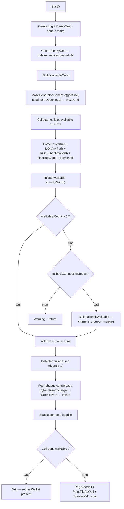
```mermaid
graph TD
    A["Start()"] --> B["CreateRng + DeriveSeed pour le maze"]
    B --> C[CacheTilesByCell — indexer les tiles par cellule]
    C --> D[BuildWalkableCells]
    D --> D1["MazeGenerator.Generate(gridSize, seed, extraOpenings) → MazeGrid"]
    D1 --> D2["Collecter cellules walkable du maze"]
    D2 --> D3["Forcer ouverture : IsOnAnyPath + IsOnSuboptimalPath + HasBugCloud + playerCell"]
    D3 --> E["Inflate(walkable, corridorWidth)"]
    E --> F{walkable.Count > 0 ?}
    F -->|Non| G{fallbackConnectToClouds ?}
    G -->|Oui| H["BuildFallbackWalkable — chemins L joueur→nuages"]
    G -->|Non| I[Warning + return]
    F -->|Oui| J[AddExtraConnections]
    H --> J

    J --> K["Détecter culs-de-sac (degré ≤ 1)"]
    K --> L["Pour chaque cul-de-sac : TryFindNearbyTarget → CarveLPath → Inflate"]

    L --> M["Boucle sur toute la grille"]
    M --> N{Cell dans walkable ?}
    N -->|Oui| O[Skip — retirer Wall si présent]
    N -->|Non| P["RegisterWall + PaintTileAsWall + SpawnWallVisual"]
```

### 3.3.5 Formules et règles métier

```
Maze base              = MazeGenerator.Generate(width, height, seed, extraOpenings)
                         DFS backtracker classique, seed déterministe
Force paths            = union(maze walkable, chemins réservés, chemin suboptimal, nuages, joueur)
Inflate(cells, width)  = pour chaque cellule, ajouter un carré de côté `width` centré
                         width=1 → pas d'élargissement, width=2 → offsets [0,1]
Cul-de-sac             = cellule walkable avec ≤ 1 voisin walkable (Neighbors4)
Extra connection        = chemin L entre un cul-de-sac et une cellule walkable à distance [2..6]
Mur                    = toute cellule de la grille qui n'est PAS dans walkable
```

### 3.3.6 Points d'attention

- **⚠️ Edge case :** Si `PathSpawner` est absent ou n'a réservé aucun chemin, le système bascule en fallback (chemins L directs joueur→nuages) — le résultat est un labyrinthe minimal sans garantie de couloirs
- **⚠️ Maze generation :** Le maze est généré par `MazeGenerator` (DFS backtracker) sous `Assets/Game/Utils/Maze/`. La seed est dérivée de la seed globale via `DeriveSeed("CorridorWallsGenerator.Maze")` — reproductible
- **⚠️ Performance :** `FindGameObjectsWithTag("Tile")` est appelé une fois au Start pour indexer les tuiles — OK pour l'initialisation, mais O(n) sur le nombre de tuiles
- **⚠️ Visuels :** Si `wallPrefab` est null, des Cubes primitifs sont créés — fonctionnel mais coûteux en draw calls sur de grandes grilles
- **🔧 À surveiller :** `extraConnections` est un nombre de tentatives, pas un nombre garanti de connexions ajoutées — si les culs-de-sac n'ont pas de voisins proches, moins de connexions seront créées

### 3.3.7 Journal d'implémentation

| Date     | Développeur | Note / Décision Technique                                                                                                                                                                                                            |
| :------- | :---------- | :----------------------------------------------------------------------------------------------------------------------------------------------------------------------------------------------------------------------------------- |
| 17/02/26 | @auteur     | Documentation initiale. Couloirs par inflation des chemins réservés + connexions anti-cul-de-sac.                                                                                                                                    |
| 27/02/26 | @pierre     | Refacto : suppression champ player (TryGetPlayerStartCell), seeded RNG, intégration MazeGenerator DFS backtracker, corridorWidth default 2→1, ajout mazeExtraOpenings.                                                               |
| 09/03/26 | @auteur     | Feature suboptimal path : `BuildWalkableCells` inclut désormais `reg.IsOnSuboptimalPath(c)` dans baseCells — les cellules du chemin suboptimal sont traitées comme walkable (couloirs forcés) mais sans Reserved (pièges possibles). |

## 3.4 TrapSpawner

### 3.4.1 Responsabilités

- Placer un nombre configurable de pièges sur les cellules libres de la grille
- **Placer en priorité des pièges sur le chemin suboptimal** (tirage probabiliste + bornes min/max — comptent dans le budget `trapCount`)
- Respecter les contraintes spatiales (pas sur les chemins réservés, nuages, murs, cellule joueur)
- Lire le nombre de pièges depuis `SessionManager.Instance.trapCount` (propriétaire de la config expérimentale)
- Lire les paramètres de pièges suboptimaux depuis `SessionManager.Instance` (suboptimalTrapProbability, minSuboptimalTraps, maxSuboptimalTraps)
- Utiliser le RNG seedé pour un placement reproductible
- Enregistrer chaque piège dans LevelRegistry

### 3.4.2 Composants clés (Data Model)

→ **TrapSpawner.cs** : MonoBehaviour, placement des pièges au Start. Ordre d'exécution : `-10`.

```csharp
[DefaultExecutionOrder(-10)]
public class TrapSpawner : MonoBehaviour
{
    [Header("Références")]
    public GameObject trapPrefab;

    [Header("Placement")]
    public float trapYOffset = 0.5f;
}
```

| Variable / Méthode                           | Type        | Description                                                                      |
| :------------------------------------------- | :---------- | :------------------------------------------------------------------------------- |
| trapPrefab                                   | GameObject  | Prefab du piège (doit avoir Trap.cs + BoxCollider IsTrigger)                     |
| trapYOffset                                  | float       | Hauteur Y d'instanciation (défaut : 0.5)                                         |
| \_trapCount                                  | int (privé) | Lu depuis `SessionManager.Instance.trapCount` au Start — pas de champ Inspector  |
| PlaceSuboptimalTraps(registry, session, rng) | int (privé) | Place des pièges sur les cellules du chemin suboptimal. Retourne le nombre placé |

### 3.4.3 Dépendances

- **Nécessite :** `LevelRegistry.Instance` (gridSize, CellToWorld, IsFreeForTrap, IsOnSuboptimalPath, RegisterTrap, TryGetPlayerStartCell, CreateRng), `SessionManager.Instance` (**paramètres recherche** : trapCount, suboptimalTrapProbability, minSuboptimalTraps, maxSuboptimalTraps)
- **Est configuré par :** `SessionManager.Instance` (lecture directe de trapCount + params suboptimal traps — voir section 2.3)
- **Déclenche :** `RegisterTrap()` dans LevelRegistry pour chaque piège placé

### 3.4.4 Diagramme de flux

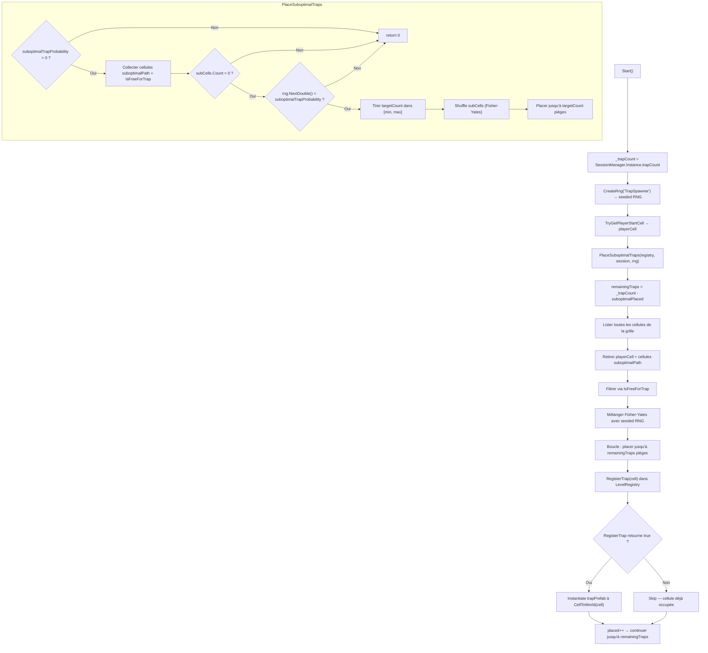
```mermaid
graph TD
    A["Start()"] --> A1["_trapCount = SessionManager.Instance.trapCount"]
    A1 --> A2["CreateRng('TrapSpawner') → seeded RNG"]
    A2 --> B["TryGetPlayerStartCell → playerCell"]
    B --> SUB["PlaceSuboptimalTraps(registry, session, rng)"]

    subgraph "PlaceSuboptimalTraps"
        SUB1{"suboptimalTrapProbability > 0 ?"}
        SUB1 -->|Non| SUB_END["return 0"]
        SUB1 -->|Oui| SUB2["Collecter cellules suboptimalPath + IsFreeForTrap"]
        SUB2 --> SUB3{"subCells.Count > 0 ?"}
        SUB3 -->|Non| SUB_END
        SUB3 -->|Oui| SUB4{"rng.NextDouble() < suboptimalTrapProbability ?"}
        SUB4 -->|Non| SUB_END
        SUB4 -->|Oui| SUB5["Tirer targetCount dans [min, max]"]
        SUB5 --> SUB6["Shuffle subCells (Fisher-Yates)"]
        SUB6 --> SUB7["Placer jusqu’à targetCount pièges"]
    end

    SUB --> C["remainingTraps = _trapCount - suboptimalPlaced"]
    C --> D["Lister toutes les cellules de la grille"]
    D --> D2["Retirer playerCell + cellules suboptimalPath"]
    D2 --> E["Filtrer via IsFreeForTrap"]
    E --> F["Mélanger Fisher-Yates avec seeded RNG"]
    F --> G["Boucle : placer jusqu'à remainingTraps pièges"]
    G --> H["RegisterTrap(cell) dans LevelRegistry"]
    H --> I{RegisterTrap retourne true ?}
    I -->|Oui| J["Instantiate trapPrefab à CellToWorld(cell)"]
    I -->|Non| K[Skip — cellule déjà occupée]
    J --> L["placed++ → continuer jusqu'à remainingTraps"]
    K --> L
```

### 3.4.5 Formules et règles métier

```
Cellule éligible   = IsFreeForTrap(cell) = InBounds && !IsReserved && !IsWall && !HasTrap
                     + cell != playerCell
Placement          = Fisher-Yates shuffle (seeded RNG) puis N premières cellules valides
trapCount          = SessionManager.Instance.trapCount (lecture directe du Singleton)
                     Valeur par défaut : 10, pilotée par la config de session (MapGenConfig)
                     Aucun override CLI : le seul argument lu est "sessionId=" (FlowController.cs:389)
Reproductibilité   = seed dérivée via CreateRng("TrapSpawner") — même seed globale → même placement

--- Pièges suboptimaux ---
Tirage activation  = rng.NextDouble() < SessionManager.Instance.suboptimalTrapProbability
                     (0 = jamais, 1 = toujours)
targetCount        = rng.Next(minSuboptimalTraps, maxSuboptimalTraps + 1)
Cellules éligibles = IsOnSuboptimalPath(cell) && IsFreeForTrap(cell)
Budget             = les pièges suboptimaux comptent dans trapCount
                     remainingTraps = trapCount - suboptimalPlaced
Exclusion          = les cellules suboptimalPath sont exclues des candidats normaux
                     (pas de double placement)
```

### 3.4.6 Points d'attention

- **⚠️ Edge case :** Si le nombre de cellules libres est inférieur à `_trapCount`, moins de pièges seront placés — comportement silencieux (log `placed/_trapCount`)
- **⚠️ Séquencement :** TrapSpawner (-10) s'exécute après CorridorWallsGenerator (-50) — les murs sont déjà en place, donc `IsFreeForTrap` exclut correctement les cellules murées
- **⚠️ Plus de champ player :** La cellule joueur est obtenue via `TryGetPlayerStartCell()` — pas de référence Transform dans l'Inspector
- **⚠️ trapCount :** Pas de champ `trapCount` sur TrapSpawner — la valeur est lue depuis `SessionManager.Instance.trapCount` au Start. Le pipeline est : CLI arg → SessionManager.Awake (parsing) → TrapSpawner.Start (lecture directe)
- **⚠️ Suboptimal traps prioritaires :** `PlaceSuboptimalTraps` est appelé **avant** le placement normal. Les pièges suboptimaux comptent dans le budget `trapCount`. Si `suboptimalPlaced >= trapCount`, aucun piège normal n'est placé
- **⚠️ Exclusion croisée :** Les cellules du chemin suboptimal sont retirées des candidats normaux via `RemoveAll(c => registry.IsOnSuboptimalPath(c))` — pas de double placement possible

### 3.4.7 Journal d'implémentation

| Date     | Développeur | Note / Décision Technique                                                                                                                                                                                                                                                                                                                                                                                                                                                                                                                                                                                                                       |
| :------- | :---------- | :---------------------------------------------------------------------------------------------------------------------------------------------------------------------------------------------------------------------------------------------------------------------------------------------------------------------------------------------------------------------------------------------------------------------------------------------------------------------------------------------------------------------------------------------------------------------------------------------------------------------------------------------- |
| 17/02/26 | @auteur     | Documentation initiale. Placement par shuffle + filtre IsFreeForTrap, configurable via CLI.                                                                                                                                                                                                                                                                                                                                                                                                                                                                                                                                                     |
| 27/02/26 | @pierre     | Refacto : suppression champ player (TryGetPlayerStartCell), trapCount lu depuis registry, seeded RNG.                                                                                                                                                                                                                                                                                                                                                                                                                                                                                                                                           |
| 02/03/26 | @pierre     | Refacto SRP : TrapSpawner lit `trapCount` directement depuis `SessionManager.Instance` (nouveau Singleton). Plus de transit par LevelRegistry pour les paramètres recherche.                                                                                                                                                                                                                                                                                                                                                                                                                                                                    |
| 12/03/26 | @auteur     | Feature suboptimal traps : ajout `PlaceSuboptimalTraps()` (tirage probabiliste + bornes min/max). Les pièges suboptimaux comptent dans le budget `trapCount`. Cellules suboptimalPath exclues des candidats normaux. Params lus depuis SessionManager : `suboptimalTrapProbability`, `minSuboptimalTraps`, `maxSuboptimalTraps`.                                                                                                                                                                                                                                                                                                                |
| 28/07/26 | @florian    | **Correction documentaire — aucune modification de code.** Revue de couverture (`Docs/project-state/revue-couverture-2026-07-28.md`, constat N2-K) : §3.4.5 annonçait `trapCount` « overridable via arg CLI "trapCount=N" ». Aucun parsing de cet argument n'existe dans le code — le seul argument lu est `sessionId=`, dans `FlowController.cs:389`. `trapCount` vient de la config de session (`MapGenConfig`) recopiée par `SessionManager.CopyConfigFromFlowController()`. La même erreur subsiste dans `CLAUDE.md:116` (corrigée en parallèle). L'entrée du 17/02/26 ci-dessus est conservée : elle décrit un état initial depuis révisé. |

## 3.5 GridMover

### 3.5.1 Responsabilités

- Capturer les inputs clavier via le set de touches actif défini par `MotorAdviceController` (ZQSD, TFGH ou IJKL)
- Si `MotorAdviceController` est absent, fallback sur les flèches directionnelles
- Tourner le joueur vers la direction demandée, même si la case cible est bloquée
- Valider le mouvement cible via LevelRegistry (InBounds, IsWalkable)
- Interpoler le déplacement du joueur par coroutine avec SmoothStep
- **Détecter les appuis sur des touches non actives** (itération `Keyboard.current.allKeys`) et signaler la pénalité au GameManager
- Notifier GameManager de chaque déplacement terminé via `OnPlayerStep(cell)`
- **Ne gère pas** le brouillard ni le marquage des cellules visitées — c'est la responsabilité de GameManager

### 3.5.2 Composants clés (Data Model)

→ **GridMover.cs** (classe `GridMover`) : MonoBehaviour sur le GameObject joueur. Ordre d'exécution : `0` (défaut).

```csharp
public class GridMover : MonoBehaviour
{
    [Header("Grille")]
    public float cellSize = 1f;

    [Header("Déplacement")]
    public float moveDuration = 0.15f;
    public bool rotateToDirection = true;

    private bool _isMoving = false;
}
```

| Variable / Méthode                      | Type               | Description                                                                                          |
| :-------------------------------------- | :----------------- | :--------------------------------------------------------------------------------------------------- |
| cellSize                                | float              | Taille d'une case en unités monde — ignoré si LevelRegistry présent (défaut : 1)                     |
| moveDuration                            | float              | Durée de l'interpolation en secondes (défaut : 0.15)                                                 |
| rotateToDirection                       | bool               | Rotation du joueur vers la direction du mouvement (défaut : true)                                    |
| \_isMoving                              | bool (privé)       | Verrou empêchant un nouveau mouvement pendant l'interpolation                                        |
| ReadStep()                              | Vector2Int (privé) | Lit un pas discret depuis le set actif via `MotorAdviceController.TryGetStep()`, fallback flèches    |
| IsAnyNonActiveMoveKeyPressedThisFrame() | bool (privé)       | Itère `Keyboard.current.allKeys` — retourne `true` si une touche pressée n'est pas dans le set actif |
| IsActiveMoveKey(KeyControl)             | bool (privé)       | Délègue à `MotorAdviceController.Instance.IsActiveMoveKey()`, fallback flèches si MAC absent         |
| MoveTo(Vector3, float)                  | Coroutine (privé)  | Interpolation SmoothStep + appel `GameManager.OnPlayerStep(cell)` à la fin                           |
| SnapToGrid()                            | void               | Aligne la position du joueur au centre de la cellule la plus proche                                  |

### 3.5.3 Dépendances

- **Nécessite :** `LevelRegistry.Instance` (WorldToCell, CellToWorld, InBounds, IsWalkable, SnapWorldToCellCenter), `GameManager.Instance` (inputLocked, OnPlayerStep, OnInvalidMoveKeyPressed), `MotorAdviceController.Instance` (TryGetStep, IsActiveMoveKey)
- **Ne dépend plus de :** `FogController` (la révélation du brouillard et le marquage visited sont gérés par `GameManager.OnPlayerStep`)
- **Est utilisé par :** Aucun — composant terminal sur le GameObject joueur
- **Package requis :** `com.unity.inputsystem` 1.17.0 (`using UnityEngine.InputSystem`, `using UnityEngine.InputSystem.Controls`)

### 3.5.4 Diagramme de flux

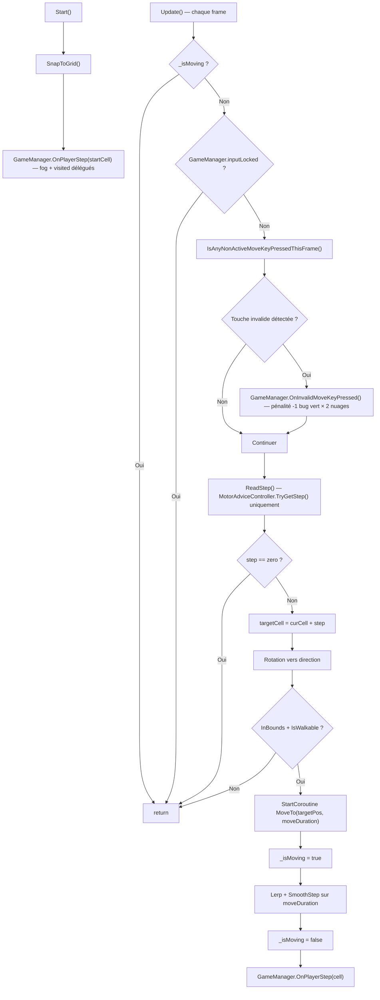
```mermaid
graph TD
    A["Start()"] --> B["SnapToGrid()"]
    B --> C["GameManager.OnPlayerStep(startCell) — fog + visited délégués"]

    E["Update() — chaque frame"] --> F{_isMoving ?}
    F -->|Oui| G[return]
    F -->|Non| H{GameManager.inputLocked ?}
    H -->|Oui| G
    H -->|Non| INV["IsAnyNonActiveMoveKeyPressedThisFrame()"]
    INV --> INV2{Touche invalide détectée ?}
    INV2 -->|Oui| INV3["GameManager.OnInvalidMoveKeyPressed() — pénalité -1 bug vert × 2 nuages"]
    INV2 -->|Non| CONT[Continuer]
    INV3 --> CONT
    CONT --> I["ReadStep() — MotorAdviceController.TryGetStep() uniquement"]
    I --> J{step == zero ?}
    J -->|Oui| G
    J -->|Non| K["targetCell = curCell + step"]
    K --> L["Rotation vers direction"]
    L --> M{"InBounds + IsWalkable ?"}
    M -->|Non| G
    M -->|Oui| N["StartCoroutine MoveTo(targetPos, moveDuration)"]

    N --> O["_isMoving = true"]
    O --> P["Lerp + SmoothStep sur moveDuration"]
    P --> Q["_isMoving = false"]
    Q --> R["GameManager.OnPlayerStep(cell)"]
```

### 3.5.5 Formules et règles métier

```
Input mapping      = Set actif défini par MotorAdviceController (ZQSD, TFGH ou IJKL)
                     Aucun fallback : si MotorAdviceController est absent, ReadStep() renvoie
                     Vector2Int.zero et aucun déplacement n'est possible (GridMover.cs:109-117)
                     wasPressedThisFrame → 1 step par appui (pas de repeat)
Mouvement          = 1 case par input, 4 directions cardinales
Interpolation      = Vector3.Lerp(start, target, SmoothStep(0, 1, t))
                     t += deltaTime / moveDuration
Validation         = LevelRegistry.InBounds(targetCell) && LevelRegistry.IsWalkable(targetCell)
Rotation           = appliquee des qu'une direction est demandee, y compris sur tentative bloquee
Verrouillage       = _isMoving (pendant interpolation) || GameManager.inputLocked (fin de round)
Signalisation      = OnPlayerStep(cell) → GameManager gère fog, visited, trial log
Touche invalide    = toute touche de Keyboard.current.allKeys pressée qui n'est PAS dans le set actif
                     → GameManager.OnInvalidMoveKeyPressed() appelé (pénalité -1 bug vert × 2 nuages)
                     Détection AVANT ReadStep — la pénalité s'applique même si une touche valide est aussi pressée
```

### 3.5.6 Points d'attention

- **⚠️ Input :** Le set de touches actif est défini par `MotorAdviceController` (ZQSD, TFGH ou IJKL). Si `MotorAdviceController.Instance` est null, fallback sur les flèches directionnelles
- **⚠️ Pénalité touches invalides :** `IsAnyNonActiveMoveKeyPressedThisFrame()` itère sur `Keyboard.current.allKeys` — TOUTES les touches du clavier (y compris modificateurs Shift, Ctrl, Alt, Space) déclenchent la pénalité. Détection indépendante du mouvement : se produit même si le joueur ne bouge pas
- **⚠️ Fallback :** Si `LevelRegistry.Instance` est null, le système bascule sur un snap local sans validation de marchabilité — le joueur peut sortir de la grille
- **⚠️ Séparation des responsabilités :** GridMover ne sait rien du brouillard, des cellules visitées, ni du trial log. Il se contente de déplacer le joueur et signaler le pas au GameManager. C'est un design « entité signale, manager interprète ».
- **⚠️ Champs nettoyés :** Les anciens champs `tileLayer`, `raycastStartHeight`, `raycastDistance` (vestiges de validation par raycast) ont été supprimés dans la refacto

### 3.5.7 Journal d'implémentation

| Date     | Développeur | Note / Décision Technique                                                                                                                                                                                                                                                                                                                                                                                                                                                                                                                                                                                                                                                                                                                                                                                                                                                                                                                                                                                                                |
| :------- | :---------- | :--------------------------------------------------------------------------------------------------------------------------------------------------------------------------------------------------------------------------------------------------------------------------------------------------------------------------------------------------------------------------------------------------------------------------------------------------------------------------------------------------------------------------------------------------------------------------------------------------------------------------------------------------------------------------------------------------------------------------------------------------------------------------------------------------------------------------------------------------------------------------------------------------------------------------------------------------------------------------------------------------------------------------------------- |
| 17/02/26 | @auteur     | Documentation initiale. Mouvement discret par coroutine SmoothStep, validation via LevelRegistry.                                                                                                                                                                                                                                                                                                                                                                                                                                                                                                                                                                                                                                                                                                                                                                                                                                                                                                                                        |
| 17/02/26 | @auteur     | Suppression des touches ZQSD/WASD. Seules les flèches directionnelles restent comme contrôles de mouvement.                                                                                                                                                                                                                                                                                                                                                                                                                                                                                                                                                                                                                                                                                                                                                                                                                                                                                                                              |
| 27/02/26 | @pierre     | Refacto : renommage GridMoverNewInput→GridMover, suppression champs raycast legacy, fog+visited déplacés vers GameManager.OnPlayerStep.                                                                                                                                                                                                                                                                                                                                                                                                                                                                                                                                                                                                                                                                                                                                                                                                                                                                                                  |
| 12/03/26 | @auteur     | Intégration Motor Advice : `ReadStep()` délègue à `MotorAdviceController.TryGetStep()` (fallback flèches). Ajout `IsAnyNonActiveMoveKeyPressedThisFrame()` (itère `allKeys`), `IsActiveMoveKey()` (délègue à MAC). Pénalité touche invalide via `GameManager.OnInvalidMoveKeyPressed()`. Import `UnityEngine.InputSystem.Controls`.                                                                                                                                                                                                                                                                                                                                                                                                                                                                                                                                                                                                                                                                                                      |
| 28/07/26 | @florian    | **Correction documentaire — aucune modification de code.** Revue de couverture (`Docs/project-state/revue-couverture-2026-07-28.md`, constats N2-L et N2-K). **(1) Barème de pénalité** : §3.5.4 (`:818`) et §3.5.5 (`:850`) annonçaient encore **-2 bugs** sur la touche invalide — deux occurrences que la passe de correction du 28/07 (cf. journal §4.2.7) avait manquées. Le barème réel est **-1 bug vert** par nuage (`GameManager.cs:285-286`). **(2) Fallback flèches inexistant** : §3.5.4 et §3.5.5 décrivaient un repli sur les flèches directionnelles si `MotorAdviceController` est absent. `GridMover.ReadStep()` (`:109-117`) commente explicitement « Aucun fallback sur les flèches directionnelles » et renvoie `Vector2Int.zero` quand `MotorAdviceController.Instance == null` — **le joueur ne peut alors pas se déplacer du tout**, ce qui compte pour qui lance ProximalScene isolément. L'entrée du 12/03/26 ci-dessus est conservée : elle décrit l'intention d'origine, depuis abandonnée en implémentation. |

## 3.6 MotorAdviceController

### 3.6.1 Responsabilités

- Singleton gérant le **jeu de touches actif** pour le mouvement joueur (ZQSD, TFGH ou IJKL)
- Tirage seedé du set actif au Start (RNG déterministe via `LevelRegistry.CreateRng`)
- Déterminer si l'**advice est visible** (tirage `rng.NextDouble() < motorAdviceVisibleProbability`)
- Si visible, déterminer si l'**advice est fiable** (tirage `rng.NextDouble() < motorAdviceReliableProbability`)
- Si non fiable, afficher un **set différent** du set actif (trompeur)
- Fournir l'API d'input (`TryGetStep`) pour `GridMover` — remplace la lecture directe des flèches
- Fournir l'API de validation (`IsActiveMoveKey`) pour la détection de touches invalides

### 3.6.2 Composants clés (Data Model)

→ **MotorAdviceController.cs** : Singleton MonoBehaviour. Ordre d'exécution : `0` (défaut).

> **Note architecture :** Les paramètres `motorAdviceVisibleProbability` et `motorAdviceReliableProbability` sont lus directement depuis `SessionManager.Instance` (Singleton). Ce script ne possède aucun paramètre de game design. Voir pattern **Research Parameter Pipeline** (section 2.3).

```csharp
public class MotorAdviceController : MonoBehaviour
{
    public static MotorAdviceController Instance { get; private set; }

    public MotorKeySet ActiveSet { get; private set; } = MotorKeySet.ZQSD;
    public MotorKeySet DisplayedSet { get; private set; } = MotorKeySet.None;
    public bool AdviceVisible { get; private set; }
    public bool AdviceReliable { get; private set; }

    public event Action OnAdviceChanged;
}
```

→ **MotorKeySet** (enum, même fichier) :

```csharp
public enum MotorKeySet
{
    ZQSD,   // W/A/S/D (layout AZERTY → ZQSD)
    TFGH,   // T/F/G/H
    IJKL,   // I/J/K/L
    None
}
```

| Variable / Méthode                         | Type                           | Description                                                                                                                                                                                        |
| :----------------------------------------- | :----------------------------- | :------------------------------------------------------------------------------------------------------------------------------------------------------------------------------------------------- |
| Instance                                   | MotorAdviceController          | Référence statique globale (Singleton)                                                                                                                                                             |
| ActiveSet                                  | MotorKeySet (get)              | Set de touches réellement actif pour le mouvement (tiré au Start)                                                                                                                                  |
| DisplayedSet                               | MotorKeySet (get)              | Set de touches affiché à l'UI — peut différer de ActiveSet si non fiable                                                                                                                           |
| AdviceVisible                              | bool (get)                     | `true` si l'advice est affiché au joueur (tirage probabiliste)                                                                                                                                     |
| AdviceReliable                             | bool (get)                     | `true` si le set affiché == set actif (advice fiable)                                                                                                                                              |
| OnAdviceChanged                            | event Action                   | Émis après le tirage — `MotorAdviceUI` s'y abonne                                                                                                                                                  |
| _Lecture depuis SessionManager.Instance :_ |                                | `motorAdviceVisibleProbability` (float, 0-1), `motorAdviceReliableProbability` (float, 0-1) — **paramètres recherche** (Singleton, lecture directe)                                                |
| TryGetStep(out Vector2Int)                 | bool                           | Teste `wasPressedThisFrame` sur les 4 directions du set actif (via `GetKeyControl` + `IsDirectionPressed`). Retourne `true` + direction si pressée                                                 |
| IsActiveMoveKey(KeyControl)                | bool                           | Retourne `true` si la touche appartient au set actif (comparaison aux 4 `GetKeyControl` du set)                                                                                                    |
| FormatSet(MotorKeySet, direction)          | string (statique)              | Renvoie le **label à afficher** pour une direction. Utilise `KeyControl.displayName` (libellé réel selon layout OS : "Z" AZERTY / "W" QWERTY). Fallback labels AZERTY si `Keyboard.current` absent |
| GetKeyControl(set, direction)              | KeyControl (statique privé)    | Source de vérité unique set+direction → `KeyControl` (position physique). Utilisé par TryGetStep, IsActiveMoveKey et FormatSet                                                                     |
| IsDirectionPressed(set, direction)         | bool (statique privé)          | `true` si le `KeyControl` de la direction a `wasPressedThisFrame`                                                                                                                                  |
| FallbackLabel(set, direction)              | string (statique privé)        | Labels AZERTY codés en dur, utilisés uniquement quand `displayName` indisponible                                                                                                                   |
| PickOtherSet(rng, current)                 | MotorKeySet (statique privé)   | Choisit un set différent du set courant (pour advice non fiable)                                                                                                                                   |
| CreateRng()                                | System.Random (statique privé) | Crée un RNG seedé via `LevelRegistry.CreateRng("MotorAdviceController")`                                                                                                                           |

### 3.6.3 Dépendances

- **Nécessite :** `LevelRegistry.Instance` (CreateRng — pour RNG seedé), `SessionManager.Instance` (**paramètres recherche** : motorAdviceVisibleProbability, motorAdviceReliableProbability)
- **Est configuré par :** `SessionManager.Instance` (lecture directe des probabilités visible/reliable — voir section 2.3)
- **Est utilisé par :** `GridMover` (TryGetStep pour lecture d'input, IsActiveMoveKey pour validation touches), `MotorAdviceUI` (s'abonne à OnAdviceChanged pour l'affichage)
- **Package requis :** `com.unity.inputsystem` 1.17.0 (`using UnityEngine.InputSystem`, `using UnityEngine.InputSystem.Controls`)

### 3.6.4 Diagramme de flux

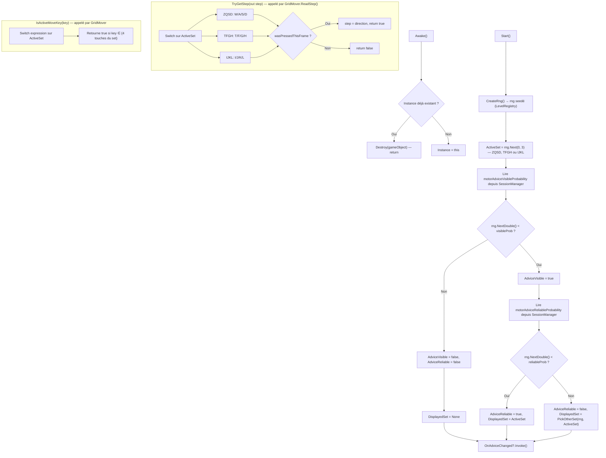
```mermaid
graph TD
    A["Awake()"] --> A1{"Instance déjà existant ?"}
    A1 -->|Oui| A2["Destroy(gameObject) — return"]
    A1 -->|Non| A3["Instance = this"]

    B["Start()"] --> C["CreateRng() → rng seedé (LevelRegistry)"]
    C --> D["ActiveSet = rng.Next(0, 3) — ZQSD, TFGH ou IJKL"]
    D --> E["Lire motorAdviceVisibleProbability depuis SessionManager"]
    E --> F{"rng.NextDouble() < visibleProb ?"}
    F -->|Non| G["AdviceVisible = false, AdviceReliable = false"]
    G --> G2["DisplayedSet = None"]
    G2 --> H["OnAdviceChanged?.Invoke()"]
    F -->|Oui| I["AdviceVisible = true"]
    I --> J["Lire motorAdviceReliableProbability depuis SessionManager"]
    J --> K{"rng.NextDouble() < reliableProb ?"}
    K -->|Oui| L["AdviceReliable = true, DisplayedSet = ActiveSet"]
    K -->|Non| M["AdviceReliable = false, DisplayedSet = PickOtherSet(rng, ActiveSet)"]
    L --> H
    M --> H

    subgraph "TryGetStep(out step) — appelé par GridMover.ReadStep()"
        TS1["Switch sur ActiveSet"] --> TS2["ZQSD: W/A/S/D"]
        TS1 --> TS3["TFGH: T/F/G/H"]
        TS1 --> TS4["IJKL: I/J/K/L"]
        TS2 --> TS5{"wasPressedThisFrame ?"}
        TS3 --> TS5
        TS4 --> TS5
        TS5 -->|Oui| TS6["step = direction, return true"]
        TS5 -->|Non| TS7["return false"]
    end

    subgraph "IsActiveMoveKey(key) — appelé par GridMover"
        AM1["Switch expression sur ActiveSet"] --> AM2["Retourne true si key ∈ {4 touches du set}"]
    end
```

### 3.6.5 Formules et règles métier

```
Tirage set actif    = rng.Next(0, 3) → index dans {ZQSD=0, TFGH=1, IJKL=2}
Tirage visible      = rng.NextDouble() < SessionManager.Instance.motorAdviceVisibleProbability
                      (défaut 1.0 = toujours visible)
Tirage fiable       = rng.NextDouble() < SessionManager.Instance.motorAdviceReliableProbability
                      (défaut 1.0 = toujours fiable, uniquement si visible)
Set affiché         = ActiveSet si fiable, PickOtherSet(rng, ActiveSet) si non fiable, None si invisible
PickOtherSet        = retire le set courant de la liste [ZQSD, TFGH, IJKL], tire au hasard parmi les 2 restants

Mapping ZQSD : wKey=Haut, aKey=Gauche, sKey=Bas, dKey=Droite (POSITION PHYSIQUE, réf. layout US)
Mapping TFGH : tKey=Haut, fKey=Gauche, gKey=Bas, hKey=Droite
Mapping IJKL : iKey=Haut, jKey=Gauche, kKey=Bas, lKey=Droite

Input   = position physique de la touche → comportement identique quel que soit le layout
Affichage = KeyControl.displayName → libellé réel selon le layout OS courant
            ex. wKey.displayName = "Z" (AZERTY) / "W" (QWERTY) / "Z" (QWERTZ)
            semicolonKey.displayName = "M" (AZERTY) / ";" (QWERTY)
Fallback  = labels AZERTY codés en dur si Keyboard.current == null (hors Play Mode, headless)
```

### 3.6.6 Points d'attention

- **⚠️ Singleton :** `MotorAdviceController.Instance` peut être `null` si le GameObject n'est pas dans la scène. `GridMover` gère ce cas avec fallback flèches
- **⚠️ RNG seedé :** Le tirage utilise `LevelRegistry.CreateRng(nameof(MotorAdviceController))` — même seed = même set actif + mêmes tirages visible/fiable. Si `LevelRegistry.Instance` est null, un RNG non seedé est utilisé (warning loggé)
- **⚠️ Layout clavier :** Les sets lisent des **positions physiques** (`wKey/aKey/sKey/dKey`...) du New Input System — l'input est donc identique quel que soit le layout. L'**affichage** utilise `KeyControl.displayName` qui renvoie le libellé réel selon le layout OS (Z/Q/S/D en AZERTY, W/A/S/D en QWERTY). Un fallback labels AZERTY est utilisé si `Keyboard.current` est null (hors Play Mode). Les noms d'enum (ZQSD/TFGH/IJKL) restent des **identifiants internes AZERTY-centrés**, sans impact sur l'affichage runtime
- **⚠️ Advice non fiable :** Si `AdviceReliable == false`, le joueur voit un set différent du set actif. Il doit identifier le bon set par essai — les erreurs déclenchent la pénalité de touche invalide
- **⚠️ OnAdviceChanged :** Émis une seule fois au Start après tous les tirages. Si l'UI n'est pas encore abonnée (problème de timing), l'affichage ne sera pas mis à jour — en pratique non problématique car `MotorAdviceUI.Start()` appelle aussi `Refresh()` directement

### 3.6.7 Journal d'implémentation

| Date     | Développeur | Note / Décision Technique                                                                                                                                                                                                                                                                                                                                      |
| :------- | :---------- | :------------------------------------------------------------------------------------------------------------------------------------------------------------------------------------------------------------------------------------------------------------------------------------------------------------------------------------------------------------- |
| 12/03/26 | @auteur     | Création. Singleton Motor Advice : tirage seedé du set actif (ZQSD/TFGH/IJKL), advice visible/fiable configurable via SessionManager. API TryGetStep + IsActiveMoveKey. Event OnAdviceChanged pour MotorAdviceUI.                                                                                                                                              |
| 08/07/26 | @auteur     | Affichage layout-aware : `FormatSet` renvoie désormais `KeyControl.displayName` (libellé réel selon layout OS) au lieu de labels codés en dur → corrige l'affichage QWERTY. Mapping set+direction centralisé dans `GetKeyControl` (partagé par TryGetStep/IsActiveMoveKey/FormatSet). Fallback labels AZERTY via `FallbackLabel` si `Keyboard.current` absent. |

# 4. Systèmes Core

## 4.1 LevelRegistry

### 4.1.1 Responsabilités

- Maintenir l'état spatial de chaque cellule de la grille via des flags bitwise (`CellFlags`)
- Fournir les conversions coordonnées grille ↔ monde (`WorldToCell`, `CellToWorld`)
- Valider la marchabilité des cellules pour le mouvement joueur (`IsWalkable`)
- Valider la disponibilité des cellules pour le spawn de pièges (`IsFreeForTrap`)
- Enregistrer et désenregistrer les entités spatiales (nuages, pièges, murs, chemins, position de départ joueur)
- Gérer le système de seed reproductible (RNG déterministe par scope via FNV-1a 64-bit)
- Stocker les données globales de round (`optimalPathLength`, `stepBudget`) accessibles par tous les systèmes

### 4.1.2 Composants clés (Data Model)

→ **LevelRegistry.cs** : Singleton MonoBehaviour, source de vérité unique pour l'état de la grille. Ordre d'exécution : `-300`.

```csharp
[DefaultExecutionOrder(-300)]
public class LevelRegistry : MonoBehaviour
{
    public static LevelRegistry Instance { get; private set; }

    public Vector2Int gridSize = new(10, 10);
    public float cellSize = 1f;
    public Vector3 originWorld = Vector3.zero;

    [HideInInspector] public int optimalPathLength;
    [HideInInspector] public int stepBudget;

    long _roundSeed;
    bool _hasRoundSeed;

    [Flags]
    public enum CellFlags
    {
        None           = 0,
        BugCloud       = 1 << 0,
        Trap           = 1 << 1,
        PathLeft       = 1 << 2,
        PathRight      = 1 << 3,
        Reserved       = 1 << 4,
        Visited        = 1 << 5,
        Wall           = 1 << 6,
        PlayerStart    = 1 << 7,
        SuboptimalPath = 1 << 8,  // walkable mais PAS réservé → pièges possibles
    }

    readonly Dictionary<Vector2Int, CellFlags> _cells = new();

    bool _hasPlayerStart;
    bool _hasPlayerStartWorld;
    Vector2Int _playerStartCell;
    Vector3 _playerStartWorld;
}
```

| Variable / Méthode                                | Type                  | Description                                                                                   |
| :------------------------------------------------ | :-------------------- | :-------------------------------------------------------------------------------------------- |
| Instance                                          | LevelRegistry         | Référence statique globale (Singleton)                                                        |
| gridSize                                          | Vector2Int            | Dimensions de la grille (défaut : 10×10) — **game design**                                    |
| cellSize                                          | float                 | Taille d'une case en unités monde (défaut : 1, min : 0.0001) — **game design**                |
| originWorld                                       | Vector3               | Position monde (X,Z) de la case (0,0) — initialisée par TilesSpawner                          |
| optimalPathLength                                 | int [HideInInspector] | Longueur du chemin optimal enregistré par PathSpawner                                         |
| stepBudget                                        | int [HideInInspector] | Distance Manhattan joueur→nuages (budget de pas) — enregistré par BugCloudSpawner             |
| **Système RNG**                                   |                       |                                                                                               |
| SetRoundSeed(long)                                | void                  | Définit la seed du round (appelé par SessionManager)                                          |
| TryGetRoundSeed(out long)                         | bool                  | Récupère la seed du round si elle a été définie                                               |
| CreateRng(string scope)                           | System.Random         | Crée un RNG déterministe — si pas de seed, en génère une automatiquement                      |
| DeriveSeed(string scope)                          | int                   | Dérive un seed int depuis roundSeed+scope via FNV-1a 64-bit                                   |
| **Système PlayerStart**                           |                       |                                                                                               |
| RegisterPlayerStart(Vector2Int, Vector3)          | void                  | Enregistre la cellule et position monde du joueur + flags PlayerStart+Reserved                |
| UnregisterPlayerStart(Vector2Int)                 | void                  | Retire PlayerStart+Reserved, efface les données de position                                   |
| TryGetPlayerStartCell(out Vector2Int)             | bool                  | Récupère la cellule de départ du joueur si enregistrée                                        |
| TryGetPlayerStartWorld(out Vector3)               | bool                  | Récupère la position monde de départ du joueur si enregistrée                                 |
| **API d'écriture — Entités spatiales**            |                       |                                                                                               |
| MarkVisited(Vector2Int)                           | void                  | Ajoute le flag `Visited` à la cellule                                                         |
| RegisterBugCloud(Vector2Int)                      | void                  | Ajoute `BugCloud + Reserved`                                                                  |
| UnregisterBugCloud(Vector2Int)                    | void                  | Retire `BugCloud`, retire `Reserved` si ni chemin ni PlayerStart                              |
| RegisterTrap(Vector2Int)                          | bool                  | Ajoute `Trap` si !Reserved && !PlayerStart && !HasTrap — retourne false sinon                 |
| RegisterOptimalPath(List\<Vector2Int\>)           | void                  | Enregistre la longueur du chemin optimal                                                      |
| RegisterStepBudget(int)                           | void                  | Enregistre la distance Manhattan comme budget de pas pour la pénalité de dépassement          |
| UnregisterTrap(Vector2Int)                        | void                  | Retire le flag `Trap`                                                                         |
| ReservePathLeft(IEnumerable\<Vector2Int\>)        | void                  | Marque les cellules comme `PathLeft + Reserved`                                               |
| ReservePathRight(IEnumerable\<Vector2Int\>)       | void                  | Marque les cellules comme `PathRight + Reserved`                                              |
| ClearPathReservations()                           | void                  | Retire `PathLeft`, `PathRight` et `Reserved` de toutes les cellules                           |
| RegisterSuboptimalPath(IEnumerable\<Vector2Int\>) | void                  | Marque les cellules comme `SuboptimalPath` **sans** `Reserved` — les pièges peuvent y spawner |
| RegisterWall(Vector2Int)                          | void                  | Ajoute le flag `Wall` (bloque déplacement et spawn)                                           |
| **API de lecture**                                |                       |                                                                                               |
| InBounds(Vector2Int)                              | bool                  | Vérifie si une coordonnée est dans la grille                                                  |
| GetFlags(Vector2Int)                              | CellFlags             | Retourne les flags de la cellule (None si absente)                                            |
| IsWalkable(Vector2Int)                            | bool                  | `InBounds && !IsWall` — utilisé par GridMover                                                 |
| IsFreeForTrap(Vector2Int)                         | bool                  | `InBounds && !IsReserved && !IsWall && !HasTrap`                                              |
| HasBugCloud / HasTrap / IsWall / etc.             | bool                  | Helpers de lecture par flag individuel                                                        |
| IsOnSuboptimalPath(Vector2Int)                    | bool                  | `true` si la cellule a le flag `SuboptimalPath`                                               |
| WorldToCell(Vector3)                              | Vector2Int            | Conversion position monde → coordonnée grille (RoundToInt)                                    |
| CellToWorld(Vector2Int, float)                    | Vector3               | Conversion coordonnée grille → position monde                                                 |
| SnapWorldToCellCenter(Vector3)                    | Vector3               | Snap une position monde au centre de la cellule la plus proche                                |

### 4.1.3 Dépendances

- **Est utilisé par :** `PlayerSpawner` (RegisterPlayerStart), `TilesSpawner` (originWorld), `BugCloudSpawner` (RegisterBugCloud, RegisterStepBudget, CreateRng, TryGetPlayerStartCell), `PathSpawner` (ReservePathLeft/Right, RegisterOptimalPath, RegisterSuboptimalPath, InBounds, TryGetPlayerStartCell, CreateRng), `CorridorWallsGenerator` (RegisterWall, IsOnAnyPath, IsOnSuboptimalPath, HasBugCloud, TryGetPlayerStartCell, CreateRng), `TrapSpawner` (RegisterTrap, IsFreeForTrap, TryGetPlayerStartCell, CreateRng), `GameManager` (MarkVisited, optimalPathLength, stepBudget, TryGetRoundSeed), `GridMover` (WorldToCell, CellToWorld, InBounds, IsWalkable), `FogSpawner` (gridSize, cellSize, originWorld, CreateRng), `FogController` (gridSize — lu à l'Awake dynamique), `SessionManager` (SetRoundSeed), `MapGenerator` (prévisualisation éditeur)
- **Ne dépend de :** Rien (système fondation sans dépendance entrante)
- **Ne déclenche :** Aucun event (`OnCellChanged` a été supprimé — les flags sont écrits silencieusement)

### 4.1.4 Diagramme de flux

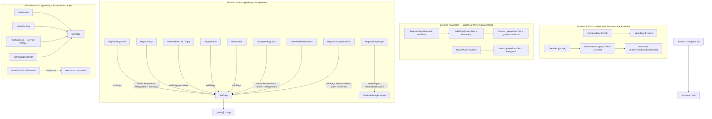
```mermaid
graph TD
    A[Awake — Singleton Init] --> B[Instance = this]

    subgraph "Système RNG — configuré par SessionManager.Awake"
        R1["SetRoundSeed(seed)"] --> R2["_roundSeed = seed"]
        R3["CreateRng(scope)"] --> R4["DeriveSeed(scope) — FNV-1a 64-bit"]
        R4 --> R5["return new System.Random(derivedSeed)"]
    end

    subgraph "Système PlayerStart — appelé par PlayerSpawner.Start"
        P1["RegisterPlayerStart(cell, worldPos)"] --> P2["AddFlags(PlayerStart + Reserved)"]
        P2 --> P3["Stocker _playerStartCell + _playerStartWorld"]
        P4["TryGetPlayerStartCell"] --> P5["return _playerStartCell si enregistré"]
    end

    subgraph "API d'écriture — appelée par les spawners"
        C1[RegisterBugCloud] -->|AddFlags| D[SetFlags]
        C2[RegisterTrap] -->|"Vérifie !Reserved + !PlayerStart + !HasTrap"| D
        C3[ReservePathLeft / Right] -->|AddFlags par cellule| D
        C4[RegisterWall] -->|AddFlags| D
        C5[MarkVisited] -->|AddFlags| D
        C6[UnregisterBugCloud] -->|"Retire Reserved si ni chemin ni PlayerStart"| D
        C7[ClearPathReservations] --> D
        C8[RegisterStepBudget] -->|"stepBudget = manhattanDistance"| C9["Stocke le budget de pas"]
        C10[RegisterSuboptimalPath] -->|"AddFlags SuboptimalPath (sans Reserved)"| D
    end

    D --> E["_cells[c] = flags"]

    subgraph "API de lecture — appelée par les systèmes de jeu"
        L1[IsWalkable] --> L0[GetFlags]
        L2[IsFreeForTrap] --> L0
        L3[HasBugCloud / HasTrap / IsWall...] --> L0
        L3b[IsOnSuboptimalPath] --> L0
        L4[WorldToCell / CellToWorld] -.->|Conversion| L5[Retourne coordonnée]
    end
```

### 4.1.5 Approche retenue & alternatives évaluées

**Pattern retenu :** Singleton + Dictionary bitwise flags + RNG déterministe par scope

| Approche                                   | Avantages                                                                     | Inconvénients                                                       |
| :----------------------------------------- | :---------------------------------------------------------------------------- | :------------------------------------------------------------------ |
| ✅ **Singleton + Dictionary\<CellFlags\>** | Accès global simple, combinaison d'états par bitwise, allocation à la demande | Non testable unitairement, état mutable global                      |
| Tableau 2D `CellFlags[,]`                  | Accès O(1) sans hash, mémoire prévisible                                      | Alloue toute la grille même si peu de cellules sont utilisées       |
| ECS (Entity Component System)              | Scalable, parallélisable, data-oriented                                       | Sur-ingénierie massive pour une grille 10×10, complexité Unity DOTS |

| Approche RNG                         | Avantages                                                         | Inconvénients                                                        |
| :----------------------------------- | :---------------------------------------------------------------- | :------------------------------------------------------------------- |
| ✅ **FNV-1a 64-bit + scope string**  | Reproductible, chaque système a son propre stream, cross-platform | Dépend de System.Random (pas crypto-safe, non requis ici)            |
| UnityEngine.Random                   | API simple, intégré Unity                                         | État global partagé, non reproductible entre systèmes                |
| Seed par composant (champ Inspector) | Isolation totale                                                  | Pas de seed globale, chaque système doit être configuré manuellement |

### 4.1.6 Points d'attention

- **⚠️ Edge case :** `UnregisterBugCloud` ne retire `Reserved` que si la cellule n'appartient à aucun chemin ET n'est pas `PlayerStart` — logique couplée entre entités
- **⚠️ Edge case :** `RegisterTrap` refuse la cellule de départ du joueur (`PlayerStart` flag), même si elle n'est pas réservée par un chemin
- **⚠️ Ordre d'exécution :** `LevelRegistry` doit s'initialiser avant tous les autres systèmes (`-300`). Si un spawner appelle `Instance` dans son `Awake` avec un ordre ≤ -300, NullRef possible
- **⚠️ RNG auto-seed :** Si `CreateRng()` est appelé sans `SetRoundSeed()` préalable, une seed est générée automatiquement (DateTime + Guid) — le run ne sera pas reproductible
- **⚠️ Thread safety :** `_cells` Dictionary non thread-safe — pas de problème en single-threaded Unity, mais à surveiller si des Jobs sont introduits

### 4.1.7 Journal d'implémentation

| Date     | Développeur | Note / Décision Technique                                                                                                                                                                                                                                                                                                  |
| :------- | :---------- | :------------------------------------------------------------------------------------------------------------------------------------------------------------------------------------------------------------------------------------------------------------------------------------------------------------------------- |
| 17/02/26 | @auteur     | Documentation initiale du système. LevelRegistry stable — source de vérité grille avec CellFlags bitwise.                                                                                                                                                                                                                  |
| 27/02/26 | @pierre     | Refacto : ajout CellFlag PlayerStart, système RNG (FNV-1a + CreateRng/DeriveSeed), système PlayerStart (RegisterPlayerStart/TryGetPlayerStartCell), suppression OnCellChanged, ajout trapCount [HideInInspector].                                                                                                          |
| 02/03/26 | @pierre     | Ajout de 9 champs [HideInInspector] pour les paramètres recherche (minDistance, totalBugs, greenRatio, gap, pathVisible, blockId). Pipeline Research Parameter complété.                                                                                                                                                   |
| 02/03/26 | @pierre     | Refacto SRP : suppression des 11 champs [HideInInspector] de paramètres recherche. LevelRegistry ne sert plus de relais — les spawners lisent directement `SessionManager.Instance`. LevelRegistry recentré sur son rôle unique : état spatial de la grille + RNG.                                                         |
| 02/03/26 | @pierre     | Ajout champ `stepBudget` [HideInInspector] et méthode `RegisterStepBudget(int)`. Stocke la distance Manhattan joueur→nuages comme budget de pas pour la mécanique de pénalité de dépassement.                                                                                                                              |
| 09/03/26 | @auteur     | Feature suboptimal path : ajout `CellFlags.SuboptimalPath` (1 << 8), `RegisterSuboptimalPath(IEnumerable<Vector2Int>)` marque les cellules **sans** Reserved (pièges possibles), `IsOnSuboptimalPath(Vector2Int)` helper de lecture. Utilisé par PathSpawner (écriture) et CorridorWallsGenerator (lecture pour walkable). |

## 4.2 GameManager

### 4.2.1 Responsabilités

- Suivre l'état du round en cours (steps, trapsHit, bugsCollected, followedAdvisorPath)
- Gérer le cycle de vie des rounds (démarrage, fin de manche sur collecte de nuage)
- Enregistrer les deux nuages du round et déterminer le nuage optimal
- Orchestrer les callbacks d'entités : `OnPlayerStep` (GridMover), `OnTrapTriggered` (Trap), `OnCloudCollected` (BugCloud), `OnInvalidMoveKeyPressed` (GridMover)
- À chaque pas joueur : révéler le brouillard, marquer la cellule visitée, vérifier l'adhérence au chemin conseillé, vérifier le dépassement du budget de pas, enregistrer dans le trial
- Appliquer les pénalités de pièges sur les nuages (-1 bug vert par nuage par piège)
- Appliquer la pénalité de dépassement du budget de pas (-1 bug vert par nuage par pas en trop)
- **Appliquer la pénalité de touche invalide** (-1 bug vert par nuage par appui non valide)
- Émettre `OnRoundEnded` pour l'UI (RoundUI) — **pas de référence UI directe**
- **Déléguer la transition post-round** à `FlowController.OnTrialComplete(score)` via `ContinueAfterRound()` — fallback `RestartRound()` si FlowController absent (mode debug)
- Coordonner avec TrialManager pour la collecte de données de recherche (transmettre `cloud_distance` via `SetCloudDistance`)

### 4.2.2 Composants clés (Data Model)

→ **GameManager.cs** : Singleton MonoBehaviour orchestrant l'état du jeu et le cycle de vie des rounds. Ordre d'exécution : `0` (défaut).

```csharp
public class GameManager : MonoBehaviour
{
    public static GameManager Instance { get; private set; }

    [Header("Références")]
    public TrialManager trialManager;

    [Header("Round / Score")]
    public int steps;
    public int trapsHit;
    public int overtimeSteps;
    public int bugsCollected;
    public bool followedAdvisorPath = true;

    bool _roundOver;
    bool _pathIsSuboptimal;
    bool _advisorPathVisible = true;

    public bool inputLocked { get; private set; }

    BugCloud _leftCloud, _rightCloud;
    readonly HashSet<Vector2Int> _advisorPath = new();

    [Serializable]
    public struct RoundEndInfo
    {
        public int bugsCollected;
        public int trapsHit;
        public int overtimeSteps;
        public int steps;
        public bool followedAdvisorPath;
        public int leftCloudGreenBugs;
        public int rightCloudGreenBugs;
        public bool optimalPathVisible;
    }

    public event Action<RoundEndInfo> OnRoundEnded;
}
```

| Variable / Méthode                       | Type                         | Description                                                                                                                                                                                                                                   |
| :--------------------------------------- | :--------------------------- | :-------------------------------------------------------------------------------------------------------------------------------------------------------------------------------------------------------------------------------------------- |
| Instance                                 | GameManager                  | Référence statique globale (Singleton)                                                                                                                                                                                                        |
| trialManager                             | TrialManager                 | Référence au TrialManager pour l'envoi des données de recherche                                                                                                                                                                               |
| steps / trapsHit / bugsCollected         | int                          | Compteurs du round courant                                                                                                                                                                                                                    |
| overtimeSteps                            | int                          | Compteur de pas au-delà du budget (distance Manhattan)                                                                                                                                                                                        |
| followedAdvisorPath                      | bool                         | `true` tant que le joueur reste sur le chemin conseillé                                                                                                                                                                                       |
| \_pathIsSuboptimal                       | bool (privé)                 | `true` si le chemin affiché est suboptimal (reçu de PathSpawner via `SetPathIsSuboptimal`)                                                                                                                                                    |
| \_proximalAdviceReliable                 | bool (privé)                 | `true` si le chemin conseillé désignait le meilleur nuage (reçu de PathSpawner via `SetProximalAdviceReliable`)                                                                                                                               |
| **\_advisorPathVisible**                 | bool (privé)                 | `true` par défaut — mis à jour via `SetAdvisorPathVisible(bool)` par PathSpawner                                                                                                                                                              |
| inputLocked                              | bool (get)                   | Verrouille les inputs joueur quand `true` (fin de round)                                                                                                                                                                                      |
| \_roundOver                              | bool (privé)                 | Empêche les callbacks d'entités après fin de round                                                                                                                                                                                            |
| \_advisorPath                            | HashSet (privé)              | Cellules du chemin conseillé (reçu de PathSpawner)                                                                                                                                                                                            |
| RoundEndInfo                             | struct                       | Données transmises via OnRoundEnded (bugs, traps, overtimeSteps, steps, chemin conseillé, bugs L/R, optimalPathVisible)                                                                                                                       |
| OnRoundEnded                             | event Action\<RoundEndInfo\> | Émis à la fin du round — RoundUI s'y abonne                                                                                                                                                                                                   |
| BeginFirstRound()                        | void                         | Point d'entrée appelé par SessionManager — appelle `trialManager.StartNewTrial()`                                                                                                                                                             |
| **ContinueAfterRound()**                 | void                         | Délègue au `FlowController.OnTrialComplete(bugsCollected)` ; fallback `RestartRound()` si FlowController absent                                                                                                                               |
| RegisterClouds(BugCloud, BugCloud)       | void                         | Enregistre les 2 nuages, transmet la config map (positions, totalBugs, greenRatio) à TrialManager via `SetMapConfig`                                                                                                                          |
| SetChosenPath(IEnumerable\<Vector2Int\>) | void                         | Reçoit le chemin conseillé de PathSpawner pour détecter les déviations                                                                                                                                                                        |
| **SetAdvisorPathVisible(bool)**          | void                         | Reçoit de PathSpawner si le chemin conseillé est visible — stocke dans `_advisorPathVisible`                                                                                                                                                  |
| SetPathIsSuboptimal(bool)                | void                         | Reçoit de PathSpawner si le chemin affiché est suboptimal — stocke dans `_pathIsSuboptimal`                                                                                                                                                   |
| SetProximalAdviceReliable(bool)          | void                         | Reçoit de PathSpawner si le chemin conseillé désignait le meilleur nuage — stocke dans `_proximalAdviceReliable`                                                                                                                              |
| OnPlayerStep(Vector2Int)                 | void                         | Appelé par GridMover — fog, visited, déviation, budget de pas, trial log                                                                                                                                                                      |
| OnTrapTriggered()                        | void                         | Appelé par Trap — trapsHit++, **-1 bug vert** sur chaque nuage                                                                                                                                                                                |
| OnInvalidMoveKeyPressed()                | void                         | Appelé par GridMover — pénalité : **-1 bug vert** sur chaque nuage                                                                                                                                                                            |
| OnStepBudgetExceeded()                   | void (privé)                 | Appelé quand le joueur dépasse le budget de pas — overtimeSteps++, **-1 bug vert** sur chaque nuage                                                                                                                                           |
| OnCloudCollected(BugCloud)               | void                         | Fin de round — `FogController.RevealAll()`, calcule bugs verts, détermine trueCloud, transmet cloud_distance, finalise trial (10 params dont overtimeSteps, followedAdvisorPath, \_advisorPathVisible, \_pathIsSuboptimal), émet OnRoundEnded |
| GetBestCloud()                           | BugCloud                     | Retourne le nuage ayant le plus de `greenBugs`. ⚠️ Comparaison stricte `>` : **à égalité, retourne toujours le nuage de droite**, jamais `null`                                                                                               |
| RestartRound()                           | void                         | Recharge la scène active (mode debug, fallback si FlowController absent)                                                                                                                                                                      |

### 4.2.3 Dépendances

- **Nécessite :** `LevelRegistry.Instance` (MarkVisited, optimalPathLength, stepBudget), `FogController.Instance` (RevealCell, **RevealAll**), `TrialManager` (StartNewTrial, RecordMove, SetMapConfig, SetOptimalPathLength, SetCloudDistance, EndCurrentTrial), `FlowController.Instance` (OnTrialComplete — pour ContinueAfterRound), `BugCloud` (nuages du round), `PathSpawner` (chemin conseillé)
- **Est utilisé par :** `SessionManager` (lance `BeginFirstRound()`), `GridMover` (appelle `OnPlayerStep()`, `OnInvalidMoveKeyPressed()`), `BugCloud` (appelle `OnCloudCollected()`), `Trap` (appelle `OnTrapTriggered()`), `PathSpawner` (appelle `SetChosenPath()`, `SetPathIsSuboptimal()`, `SetProximalAdviceReliable()`, `SetAdvisorPathVisible()`), `RoundUI` (appelle `ContinueAfterRound()`)
- **Communique avec l'UI via :** `event OnRoundEnded` → `RoundUI` (pas de références UI directes)
- **Communique avec l'UI via :** `event OnRoundEnded` → `RoundUI` (pas de références UI directes)

### 4.2.4 Diagramme de flux


```mermaid
graph TD
    A[SessionManager.BeginFirstRound] --> B["trialManager.StartNewTrial()"]

    subgraph "Phase Setup — appelé par les spawners"
        D[BugCloudSpawner] -->|RegisterClouds| E[Trie leftCloud / rightCloud par position X]
        E --> F["TrialManager.SetMapConfig(gridSize, leftCell, leftBugs, leftGreenRatio, rightCell, rightBugs, rightGreenRatio)"]
        G[PathSpawner] -->|SetChosenPath| H[Remplit _advisorPath HashSet]
        G -->|SetAdvisorPathVisible| H2["_advisorPathVisible = isVisible"]
        G -->|SetPathIsSuboptimal| H3["_pathIsSuboptimal = isSuboptimal"]
    end

    subgraph "Phase Gameplay — OnPlayerStep(cell) via GridMover"
        I[GridMover] -->|OnPlayerStep| I1{_roundOver ?}
        I1 -->|Oui| I2[return]
        I1 -->|Non| J["steps++"]
        J --> J0["LevelRegistry.MarkVisited(cell)"]
        J0 --> J1["FogController.RevealCell(cell)"]
        J1 --> J2{Cell dans _advisorPath ?}
        J2 -->|Non| K[followedAdvisorPath = false]
        J2 -->|Oui| L[Continue]
        K --> M["TrialManager.RecordMove(cell)"]
        L --> M
        M --> M1{"movesMade > stepBudget ?"}
        M1 -->|Oui| M2["OnStepBudgetExceeded()"]
        M1 -->|Non| M3[Continue]
    end

    subgraph "OnStepBudgetExceeded — pénalité de dépassement"
        SB1["overtimeSteps++"] --> SB2["leftCloud.AddBugs(-1)"]
        SB2 --> SB3["rightCloud.AddBugs(-1)"]
    end

    subgraph "OnTrapTriggered — via Trap.OnTriggerEnter"
        T0[Trap] -->|OnTrapTriggered| T1{_roundOver ?}
        T1 -->|Oui| T2[return]
        T1 -->|Non| T3["trapsHit++"]
        T3 --> T4["leftCloud.AddBugs(-1)"]
        T4 --> T5["rightCloud.AddBugs(-1)"]
    end

    subgraph "OnInvalidMoveKeyPressed — via GridMover"
        IK0[GridMover] -->|OnInvalidMoveKeyPressed| IK1{_roundOver ?}
        IK1 -->|Oui| IK2[return]
        IK1 -->|Non| IK3["leftCloud.AddBugs(-1)"]
        IK3 --> IK4["rightCloud.AddBugs(-1)"]
    end

    subgraph "Phase Fin de Round — OnCloudCollected via BugCloud"
        P[BugCloud.OnTrigger] -->|OnCloudCollected| Q["_roundOver = true, inputLocked = true"]
        Q --> Q1["FogController.RevealAll()"]
        Q1 --> R["bugsCollected = cloud.greenBugs (compteur vivant, déjà amputé des pénalités)"]
        R --> R1["trueCloud = best == leftCloud ? 'left' : best == rightCloud ? 'right' : 'none'"]
        R1 --> R1b["TrialManager.SetOptimalPathLength + SetCloudDistance"]
        R1b --> S["TrialManager.EndCurrentTrial(choice, correct, trueCloud, bugsCollected, trapsHit, steps, overtimeSteps, followedAdvisorPath, _advisorPathVisible, _pathIsSuboptimal)"]
        S --> U["OnRoundEnded?.Invoke(RoundEndInfo)"]
    end

    U -.->|RoundUI écoute| V["Afficher panneau game over"]
    V -.->|Bouton Continuer| W["ContinueAfterRound()"]
    W --> W1{FlowController.Instance != null ?}
    W1 -->|Oui| W2["FlowController.OnTrialComplete(bugsCollected)"]
    W1 -->|Non| W3["RestartRound() — SceneManager.LoadScene"]
```

### 4.2.5 Formules et règles métier

```
Pénalité piège    = -1 bug VERT dans CHAQUE nuage (leftCloud + rightCloud) par piège déclenché
Pénalité budget   = -1 bug VERT dans CHAQUE nuage (leftCloud + rightCloud) par pas au-delà du budget
Pénalité invalide = -1 bug VERT dans CHAQUE nuage (leftCloud + rightCloud) par appui de touche non active
                    Seuls les bugs VERTS sont retirés, jamais les rouges, jamais sous zéro (BugCloud.AddBugs).
                    totalBugs et greenBugs décroissent ensemble ; le champ greenRatio, lui, n'est PAS recalculé.
Budget de pas     = LevelRegistry.stepBudget (= distance Manhattan joueur→nuages, enregistré par BugCloudSpawner)
movesMade         = steps - 1 (le premier step est le déplacement initial, pas un dépassement)
overtimeSteps     = nombre de pas où movesMade > stepBudget
Bugs collectés    = cloud.greenBugs au moment de la collecte (compteur vivant, déjà amputé des pénalités)
Meilleur nuage    = celui avec le plus de greenBugs (GameManager.GetBestCloud)
                    ⚠️ Comparaison stricte `>` : à ÉGALITÉ, c'est TOUJOURS le nuage de droite qui est
                    retourné — jamais null. Voir point d'attention ci-dessous.
Choix correct     = le joueur a collecté ce nuage-là
trueCloud         = "left" si best == leftCloud, "right" si best == rightCloud, "none" si égalité
followedAdvisorPath = true tant que TOUS les pas du joueur sont dans _advisorPath
Fog + Visited     = gérés par OnPlayerStep (pas par GridMover)
RevealAll         = appelé dans OnCloudCollected pour révéler toute la carte à la fin du round
Accumulated score = FlowController.GetAccumulatedScoreAfterTrial(trialScore) — géré côté TrialManager, pas GameManager
```

### 4.2.6 Points d'attention

- **⚠️ Séparation UI :** GameManager n'a AUCUNE référence UI directe — il émet `OnRoundEnded` et RoundUI s'y abonne. C'est un design « manager émet, UI écoute »
- **⚠️ Edge case greenRatio :** Si `leftCloud.greenRatio == rightCloud.greenRatio` (Approximately), `GetBestCloud()` retourne `null` et `choice_correct` sera toujours `false`
- **⚠️ Fog centralisé :** La révélation du brouillard et le marquage visited sont faits dans `OnPlayerStep()`, pas dans GridMover — un seul point de vérité. `RevealAll()` est appelé une fois en fin de round.
- **⚠️ Budget de pas :** La vérification du dépassement utilise `steps - 1` car le premier step est l'arrivée sur la première case. Si `stepBudget == 0` (non initialisé), la pénalité ne s'applique pas
- **⚠️ Séquencement :** `RegisterClouds` peut être appelé avant `StartNewTrial` (BugCloudSpawner Start -200 vs GameManager Start 0). Le tampon `pendingMapConfigJson` dans TrialManager gère ce cas
- **⚠️ ContinueAfterRound :** Vérifie `_roundOver` avant d'agir — empêche les appels prématurés. Délègue à FlowController si présent, sinon fallback `RestartRound()` (mode debug sans flow)
- **⚠️ Pénalités uniformes :** Toutes les pénalités (piège, budget, touche invalide) sont **-1 bug vert** sur chaque nuage — pas de différenciation entre types de pénalité. Conforme au GDD (« when a trap is hit both clouds loose 1 green bug »), sign-off chercheur en attente (Q-007)
- **⚠️ Départage à égalité :** `GetBestCloud()` utilise `_leftCloud.greenBugs > _rightCloud.greenBugs`. Si les deux nuages ont exactement le même nombre de bugs verts, **le nuage de droite est déclaré « correct » par construction**, sans tirage. Les pénalités étant appliquées symétriquement aux deux nuages, une égalité initiale reste une égalité. **Le cas est atteignable** : les pénalités s'arrêtent à zéro, donc dès que les deux nuages sont vidés ils sont à égalité et la droite l'emporte. Avec les défauts (`total = 20`, ratio 0.5 → 10 verts ; `trap_count = 10`), un participant en difficulté y arrive. Le biais se concentre sur les trials les moins bien joués. Arbitrage chercheur ouvert : **Q-TIE-1**

### 4.2.7 Journal d'implémentation

| Date     | Développeur | Note / Décision Technique                                                                                                                                                                                                                                                                                                                                                                                                                                                                                                                                                                                                                                                                                                                                                                                                                                                                                                                                  |
| :------- | :---------- | :--------------------------------------------------------------------------------------------------------------------------------------------------------------------------------------------------------------------------------------------------------------------------------------------------------------------------------------------------------------------------------------------------------------------------------------------------------------------------------------------------------------------------------------------------------------------------------------------------------------------------------------------------------------------------------------------------------------------------------------------------------------------------------------------------------------------------------------------------------------------------------------------------------------------------------------------------------- |
| 17/02/26 | @auteur     | Documentation initiale. GameManager stable — gestion complète du cycle de round avec intégration TrialManager.                                                                                                                                                                                                                                                                                                                                                                                                                                                                                                                                                                                                                                                                                                                                                                                                                                             |
| 27/02/26 | @pierre     | Refacto : suppression champs UI (scoreText, gameOverUI, gameOverStats), ajout event OnRoundEnded + RoundEndInfo, ajout OnTrapTriggered, fog+visited centralisés dans OnPlayerStep, SetMapConfig structuré (plus de JSON brut dans GameManager), StartNewTrial passe la seed, suppression DTOs MiniMapCfg/CloudInfo (déplacés dans TrialManager).                                                                                                                                                                                                                                                                                                                                                                                                                                                                                                                                                                                                           |
| 02/03/26 | @pierre     | Migration blockId : GameManager ne possède plus de champ blockId — lit désormais `SessionManager.Instance.blockId` en inline (fallback : 1 si Instance null). Suppression du commentaire blockId dans le code.                                                                                                                                                                                                                                                                                                                                                                                                                                                                                                                                                                                                                                                                                                                                             |
| 02/03/26 | @pierre     | Pipeline collecte enrichi : `OnCloudCollected` calcule désormais les bugs verts (totalBugs × greenRatio), détermine `trueCloud` (left/right/none), et transmet 6 params à `EndCurrentTrial` (choice, correct, trueCloud, greenBugsCollected, trapsHit, steps). `RegisterClouds` passe `greenRatio` à `SetMapConfig`. `GetBestCloud` compare `greenRatio` (pas totalBugs).                                                                                                                                                                                                                                                                                                                                                                                                                                                                                                                                                                                  |
| 02/03/26 | @pierre     | Mécanique Step Budget Penalty : ajout `overtimeSteps`, `OnStepBudgetExceeded()`, vérification budget dans `OnPlayerStep`. `OnCloudCollected` transmet `cloud_distance` via `TrialManager.SetCloudDistance`. `RoundEndInfo` inclut `overtimeSteps`.                                                                                                                                                                                                                                                                                                                                                                                                                                                                                                                                                                                                                                                                                                         |
| 02/03/26 | @auteur     | `pathVisible` passe de bool à float (probabilité). `OnCloudCollected` détermine `optimalPathVisible` par tirage `rng.NextDouble() < pathVisible` et le transmet à `EndCurrentTrial` (7 params). `RoundEndInfo` ajoute `optimalPathVisible`.                                                                                                                                                                                                                                                                                                                                                                                                                                                                                                                                                                                                                                                                                                                |
| 09/03/26 | @auteur     | Feature suboptimal path : renommage `followedBestPath` → `followedAdvisorPath` partout. Ajout `_pathIsSuboptimal` (bool privé) + `SetPathIsSuboptimal(bool)` (appelé par PathSpawner). `RoundEndInfo` utilise `followedAdvisorPath`. `EndCurrentTrial` passe désormais 8 params (ajout `_pathIsSuboptimal`).                                                                                                                                                                                                                                                                                                                                                                                                                                                                                                                                                                                                                                               |
| 12/03/26 | @auteur     | Pénalité touche invalide : ajout `OnInvalidMoveKeyPressed()` — appelé par GridMover quand une touche hors du set actif est pressée. Applique -2 bugs sur chaque nuage (pénalité renforcée vs piège -1). Guard `_roundOver`.                                                                                                                                                                                                                                                                                                                                                                                                                                                                                                                                                                                                                                                                                                                                |
| 23/03/26 | @pierre     | Intégration FlowController : suppression `_screenCounter`, suppression `StartNewRound`, `BeginFirstRound` appelle directement `trialManager.StartNewTrial()`. Ajout `ContinueAfterRound()` (délègue à FlowController.OnTrialComplete ou fallback RestartRound). Ajout `SetAdvisorPathVisible(bool)` + `_advisorPathVisible`. `OnCloudCollected` appelle `FogController.RevealAll()`, n'utilise plus de tirage probabiliste pour optimalPathVisible (utilise `_advisorPathVisible` directement). `EndCurrentTrial` passe 10 params (ajout overtimeSteps, followedAdvisorPath). Toutes les pénalités uniformisées à -2 (piège et budget étaient -1).                                                                                                                                                                                                                                                                                                         |
| 28/07/26 | @florian    | **Correction documentaire — aucune modification de code.** Revue de complétude (`Docs/project-state/revue-completude-2026-07-28.md`) : les 18 mentions d'une pénalité de **-2 bugs** ne correspondaient plus au code. Le barème réel est **-1 bug vert** par nuage pour les trois pénalités (piège, dépassement de budget, touche invalide), retiré des verts uniquement et jamais sous zéro (`GameManager.cs:256-257,268-269,285-286` + `BugCloud.AddBugs`) — conforme au GDD, sign-off chercheur en attente (Q-007). L'entrée du 23/03/26 ci-dessus est conservée telle quelle : elle décrit un état intermédiaire depuis révisé. Corrigé aussi : `GetBestCloud()` compare `greenBugs` et non `greenRatio`, et **ne retourne jamais `null`** — à égalité, la comparaison stricte `>` désigne toujours le nuage de droite (nouveau point d'attention §4.2.6) ; `bugsCollected` vaut `cloud.greenBugs` et non `totalBugs × greenRatio` (§4.2.4 et §4.2.5). |

## 4.3 SessionManager

### 4.3.1 Responsabilités

- **Singleton** (`SessionManager.Instance`) — façade locale du ProximalScene pour la config du trial courant
- Exposer aux spawners la configuration du trial via les champs `public` lus directement (`SessionManager.Instance.paramName`)
- **Copier la config depuis FlowController** (`CopyConfigFromFlowController()`) si présent — mappe `MapGenConfig` → champs locaux
- Gérer la seed de randomisation pour le trial (copie depuis FlowController ou génération locale)
- Écrire la seed dans `LevelRegistry.SetRoundSeed()` pour que tous les spawners l'utilisent
- Déclencher le début du jeu via `GameManager.BeginFirstRound()` après un frame de délai
- **Si FlowController absent** : conserve les valeurs Inspector (mode debug standalone)

### 4.3.2 Composants clés (Data Model)

→ **SessionManager.cs** : Singleton MonoBehaviour, façade de configuration du ProximalScene. Ordre d'exécution : `0` (défaut). Awake initialise le Singleton, copie la config depuis FlowController si disponible, puis applique la seed. Start est une coroutine qui lance le jeu après un frame.

> **Note architecture :** SessionManager ne fait plus de parsing CLI. La configuration vient de FlowController (qui la récupère du backend via ApiClient). SessionManager reste le point de lecture direct pour les spawners (pattern Singleton identique à v2.9), mais la source de vérité est désormais FlowController → SessionManager → Spawners.

```csharp
public class SessionManager : MonoBehaviour
{
    public static SessionManager Instance { get; private set; }

    [Header("Références")]
    public TrialManager trialManager;
    public GameManager gameManager;

    [Header("Session")]
    public long randomizationSeed;
    public string buildVersion = "1.0.0";

    [Header("Recherche : Map")]
    public int trapCount = 10;
    public int minDistance = 3;
    public int maxDistance;

    [Header("Recherche : Discrimination")]
    public int minTotalBugs = 20;
    public int maxTotalBugs = 80;
    public float minGreenBugsRatio = 0.4f;
    public float maxGreenBugsRatio = 0.8f;
    public float gapMin = 0.1f;
    public float gapMax = 0.3f;

    [Header("Recherche : Advisor")]
    public float pathVisible = 1f;
    [Range(0f, 1f)] public float suboptimalPathProbability;
    [Range(0f, 1f)] public float detourProbability;
    [Range(0f, 1f)] public float motorAdviceVisibleProbability = 1f;
    [Range(0f, 1f)] public float motorAdviceReliableProbability = 1f;
    [Range(0f, 1f)] public float suboptimalTrapProbability;
    [Min(0)] public int minSuboptimalTraps = 1;
    [Min(0)] public int maxSuboptimalTraps = 3;

    [Header("Recherche : Fog of War")]
    [Range(0f, 1f)] public float fogProbability;

    [Header("Recherche : Protocole")]
    public int blockId = 1;

    public bool IsFlowDriven { get; private set; }
    public bool IsTutorialBlock { get; private set; }
}
```

| Variable / Méthode                                                                                           | Type           | Description                                                                                                                                                           |
| :----------------------------------------------------------------------------------------------------------- | :------------- | :-------------------------------------------------------------------------------------------------------------------------------------------------------------------- |
| Instance                                                                                                     | SessionManager | Référence statique globale (Singleton)                                                                                                                                |
| trialManager                                                                                                 | TrialManager   | Référence (conservée dans l'Inspector, utilisée par TrialManager.BuildBaseRow)                                                                                        |
| gameManager                                                                                                  | GameManager    | Référence pour déclencher `BeginFirstRound()`                                                                                                                         |
| randomizationSeed                                                                                            | long           | Seed de randomisation — copiée depuis FlowController ou générée localement                                                                                            |
| buildVersion                                                                                                 | string         | Version du build — copiée depuis FlowController.BuildVersion si disponible                                                                                            |
| **IsFlowDriven**                                                                                             | bool (get)     | `true` si la config a été copiée avec succès depuis FlowController                                                                                                    |
| **IsTutorialBlock**                                                                                          | bool (get)     | `true` si le bloc courant est un tutorial (lu depuis FlowController.IsCurrentBlockTutorial)                                                                           |
| **Paramètres recherche** _(champs `public`, lus directement par les spawners via `SessionManager.Instance`)_ |                |                                                                                                                                                                       |
| trapCount                                                                                                    | int            | Nombre de pièges (défaut : 10)                                                                                                                                        |
| minDistance / maxDistance                                                                                    | int            | Distance Manhattan min/max joueur↔nuages                                                                                                                              |
| minTotalBugs / maxTotalBugs                                                                                  | int            | Range du nombre total de bugs (défaut : 20-80)                                                                                                                        |
| minGreenBugsRatio / maxGreenBugsRatio                                                                        | float          | Bornes ratio vert (défaut : 0.4-0.8)                                                                                                                                  |
| gapMin / gapMax                                                                                              | float          | Écart min/max entre ratios verts (défaut : 0.1-0.3)                                                                                                                   |
| pathVisible                                                                                                  | float          | Probabilité d'affichage du chemin conseillé (défaut : 1.0)                                                                                                            |
| suboptimalPathProbability                                                                                    | float          | Probabilité chemin suboptimal (défaut : 0.0)                                                                                                                          |
| detourProbability                                                                                            | float          | Probabilité détour en « Z » (défaut : 0.0)                                                                                                                            |
| motorAdviceVisibleProbability                                                                                | float          | Probabilité affichage motor advice (défaut : 1.0)                                                                                                                     |
| motorAdviceReliableProbability                                                                               | float          | Probabilité fiabilité motor advice (défaut : 1.0)                                                                                                                     |
| suboptimalTrapProbability                                                                                    | float          | Probabilité pièges sur chemin suboptimal (défaut : 0.0)                                                                                                               |
| minSuboptimalTraps / maxSuboptimalTraps                                                                      | int            | Range pièges suboptimaux (défaut : 1-3)                                                                                                                               |
| fogProbability                                                                                               | float          | Probabilité brouillard de guerre (défaut : 0.0)                                                                                                                       |
| blockId                                                                                                      | int            | Index du bloc courant (1-based, défaut : 1)                                                                                                                           |
| **Méthodes**                                                                                                 |                |                                                                                                                                                                       |
| Awake()                                                                                                      | void           | Singleton init → `CopyConfigFromFlowController()` → `ApplySeedForThisTrial()`                                                                                         |
| Start()                                                                                                      | IEnumerator    | Coroutine : `yield return null` → `gameManager.BeginFirstRound()`                                                                                                     |
| CopyConfigFromFlowController()                                                                               | bool (privé)   | Lit FlowController.ActiveMapConfig et copie tous les champs MapGenConfig + blockId + IsTutorialBlock. Retourne `false` si FlowController absent ou config non chargée |
| ApplySeedForThisTrial()                                                                                      | void (privé)   | Si seed == 0 : génère depuis DateTime+Guid. Écrit dans LevelRegistry.SetRoundSeed()                                                                                   |
| GenerateSeed()                                                                                               | long (static)  | `(DateTime.UtcNow.Ticks << 1) ^ Guid.NewGuid().GetHashCode()` (unchecked)                                                                                             |

### 4.3.3 Dépendances

- **Nécessite :** `FlowController.Instance` (ActiveMapConfig, CurrentTrialSeed, BuildVersion, State.current_block_index, IsCurrentBlockTutorial, HasLoadedConfig), `LevelRegistry.Instance` (SetRoundSeed), `GameManager` (appelle `BeginFirstRound()`)
- **Est utilisé par :** `BugCloudSpawner` (lecture directe : minDistance, maxDistance, minTotalBugs, maxTotalBugs, minGreenBugsRatio, maxGreenBugsRatio, gapMin, gapMax), `TrapSpawner` (lecture directe : trapCount, suboptimalTrapProbability, minSuboptimalTraps, maxSuboptimalTraps), `PathSpawner` (lecture directe : pathVisible, proximalAdviceReliableProbability, suboptimalPathProbability, detourProbability), `FogSpawner` (lecture directe : fogProbability), `TrialManager` (lecture directe dans BuildBaseRow : tous les paramètres recherche), `MotorAdviceController` (lecture directe : motorAdviceVisibleProbability, motorAdviceReliableProbability)
- **Pattern :** Backend Config Pipeline — FlowController.ActiveMapConfig → SessionManager.CopyConfigFromFlowController() → Spawners `.Start()` (lecture directe)

### 4.3.4 Diagramme de flux

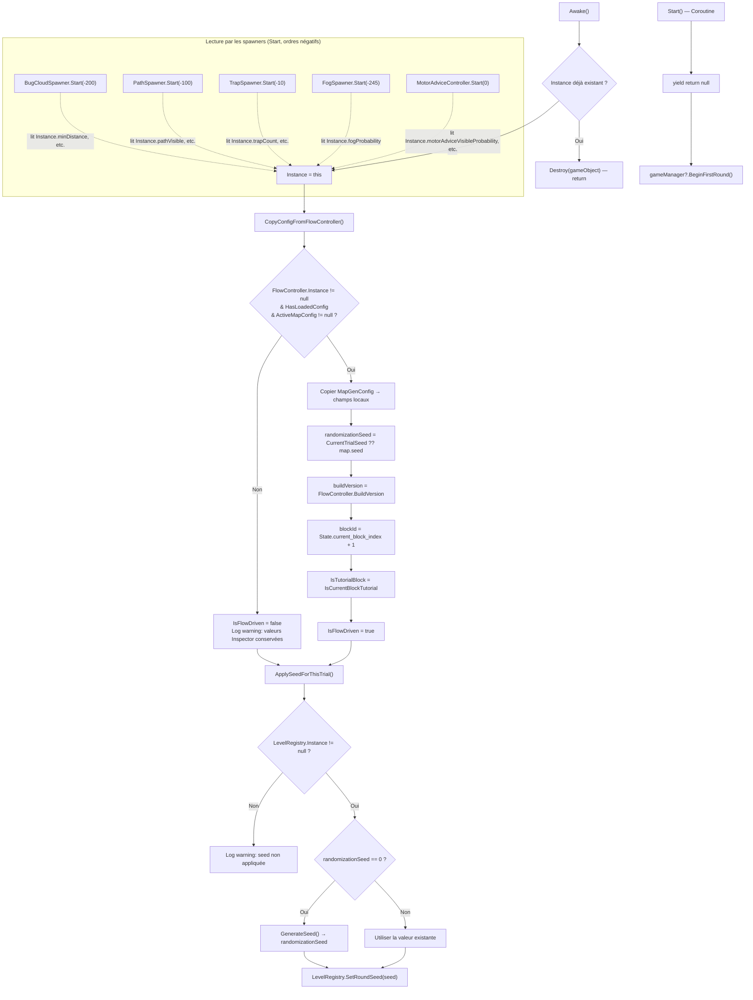
```mermaid
graph TD
    A["Awake()"] --> A0{"Instance déjà existant ?"}
    A0 -->|Oui| A1["Destroy(gameObject) — return"]
    A0 -->|Non| A2["Instance = this"]
    A2 --> B["CopyConfigFromFlowController()"]
    B --> B0{"FlowController.Instance != null<br/>& HasLoadedConfig<br/>& ActiveMapConfig != null ?"}
    B0 -->|Non| B1["IsFlowDriven = false<br/>Log warning: valeurs Inspector conservées"]
    B0 -->|Oui| B2["Copier MapGenConfig → champs locaux"]
    B2 --> B3["randomizationSeed = CurrentTrialSeed ?? map.seed"]
    B3 --> B4["buildVersion = FlowController.BuildVersion"]
    B4 --> B5["blockId = State.current_block_index + 1"]
    B5 --> B6["IsTutorialBlock = IsCurrentBlockTutorial"]
    B6 --> B7["IsFlowDriven = true"]

    B1 --> C["ApplySeedForThisTrial()"]
    B7 --> C
    C --> C1{"LevelRegistry.Instance != null ?"}
    C1 -->|Non| C2["Log warning: seed non appliquée"]
    C1 -->|Oui| C3{"randomizationSeed == 0 ?"}
    C3 -->|Oui| C4["GenerateSeed() → randomizationSeed"]
    C3 -->|Non| C5["Utiliser la valeur existante"]
    C4 --> C6["LevelRegistry.SetRoundSeed(seed)"]
    C5 --> C6

    G["Start() — Coroutine"] --> H["yield return null"]
    H --> I["gameManager?.BeginFirstRound()"]

    subgraph "Lecture par les spawners (Start, ordres négatifs)"
        S1["BugCloudSpawner.Start(-200)"] -.->|"lit Instance.minDistance, etc."| A2
        S2["PathSpawner.Start(-100)"] -.->|"lit Instance.pathVisible, etc."| A2
        S3["TrapSpawner.Start(-10)"] -.->|"lit Instance.trapCount, etc."| A2
        S5["FogSpawner.Start(-245)"] -.->|"lit Instance.fogProbability"| A2
        S6["MotorAdviceController.Start(0)"] -.->|"lit Instance.motorAdviceVisibleProbability, etc."| A2
    end
```

### 4.3.5 Approche retenue & alternatives évaluées

**Approche retenue :** Façade Singleton qui copie la config depuis FlowController (DDOL) vers des champs locaux lus directement par les spawners.

| Approche                                                             | Avantages                                                                                                                              | Inconvénients                                                         |
| :------------------------------------------------------------------- | :------------------------------------------------------------------------------------------------------------------------------------- | :-------------------------------------------------------------------- |
| ✅ **FlowController → SessionManager.CopyConfig (Singleton façade)** | Spawners inchangés (lisent toujours SessionManager.Instance), FlowController reste DDOL découplé de la scène, fallback debug Inspector | Duplication temporaire des champs (FlowController → SessionManager)   |
| ~~Args CLI → SessionManager (v2.9)~~                                 | Simple, pas de dépendance backend                                                                                                      | Plus compatible avec le flow multi-scènes, pas de config dynamique    |
| FlowController direct (spawners lisent FlowController.Instance)      | Pas de duplication, source unique                                                                                                      | Couplage fort entre spawners et FlowController, pas de fallback debug |

### 4.3.6 Points d'attention

- **⚠️ Awake, pas Start :** `CopyConfigFromFlowController()` et `ApplySeedForThisTrial()` sont faites en Awake — les spawners (Start avec ordres négatifs) lisent les valeurs déjà copiées
- **⚠️ Fallback Inspector :** Si FlowController est absent (mode debug), les valeurs Inspector sont conservées — comportement identique à v2.9 en standalone
- **⚠️ Seed reproductible :** En mode flow, `CurrentTrialSeed` est prioritaire sur `map.seed`. Si 0, une seed est générée localement
- **⚠️ Plus de CLI :** Le parsing d'arguments CLI a été entièrement supprimé — la config vient du backend via FlowController
- **⚠️ blockId :** Calculé comme `State.current_block_index + 1` (1-based) — cohérent avec l'ancien blockId CLI

### 4.3.7 Journal d'implémentation

| Date     | Développeur | Note / Décision Technique                                                                                                                                                                                                                                                                                      |
| :------- | :---------- | :------------------------------------------------------------------------------------------------------------------------------------------------------------------------------------------------------------------------------------------------------------------------------------------------------------- |
| 17/02/26 | @auteur     | Documentation initiale. SessionManager stable — bootstrap par args CLI avec injection dans TrapSpawner/TrialManager.                                                                                                                                                                                           |
| 27/02/26 | @pierre     | Refacto : suppression référence TrapSpawner, SessionManager possède trapCount (SerializeField), pipeline seed (ApplySeedForThisRound → LevelRegistry.SetRoundSeed), trapCount écrit dans LevelRegistry.trapCount, ajout parsing CLI seed=N.                                                                    |
| 02/03/26 | @pierre     | Migration centralisée : SessionManager possède désormais TOUS les paramètres de protocole expérimental. Ajout helpers CLI génériques.                                                                                                                                                                          |
| 02/03/26 | @pierre     | Refacto Singleton SRP : SessionManager devient Singleton (`Instance`). Champs `[SerializeField] private` → `public`. Suppression relais LevelRegistry.                                                                                                                                                         |
| 12/03/26 | @pierre     | Ajout paramètres Motor Advice & Suboptimal Traps.                                                                                                                                                                                                                                                              |
| 23/03/26 | @pierre     | Refacto façade : suppression totale du parsing CLI. Ajout `CopyConfigFromFlowController()` qui mappe `MapGenConfig` vers les champs locaux. Ajout `IsFlowDriven` et `IsTutorialBlock`. Renommage `ApplySeedForThisRound` → `ApplySeedForThisTrial`. La seed prioritaire est `FlowController.CurrentTrialSeed`. |

## 4.4 FogController

### 4.4.1 Responsabilités

- Générer et maintenir une texture masque RGBA32 pour le brouillard de guerre
- Fournir une API de révélation par cellule avec des carrés nets (1 cellule = 1 bloc de pixels)
- Alimenter le shader custom (`FogUnlitMask.shadergraph`) via la property `_Mask`
- **Ne gère pas** le spawn de la surface fog (→ `FogSpawner`), ni la décision de quoi révéler (→ `GameManager`, `PathSpawner`)

### 4.4.2 Composants clés (Data Model)

→ **FogController.cs** : Singleton MonoBehaviour, `[RequireComponent(typeof(Renderer))]`. **Pas de `DefaultExecutionOrder`** — instancié dynamiquement par `FogSpawner`, son `Awake` se déclenche immédiatement à l'`Instantiate`.

```csharp
[RequireComponent(typeof(Renderer))]
public class FogController : MonoBehaviour
{
    public static FogController Instance { get; private set; }

    [Header("Masque")]
    [Tooltip("Résolution du masque en pixels par case (1 = carré net, >1 = résolution plus fine).")]
    public int pixelsPerCell = 1;

    Renderer _renderer;
    Texture2D _mask;
    Color32[] _buffer;
    int _texW, _texH, _ppc;
}
```

| Variable / Méthode                     | Type          | Description                                                               |
| :------------------------------------- | :------------ | :------------------------------------------------------------------------ |
| Instance                               | FogController | Référence statique globale (Singleton) — `null` si fog désactivé ce round |
| pixelsPerCell                          | int           | Résolution du masque par case (défaut : 1 — carré net, sans feathering)   |
| \_mask                                 | Texture2D     | Texture RGBA32 générée au runtime (canal R utilisé par le shader)         |
| \_buffer                               | Color32[]     | Buffer RAM modifié puis poussé vers la texture GPU                        |
| \_texW / \_texH                        | int (privé)   | Dimensions de la texture (gridSize × pixelsPerCell)                       |
| \_ppc                                  | int (privé)   | Cache de `pixelsPerCell` (min 1)                                          |
| RevealCell(Vector2Int)                 | void          | Révèle une cellule entière (carré net) + Apply immédiat                   |
| RevealCells(IEnumerable\<Vector2Int\>) | void          | Révèle plusieurs cellules en un seul Apply (batch optimisé)               |
| PaintCellSquare(Vector2Int)            | void (privé)  | Peint un carré de `_ppc × _ppc` pixels à (0,0,0,0) dans le buffer         |
| OnDestroy()                            | void          | Nettoie `Instance = null` si c'est l'instance courante                    |

### 4.4.3 Dépendances

- **Nécessite :** `LevelRegistry.Instance` (gridSize à l'Awake pour calculer la taille de la texture), `Renderer` sur le même GameObject (pour assigner `_Mask`), Shader `FogUnlitMask.shadergraph` (property reference `_Mask`)
- **Est instancié par :** `FogSpawner` (Instantiate du prefab FogSurface qui porte ce composant)
- **Est utilisé par :** `GameManager.OnPlayerStep` (RevealCell à chaque pas joueur), `PathSpawner` (RevealCells pour le chemin conseillé + cellules nuages + cellule joueur)
- **Ne déclenche :** Aucun event

### 4.4.4 Diagramme de flux

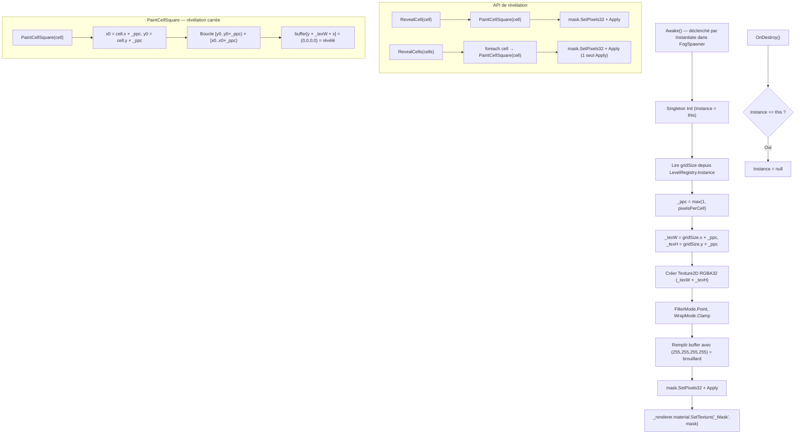
```mermaid
graph TD
    A["Awake() — déclenché par Instantiate dans FogSpawner"] --> B["Singleton Init (Instance = this)"]
    B --> C["Lire gridSize depuis LevelRegistry.Instance"]
    C --> D["_ppc = max(1, pixelsPerCell)"]
    D --> E["_texW = gridSize.x × _ppc, _texH = gridSize.y × _ppc"]
    E --> F["Créer Texture2D RGBA32 (_texW × _texH)"]
    F --> G["FilterMode.Point, WrapMode.Clamp"]
    G --> H["Remplir buffer avec (255,255,255,255) = brouillard"]
    H --> I["mask.SetPixels32 + Apply"]
    I --> J["_renderer.material.SetTexture('_Mask', mask)"]

    subgraph "API de révélation"
        K["RevealCell(cell)"] --> L["PaintCellSquare(cell)"]
        L --> L2["mask.SetPixels32 + Apply"]

        M["RevealCells(cells)"] --> N["foreach cell → PaintCellSquare(cell)"]
        N --> O["mask.SetPixels32 + Apply (1 seul Apply)"]
    end

    subgraph "PaintCellSquare — révélation carrée"
        P["PaintCellSquare(cell)"] --> Q["x0 = cell.x × _ppc, y0 = cell.y × _ppc"]
        Q --> R["Boucle [y0..y0+_ppc) × [x0..x0+_ppc)"]
        R --> S["buffer[y × _texW + x] = (0,0,0,0) = révélé"]
    end

    T["OnDestroy()"] --> U{"Instance == this ?"}
    U -->|Oui| V["Instance = null"]
```

### 4.4.5 Approche retenue & alternatives évaluées

**Approche retenue :** Texture masque RGBA32 modifiée en RAM + Shader Graph custom + révélation carrée

| Approche                            | Avantages                                                                                                                | Inconvénients                                                                                    |
| :---------------------------------- | :----------------------------------------------------------------------------------------------------------------------- | :----------------------------------------------------------------------------------------------- |
| ✅ **Texture masque + carrés nets** | Contrôle pixel-perfect, batch optimisé (1 Apply), pas de GameObjects supplémentaires, pixelsPerCell=1 minimal en mémoire | Pas de dégradé doux aux bords (design choice — carré net voulu)                                  |
| Texture masque + brush circulaire   | Dégradé doux au bord, esthétique douce                                                                                   | SmoothStep coûteux par pixel, N Apply par frame si N cellules, résolution 32ppx = grosse texture |
| Tiles individuelles avec alpha      | Simple, pas de shader custom                                                                                             | Pas de dégradé, 100+ GameObjects pour une grille 10×10                                           |
| Render Texture + caméra secondaire  | Rendu dynamique, effet volumétrique possible                                                                             | Coût GPU, complexité de setup, overkill pour une grille 2D                                       |

### 4.4.6 Points d'attention

- **⚠️ Instanciation dynamique :** FogController est instancié par `FogSpawner` — pas de `DefaultExecutionOrder`. Son `Awake` se déclenche immédiatement lors de l'`Instantiate`. Si `LevelRegistry.Instance` est null à ce moment, le masque ne sera pas créé (erreur loggée)
- **⚠️ Singleton nullable :** `FogController.Instance` peut être `null` si le fog n'est pas actif ce round (tirage dans FogSpawner). Tous les appelants (GameManager, PathSpawner, GridMover) utilisent `FogController.Instance?.RevealCell()` — null-safe
- **⚠️ OnDestroy :** Nettoie `Instance = null` pour éviter les références stale après rechargement de scène
- **⚠️ Batch optimisé :** `RevealCells` appelle `PaintCellSquare` en boucle puis un seul `Apply` — contrairement à l'ancienne implémentation qui faisait N Apply pour N cellules
- **⚠️ Mono-directionnelle :** La révélation ne fait qu'effacer (buffer = 0,0,0,0) — impossible de "re-brouiller" une cellule déjà révélée
- **⚠️ Résolution :** `pixelsPerCell = 1` donne une texture minuscule (10×10 pour grille 10×10) — optimal en mémoire WebGL. Si une résolution plus fine est nécessaire, augmenter pixelsPerCell (la texture grandit quadratiquement)

### 4.4.7 Journal d'implémentation

| Date     | Développeur | Note / Décision Technique                                                                                                                                                                                                                                                                                                                                                                                                                                                 |
| :------- | :---------- | :------------------------------------------------------------------------------------------------------------------------------------------------------------------------------------------------------------------------------------------------------------------------------------------------------------------------------------------------------------------------------------------------------------------------------------------------------------------------ |
| 17/02/26 | @auteur     | Documentation initiale. Texture masque RGBA32 avec révélation par brush circulaire SmoothStep.                                                                                                                                                                                                                                                                                                                                                                            |
| 09/03/26 | @auteur     | Réécriture complète. Suppression `DefaultExecutionOrder(-250)` (instancié dynamiquement par FogSpawner). Suppression `gridSize` (lit LevelRegistry). Suppression `brushRadiusPx`, `brushFeatherPx`, `PaintDisc`, `CellToPixelCenter` (révélation circulaire). Remplacement par `PaintCellSquare` (carrés nets). `pixelsPerCell` passe de 32 à 1 (défaut). `RevealCells` batch optimisé (1 seul Apply). Ajout `OnDestroy` (nettoyage Singleton). `FilterMode.Point` forcé. |

## 4.5 TrialManager

### 4.5.1 Responsabilités

- Créer et assembler une `TrialResponseRow` pour chaque trial de gameplay
- Enregistrer le chemin du joueur step par step (coordonnées grille + timestamp ISO)
- Stocker la configuration de la carte via une API structurée (`SetMapConfig`) — construit le JSON en interne
- **Construire la ligne de base du trial** (`BuildBaseRow()`) en lisant FlowController (participant_id, session_template_id, block/trial index, advisor/valley choice) et SessionManager (tous les paramètres recherche)
- Finaliser les résultats de manche (choix du joueur, justesse, bugs accumulés, overtime, suivi du chemin)
- **Déléguer l'envoi à ApiClient** (`SendTrialResponse`) — aucune logique HTTP propre
- **Ignorer les tutorials** : si `FlowController.IsCurrentBlockTutorial`, l'envoi réseau est sauté
- Enregistrer le `trialResponseId` retourné par le backend dans FlowController

### 4.5.2 Composants clés (Data Model)

→ **TrialManager.cs** : MonoBehaviour gérant le cycle de vie des données de recherche. Pas de Singleton — référencé via Inspector par GameManager.

```csharp
public class TrialManager : MonoBehaviour
{
    [Serializable]
    struct CloudInfo
    {
        public int x, y, totalBugs;
        public float greenRatio;
    }

    [Serializable]
    struct MiniMapCfg
    {
        public int gridWidth, gridHeight;
        public CloudInfo leftCloud, rightCloud;
    }

    readonly List<PlayerStep> _playerPathSteps = new();
    TrialResponseRow _currentTrialRow;
    string _startedAtIsoUtc;
    string _pendingMapConfigJson;
}
```

| Variable / Méthode                                                                                                 | Type                       | Description                                                                                                                                                                                                                                                                                                                                                                                                                                           |
| :----------------------------------------------------------------------------------------------------------------- | :------------------------- | :---------------------------------------------------------------------------------------------------------------------------------------------------------------------------------------------------------------------------------------------------------------------------------------------------------------------------------------------------------------------------------------------------------------------------------------------------- |
| \_playerPathSteps                                                                                                  | List\<PlayerStep\> (privé) | Chemin du joueur pour le trial courant (position + timestamp)                                                                                                                                                                                                                                                                                                                                                                                         |
| \_currentTrialRow                                                                                                  | TrialResponseRow (privé)   | Ligne de données du trial en cours — construite par `BuildBaseRow()`                                                                                                                                                                                                                                                                                                                                                                                  |
| \_startedAtIsoUtc                                                                                                  | string (privé)             | Timestamp ISO du début du trial                                                                                                                                                                                                                                                                                                                                                                                                                       |
| \_pendingMapConfigJson                                                                                             | string (privé)             | Tampon pour la config map reçue avant que le trial ne soit créé                                                                                                                                                                                                                                                                                                                                                                                       |
| StartNewTrial()                                                                                                    | void                       | Crée une TrialResponseRow via `BuildBaseRow()`, applique le tampon map_config si présent                                                                                                                                                                                                                                                                                                                                                              |
| RecordMove(Vector2Int)                                                                                             | void                       | Ajoute un PlayerStep (position + timestamp ISO) au trial courant                                                                                                                                                                                                                                                                                                                                                                                      |
| EndCurrentTrial(string, bool, string, int, int, int, **int, bool, IReadOnlyList\<Vector2Int\>, bool, bool, bool**) | void                       | Finalise la row : choix, justesse, trueCloud, greenBugs, trapsHit, steps, **overtimeSteps, followedAdvisorPath, advisorPathCells**, optimalPathVisible, pathIsSuboptimal. Calcule `green_bugs_accumulated` et `green_bugs_session_total` via FlowController. Sérialise `player_path_log` via FlowSerializationUtility, et `advisor_path_config` via `ToPathCellsJson` si le chemin était visible (`null` sinon). Envoie via ApiClient (sauf tutorial) |
| SetOptimalPathLength(int)                                                                                          | void                       | Enregistre la longueur du chemin optimal dans la row courante                                                                                                                                                                                                                                                                                                                                                                                         |
| SetCloudDistance(int)                                                                                              | void                       | Enregistre la distance Manhattan joueur→nuages (`cloud_distance`) dans la row courante                                                                                                                                                                                                                                                                                                                                                                |
| SetMapConfig(gridSize, leftCell, leftBugs, leftGreenRatio, rightCell, rightBugs, rightGreenRatio)                  | void                       | API structurée — construit le JSON MiniMapCfg en interne                                                                                                                                                                                                                                                                                                                                                                                              |
| SetMapConfigJson(string)                                                                                           | void                       | Stocke le JSON brut dans la row courante ou dans le tampon                                                                                                                                                                                                                                                                                                                                                                                            |
| BuildBaseRow()                                                                                                     | TrialResponseRow (privé)   | Lit FlowController (participant_id, session_template_id, block_index, trial_index, advisor, valley) et SessionManager (tous params recherche). Fallbacks si Flow absent                                                                                                                                                                                                                                                                               |
| EnsureCurrentTrialRow()                                                                                            | void (privé)               | Crée la row via BuildBaseRow si null — appelé par SetOptimalPathLength/SetCloudDistance                                                                                                                                                                                                                                                                                                                                                               |

### 4.5.3 Dépendances

- **Nécessite :** `TrialResponseRow` (structure de données sérialisable), `PlayerStep` (structure de données sérialisable), `FlowController.Instance` (participant_id, session_template_id, State, IsCurrentBlockTutorial, GetAccumulatedScoreAfterTrial, RegisterLastTrialResponse), `ApiClient.Instance` (SendTrialResponse), `SessionManager.Instance` (tous les paramètres recherche pour BuildBaseRow), `FlowSerializationUtility` (ToPlayerStepsJson)
- **Est utilisé par :** `GameManager` (StartNewTrial, RecordMove, EndCurrentTrial, SetMapConfig, SetOptimalPathLength, SetCloudDistance)
- **Possède en interne :** DTOs `MiniMapCfg` / `CloudInfo` (privés)

### 4.5.4 Diagramme de flux

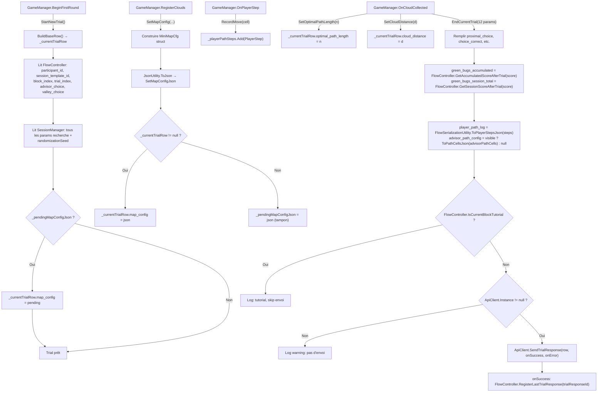
```mermaid
graph TD
    C["GameManager.BeginFirstRound"] -->|"StartNewTrial()"| D["BuildBaseRow() → _currentTrialRow"]
    D --> D1["Lit FlowController: participant_id, session_template_id,<br/>block_index, trial_index, advisor_choice, valley_choice"]
    D1 --> D2["Lit SessionManager: tous les params recherche +<br/>randomizationSeed"]
    D2 --> E{_pendingMapConfigJson ?}
    E -->|Oui| F["_currentTrialRow.map_config = pending"]
    E -->|Non| G[Trial prêt]
    F --> G

    H["GameManager.RegisterClouds"] -->|"SetMapConfig(...)"| H1["Construire MiniMapCfg struct"]
    H1 --> H2["JsonUtility.ToJson → SetMapConfigJson"]
    H2 --> I{_currentTrialRow != null ?}
    I -->|Oui| J["_currentTrialRow.map_config = json"]
    I -->|Non| K["_pendingMapConfigJson = json (tampon)"]

    L["GameManager.OnPlayerStep"] -->|"RecordMove(cell)"| M["_playerPathSteps.Add(PlayerStep)"]

    N["GameManager.OnCloudCollected"] -->|"SetOptimalPathLength(n)"| O["_currentTrialRow.optimal_path_length = n"]
    N -->|"SetCloudDistance(d)"| O2["_currentTrialRow.cloud_distance = d"]
    N -->|"EndCurrentTrial(12 params)"| P["Remplir proximal_choice, choice_correct, etc."]
    P --> P1["green_bugs_accumulated = FlowController.GetAccumulatedScoreAfterTrial(score)<br/>green_bugs_session_total = FlowController.GetSessionScoreAfterTrial(score)"]
    P1 --> P2["player_path_log = FlowSerializationUtility.ToPlayerStepsJson(steps)<br/>advisor_path_config = visible ? ToPathCellsJson(advisorPathCells) : null"]
    P2 --> P3{"FlowController.IsCurrentBlockTutorial ?"}
    P3 -->|Oui| P4["Log: tutorial, skip envoi"]
    P3 -->|Non| P5{"ApiClient.Instance != null ?"}
    P5 -->|Non| P6["Log warning: pas d'envoi"]
    P5 -->|Oui| T["ApiClient.SendTrialResponse(row, onSuccess, onError)"]
    T --> T1["onSuccess: FlowController.RegisterLastTrialResponse(trialResponseId)"]
```

### 4.5.5 Approche retenue & alternatives évaluées

**Approche retenue :** Assemblage local de TrialResponseRow + envoi unitaire via ApiClient (queue + retry côté ApiClient)

| Approche                                | Avantages                                                                         | Inconvénients                                                 |
| :-------------------------------------- | :-------------------------------------------------------------------------------- | :------------------------------------------------------------ |
| ✅ **Row unitaire + ApiClient**         | Séparation des responsabilités, retry géré par ApiClient, compatible multi-scènes | TrialManager ne sait pas si l'envoi a réussi (callback async) |
| ~~Batch local + POST coroutine (v2.9)~~ | Simple, tout dans TrialManager                                                    | Couplage HTTP dans TrialManager, pas de retry, pas de queue   |
| WebSocket persistant                    | Temps réel, pas de perte de données                                               | Complexité serveur, pas supporté nativement par WebGL         |

### 4.5.6 Points d'attention

- **⚠️ Tutorial skip :** Si le bloc courant est un tutorial (`FlowController.IsCurrentBlockTutorial`), l'envoi réseau est ignoré — les données du trial sont construites mais pas envoyées
- **⚠️ Séquencement :** `SetMapConfig` peut être appelé avant `StartNewTrial` (BugCloudSpawner Start -200 vs GameManager Start 0). Le tampon `_pendingMapConfigJson` gère ce cas
- **⚠️ BuildBaseRow fallbacks :** Si FlowController est absent, `participant_id` est un GUID aléatoire, `session_template_id` = "debug-session-template", `block_index` = SessionManager.blockId ou 1
- **⚠️ Accumulated score :** `green_bugs_accumulated` est calculé via `FlowController.GetAccumulatedScoreAfterTrial()` et inclut le score du trial courant. Si FlowController absent, = greenBugsCollected seul
- **⚠️ Session total :** `green_bugs_session_total` est calculé via `FlowController.GetSessionScoreAfterTrial()` — cumul sur toute la session, jamais remis à 0 entre blocs. Sur un bloc tutorial la valeur reste plate (le score n'est pas compté), contrairement à `green_bugs_accumulated`
- **⚠️ Envoi asynchrone :** Le `trialResponseId` est récupéré dans le callback `onSuccess` et enregistré dans FlowController — utilisé ensuite par le questionnaire pour le PATCH

### 4.5.7 Journal d'implémentation

| Date     | Développeur | Note / Décision Technique                                                                                                                                                                                                                                                                                                                                                                                                                                                                                                                                                                                                               |
| :------- | :---------- | :-------------------------------------------------------------------------------------------------------------------------------------------------------------------------------------------------------------------------------------------------------------------------------------------------------------------------------------------------------------------------------------------------------------------------------------------------------------------------------------------------------------------------------------------------------------------------------------------------------------------------------------- |
| 17/02/26 | @auteur     | Documentation initiale. Pipeline de collecte trial complet avec tampon map_config et envoi batch par coroutine.                                                                                                                                                                                                                                                                                                                                                                                                                                                                                                                         |
| 27/02/26 | @pierre     | Refacto : StartNewTrial prend 4 params (ajout trialSeed), nouveau SetMapConfig structuré (construit JSON en interne), DTOs MiniMapCfg/CloudInfo déplacés de GameManager vers TrialManager, noms de champs changés (gridWidth/gridHeight, totalBugs).                                                                                                                                                                                                                                                                                                                                                                                    |
| 02/03/26 | @pierre     | Pipeline collecte enrichi : CloudInfo ajoute `greenRatio`. SetMapConfig prend 7 params. EndCurrentTrial prend 6 params.                                                                                                                                                                                                                                                                                                                                                                                                                                                                                                                 |
| 02/03/26 | @pierre     | Ajout `SetCloudDistance(int)`.                                                                                                                                                                                                                                                                                                                                                                                                                                                                                                                                                                                                          |
| 09/03/26 | @auteur     | `EndCurrentTrial` passe à 8 params (ajout `pathIsSuboptimal`).                                                                                                                                                                                                                                                                                                                                                                                                                                                                                                                                                                          |
| 23/03/26 | @pierre     | Réécriture complète. Suppression `apiBaseUrl`, `studyToken`, `gameSessionId` — délégation totale à ApiClient. `StartNewTrial()` sans params (BuildBaseRow lit FlowController + SessionManager). `EndCurrentTrial` passe à 10 params (ajout `overtimeSteps`, `followedAdvisorPath`). Utilise `TrialResponseRow` au lieu de `TrialData`. `green_bugs_accumulated` calculé via `FlowController.GetAccumulatedScoreAfterTrial()`. `player_path_log` sérialisé via `FlowSerializationUtility.ToPlayerStepsJson()`. Tutorial skip si `IsCurrentBlockTutorial`. `trialResponseId` enregistré via `FlowController.RegisterLastTrialResponse()`. |
| 25/08/26 | @pierre     | `EndCurrentTrial` passe à 12 params (ajout `advisorPathCells`). Nouveau champ `advisor_path_config` : cases ordonnées du chemin advisor affiché, sérialisées via `FlowSerializationUtility.ToPathCellsJson()` (`[{x,y}]`, sans timestamps) quand `optimal_path_visible` est vrai, `null` sinon.                                                                                                                                                                                                                                                                                                                                         |

## 4.6 TilesSpawner

### 4.6.1 Responsabilités

- Générer la grille de tuiles au runtime à partir du prefab tile
- Calculer et initialiser `LevelRegistry.originWorld` depuis la position du joueur
- Garantir que le joueur se retrouve centré en X sur la première rangée (z=0)
- Organiser les tuiles instanciées sous un GameObject root dédié

### 4.6.2 Composants clés (Data Model)

→ **TilesSpawner.cs** : MonoBehaviour, génération de la grille à l'Awake. Ordre d'exécution : `-240`.

```csharp
[DefaultExecutionOrder(-240)]
public class TilesSpawner : MonoBehaviour
{
    [Header("Tiles")]
    public GameObject tilePrefab;

    [Header("Placement")]
    public Transform root;
    public float tilesY = 0f;

    private Transform tilesRoot;
}
```

| Variable / Méthode                          | Type               | Description                                                                |
| :------------------------------------------ | :----------------- | :------------------------------------------------------------------------- |
| tilePrefab                                  | GameObject         | Prefab de tuile à instancier pour chaque cellule de la grille              |
| root                                        | Transform          | Transform de référence pour le calcul de l'origine (position joueur)       |
| tilesY                                      | float              | Hauteur Y de génération de la grille (défaut : 0)                          |
| tilesRoot                                   | Transform (privé)  | GameObject parent regroupant toutes les tuiles instanciées                 |
| Spawn()                                     | void (public)      | Méthode principale : calcule l'origine, crée le root, instancie les tuiles |
| ComputeOriginFromPlayer(registry, worldPos) | Vector3 (statique) | Calcule l'origine grille pour centrer le joueur sur la cellule médiane     |
| EnsureRoot()                                | void (privé)       | Crée le GameObject "TilesRootRuntime" comme enfant du TilesSpawner         |
| ClearRuntime()                              | void (privé)       | Détruit tous les enfants du root (nettoyage avant régénération)            |

### 4.6.3 Dépendances

- **Nécessite :** `LevelRegistry.Instance` (gridSize, cellSize — lecture ; originWorld — écriture)
- **Est utilisé par :** Aucun système directement — produit les GameObjects tuiles taggés "Tile" consommés par `CorridorWallsGenerator`
- **Déclenche :** Initialisation de `LevelRegistry.originWorld`

### 4.6.4 Diagramme de flux

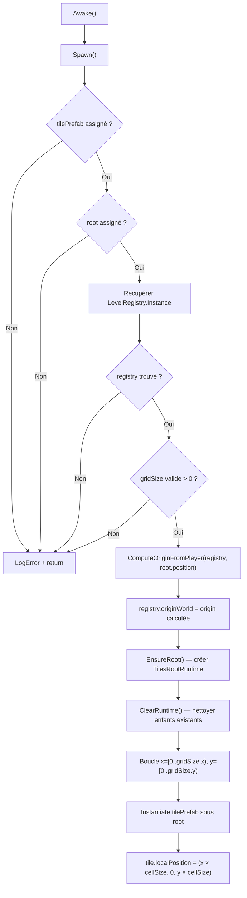
```mermaid
graph TD
    A["Awake()"] --> B["Spawn()"]
    B --> C{tilePrefab assigné ?}
    C -->|Non| D["LogError + return"]
    C -->|Oui| E{root assigné ?}
    E -->|Non| D
    E -->|Oui| F["Récupérer LevelRegistry.Instance"]
    F --> G{registry trouvé ?}
    G -->|Non| D
    G -->|Oui| H{gridSize valide > 0 ?}
    H -->|Non| D
    H -->|Oui| I["ComputeOriginFromPlayer(registry, root.position)"]
    I --> J["registry.originWorld = origin calculée"]
    J --> K["EnsureRoot() — créer TilesRootRuntime"]
    K --> L["ClearRuntime() — nettoyer enfants existants"]
    L --> M["Boucle x=[0..gridSize.x), y=[0..gridSize.y)"]
    M --> N["Instantiate tilePrefab sous root"]
    N --> O["tile.localPosition = (x × cellSize, 0, y × cellSize)"]
```

### 4.6.5 Formules et règles métier

```
midX                = gridSize.x / 2 (division entière)
originWorld.x       = root.position.x - (midX × cellSize)
originWorld.z       = root.position.z
originWorld.y       = 0

Tile localPosition  = (x × cellSize, 0, y × cellSize)  pour x ∈ [0, gridSize.x), y ∈ [0, gridSize.y)

Contrainte joueur   = le joueur doit se retrouver sur la cellule (midX, 0) après calcul de l'origine
```

### 4.6.6 Points d'attention

- **⚠️ Écriture dans LevelRegistry :** TilesSpawner est le seul système qui écrit `originWorld` — tous les autres systèmes le lisent. Si TilesSpawner ne s'exécute pas, toutes les conversions WorldToCell/CellToWorld seront faussées
- **⚠️ Ordre d'exécution :** `-240` s'exécute après LevelRegistry (-300) et FogController (-250), mais avant BugCloudSpawner (-200) — l'origine doit être calculée avant tout placement d'entité
- **⚠️ Fallback :** Si `LevelRegistry.Instance` est null, tente `FindFirstObjectByType<LevelRegistry>()` — couverture du cas où l'ordre Awake n'est pas garanti
- **⚠️ cellSize guard :** `Mathf.Max(0.0001f, cellSize)` empêche une division par zéro ou un espacement nul des tuiles

### 4.6.7 Journal d'implémentation

| Date     | Développeur | Note / Décision Technique                                                                           |
| :------- | :---------- | :-------------------------------------------------------------------------------------------------- |
| 17/02/26 | @auteur     | Documentation initiale. Génération runtime de la grille avec calcul d'origine centré sur le joueur. |
| 19/02/26 | @pierre     | MAJ doc: champ root en entree et parent runtime tilesRoot.                                          |

## 4.7 PlayerSpawner

### 4.7.1 Responsabilités

- Instancier le prefab joueur au runtime à une position et rotation définies par un Transform de spawn
- Enregistrer la cellule et la position monde de départ du joueur dans `LevelRegistry.RegisterPlayerStart()`
- Permettre aux autres spawners de récupérer la position joueur via `TryGetPlayerStartCell()` sans référence Transform directe

### 4.7.2 Composants clés (Data Model)

→ **PlayerSpawner.cs** : MonoBehaviour, instanciation du joueur au Start. Ordre d'exécution : **`-250`** (premier spawner en Start, après que TilesSpawner.Awake ait posé `originWorld`).

```csharp
[DefaultExecutionOrder(-250)]
public class PlayerSpawner : MonoBehaviour
{
    [Header("Références")]
    [SerializeField] private GameObject playerPrefab;
    [SerializeField] private Transform spawnTransform;
}
```

| Variable / Méthode | Type       | Description                                                      |
| :----------------- | :--------- | :--------------------------------------------------------------- |
| playerPrefab       | GameObject | Prefab du joueur à instancier (doit avoir GridMover, etc.)       |
| spawnTransform     | Transform  | Transform définissant la position et rotation de spawn du joueur |

### 4.7.3 Dépendances

- **Nécessite :** `LevelRegistry.Instance` (WorldToCell, RegisterPlayerStart)
- **Est utilisé par :** Aucun système directement — mais tous les spawners accèdent à la position joueur via `LevelRegistry.TryGetPlayerStartCell()` / `TryGetPlayerStartWorld()` (rendu possible par l'enregistrement fait ici)
- **Déclenche :** `RegisterPlayerStart(cell, worldPos)` dans LevelRegistry (ajoute les flags `PlayerStart + Reserved`)

### 4.7.4 Diagramme de flux

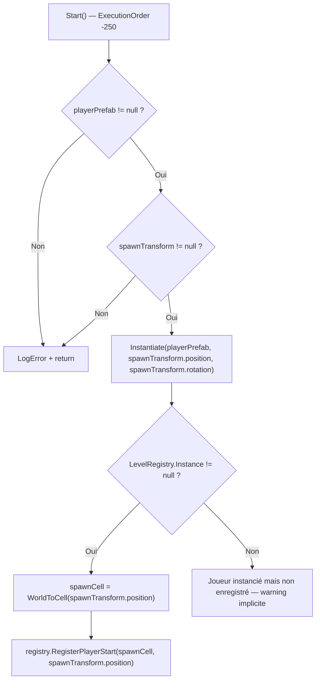
```mermaid
graph TD
    A["Start() — ExecutionOrder -250"] --> B{playerPrefab != null ?}
    B -->|Non| C["LogError + return"]
    B -->|Oui| D{spawnTransform != null ?}
    D -->|Non| C
    D -->|Oui| E["Instantiate(playerPrefab, spawnTransform.position, spawnTransform.rotation)"]
    E --> F{LevelRegistry.Instance != null ?}
    F -->|Oui| G["spawnCell = WorldToCell(spawnTransform.position)"]
    G --> H["registry.RegisterPlayerStart(spawnCell, spawnTransform.position)"]
    F -->|Non| I["Joueur instancié mais non enregistré — warning implicite"]
```

### 4.7.5 Points d'attention

- **⚠️ Ordre d'exécution :** `-250` garantit que PlayerSpawner tourne en Start avant tous les autres spawners (BugCloudSpawner -200, PathSpawner -100, etc.) — la cellule joueur est donc disponible via `TryGetPlayerStartCell()` quand ils en ont besoin
- **⚠️ RegisterPlayerStart :** L'enregistrement ajoute les flags `PlayerStart + Reserved` à la cellule — aucun piège ne pourra y être placé, et `UnregisterBugCloud` ne retirera pas `Reserved` de cette cellule
- **⚠️ Découplage :** Les autres spawners n'ont plus de champ `Transform player` dans l'Inspector — ils passent par `LevelRegistry.TryGetPlayerStartCell()`. Cela supprime les références croisées et simplifie le setup de scène

### 4.7.6 Journal d'implémentation

| Date     | Développeur | Note / Décision Technique                                                                                                                                                                                                        |
| :------- | :---------- | :------------------------------------------------------------------------------------------------------------------------------------------------------------------------------------------------------------------------------- |
| 17/02/26 | @auteur     | Documentation initiale. Spawner simple — instanciation du joueur à un point de spawn configurable.                                                                                                                               |
| 27/02/26 | @pierre     | Refacto : ajout [DefaultExecutionOrder(-250)], appel RegisterPlayerStart(cell, worldPos) après Instantiate, suppression Update() vide. Les spawners accèdent au joueur via TryGetPlayerStartCell au lieu de Transform Inspector. |

## 4.8 FogSpawner

### 4.8.1 Responsabilités

- Décider si le brouillard de guerre est actif ce round (tirage `rng.NextDouble() >= fogProbability`)
- Instancier le prefab `FogSurface` (qui porte `FogController`) et le positionner/dimensionner sur la grille
- **Ne gère pas** la logique de révélation (→ `FogController`), ni la décision de quoi révéler (→ `GameManager`, `PathSpawner`)

### 4.8.2 Composants clés (Data Model)

→ **FogSpawner.cs** : MonoBehaviour, spawn conditionnel du brouillard au Start. Ordre d'exécution : **`-245`** (après `TilesSpawner.Awake(-240)` qui pose `originWorld`, avant `BugCloudSpawner.Start(-200)`).

> **Note architecture :** Le paramètre `fogProbability` est lu directement depuis `SessionManager.Instance` (Singleton). Ce script ne possède que les paramètres de game design (`fogSurfacePrefab`, `fogY`). Voir pattern **Research Parameter Pipeline** (section 2.3).

```csharp
[DefaultExecutionOrder(-245)]
public class FogSpawner : MonoBehaviour
{
    [Header("Références")]
    [Tooltip("Prefab FogSurface (Quad + Renderer + FogController).")]
    public GameObject fogSurfacePrefab;

    [Header("Placement")]
    [Tooltip("Hauteur Y du plan de brouillard au-dessus de la grille.")]
    public float fogY = 0.3f;
}
```

| Variable / Méthode                         | Type       | Description                                                                                                             |
| :----------------------------------------- | :--------- | :---------------------------------------------------------------------------------------------------------------------- |
| fogSurfacePrefab                           | GameObject | Prefab FogSurface (Quad + Renderer + FogController) — **game design**                                                   |
| fogY                                       | float      | Hauteur Y du plan de brouillard (défaut : 0.3) — **game design**                                                        |
| _Lecture depuis SessionManager.Instance :_ |            | `fogProbability` (float, 0-1) — probabilité que le fog soit actif. **Paramètre recherche** (Singleton, lecture directe) |

### 4.8.3 Dépendances

- **Nécessite :** `LevelRegistry.Instance` (gridSize, cellSize, originWorld, CreateRng), `SessionManager.Instance` (**paramètre recherche** : fogProbability)
- **Est configuré par :** `SessionManager.Instance` (lecture directe de fogProbability — voir section 2.3)
- **Déclenche :** Instanciation conditionnelle du prefab FogSurface → `FogController.Awake()` se déclenche immédiatement, `FogController.Instance` devient disponible pour les spawners suivants

### 4.8.4 Diagramme de flux

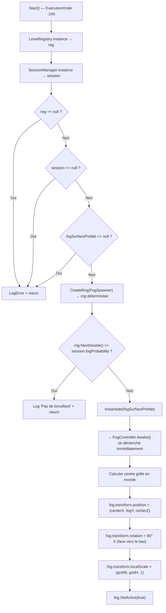
```mermaid
graph TD
    A["Start() — ExecutionOrder -245"] --> B["LevelRegistry.Instance → reg"]
    B --> C["SessionManager.Instance → session"]
    C --> D{reg == null ?}
    D -->|Oui| E["LogError + return"]
    D -->|Non| F{session == null ?}
    F -->|Oui| E
    F -->|Non| G{fogSurfacePrefab == null ?}
    G -->|Oui| E
    G -->|Non| H["CreateRng(FogSpawner) → rng déterministe"]
    H --> I{"rng.NextDouble() >= session.fogProbability ?"}
    I -->|Oui| J["Log 'Pas de brouillard' + return"]
    I -->|Non| K["Instantiate(fogSurfacePrefab)"]
    K --> K1["→ FogController.Awake() se déclenche immédiatement"]
    K1 --> L["Calculer centre grille en monde"]
    L --> M["fog.transform.position = (centerX, fogY, centerZ)"]
    M --> N["fog.transform.rotation = 90° X (face vers le bas)"]
    N --> O["fog.transform.localScale = (gridW, gridH, 1)"]
    O --> P["fog.SetActive(true)"]
```

### 4.8.5 Formules et règles métier

```
Tirage fog          = rng.NextDouble() < session.fogProbability → fog actif
                      rng.NextDouble() >= session.fogProbability → pas de fog

gridW               = reg.gridSize.x × reg.cellSize
gridH               = reg.gridSize.y × reg.cellSize
centerX             = reg.originWorld.x + (reg.gridSize.x - 1) × reg.cellSize / 2
centerZ             = reg.originWorld.z + (reg.gridSize.y - 1) × reg.cellSize / 2

Position fog        = (centerX, fogY, centerZ)
Rotation fog        = Quaternion.Euler(90, 0, 0)  — Quad face vers le bas
Scale fog           = (gridW, gridH, 1)            — couvre toute la grille
```

### 4.8.6 Points d'attention

- **⚠️ Séquencement :** `-245` garantit que FogSpawner tourne après `TilesSpawner.Awake(-240)` (qui pose `originWorld`) et `PlayerSpawner.Start(-250)` (qui enregistre le joueur). Si `originWorld` n'est pas défini, le fog sera mal positionné
- **⚠️ Singleton nullable :** Si le tirage est négatif, aucun FogSurface n'est instancié → `FogController.Instance` reste `null` pour tout le round. Tous les appelants doivent utiliser le null-conditional operator (`?.`)
- **⚠️ RNG seedé :** Le tirage utilise `CreateRng(nameof(FogSpawner))` — même seed = même décision fog/pas fog. Reproductible
- **⚠️ Prefab :** Le prefab FogSurface doit contenir un `Renderer` (Quad) + `FogController` déjà configurés. `FogController.Awake()` crée la texture masque et l'assigne au shader immédiatement à l'Instantiate
- **⚠️ fogY :** La hauteur par défaut est 0.3 (au-dessus des tuiles, en-dessous des murs et entités). Ajuster si le design évolue

### 4.8.7 Journal d'implémentation

| Date     | Développeur | Note / Décision Technique                                                                                                                                                                                                                                                                                                    |
| :------- | :---------- | :--------------------------------------------------------------------------------------------------------------------------------------------------------------------------------------------------------------------------------------------------------------------------------------------------------------------------- |
| 09/03/26 | @auteur     | Création. Spawn conditionnel du brouillard de guerre basé sur `fogProbability` lu depuis SessionManager. Architecture spawner-based : FogSpawner décide et instancie, FogController gère le masque. RNG seedé via `CreateRng("FogSpawner")`. Positionnement et dimensionnement automatiques sur la grille via LevelRegistry. |

## 4.9 FlowController

### 4.9.1 Responsabilités

- **Singleton DDOL** (`FlowController.Instance`, `DontDestroyOnLoad`) — orchestre le cycle de vie complet de la session multi-scènes
- Extraire le `sessionId` depuis l'URL WebGL (`Application.absoluteURL`) au boot
- Récupérer la `SessionConfig` du backend via `ApiClient.FetchSessionConfig()`
- Initialiser l'état de session (`PlayerSessionState`) et préparer la configuration (injection tutorial, tri des blocs)
- **Machine à états** : piloter les transitions entre `GamePhase` (Boot → Welcome → Consent → Intro → Tutorial → AdvisorChoice → DistalChoice → Proximal → Questionnaire → EndSession)
- Exposer la configuration du bloc/trial courant (`CurrentBlock`, `ActiveMapConfig`, `CurrentTrialSeed`)
- Recevoir les callbacks des écrans UI (OnConsentGiven, OnAdvisorChosen, OnValleyChosen, OnPhaseComplete, OnTrialComplete, OnQuestionnaireComplete)
- Gérer le score accumulé par bloc (`BlockScore`)
- Orchestrer la transition entre scènes via `FadeTransition`
- Émettre `OnPhaseChanged` pour les écrans qui veulent réagir au changement de phase

### 4.9.2 Composants clés (Data Model)

→ **FlowController.cs** : Singleton DDOL MonoBehaviour. Pas de `DefaultExecutionOrder` — créé dans BootScene et persiste.

```csharp
public class FlowController : MonoBehaviour
{
    public static FlowController Instance { get; private set; }

    [Header("Routing")]
    [SerializeField] string _bootSceneName = "BootScene";
    [SerializeField] string _welcomeSceneName = "WelcomeScene";
    // ... 7 autres scènes configurables

    [Header("Build")]
    [SerializeField] string _buildVersion = "0.3.0-flow";

    [Header("Editor Test")]
    [SerializeField] string _editorSessionId;

    public SessionConfig Config { get; private set; }
    public PlayerSessionState State { get; private set; }
    public long CurrentTrialSeed { get; private set; }
    public int BlockScore { get; private set; }
    public string BuildVersion => _buildVersion;

    public BlockConfig CurrentBlock { get; }       // Config.blocks[State.current_block_index]
    public MapGenConfig ActiveMapConfig { get; }   // valley_a ou valley_b selon State.valley_choice, clone + seed
    public bool HasLoadedConfig { get; }
    public bool IsCurrentBlockTutorial { get; }
    public bool IsLastBlock { get; }
    public bool IsLastTrial { get; }

    public event Action<GamePhase> OnPhaseChanged;
}
```

| Variable / Méthode                                | Type                      | Description                                                                                      |
| :------------------------------------------------ | :------------------------ | :----------------------------------------------------------------------------------------------- |
| Instance                                          | FlowController            | Singleton DDOL                                                                                   |
| Config                                            | SessionConfig (get)       | Configuration de session récupérée du backend                                                    |
| State                                             | PlayerSessionState (get)  | État courant de la session (phase, block, trial, choix, score)                                   |
| CurrentTrialSeed                                  | long (get)                | Seed du trial courant — générée à chaque OnValleyChosen / après chaque trial                     |
| BlockScore                                        | int (get)                 | Score accumulé dans le bloc courant (reset entre blocs)                                          |
| BuildVersion                                      | string (get)              | Version du build (défaut : "0.3.0-flow")                                                         |
| CurrentBlock                                      | BlockConfig (get)         | `Config.blocks[State.current_block_index]`, null si index hors bornes                            |
| ActiveMapConfig                                   | MapGenConfig (get)        | Clone de `valley_a` ou `valley_b` selon `State.valley_choice`, avec seed injectée                |
| HasLoadedConfig                                   | bool (get)                | `true` si Config non null et contient au moins un bloc                                           |
| IsCurrentBlockTutorial                            | bool (get)                | `CurrentBlock.is_tutorial`                                                                       |
| IsLastBlock / IsLastTrial                         | bool (get)                | Indicateurs de fin de bloc/session                                                               |
| OnPhaseChanged                                    | event Action\<GamePhase\> | Émis à chaque transition de phase                                                                |
| Initialize(SessionConfig)                         | void                      | Prépare la config (tutorial injection, tri, cleanup), crée PlayerSessionState                    |
| OnConsentGiven()                                  | void                      | Consent → Intro                                                                                  |
| OnPhaseComplete()                                 | void                      | Welcome→Consent, Intro/Tutorial→AdvisorChoice, EndSession→CompleteSession                        |
| OnAdvisorChosen(AdvisorType)                      | void                      | AdvisorChoice → DistalChoice                                                                     |
| OnValleyChosen(ValleyChoice)                      | void                      | DistalChoice → Proximal (génère seed)                                                            |
| OnTrialComplete(int trialScore)                   | void                      | Fin de trial : accumule score, avance trial_index. Dernier trial → Questionnaire ou bloc suivant |
| OnQuestionnaireComplete(List\<QuestionResponse\>) | void                      | Queue le PATCH questionnaire via ApiClient, avance au bloc suivant ou EndSession                 |
| GetAccumulatedScoreAfterTrial(int)                | int                       | Retourne `BlockScore + trialScore` (0 si tutorial)                                               |
| RegisterLastTrialResponse(string)                 | void                      | Enregistre le trialResponseId dans State (pour le PATCH questionnaire)                           |
| BootstrapFlow()                                   | IEnumerator (privé)       | Extract sessionId from URL → ApiClient.FetchSessionConfig → Initialize → Welcome                 |
| AdvanceToPhase(GamePhase)                         | void (privé)              | Met à jour State.current_phase, émet OnPhaseChanged, lance TransitionToScene                     |
| AdvanceToNextBlockOrEnd()                         | void (privé)              | Reset score/choices, incrémente block_index, → AdvisorChoice ou EndSession                       |
| TransitionToScene(string)                         | IEnumerator (privé)       | FadeOut → LoadScene → FadeIn                                                                     |
| PrepareConfig(SessionConfig)                      | SessionConfig (privé)     | EnsureTutorialBlock, cleanup nulls, sanitize blocks                                              |
| GetSceneName(GamePhase)                           | string (privé)            | Mapping phase → nom de scène (configurable via SerializeField)                                   |
| ExtractSessionIdFromAbsoluteUrl(string, string)   | string (static)           | Parse query parameter depuis Application.absoluteURL                                             |
| GenerateTrialSeed()                               | long (static)             | `(DateTime.UtcNow.Ticks << 1) ^ Guid.NewGuid().GetHashCode()` (unchecked)                        |

### 4.9.3 Dépendances

- **Nécessite :** `ApiClient.Instance` (FetchSessionConfig, CompleteSession, QueueQuestionnairePatchForTrial, OnTrialResponseStored), `FadeTransition.Instance` (FadeOut, FadeIn), `TutorialSessionFactory` (EnsureTutorialBlock), `SceneManager` (LoadScene)
- **Est utilisé par :** `SessionManager` (CopyConfigFromFlowController — lit Config, State, ActiveMapConfig, CurrentTrialSeed, BuildVersion, IsCurrentBlockTutorial), `TrialManager` (BuildBaseRow — lit State, CurrentBlock, ActiveMapConfig ; EndCurrentTrial — GetAccumulatedScoreAfterTrial, RegisterLastTrialResponse, IsCurrentBlockTutorial), `GameManager` (ContinueAfterRound → OnTrialComplete), `ConsentUI` (OnConsentGiven), `AdvisorChoiceUI` (OnAdvisorChosen), `DistalChoiceUI` (OnValleyChosen), `FlowContinueScreenUI` (OnPhaseComplete), `QuestionnaireUI` (OnQuestionnaireComplete)
- **Communique avec :** Backend Supabase (via ApiClient), Scènes Unity (via SceneManager)

### 4.9.4 Diagramme de flux

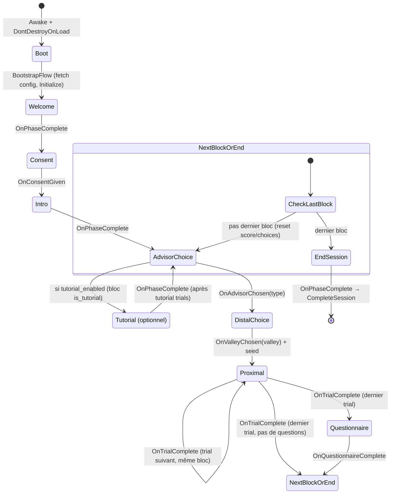
```mermaid
stateDiagram-v2
    [*] --> Boot : Awake + DontDestroyOnLoad
    Boot --> Welcome : BootstrapFlow (fetch config, Initialize)
    Welcome --> Consent : OnPhaseComplete
    Consent --> Intro : OnConsentGiven
    Intro --> AdvisorChoice : OnPhaseComplete

    state "Tutorial (optionnel)" as Tut
    AdvisorChoice --> Tut : si tutorial_enabled (bloc is_tutorial)
    Tut --> AdvisorChoice : OnPhaseComplete (après tutorial trials)

    AdvisorChoice --> DistalChoice : OnAdvisorChosen(type)
    DistalChoice --> Proximal : OnValleyChosen(valley) + seed
    Proximal --> Proximal : OnTrialComplete (trial suivant, même bloc)
    Proximal --> Questionnaire : OnTrialComplete (dernier trial)
    Proximal --> NextBlockOrEnd : OnTrialComplete (dernier trial, pas de questions)
    Questionnaire --> NextBlockOrEnd : OnQuestionnaireComplete

    state "NextBlockOrEnd" as NB {
        [*] --> CheckLastBlock
        CheckLastBlock --> AdvisorChoice : pas dernier bloc (reset score/choices)
        CheckLastBlock --> EndSession : dernier bloc
    }

    EndSession --> [*] : OnPhaseComplete → CompleteSession
```

### 4.9.5 Formules et règles métier

```
ActiveMapConfig     = clone de valley_a (si ValleyChoice.A ou None) ou valley_b (si B) + injection seed
BlockScore          += trialScore à chaque OnTrialComplete (sauf tutorial)
green_bugs_accumulated = BlockScore (reset à 0 entre blocs)
SessionScore        += trialScore à chaque OnTrialComplete (sauf tutorial), jamais reset
green_bugs_session_total = SessionScore (cumul session, tutoriels exclus)
Tutorial skip       = si CurrentBlock.is_tutorial → score non compté, envoi réseau ignoré
Session complete    = ApiClient.CompleteSession après dernier bloc
PrepareConfig       = EnsureTutorialBlock + cleanup nulls + sanitize blocks
```

### 4.9.6 Points d'attention

- **⚠️ DDOL :** FlowController persiste entre toutes les scènes — attention aux références de scène qui deviennent invalides après un changement de scène
- **⚠️ BootstrapFlow :** Attend un frame (`yield return null`) avant d'extraire l'URL — nécessaire en WebGL pour que Application.absoluteURL soit disponible
- **⚠️ Editor fallback :** `_editorSessionId` permet de tester le flow dans l'éditeur sans URL — conditionné par `#if UNITY_EDITOR`
- **⚠️ ActiveMapConfig clone :** Retourne toujours un DeepClone pour éviter la mutation de la config source — la seed est injectée dans le clone
- **⚠️ OnTrialComplete guards :** Vérifie `State.current_phase == Proximal` et `CurrentBlock != null` — empêche les appels hors séquence
- **⚠️ Questionnaire PATCH :** Les réponses sont mises en queue (`QueueQuestionnairePatchForTrial`) et patchées quand le `trialResponseId` du dernier trial est disponible — mécanisme asynchrone

### 4.9.7 Journal d'implémentation

| Date     | Développeur | Note / Décision Technique                                                                                                                                                                                                 |
| :------- | :---------- | :------------------------------------------------------------------------------------------------------------------------------------------------------------------------------------------------------------------------ |
| 23/03/26 | @pierre     | Création. Machine à états orchestrant 10 phases, DDOL, fetch config backend via ApiClient, transitions FadeTransition, tutorial injection via TutorialSessionFactory, score accumulé par bloc, questionnaire PATCH queue. |

## 4.10 ApiClient

### 4.10.1 Responsabilités

- **Singleton DDOL** (`ApiClient.Instance`, `DontDestroyOnLoad`) — couche réseau exclusive pour Supabase REST API
- Récupérer la configuration de session (`GET /api/sessions/{sessionId}`)
- Envoyer les trial responses (`POST /api/trial-responses`) avec queue et retry (max 3 tentatives)
- Patcher les réponses questionnaire sur un trial response existant (`PATCH /api/trial-responses/{id}`)
- Gérer un mécanisme de queue pour les PATCH questionnaire qui attendent le `trialResponseId`
- Authentification : `supabaseAnonKey` en headers `apikey` + `Authorization: Bearer`
- Émettre `OnTrialResponseStored` après chaque POST réussi

### 4.10.2 Composants clés (Data Model)

→ **ApiClient.cs** : Singleton DDOL MonoBehaviour. Gère la queue d'envoi et les retries.

```csharp
public class ApiClient : MonoBehaviour
{
    public static ApiClient Instance { get; private set; }

    [Header("Config")]
    public string supabaseUrl;
    public string supabaseAnonKey;
    [SerializeField] string _sessionConfigPath = "api/sessions";
    [SerializeField] string _trialResponsesPath = "api/trial-responses";
    [SerializeField] int _maxImmediateRetries = 3;
    [SerializeField] float _retryDelaySeconds = 1f;

    readonly Queue<PendingTrialRequest> _pendingTrialRequests = new();
    readonly Dictionary<string, string> _storedTrialIdsByKey = new();
    readonly Dictionary<string, PendingQuestionnairePatch> _pendingQuestionnairePatches = new();

    bool _isProcessingTrialQueue;
    bool _isFlushingQuestionnairePatches;

    public event Action<TrialResponseRow, string> OnTrialResponseStored;
}
```

| Variable / Méthode                                                                                    | Type               | Description                                                                     |
| :---------------------------------------------------------------------------------------------------- | :----------------- | :------------------------------------------------------------------------------ | ---------- | ----------------------------------------------------- |
| Instance                                                                                              | ApiClient          | Singleton DDOL                                                                  |
| supabaseUrl                                                                                           | string             | URL de base Supabase (configuré dans l'Inspector)                               |
| supabaseAnonKey                                                                                       | string             | Clé anonyme Supabase — envoyée en `apikey` et `Bearer` headers                  |
| \_sessionConfigPath                                                                                   | string             | Chemin GET sessions (défaut : `api/sessions`)                                   |
| \_trialResponsesPath                                                                                  | string             | Chemin POST/PATCH trial responses (défaut : `api/trial-responses`)              |
| \_maxImmediateRetries                                                                                 | int                | Nombre max de tentatives par trial (défaut : 3)                                 |
| \_retryDelaySeconds                                                                                   | float              | Délai entre retries (défaut : 1s)                                               |
| \_pendingTrialRequests                                                                                | Queue (privé)      | File d'attente FIFO des trials à envoyer                                        |
| \_storedTrialIdsByKey                                                                                 | Dictionary (privé) | Mapping `participantId                                                          | blockIndex | trialIndex`→`trialResponseId` retourné par le backend |
| \_pendingQuestionnairePatches                                                                         | Dictionary (privé) | PATCH questionnaire en attente du `trialResponseId`                             |
| OnTrialResponseStored                                                                                 | event              | Émis après chaque POST trial réussi (row, trialResponseId)                      |
| FetchSessionConfig(sessionId, onSuccess, onError)                                                     | void               | GET `/api/sessions/{sessionId}` → `SessionConfig`                               |
| SendTrialResponse(row, onSuccess, onError)                                                            | void               | Enqueue le trial + lance le processing de la queue                              |
| PatchQuestionnaireResponses(trialResponseId, q1..q3, onSuccess, onError)                              | void               | PATCH `/api/trial-responses/{id}` avec les réponses questionnaire               |
| QueueQuestionnairePatchForTrial(participantId, blockIndex, trialIndex, responses, onSuccess, onError) | void               | Met en queue un PATCH qui sera exécuté quand le trialResponseId sera disponible |
| RetryPendingTrialUploads()                                                                            | void               | Relance le processing de la queue si pas déjà en cours                          |
| CompleteSession(participantId)                                                                        | void               | Flush tous les pending (trials + questionnaires), log completion                |

### 4.10.3 Dépendances

- **Nécessite :** `UnityWebRequest` (HTTP), `TrialResponseRow` (payload), `QuestionResponse` (questionnaire), `FlowSerializationUtility` (ApplyQuestionnaireResponses)
- **Est utilisé par :** `FlowController` (FetchSessionConfig, QueueQuestionnairePatchForTrial, CompleteSession, OnTrialResponseStored), `TrialManager` (SendTrialResponse)
- **Communique avec :** Supabase REST API (GET, POST, PATCH)

### 4.10.4 Diagramme de flux


```mermaid
graph TD
    subgraph "FetchSessionConfig"
        F1["FetchSessionConfig(sessionId)"] --> F2["GET supabaseUrl/api/sessions/sessionId"]
        F2 --> F3{"Succès ?"}
        F3 -->|Oui| F4["JsonUtility.FromJson → SessionConfig"]
        F3 -->|Non| F5["onError(message)"]
        F4 --> F6["onSuccess(config)"]
    end

    subgraph "SendTrialResponse — Queue + Retry"
        S1["SendTrialResponse(row)"] --> S2["Enqueue dans _pendingTrialRequests"]
        S2 --> S3["RetryPendingTrialUploads()"]
        S3 --> S4{"_isProcessingTrialQueue ?"}
        S4 -->|Oui| S5[Skip]
        S4 -->|Non| S6["ProcessPendingTrialRequests()"]
        S6 --> S7["Peek queue"]
        S7 --> S8["POST supabaseUrl/api/trial-responses"]
        S8 --> S9{"Succès ?"}
        S9 -->|Non, attempt < max| S10["Wait retryDelay → retry"]
        S9 -->|Non, attempt >= max| S11["onError → break"]
        S9 -->|Oui| S12["Dequeue, extract ID, store in _storedTrialIdsByKey"]
        S12 --> S13["onSuccess(rowId)"]
        S13 --> S14["OnTrialResponseStored(row, rowId)"]
        S14 --> S15{"Pending questionnaire patch pour ce trial ?"}
        S15 -->|Oui| S16["FlushPendingQuestionnairePatches()"]
        S15 -->|Non| S17["Traiter trial suivant"]
    end

    subgraph "QueueQuestionnairePatchForTrial"
        Q1["QueueQuestionnairePatchForTrial(...)"] --> Q2["FlowSerializationUtility.ApplyQuestionnaireResponses"]
        Q2 --> Q3["Store dans _pendingQuestionnairePatches[key]"]
        Q3 --> Q4["RetryPendingTrialUploads + FlushPendingQuestionnairePatches"]
    end

    subgraph "FlushPendingQuestionnairePatches"
        FP1["Pour chaque pending patch"] --> FP2{"_storedTrialIdsByKey[key] existe ?"}
        FP2 -->|Non| FP3["Skip (attendre le ID)"]
        FP2 -->|Oui| FP4["PATCH /api/trial-responses/rowId"]
        FP4 --> FP5{"Succès ?"}
        FP5 -->|Oui| FP6["Remove du pending, onSuccess"]
        FP5 -->|Non| FP7["onError"]
    end
```

### 4.10.5 Points d'attention

- **⚠️ DDOL :** ApiClient persiste entre scènes — la queue de trials est conservée si un envoi échoue
- **⚠️ Queue FIFO :** Les trials sont envoyés dans l'ordre — si un trial échoue après max retries, la queue est bloquée (`break`)
- **⚠️ Auth Supabase :** `supabaseAnonKey` est envoyé en double (`apikey` header + `Authorization: Bearer`) — c'est le pattern standard Supabase
- **⚠️ Regex ID extraction :** Le `trialResponseId` est extrait de la réponse JSON par regex `"id"\s*:\s*"([^"]+)"` — fragile si le format JSON change
- **⚠️ QueueQuestionnairePatch :** Le PATCH questionnaire attend que le trial correspondant ait été envoyé et que son ID soit stocké dans `_storedTrialIdsByKey`
- **⚠️ CompleteSession :** Flush tout avant de loguer — pas de garantie que tout a été envoyé avec succès

### 4.10.6 Journal d'implémentation

| Date     | Développeur | Note / Décision Technique                                                                                                                                     |
| :------- | :---------- | :------------------------------------------------------------------------------------------------------------------------------------------------------------ |
| 23/03/26 | @pierre     | Création. Client REST Supabase DDOL : GET sessions, POST trial-responses avec queue+retry, PATCH questionnaire avec queue différée, auth par supabaseAnonKey. |

## 4.11 FadeTransition

### 4.11.1 Responsabilités

- **Singleton DDOL** (`FadeTransition.Instance`, `DontDestroyOnLoad`) — overlay de transition visuelle entre scènes
- Créer dynamiquement un Canvas overlay (ScreenSpaceOverlay, sortingOrder max) avec une image noire plein écran
- Fournir `FadeOut()` (opacité 0→1) et `FadeIn()` (opacité 1→0) comme coroutines
- Utiliser `Time.unscaledDeltaTime` pour fonctionner même si le jeu est en pause

### 4.11.2 Composants clés (Data Model)

→ **FadeTransition.cs** : Singleton DDOL MonoBehaviour. Crée son overlay dynamiquement en Awake.

```csharp
public class FadeTransition : MonoBehaviour
{
    public static FadeTransition Instance { get; private set; }

    [SerializeField] float _defaultDuration = 0.2f;

    CanvasGroup _canvasGroup;
}
```

| Variable / Méthode       | Type                | Description                                                 |
| :----------------------- | :------------------ | :---------------------------------------------------------- |
| Instance                 | FadeTransition      | Singleton DDOL                                              |
| \_defaultDuration        | float               | Durée par défaut du fade (0.2s)                             |
| \_canvasGroup            | CanvasGroup         | Contrôle l'opacité de l'overlay (alpha 0-1)                 |
| FadeOut(float? duration) | IEnumerator         | Anime alpha 0→1 — appelé par FlowController avant LoadScene |
| FadeIn(float? duration)  | IEnumerator         | Anime alpha 1→0 — appelé par FlowController après LoadScene |
| EnsureOverlay()          | void (privé)        | Crée Canvas + Image noire + CanvasGroup si pas déjà créé    |
| FadeTo(float, float)     | IEnumerator (privé) | Lerp alpha avec unscaledDeltaTime                           |

### 4.11.3 Dépendances

- **Nécessite :** Unity UI (Canvas, CanvasScaler, GraphicRaycaster, Image, CanvasGroup)
- **Est utilisé par :** `FlowController` (TransitionToScene — FadeOut avant LoadScene, FadeIn après)

### 4.11.4 Diagramme de flux

```mermaid
graph TD
    A["Awake()"] --> A1{"Instance existant ?"}
    A1 -->|Oui| A2["Destroy(gameObject)"]
    A1 -->|Non| A3["Instance = this, DontDestroyOnLoad"]
    A3 --> A4["EnsureOverlay()"]
    A4 --> A5["Créer Canvas (ScreenSpaceOverlay, sortingOrder=MaxValue)"]
    A5 --> A6["Ajouter CanvasScaler + GraphicRaycaster"]
    A6 --> A7["Créer Image noire plein écran"]
    A7 --> A8["Ajouter CanvasGroup (alpha=0, blocksRaycasts=false)"]

    subgraph "FadeOut / FadeIn"
        F1["FadeOut(duration)"] --> F2["EnsureOverlay()"]
        F2 --> F3["FadeTo(targetAlpha=1, duration)"]
        F3 --> F4["Lerp alpha avec unscaledDeltaTime"]
        F4 --> F5["alpha = targetAlpha"]

        G1["FadeIn(duration)"] --> G2["EnsureOverlay()"]
        G2 --> G3["FadeTo(targetAlpha=0, duration)"]
    end
```

### 4.11.5 Points d'attention

- **⚠️ DDOL :** L'overlay persiste entre scènes — pas besoin de le recréer
- **⚠️ UnscaledDeltaTime :** Le fade fonctionne même si `Time.timeScale == 0`
- **⚠️ sortingOrder :** `short.MaxValue` (32767) garantit que l'overlay est au-dessus de tout
- **⚠️ EnsureOverlay :** Idempotent — appelé à chaque FadeOut/FadeIn pour garantir l'existence du Canvas

### 4.11.6 Journal d'implémentation

| Date     | Développeur | Note / Décision Technique                                                                                           |
| :------- | :---------- | :------------------------------------------------------------------------------------------------------------------ |
| 23/03/26 | @pierre     | Création. Overlay dynamique DDOL, Canvas ScreenSpaceOverlay, CanvasGroup alpha pour transitions, unscaledDeltaTime. |

# 5. Gestion des données

## 5.1 Structures de données de recherche

### TrialResponseRow

→ **FlowDataModels.cs** (`TrialResponseRow`) : Classe `[Serializable]` représentant une ligne plate (flat row) envoyée au backend Supabase via `POST /api/trial-responses`. Construite par `TrialManager.BuildBaseRow()` au début de chaque trial, enrichie par `EndCurrentTrial()`, sérialisée en JSON par `ApiClient.SendTrialResponse()`.

```csharp
[Serializable]
public class TrialResponseRow
{
    // Identité session
    public string participant_id;
    public string session_template_id;
    public string build_version;

    // Position dans le flow
    public int block_index;
    public int trial_index;
    public int trial_count;
    public string advisor_choice;
    public string valley_choice;

    // Config grille (MapGenConfig)
    public int grid_width;
    public int grid_height;
    public int trap_count;
    public int min_distance;
    public int max_distance;
    public int min_total_bugs;
    public int max_total_bugs;
    public float min_green_ratio;
    public float max_green_ratio;
    public float gap_min;
    public float gap_max;
    public float fog_probability;
    public long trial_seed;
    public float path_visible_probability;
    public float suboptimal_path_probability;
    public float detour_probability;
    public float proximal_advice_reliable_probability;
    public float motor_advice_visible_probability;
    public float motor_advice_reliable_probability;
    public float suboptimal_trap_probability;
    public int min_suboptimal_traps;
    public int max_suboptimal_traps;

    // Résultats de génération
    public string map_config;
    public int optimal_path_length;
    public int cloud_distance;
    public bool optimal_path_visible;
    public bool path_is_suboptimal;
    public bool proximal_advice_reliable;

    // Résultats joueur
    public string proximal_choice;
    public bool choice_correct;
    public string true_cloud;
    public int green_bugs_collected;
    public int green_bugs_accumulated;
    public int green_bugs_session_total;
    public int traps_hit;
    public int steps;
    public int overtime_steps;
    public bool followed_advisor_path;
    public string player_path_log;
    public string advisor_path_config;

    // Questionnaire de fin de trial (renseigné par TrialQuestionsUI, ProximalScene)
    public string acceptability_question;
    public string sens_of_agency_question;
    public string human_likeness_question;   // patché par bloc, pas par trial

    // Timestamps
    public string started_at;
    public string ended_at;
}
```

| Champ                                       | Type   | Rempli par                                     | Description                                                                                                                                                              |
| :------------------------------------------ | :----- | :--------------------------------------------- | :----------------------------------------------------------------------------------------------------------------------------------------------------------------------- |
| participant_id                              | string | BuildBaseRow (FlowController)                  | ID participant extrait de l'URL WebGL                                                                                                                                    |
| session_template_id                         | string | BuildBaseRow (FlowController)                  | ID du template de session backend                                                                                                                                        |
| build_version                               | string | BuildBaseRow (FlowController)                  | Version du build Unity (ex: "0.3.0-flow")                                                                                                                                |
| block_index                                 | int    | BuildBaseRow (FlowController)                  | Index du bloc courant (0-based)                                                                                                                                          |
| trial_index                                 | int    | BuildBaseRow (FlowController)                  | Index du trial dans le bloc (0-based)                                                                                                                                    |
| trial_count                                 | int    | BuildBaseRow (FlowController)                  | Nombre total de trials dans le bloc                                                                                                                                      |
| advisor_choice                              | string | BuildBaseRow (FlowController)                  | "human", "robot" ou "none"                                                                                                                                               |
| valley_choice                               | string | BuildBaseRow (FlowController)                  | "A", "B" ou null                                                                                                                                                         |
| grid_width / grid_height                    | int    | BuildBaseRow (SessionManager)                  | Dimensions de la grille                                                                                                                                                  |
| trap_count                                  | int    | BuildBaseRow (SessionManager)                  | Nombre de pièges                                                                                                                                                         |
| min_distance / max_distance                 | int    | BuildBaseRow (SessionManager)                  | Range distance placement nuages                                                                                                                                          |
| min_total_bugs / max_total_bugs             | int    | BuildBaseRow (SessionManager)                  | Range total bugs par nuage                                                                                                                                               |
| min_green_ratio / max_green_ratio           | float  | BuildBaseRow (SessionManager)                  | Range ratio vert par nuage                                                                                                                                               |
| gap_min / gap_max                           | float  | BuildBaseRow (SessionManager)                  | Range écart greenRatio entre nuages                                                                                                                                      |
| fog_probability                             | float  | BuildBaseRow (SessionManager)                  | Probabilité d'activation du brouillard                                                                                                                                   |
| trial_seed                                  | long   | BuildBaseRow (FlowController)                  | Seed de randomisation du trial — reproductibilité                                                                                                                        |
| path_visible_probability                    | float  | BuildBaseRow (SessionManager)                  | Probabilité que le chemin optimal soit visible                                                                                                                           |
| suboptimal_path_probability                 | float  | BuildBaseRow (SessionManager)                  | Probabilité de chemin suboptimal                                                                                                                                         |
| detour_probability                          | float  | BuildBaseRow (SessionManager)                  | Probabilité de détour dans le chemin suboptimal                                                                                                                          |
| proximal_advice_reliable_probability        | float  | BuildBaseRow (SessionManager)                  | Probabilité que le chemin conseillé désigne le meilleur nuage                                                                                                            |
| motor_advice_visible_probability            | float  | BuildBaseRow (SessionManager)                  | Probabilité d'affichage du motor advice                                                                                                                                  |
| motor_advice_reliable_probability           | float  | BuildBaseRow (SessionManager)                  | Probabilité que le motor advice soit fiable                                                                                                                              |
| suboptimal_trap_probability                 | float  | BuildBaseRow (SessionManager)                  | Probabilité de pièges sur le chemin suboptimal                                                                                                                           |
| min_suboptimal_traps / max_suboptimal_traps | int    | BuildBaseRow (SessionManager)                  | Range nombre de pièges suboptimaux                                                                                                                                       |
| map_config                                  | string | TrialManager.SetMapConfig                      | JSON de la config carte (positions/bugs des nuages)                                                                                                                      |
| optimal_path_length                         | int    | EndCurrentTrial                                | Longueur du chemin optimal (PathSpawner)                                                                                                                                 |
| cloud_distance                              | int    | TrialManager.SetCloudDistance                  | Distance Manhattan joueur→nuages (budget de pas)                                                                                                                         |
| optimal_path_visible                        | bool   | EndCurrentTrial                                | `true` si le chemin optimal était visible pour le joueur                                                                                                                 |
| path_is_suboptimal                          | bool   | EndCurrentTrial                                | `true` si le chemin affiché était suboptimal                                                                                                                             |
| proximal_advice_reliable                    | bool   | EndCurrentTrial                                | Tirage réalisé : `true` si le chemin conseillé désignait le meilleur nuage (PathSpawner)                                                                                 |
| proximal_choice                             | string | EndCurrentTrial                                | "left", "right" ou "unknown"                                                                                                                                             |
| choice_correct                              | bool   | EndCurrentTrial                                | `true` si le joueur a collecté le nuage optimal                                                                                                                          |
| true_cloud                                  | string | EndCurrentTrial                                | Nuage objectivement meilleur : "left", "right" ou "none"                                                                                                                 |
| green_bugs_collected                        | int    | EndCurrentTrial                                | Bugs verts collectés (totalBugs × greenRatio après pénalités)                                                                                                            |
| green_bugs_accumulated                      | int    | EndCurrentTrial                                | Score accumulé dans le bloc (FlowController.GetAccumulatedScoreAfterTrial)                                                                                               |
| green_bugs_session_total                    | int    | EndCurrentTrial                                | Score accumulé sur toute la session, tutoriels exclus (FlowController.GetSessionScoreAfterTrial)                                                                         |
| traps_hit                                   | int    | EndCurrentTrial                                | Nombre de pièges déclenchés                                                                                                                                              |
| steps                                       | int    | EndCurrentTrial                                | Nombre total de pas du joueur                                                                                                                                            |
| overtime_steps                              | int    | EndCurrentTrial                                | Pas au-delà du budget (steps − cloud_distance, min 0)                                                                                                                    |
| followed_advisor_path                       | bool   | EndCurrentTrial                                | `true` si le joueur a suivi le chemin conseillé                                                                                                                          |
| player_path_log                             | string | EndCurrentTrial                                | JSON sérialisé de `List<PlayerStep>` (coordonnées + timestamps)                                                                                                          |
| acceptability_question                      | string | TrialQuestionsUI → SubmitCurrentTrialResponses | Réponse 1-5. ⚠️ **Non posée si `advisor_choice == None`** — le champ reste `null` et `TrialManager.cs:119-124` annule alors l'envoi de toute la ligne (divergence D-001) |
| sens_of_agency_question                     | string | TrialQuestionsUI → SubmitCurrentTrialResponses | Réponse 1-5, posée à chaque trial                                                                                                                                        |
| human_likeness_question                     | string | ApiClient.QueueHumanLikenessPatchForBlock      | Posée au **dernier trial du bloc** uniquement, puis patchée via `PATCH /api/trial-responses/{id}` sur **tous** les trials du bloc avec la même valeur                    |
| started_at                                  | string | BuildBaseRow                                   | Timestamp ISO 8601 UTC début de trial                                                                                                                                    |
| ended_at                                    | string | EndCurrentTrial                                | Timestamp ISO 8601 UTC fin de trial                                                                                                                                      |

### PlayerStep

→ **PlayerStep.cs** : Classe `[Serializable]` représentant un pas du joueur sur la grille.

```csharp
[Serializable]
public class PlayerStep
{
    public int x;
    public int y;
    public string t;

    public PlayerStep(Vector2Int pos, string time);
}
```

| Champ | Type   | Description                                     |
| :---- | :----- | :---------------------------------------------- |
| x     | int    | Coordonnée grille X du pas                      |
| y     | int    | Coordonnée grille Y du pas                      |
| t     | string | Timestamp ISO 8601 UTC du moment du déplacement |

### Format JSON envoyé à l'API

Le `TrialResponseRow` est sérialisé directement en JSON via `JsonUtility.ToJson()` et envoyé en `POST /api/trial-responses`. Le backend retourne l'ID du row créé, qui est stocké pour les PATCH questionnaire ultérieurs.

```json
{
  "participant_id": "abc-123",
  "session_template_id": "tmpl-456",
  "build_version": "0.3.0-flow",
  "block_index": 0,
  "trial_index": 2,
  "trial_count": 4,
  "advisor_choice": "human",
  "valley_choice": "A",
  "grid_width": 10,
  "grid_height": 10,
  "trap_count": 5,
  "min_distance": 3,
  "max_distance": 10,
  "min_total_bugs": 20,
  "max_total_bugs": 80,
  "min_green_ratio": 0.4,
  "max_green_ratio": 0.8,
  "gap_min": 0.1,
  "gap_max": 0.3,
  "fog_probability": 0.0,
  "trial_seed": 8234567890123456789,
  "path_visible_probability": 1.0,
  "suboptimal_path_probability": 0.0,
  "detour_probability": 0.0,
  "proximal_advice_reliable_probability": 1.0,
  "motor_advice_visible_probability": 1.0,
  "motor_advice_reliable_probability": 1.0,
  "suboptimal_trap_probability": 0.0,
  "min_suboptimal_traps": 1,
  "max_suboptimal_traps": 3,
  "map_config": "{\"gridWidth\":10,\"gridHeight\":10,...}",
  "optimal_path_length": 12,
  "cloud_distance": 12,
  "optimal_path_visible": true,
  "path_is_suboptimal": false,
  "proximal_advice_reliable": true,
  "proximal_choice": "left",
  "choice_correct": true,
  "true_cloud": "left",
  "green_bugs_collected": 28,
  "green_bugs_accumulated": 72,
  "green_bugs_session_total": 214,
  "traps_hit": 2,
  "steps": 14,
  "overtime_steps": 2,
  "followed_advisor_path": true,
  "player_path_log": "[{\"x\":5,\"y\":0,\"t\":\"2026-02-17T14:30:01.000Z\"},{\"x\":5,\"y\":1,\"t\":\"2026-02-17T14:30:01.500Z\"}]",
  "advisor_path_config": "[{\"x\":5,\"y\":0},{\"x\":5,\"y\":1}]",
  "started_at": "2026-02-17T14:30:00.000Z",
  "ended_at": "2026-02-17T14:30:15.000Z"
}
```

### Points d'attention sur les données

- **⚠️ Flat row :** `TrialResponseRow` est une structure plate (~50 champs) — pas de nested objects — conçue pour insertion directe dans une table Supabase
- **⚠️ Questionnaire :** `acceptability_question` et `sens_of_agency_question` sont renseignés **au POST initial** (le questionnaire de fin de trial précède l'envoi). Seul `human_likeness_question` est retiré du payload et patché ensuite via `PATCH /api/trial-responses/{id}`, sur tous les trials du bloc
- **⚠️ Contrat de noms à vérifier (D-003) :** le schéma SQL de référence (`specs/multi-screen-flow/spec-tech.md:758`) déclare encore `q1_response`/`q2_response`/`q3_response`. Si la table Supabase suit ce schéma, les trois réponses n'atterrissent nulle part. À lever avant toute passation
- **⚠️ player_path_log :** Sérialisé en string JSON (pas un objet imbriqué) — le backend reçoit la string telle quelle
- **⚠️ advisor_path_config :** Même principe (string JSON `[{x,y}]`, sans timestamps) pour les cases du chemin advisor affiché — explicitement `null` quand `optimal_path_visible` est faux
- **⚠️ green_bugs_accumulated :** Score accumulé dans le bloc courant (pas la session entière) — reset entre blocs
- **⚠️ green_bugs_session_total :** Score accumulé sur toute la session — jamais reset entre blocs, et les blocs tutoriels n'y contribuent pas (valeur plate sur une ligne `is_tutorial`)
- **⚠️ Timestamps :** `started_at` et `ended_at` utilisent `DateTime.UtcNow.ToString("o")` (ISO 8601 UTC)
- **⚠️ Tutorial skip :** Si `FlowController.IsCurrentBlockTutorial`, le trial n'est PAS envoyé au backend (skip dans TrialManager)

## 5.2 Flow Data Models

→ **FlowDataModels.cs** : Fichier centralisé contenant tous les enums, structures de configuration, d'état et utilitaires du flow multi-scènes. Référencé par FlowController, ApiClient, SessionManager, TrialManager et les écrans UI.

### Enums

| Enum         | Valeurs                                                                                                   | Utilisé par                                          |
| :----------- | :-------------------------------------------------------------------------------------------------------- | :--------------------------------------------------- |
| GamePhase    | Boot, Welcome, Consent, Intro, Tutorial, AdvisorChoice, DistalChoice, Proximal, Questionnaire, EndSession | FlowController (machine à états), PlayerSessionState |
| AdvisorType  | None, Human, Robot                                                                                        | FlowController, PlayerSessionState, TrialResponseRow |
| ValleyChoice | None, A, B                                                                                                | FlowController, PlayerSessionState, TrialResponseRow |

### SessionConfig

Configuration de session récupérée du backend (`GET /api/sessions/{id}`).

| Champ               | Type                | Description                                       |
| :------------------ | :------------------ | :------------------------------------------------ |
| session_template_id | string              | ID du template de session                         |
| consent_text        | string (TextArea)   | Texte de consentement affiché à l'écran Consent   |
| tutorial_enabled    | bool (défaut true)  | Active l'injection automatique d'un bloc tutorial |
| blocks              | List\<BlockConfig\> | Liste ordonnée des blocs expérimentaux            |

### BlockConfig

Configuration d'un bloc dans la session. Chaque bloc contient N trials + un questionnaire optionnel.

| Champ                               | Type                   | Description                                        |
| :---------------------------------- | :--------------------- | :------------------------------------------------- |
| block_template_id                   | string                 | ID du template de bloc                             |
| block_order                         | int                    | Ordre backend des blocs; le payload est déjà trié  |
| trial_count                         | int (défaut 1)         | Nombre de trials dans le bloc                      |
| is_tutorial                         | bool                   | Si `true`, scores non comptés, envoi réseau ignoré |
| valley_a / valley_b                 | MapGenConfig           | Configuration de génération pour chaque vallée     |
| valley_a_preview / valley_b_preview | ValleyPreview          | Données de preview pour l'écran DistalChoice       |
| questions                           | List\<QuestionConfig\> | Questions affichées après le dernier trial du bloc |

### MapGenConfig (19 paramètres + seed)

Configuration de génération de map — source de vérité pour les paramètres expérimentaux d'un trial. Clonée via `DeepClone()` pour éviter la mutation cross-trial.

| Champ                                       | Type  | Défaut    | Description                                                   |
| :------------------------------------------ | :---- | :-------- | :------------------------------------------------------------ |
| trap_count                                  | int   | 10        | Nombre de pièges                                              |
| min_distance / max_distance                 | int   | 3 / 10    | Range distance Manhattan placement nuages                     |
| min_total_bugs / max_total_bugs             | int   | 20 / 80   | Range total bugs par nuage                                    |
| min_green_ratio / max_green_ratio           | float | 0.4 / 0.8 | Range ratio vert par nuage                                    |
| gap_min / gap_max                           | float | 0.1 / 0.3 | Range écart greenRatio entre nuages                           |
| path_visible                                | float | 1.0       | Probabilité que le chemin optimal soit visible                |
| proximalAdviceReliableProbability           | float | 1.0       | Probabilité que le chemin conseillé désigne le meilleur nuage |
| suboptimal_path_probability                 | float | 0         | Probabilité de chemin suboptimal                              |
| detour_probability                          | float | 0         | Probabilité de détour dans le chemin suboptimal               |
| motor_advice_visible_probability            | float | 1.0       | Probabilité d'affichage du motor advice                       |
| motor_advice_reliable_probability           | float | 1.0       | Probabilité que le motor advice soit fiable                   |
| suboptimal_trap_probability                 | float | 0         | Probabilité de pièges sur le chemin suboptimal                |
| min_suboptimal_traps / max_suboptimal_traps | int   | 1 / 3     | Range nombre de pièges suboptimaux                            |
| fog_probability                             | float | 0         | Probabilité d'activation du brouillard                        |
| seed                                        | long  | 0         | Seed injectée par FlowController (via ActiveMapConfig)        |

### ValleyPreview

Données de preview pour l'écran de choix distal. Affiche des indices visuels sur les vallées sans révéler les paramètres exacts.

| Champ            | Type  | Description                 |
| :--------------- | :---- | :-------------------------- |
| left_cloud_size  | float | Indice taille nuage gauche  |
| right_cloud_size | float | Indice taille nuage droit   |
| left_green_hint  | float | Indice vert du nuage gauche |
| right_green_hint | float | Indice vert du nuage droit  |

### QuestionConfig

Configuration d'une question de questionnaire (définie par le backend).

| Champ               | Type     | Description                                        |
| :------------------ | :------- | :------------------------------------------------- |
| order               | int      | Ordre d'affichage de la question                   |
| text                | string   | Texte de la question                               |
| type                | string   | Type de question (ex: "likert", "freetext", "mcq") |
| options             | string[] | Options pour les questions à choix multiple        |
| min_value/max_value | int      | Range pour les questions Likert (défaut 1-7)       |
| min_label/max_label | string   | Labels aux extrêmes de l'échelle Likert            |

### QuestionResponse

Réponse du joueur à une question — envoyée dans le PATCH questionnaire.

| Champ         | Type   | Description                              |
| :------------ | :----- | :--------------------------------------- |
| order         | int    | Correspondance avec QuestionConfig.order |
| question_text | string | Texte de la question                     |
| response      | string | Réponse saisie par le joueur             |

### PlayerSessionState

État mutable de la session, porté par `FlowController.State`. Mis à jour à chaque transition de phase.

| Champ                  | Type         | Description                                                |
| :--------------------- | :----------- | :--------------------------------------------------------- |
| participant_id         | string       | ID participant (extrait de l'URL)                          |
| session_template_id    | string       | ID template de session                                     |
| last_trial_response_id | string       | ID de la dernière réponse trial (pour PATCH questionnaire) |
| current_phase          | GamePhase    | Phase courante de la machine à états                       |
| current_block_index    | int          | Index du bloc courant (0-based)                            |
| current_trial_index    | int          | Index du trial courant dans le bloc                        |
| advisor_choice         | AdvisorType  | Choix du conseiller (Human/Robot/None)                     |
| valley_choice          | ValleyChoice | Choix de la vallée (A/B/None)                              |
| green_bugs_accumulated | int          | Score accumulé dans le bloc courant                        |

### Utilitaires

**FlowCloneUtility** : Méthodes statiques de deep clone pour les structures de configuration.

- `CloneBlocks(List<BlockConfig>)` → copie profonde de la liste de blocs
- `CloneQuestions(List<QuestionConfig>)` → copie profonde de la liste de questions
- `CloneArray(string[])` → copie du tableau de strings

**FlowValueConverters** : Conversion enum ↔ string API.

- `ToApiValue(AdvisorType)` → "human" / "robot" / "none"
- `ToApiValue(ValleyChoice)` → "A" / "B" / null
- `ToAdvisorType(string)` → None / Human / Robot (case-insensitive)

# 6. Interface utilisateur

## 6.1 RoundUI

### 6.1.1 Responsabilités

- Afficher le panneau de fin de round (game over) quand `GameManager.OnRoundEnded` est émis
- Formater et présenter les statistiques de la manche (bugs collectés, pièges, pas, chemin conseillé, pas en trop)
- Fournir le bouton "Continuer" qui appelle `GameManager.ContinueAfterRound()` (délègue au FlowController)
- Masquer le panneau au démarrage

### 6.1.2 Composants clés (Data Model)

→ **RoundUI.cs** : MonoBehaviour, composant UI dans ProximalScene. Pas d'ordre d'exécution spécifique (défaut : `0`).

```csharp
public class RoundUI : MonoBehaviour
{
    [Header("Game Over")]
    [SerializeField] private GameObject _gameOverPanel;
    [SerializeField] private TMP_Text _gameOverStats;
    [SerializeField] private TMP_Text _actionButtonLabel;
}
```

| Variable / Méthode             | Type          | Description                                                                        |
| :----------------------------- | :------------ | :--------------------------------------------------------------------------------- |
| \_gameOverPanel                | GameObject    | Panel UI masqué au Start, activé à la fin du round                                 |
| \_gameOverStats                | TMP_Text      | Texte affichant les stats de la manche (bugs, traps, steps, chemin, overtimeSteps) |
| \_actionButtonLabel            | TMP_Text      | Label du bouton d'action — défini à "Continuer" au Start                           |
| HandleRoundEnded(RoundEndInfo) | void (privé)  | Callback de l'event OnRoundEnded — active le panel et formate les stats            |
| OnContinueClicked()            | void (public) | Appelé par le bouton UI — délègue à `GameManager.ContinueAfterRound()`             |

### 6.1.3 Dépendances

- **Nécessite :** `GameManager.Instance` (s'abonne à `OnRoundEnded`, appelle `ContinueAfterRound()`)
- **Est utilisé par :** Aucun — composant terminal d'affichage
- **Package requis :** TextMeshPro (TMP_Text)

### 6.1.4 Diagramme de flux

```mermaid
graph TD
    A["Start()"] --> B["S'abonner à GameManager.OnRoundEnded"]
    B --> B2["_actionButtonLabel.text = 'Continuer'"]
    B2 --> C["_gameOverPanel.SetActive(false)"]

    D["GameManager émet OnRoundEnded(info)"] --> E["HandleRoundEnded(info)"]
    E --> F["_gameOverPanel.SetActive(true)"]
    F --> G["Formater _gameOverStats.text"]
    G --> H["Affiche : bugs, pièges, pas, chemin, bugs L/R, pas en trop"]

    I["Bouton Continuer cliqué"] --> J["OnContinueClicked()"]
    J --> K["GameManager.Instance.ContinueAfterRound()"]
    K --> K2{"FlowController.Instance != null ?"}
    K2 -->|Oui| K3["FlowController.OnTrialComplete(greenBugsCollected)"]
    K2 -->|Non| K4["RestartRound() (fallback)"]

    L["OnDestroy()"] --> M["Se désabonner de OnRoundEnded"]
```

### 6.1.5 Points d'attention

- **⚠️ Pattern Observer :** RoundUI s'abonne à `OnRoundEnded` dans `Start()` et se désabonne dans `OnDestroy()` — pas de référence UI dans GameManager, découplage propre
- **⚠️ Null-safe :** Tous les accès à `_gameOverPanel` et `_gameOverStats` sont protégés par des null-checks
- **⚠️ ContinueAfterRound :** Remplace l'ancien `RestartRound()` — le bouton "Continuer" délègue au FlowController qui décide de la suite (trial suivant, questionnaire ou fin de bloc)
- **⚠️ Format texte :** Le texte affiché inclut `followedAdvisorPath` (« Chemin conseillé suivi : Oui/Non »), les bugs restants dans chaque nuage et `overtimeSteps` (pas en trop) — utile pour le debriefing joueur

### 6.1.6 Journal d'implémentation

| Date     | Développeur | Note / Décision Technique                                                                                                                                                                     |
| :------- | :---------- | :-------------------------------------------------------------------------------------------------------------------------------------------------------------------------------------------- |
| 27/02/26 | @pierre     | Création. UI extraite de GameManager vers un composant dédié. S'abonne à OnRoundEnded.                                                                                                        |
| 02/03/26 | @pierre     | Ajout affichage `overtimeSteps` (pas en trop) dans les stats de fin de round. RoundEndInfo inclut désormais `overtimeSteps`.                                                                  |
| 09/03/26 | @auteur     | Feature suboptimal path : label « Chemin optimal suivi » renommé en « Chemin conseillé suivi ». `info.followedBestPath` → `info.followedAdvisorPath`.                                         |
| 23/03/26 | @pierre     | Bouton Restart → Continuer. `OnRestartClicked()` → `OnContinueClicked()`. Délègue à `GameManager.ContinueAfterRound()` au lieu de `RestartRound()`. Ajout `_actionButtonLabel` ("Continuer"). |

## 6.2 MotorAdviceUI

### 6.2.1 Responsabilités

- Afficher le motor advice (set de touches actif) en bas de l'écran quand `AdviceVisible == true`
- Masquer automatiquement le panneau quand le motor advice est invisible
- Se mettre à jour en réponse à l'événement `MotorAdviceController.OnAdviceChanged`

### 6.2.2 Composants clés (Data Model)

→ **MotorAdviceUI.cs** : MonoBehaviour, pas de Singleton. Attaché à un GameObject Canvas dans la scène.

```csharp
public class MotorAdviceUI : MonoBehaviour
{
    [SerializeField] private GameObject _root;
    [SerializeField] private TMP_Text _label;
}
```

| Variable / Méthode | Type         | Description                                                                                                      |
| :----------------- | :----------- | :--------------------------------------------------------------------------------------------------------------- |
| \_root             | GameObject   | Conteneur racine du panneau motor advice — activé/désactivé selon `AdviceVisible`                                |
| \_label            | TMP_Text     | Label texte affichant le set de touches formaté (ex: « Z Q S D »)                                                |
| Start()            | void         | S'abonne à `MotorAdviceController.Instance.OnAdviceChanged` + appel initial `Refresh()`                          |
| OnDestroy()        | void         | Se désabonne de `OnAdviceChanged` pour éviter les fuites                                                         |
| Refresh()          | void (privé) | Lit `motor.AdviceVisible` → active/désactive `_root`. Si visible : `_label.text = FormatSet(motor.DisplayedSet)` |

### 6.2.3 Dépendances

- **Nécessite :** `MotorAdviceController.Instance` (lecture `AdviceVisible`, `DisplayedSet`, abonnement `OnAdviceChanged`), `MotorAdviceController.FormatSet()` (méthode statique de formatage)
- **Est utilisé par :** Aucun (composant UI terminal)
- **Pattern :** Observer — écoute `OnAdviceChanged`, sans polling

### 6.2.4 Diagramme de flux

```mermaid
graph TD
    A["Start()"] --> B{"MotorAdviceController.Instance != null ?"}
    B -->|Oui| C["S'abonne à OnAdviceChanged"]
    B -->|Non| D["Pas d'abonnement"]
    C --> E["Refresh()"]
    D --> E

    E --> F{"motor == null OU _root == null OU _label == null ?"}
    F -->|Oui| G["Return — sécurité null"]
    F -->|Non| H["_root.SetActive(motor.AdviceVisible)"]
    H --> I{"motor.AdviceVisible ?"}
    I -->|Non| J["Return — panneau masqué"]
    I -->|Oui| K["_label.text = FormatSet(motor.DisplayedSet)"]

    L["OnAdviceChanged (event)"] --> E
    M["OnDestroy()"] --> N["Désabonnement OnAdviceChanged"]
```

### 6.2.5 Points d'attention

- **⚠️ Null-safety :** Triple vérification `motor == null || _root == null || _label == null` — le composant est résilient aux configurations manquantes
- **⚠️ Pas de DefaultExecutionOrder :** MotorAdviceUI n'a pas d'ordre d'exécution explicite. Elle s'abonne dans son `Start()` qui tourne après `MotorAdviceController.Start(0)` (ordre par défaut Unity)
- **⚠️ FormatSet statique :** Utilise `MotorAdviceController.FormatSet()` (méthode statique) — pas de dépendance à l'instance pour le formatage

### 6.2.6 Journal d'implémentation

| Date     | Développeur | Note / Décision Technique                                                                                                                        |
| :------- | :---------- | :----------------------------------------------------------------------------------------------------------------------------------------------- |
| 12/03/26 | @pierre     | Création. UI dédiée au motor advice. S'abonne à OnAdviceChanged, affiche DisplayedSet via FormatSet(). Panneau masqué si AdviceVisible == false. |

## 6.3 ConsentUI

### 6.3.1 Responsabilités

- Afficher l'écran de consentement dans la scène ConsentScene
- Récupérer le texte de consentement depuis `FlowController.Config.consent_text`
- Accepter le consentement → `FlowController.OnConsentGiven()`
- Refuser le consentement → afficher un message de refus (pas de progression)

### 6.3.2 Composants clés (Data Model)

→ **ConsentUI.cs** : MonoBehaviour, composant UI dans ConsentScene.

```csharp
public class ConsentUI : MonoBehaviour
{
    [SerializeField] private TMP_Text _titleText;
    [SerializeField] private TMP_Text _bodyText;
    [SerializeField] private TMP_Text _statusText;
}
```

| Variable / Méthode | Type     | Description                                                      |
| :----------------- | :------- | :--------------------------------------------------------------- |
| \_titleText        | TMP_Text | Titre affiché ("Consentement")                                   |
| \_bodyText         | TMP_Text | Corps du texte de consentement (lu depuis FlowController.Config) |
| \_statusText       | TMP_Text | Texte de statut (vide par défaut, message de refus si décliné)   |
| OnAcceptClicked()  | void     | Bouton Accepter → `FlowController.Instance.OnConsentGiven()`     |
| OnDeclineClicked() | void     | Bouton Refuser → affiche message de refus dans `_statusText`     |

### 6.3.3 Dépendances

- **Nécessite :** `FlowController.Instance` (Config.consent_text, OnConsentGiven())
- **Est utilisé par :** Aucun — composant terminal

### 6.3.4 Diagramme de flux

```mermaid
graph TD
    A["Start()"] --> B{"FlowController.Instance != null ?"}
    B -->|Non| C[Return]
    B -->|Oui| D["_titleText = 'Consentement'"]
    D --> E{"consent_text non vide ?"}
    E -->|Oui| F["_bodyText = Config.consent_text"]
    E -->|Non| G["_bodyText = texte par défaut"]
    F --> H["_statusText = vide"]
    G --> H

    I["Bouton Accepter"] --> J["OnAcceptClicked()"]
    J --> K["FlowController.OnConsentGiven()"]

    L["Bouton Refuser"] --> M["OnDeclineClicked()"]
    M --> N["_statusText = 'Vous avez refusé...'"]
```

### 6.3.5 Points d'attention

- **⚠️ Texte fallback :** Si `consent_text` est null ou vide, un message par défaut est affiché
- **⚠️ Refus bloquant :** Le refus ne provoque pas de navigation — le joueur reste sur l'écran

### 6.3.6 Journal d'implémentation

| Date     | Développeur | Note / Décision Technique                                                              |
| :------- | :---------- | :------------------------------------------------------------------------------------- |
| 23/03/26 | @pierre     | Création. Écran consentement avec texte backend, accepter/refuser. Scène ConsentScene. |

## 6.4 AdvisorChoiceUI

### 6.4.1 Responsabilités

- Afficher l'écran de choix d'advisor dans la scène AdvisorChoiceScene
- Proposer 3 options : None, Human, Robot (boutons dédiés ou via index)
- Adapter le titre selon le bloc (tutorial vs expérimental)
- Transmettre le choix → `FlowController.OnAdvisorChosen(AdvisorType)`

### 6.4.2 Composants clés (Data Model)

→ **AdvisorChoiceUI.cs** : MonoBehaviour, composant UI dans AdvisorChoiceScene.

```csharp
public class AdvisorChoiceUI : MonoBehaviour
{
    [SerializeField] private TMP_Text _titleText;
    [SerializeField] private TMP_Text _subtitleText;
    [SerializeField] private TMP_Text[] _optionLabels;

    string[] _advisorOptions = { "none", "human", "robot" };
}
```

| Variable / Méthode       | Type         | Description                                                                 |
| :----------------------- | :----------- | :-------------------------------------------------------------------------- |
| \_titleText              | TMP_Text     | "Choix d'advisor" (ou "Choix d'advisor (tutorial)")                         |
| \_subtitleText           | TMP_Text     | Sous-titre informatif                                                       |
| \_optionLabels           | TMP_Text[]   | Labels des boutons d'option (auto-remplis en UPPER depuis \_advisorOptions) |
| \_advisorOptions         | string[]     | {"none", "human", "robot"} — source des valeurs                             |
| Refresh()                | void (privé) | Met à jour titres et labels depuis FlowController                           |
| OnChooseOptionIndex(int) | void         | Choix par index → `FlowValueConverters.ToAdvisorType()` → `OnAdvisorChosen` |
| OnChooseNoneClicked()    | void         | Shortcut → `OnAdvisorChosen(AdvisorType.None)`                              |
| OnChooseHumanClicked()   | void         | Shortcut → `OnAdvisorChosen(AdvisorType.Human)`                             |
| OnChooseRobotClicked()   | void         | Shortcut → `OnAdvisorChosen(AdvisorType.Robot)`                             |

### 6.4.3 Dépendances

- **Nécessite :** `FlowController.Instance` (CurrentBlock, IsCurrentBlockTutorial, OnAdvisorChosen()), `FlowValueConverters.ToAdvisorType()`
- **Est utilisé par :** Aucun — composant terminal

### 6.4.4 Diagramme de flux

```mermaid
graph TD
    A["Start()"] --> B["Refresh()"]
    B --> C{"FlowController.Instance != null ?"}
    C -->|Non| D[Return]
    C -->|Oui| E{"IsCurrentBlockTutorial ?"}
    E -->|Oui| F["_titleText = 'Choix d'advisor (tutorial)'"]
    E -->|Non| G["_titleText = 'Choix d'advisor'"]
    F --> H["Remplir _optionLabels (UPPER)"]
    G --> H

    I["Bouton option cliqué"] --> J["OnChooseOptionIndex(index)"]
    J --> K["FlowValueConverters.ToAdvisorType(string)"]
    K --> L["FlowController.OnAdvisorChosen(type)"]
```

### 6.4.5 Points d'attention

- **⚠️ Index safety :** `OnChooseOptionIndex` vérifie les bornes de l'index avant de procéder
- **⚠️ Tutorial awareness :** Le titre change selon que le bloc courant est un tutorial
- **⚠️ Labels dynamiques :** Les labels des boutons sont auto-remplis en UPPER depuis le tableau `_advisorOptions`

### 6.4.6 Journal d'implémentation

| Date     | Développeur | Note / Décision Technique                                                                         |
| :------- | :---------- | :------------------------------------------------------------------------------------------------ |
| 23/03/26 | @pierre     | Création. 3 options advisor (None/Human/Robot), boutons dédiés + index, titre adaptatif tutorial. |

## 6.5 DistalChoiceUI

### 6.5.1 Responsabilités

- Afficher l'écran de choix de vallée dans la scène DistalChoiceScene
- Montrer un résumé de chaque vallée : preview des indices verts, nombre de pièges, probabilité de brouillard
- Rappeler le choix d'advisor courant
- Transmettre le choix → `FlowController.OnValleyChosen(ValleyChoice)`

### 6.5.2 Composants clés (Data Model)

→ **DistalChoiceUI.cs** : MonoBehaviour, composant UI dans DistalChoiceScene.

```csharp
public class DistalChoiceUI : MonoBehaviour
{
    [SerializeField] private TMP_Text _titleText;
    [SerializeField] private TMP_Text _advisorChoiceText;
    [SerializeField] private TMP_Text _valleyAText;
    [SerializeField] private TMP_Text _valleyBText;
}
```

| Variable / Méthode                             | Type            | Description                                                |
| :--------------------------------------------- | :-------------- | :--------------------------------------------------------- |
| \_titleText                                    | TMP_Text        | "Choix distal"                                             |
| \_advisorChoiceText                            | TMP_Text        | Rappel du choix d'advisor (ex: "Advisor choisi: human")    |
| \_valleyAText / \_valleyBText                  | TMP_Text        | Description formatée de chaque vallée (preview + config)   |
| Refresh()                                      | void (privé)    | Met à jour tous les textes depuis FlowController           |
| BuildValleyDescription(label, preview, config) | string (static) | Formate : label + preview verts + pièges + fog             |
| OnChooseValleyA()                              | void            | Bouton A → `FlowController.OnValleyChosen(ValleyChoice.A)` |
| OnChooseValleyB()                              | void            | Bouton B → `FlowController.OnValleyChosen(ValleyChoice.B)` |

### 6.5.3 Dépendances

- **Nécessite :** `FlowController.Instance` (CurrentBlock, State.advisor_choice, OnValleyChosen()), `FlowValueConverters.ToApiValue(AdvisorType)`
- **Est utilisé par :** Aucun — composant terminal

### 6.5.4 Diagramme de flux

```mermaid
graph TD
    A["Start()"] --> B["Refresh()"]
    B --> C{"FlowController.Instance != null ?"}
    C -->|Non| D[Return]
    C -->|Oui| E["_titleText = 'Choix distal'"]
    E --> F["_advisorChoiceText = advisor choisi"]
    F --> G["_valleyAText = BuildValleyDescription(A)"]
    G --> H["_valleyBText = BuildValleyDescription(B)"]

    subgraph "BuildValleyDescription"
        BD1["label + preview (green hints L/R)"] --> BD2["+ config (trap_count, fog_probability)"]
    end

    I["Bouton A"] --> J["OnChooseValleyA()"]
    J --> K["FlowController.OnValleyChosen(ValleyChoice.A)"]

    L["Bouton B"] --> M["OnChooseValleyB()"]
    M --> N["FlowController.OnValleyChosen(ValleyChoice.B)"]
```

### 6.5.5 Points d'attention

- **⚠️ Preview nullable :** Si `ValleyPreview` est null, affiche "Preview indisponible" — le texte reste lisible
- **⚠️ Config nullable :** Si `MapGenConfig` est null, affiche "Config indisponible"
- **⚠️ Indices visuels :** Les previews montrent des indices (green_hint) sans révéler les paramètres exacts de génération

### 6.5.6 Journal d'implémentation

| Date     | Développeur | Note / Décision Technique                                                                               |
| :------- | :---------- | :------------------------------------------------------------------------------------------------------ |
| 23/03/26 | @pierre     | Création. Choix de vallée A/B avec preview indices verts, rappel advisor, résumé config (pièges + fog). |

## 6.6 FlowContinueScreenUI

### 6.6.1 Responsabilités

- Composant UI polyvalent gérant 3 écrans via l'enum `ScreenKind` : Welcome, Intro, EndSession
- Configurable dans l'Inspector — une instance par scène (WelcomeScene, IntroScene, EndSessionScene)
- Afficher titre et corps adaptés au type d'écran
- Masquer le bouton "Continuer" sur l'écran EndSession (pas de progression possible)
- Transmettre la progression → `FlowController.OnPhaseComplete()`

### 6.6.2 Composants clés (Data Model)

→ **FlowContinueScreenUI.cs** : MonoBehaviour, composant UI utilisé dans 3 scènes distinctes.

```csharp
public class FlowContinueScreenUI : MonoBehaviour
{
    public enum ScreenKind { Welcome, Intro, EndSession }

    [SerializeField] private ScreenKind _screenKind;
    [SerializeField] private TMP_Text _titleText;
    [SerializeField] private TMP_Text _bodyText;
    [SerializeField] private GameObject _continueButtonRoot;
}
```

| Variable / Méthode    | Type         | Description                                                   |
| :-------------------- | :----------- | :------------------------------------------------------------ |
| \_screenKind          | ScreenKind   | Type d'écran (configurable dans l'Inspector)                  |
| \_titleText           | TMP_Text     | Titre de l'écran                                              |
| \_bodyText            | TMP_Text     | Corps du texte                                                |
| \_continueButtonRoot  | GameObject   | Racine du bouton Continuer — masqué pour EndSession           |
| Refresh()             | void (privé) | Met à jour textes et visibilité du bouton selon `_screenKind` |
| SetTexts(title, body) | void (privé) | Helper qui affecte \_titleText et \_bodyText (null-safe)      |
| OnContinueClicked()   | void         | Bouton Continuer → `FlowController.OnPhaseComplete()`         |

### Contenu par ScreenKind

| ScreenKind | Scène           | Titre              | Corps                                             | Bouton  |
| :--------- | :-------------- | :----------------- | :------------------------------------------------ | :------ |
| Welcome    | WelcomeScene    | "Bienvenue"        | Session template ID + participant ID + invitation | Visible |
| Intro      | IntroScene      | "Introduction"     | Info tutorial (si activé) ou démarrage direct     | Visible |
| EndSession | EndSessionScene | "Session terminée" | "Merci pour ta participation."                    | Masqué  |

### 6.6.3 Dépendances

- **Nécessite :** `FlowController.Instance` (State, Config.tutorial_enabled, OnPhaseComplete())
- **Est utilisé par :** Aucun — composant terminal

### 6.6.4 Diagramme de flux

```mermaid
graph TD
    A["Start()"] --> B["Refresh()"]
    B --> C{"FlowController.Instance != null ?"}
    C -->|Non| D[Return]
    C -->|Oui| E{"_screenKind ?"}

    E -->|Welcome| F["Titre: 'Bienvenue'"]
    F --> F2["Body: session + participant ID"]

    E -->|Intro| G["Titre: 'Introduction'"]
    G --> G2{"tutorial_enabled ?"}
    G2 -->|Oui| G3["Body: info tutorial"]
    G2 -->|Non| G4["Body: démarrage direct"]

    E -->|EndSession| H["Titre: 'Session terminée'"]
    H --> H2["Body: remerciement"]
    H2 --> H3["_continueButtonRoot.SetActive(false)"]

    I["Bouton Continuer cliqué"] --> J["OnContinueClicked()"]
    J --> K["FlowController.OnPhaseComplete()"]
```

### 6.6.5 Points d'attention

- **⚠️ Composant polyvalent :** Un seul script pour 3 scènes — le type est configuré dans l'Inspector via `_screenKind`
- **⚠️ EndSession sans bouton :** Le bouton est masqué pour EndSession — FlowController appelle `CompleteSession` directement (via un callback ou timer séparé si nécessaire)
- **⚠️ Contenu dynamique :** Le corps Welcome affiche les IDs de session/participant, Intro adapte le texte selon `tutorial_enabled`

### 6.6.6 Journal d'implémentation

| Date     | Développeur | Note / Décision Technique                                                                                   |
| :------- | :---------- | :---------------------------------------------------------------------------------------------------------- |
| 23/03/26 | @pierre     | Création. Composant polyvalent Welcome/Intro/EndSession via enum ScreenKind. Bouton masqué pour EndSession. |

## 6.7 QuestionnaireUI

### 6.7.1 Responsabilités

- Afficher le questionnaire post-bloc dans la scène QuestionnaireScene
- Supporter 3 types de questions : **scale** (Slider Likert), **multiple_choice** (Dropdown), **free text** (InputField)
- Naviguer question par question avec un bouton "Suivant"
- Collecter les réponses dans `List<QuestionResponse>` et les transmettre → `FlowController.OnQuestionnaireComplete()`
- Si aucune question n'est configurée → skip automatique (appelle immédiatement `OnQuestionnaireComplete`)

### 6.7.2 Composants clés (Data Model)

→ **QuestionnaireUI.cs** : MonoBehaviour, composant UI dans QuestionnaireScene.

```csharp
public class QuestionnaireUI : MonoBehaviour
{
    [Header("Texts")]
    [SerializeField] private TMP_Text _titleText;
    [SerializeField] private TMP_Text _progressText;
    [SerializeField] private TMP_Text _questionText;

    [Header("Scale")]
    [SerializeField] private GameObject _scaleRoot;
    [SerializeField] private Slider _scaleSlider;
    [SerializeField] private TMP_Text _scaleMinLabel;
    [SerializeField] private TMP_Text _scaleMaxLabel;
    [SerializeField] private TMP_Text _scaleValueLabel;

    [Header("Multiple Choice")]
    [SerializeField] private GameObject _dropdownRoot;
    [SerializeField] private TMP_Dropdown _dropdown;

    [Header("Free Text")]
    [SerializeField] private GameObject _inputRoot;
    [SerializeField] private TMP_InputField _inputField;

    readonly List<QuestionResponse> _responses = new();
    List<QuestionConfig> _questions = new();
    int _currentQuestionIndex;
}
```

| Variable / Méthode                                    | Type                      | Description                                                                             |
| :---------------------------------------------------- | :------------------------ | :-------------------------------------------------------------------------------------- |
| \_titleText / \_progressText / \_questionText         | TMP_Text                  | Titre, progression ("{n}/{total}"), texte de la question courante                       |
| \_scaleRoot / \_scaleSlider                           | GameObject/Slider         | Panneau Likert avec slider entier (wholeNumbers)                                        |
| \_scaleMinLabel / \_scaleMaxLabel / \_scaleValueLabel | TMP_Text                  | Labels min/max et valeur courante du slider                                             |
| \_dropdownRoot / \_dropdown                           | GameObject/TMP_Dropdown   | Panneau choix multiple avec dropdown                                                    |
| \_inputRoot / \_inputField                            | GameObject/TMP_InputField | Panneau texte libre avec input field                                                    |
| \_responses                                           | List\<QuestionResponse\>  | Réponses collectées (accumulées question par question)                                  |
| \_questions                                           | List\<QuestionConfig\>    | Questions du bloc courant (triées par order)                                            |
| \_currentQuestionIndex                                | int                       | Index de la question affichée                                                           |
| ShowCurrentQuestion()                                 | void (privé)              | Affiche la question courante et active le bon panneau (scale/dropdown/input)            |
| ConfigureScale(question)                              | void (privé)              | Configure le slider Likert (min/max, labels, valeur initiale)                           |
| ConfigureDropdown(question)                           | void (privé)              | Configure le dropdown avec les options                                                  |
| ConfigureInput()                                      | void (privé)              | Reset le champ texte libre                                                              |
| ReadResponse(question)                                | string (privé)            | Lit la valeur du widget actif (slider, dropdown ou inputField)                          |
| OnNextClicked()                                       | void                      | Enregistre la réponse, avance l'index, → ShowCurrentQuestion ou OnQuestionnaireComplete |
| OnScaleValueChanged(float)                            | void                      | Callback slider → met à jour \_scaleValueLabel                                          |

### 6.7.3 Dépendances

- **Nécessite :** `FlowController.Instance` (CurrentBlock.questions, OnQuestionnaireComplete()), `QuestionConfig`, `QuestionResponse`
- **Est utilisé par :** Aucun — composant terminal
- **Package requis :** TextMeshPro (TMP_Text, TMP_Dropdown, TMP_InputField), Unity UI (Slider)

### 6.7.4 Diagramme de flux

```mermaid
graph TD
    A["Start()"] --> B{"FlowController.Instance != null ?"}
    B -->|Non| C[Return]
    B -->|Oui| D["Charger questions depuis CurrentBlock"]
    D --> E["Trier par order"]
    E --> F{"questions.Count == 0 ?"}
    F -->|Oui| G["OnQuestionnaireComplete (skip)"]
    F -->|Non| H["ShowCurrentQuestion()"]

    H --> I["_progressText = 'Question {n}/{total}'"]
    I --> J["_questionText = question.text"]
    J --> K{"question.type ?"}

    K -->|scale| L["Activer _scaleRoot"]
    L --> L2["ConfigureScale (slider, labels)"]

    K -->|multiple_choice| M["Activer _dropdownRoot"]
    M --> M2["ConfigureDropdown (options)"]

    K -->|autre| N["Activer _inputRoot"]
    N --> N2["ConfigureInput (reset)"]

    O["Bouton Suivant"] --> P["OnNextClicked()"]
    P --> Q["ReadResponse() → _responses.Add()"]
    Q --> R["_currentQuestionIndex++"]
    R --> S{"Dernière question ?"}
    S -->|Oui| T["FlowController.OnQuestionnaireComplete(_responses)"]
    S -->|Non| H
```

### 6.7.5 Points d'attention

- **⚠️ Skip automatique :** Si le bloc n'a aucune question (questions null ou vide), `OnQuestionnaireComplete` est appelé immédiatement dans `Start()` — le questionnaire est transparent pour le flow
- **⚠️ Tri par order :** Les questions sont triées par `QuestionConfig.order` — l'ordre dans la liste backend peut différer de l'ordre d'affichage
- **⚠️ Scale vs labels :** Si `min_label`/`max_label` sont vides, affiche les valeurs numériques (`min_value`/`max_value`) comme fallback
- **⚠️ ReadResponse polyvalent :** Lit le bon widget selon `question.type` — le type détermine aussi quel panneau est actif
- **⚠️ Dropdown fallback :** Si `question.options` est null ou vide, un placeholder "Option 1" est ajouté

### 6.7.6 Journal d'implémentation

| Date     | Développeur | Note / Décision Technique                                                                                                          |
| :------- | :---------- | :--------------------------------------------------------------------------------------------------------------------------------- |
| 23/03/26 | @pierre     | Création. Questionnaire multi-type (scale/MCQ/freetext), navigation question par question, skip si aucune question, tri par order. |

_Section à compléter._

# 8. Pipeline et outils

## 8.1 Outils de développement

- **IDE :** Rider / Visual Studio
- **Version control :** Git + GitHub
- **Diagrammes :** Figma (architecture), Mermaid (flux dans le TDD)
- **IA assistée :** Claude Code (documentation et développement)

## 8.2 Conventions de code

```csharp
// Classes et MonoBehaviours : PascalCase
public class LevelRegistry : MonoBehaviour { }

// Méthodes publiques : PascalCase, verbe d'action
public void RegisterCloud(BugCloud cloud) { }

// Variables privées : _camelCase avec underscore
private int _currentHealth;

// Variables sérialisées (visibles dans l'Inspector)
[SerializeField] private float _moveSpeed = 5f;

// Constantes : UPPER_SNAKE_CASE
private const int MAX_TRAP_COUNT = 10;

// Events : On + NomEvenement
public event Action<Vector2Int> OnCellChanged;

// Langue des commentaires et logs : Français
```

## 8.3 Tests

- **Unit tests :** Unity Test Framework (`com.unity.test-framework` 1.6.0) — pas de tests custom pour l'instant
- **Play mode tests :** À définir

# 9. Risques techniques et mitigations

_Section à compléter._

# 10. Roadmap technique

_Section à compléter._

# 11. Références et ressources

## 11.1 Documentation Unity

- [New Input System](https://docs.unity3d.com/Packages/com.unity.inputsystem@latest)
- [URP](https://docs.unity3d.com/Packages/com.unity.render-pipelines.universal@latest)

## 11.2 Packages utilisés

| Package                                      | Version | Usage                                                                                    |
| :------------------------------------------- | :------ | :--------------------------------------------------------------------------------------- |
| `com.unity.inputsystem`                      | 1.17.0  | New Input System                                                                         |
| `com.unity.render-pipelines.universal`       | 17.3.0  | Rendu URP                                                                                |
| `com.unity.nuget.newtonsoft-json`            | 3.2.2   | **Désérialisation de `SessionConfig` — tout `ApiClient` en dépend**                      |
| `com.unity.cinemachine`                      | 3.1.6   | Caméras de WelcomeScene et AdvisorChoiceScene (`InteractionManagerProto`)                |
| `com.unity.probuilder`                       | 6.0.9   | Prototypage de scènes (sandboxes)                                                        |
| `com.unity.ai.navigation`                    | 2.0.9   | Navigation (non utilisé)                                                                 |
| `com.unity.timeline`                         | 1.8.10  | Timeline/animation                                                                       |
| `com.unity.test-framework`                   | 1.6.0   | Tests unitaires (aucun test écrit à ce jour)                                             |
| `com.unity.render-pipelines.high-definition` | 17.3.0  | ⚠️ **Installé en parallèle d'URP** — non utilisé par le projet, à retirer ou à justifier |

> Inventaire complété le 28/07/26 (revue de couverture, constat N2-M) : le tableau ne listait
> que 5 packages sur les 19 non-modules de `Packages/manifest.json`.

## 11.3 Glossaire technique

- **CellFlags :** Enum bitwise représentant les états combinables d'une cellule de grille
- **Execution Order :** Attribut Unity `[DefaultExecutionOrder(N)]` contrôlant l'ordre d'appel des lifecycle methods
- **SO :** ScriptableObject
- **Manhattan distance :** Distance en nombre de cases (|dx| + |dy|), utilisée pour les contraintes de placement

# Changelog du document

| Date     | Version | Changements                                                                                                                                                                                                                                                                                                                                                                                                                                                                                                                                                                                                                                                                                                                                                                                                                                                                                                                                                                                                                                                                                                                                                                                                                                                                                                                                                                                       |
| :------- | :------ | :------------------------------------------------------------------------------------------------------------------------------------------------------------------------------------------------------------------------------------------------------------------------------------------------------------------------------------------------------------------------------------------------------------------------------------------------------------------------------------------------------------------------------------------------------------------------------------------------------------------------------------------------------------------------------------------------------------------------------------------------------------------------------------------------------------------------------------------------------------------------------------------------------------------------------------------------------------------------------------------------------------------------------------------------------------------------------------------------------------------------------------------------------------------------------------------------------------------------------------------------------------------------------------------------------------------------------------------------------------------------------------------------ |
| 17/02/26 | 1.0     | Création initiale — sections 1, 2, 4.1 (LevelRegistry)                                                                                                                                                                                                                                                                                                                                                                                                                                                                                                                                                                                                                                                                                                                                                                                                                                                                                                                                                                                                                                                                                                                                                                                                                                                                                                                                            |
| 17/02/26 | 1.1     | Ajout sections 4.2 (GameManager) et 4.3 (SessionManager)                                                                                                                                                                                                                                                                                                                                                                                                                                                                                                                                                                                                                                                                                                                                                                                                                                                                                                                                                                                                                                                                                                                                                                                                                                                                                                                                          |
| 17/02/26 | 1.2     | Ajout sections 3.1-3.4 (BugCloudSpawner, BestPath, CorridorWallsGenerator, TrapSpawner)                                                                                                                                                                                                                                                                                                                                                                                                                                                                                                                                                                                                                                                                                                                                                                                                                                                                                                                                                                                                                                                                                                                                                                                                                                                                                                           |
| 17/02/26 | 1.3     | Ajout sections 3.5 (GridMoverNewInput) et 4.4 (FogController)                                                                                                                                                                                                                                                                                                                                                                                                                                                                                                                                                                                                                                                                                                                                                                                                                                                                                                                                                                                                                                                                                                                                                                                                                                                                                                                                     |
| 17/02/26 | 1.4     | Ajout section 4.5 (TrialManager) et section 5.1 (TrialData, PlayerStep, format JSON)                                                                                                                                                                                                                                                                                                                                                                                                                                                                                                                                                                                                                                                                                                                                                                                                                                                                                                                                                                                                                                                                                                                                                                                                                                                                                                              |
| 17/02/26 | 1.5     | MAJ section 3.5 (GridMoverNewInput) — suppression support ZQSD, flèches uniquement                                                                                                                                                                                                                                                                                                                                                                                                                                                                                                                                                                                                                                                                                                                                                                                                                                                                                                                                                                                                                                                                                                                                                                                                                                                                                                                |
| 17/02/26 | 1.6     | Ajout sections 4.6 (TilesSpawner) et 4.7 (PlayerSpawner)                                                                                                                                                                                                                                                                                                                                                                                                                                                                                                                                                                                                                                                                                                                                                                                                                                                                                                                                                                                                                                                                                                                                                                                                                                                                                                                                          |
| 27/02/26 | 2.0     | Mise à jour post-refacto : sections 2.1 (Utils/Maze/), 2.3 (patterns concrets), 3.1-3.5 (renommages PathSpawner/GridMover, seeded RNG, TryGetPlayerStartCell, MazeGenerator DFS), 4.1-4.7 (LevelRegistry RNG+PlayerStart, GameManager OnRoundEnded+OnTrapTriggered, SessionManager seed+trapCount pipeline, TrialManager SetMapConfig structuré, PlayerSpawner RegisterPlayerStart), 5.1 (trial_seed + JSON), nouvelle section 6 (RoundUI).                                                                                                                                                                                                                                                                                                                                                                                                                                                                                                                                                                                                                                                                                                                                                                                                                                                                                                                                                       |
| 02/03/26 | 2.1     | Migration paramètres recherche : nouveau pattern Research Parameter Pipeline (section 2.3). SessionManager centralise 10 params expérimentaux (trapCount, minDistance, totalBugs, greenRatio, gap, pathVisible, blockId) avec pipeline CLI → LevelRegistry → Spawners. MAJ sections 3.1, 3.2, 4.1, 4.2, 4.3. MAJ Script_Execution_Order.md.                                                                                                                                                                                                                                                                                                                                                                                                                                                                                                                                                                                                                                                                                                                                                                                                                                                                                                                                                                                                                                                       |
| 02/03/26 | 2.2     | Pipeline collecte enrichi : GameManager calcule les bugs verts (totalBugs × greenRatio), détermine `trueCloud`, transmet 6 params à EndCurrentTrial. TrialData ajoute `green_bugs_collected`, `traps_hit`, `steps`. CloudInfo/SetMapConfig incluent `greenRatio`. GetBestCloud compare greenRatio (pas totalBugs). `true_cloud` n'est plus un champ réservé. MAJ sections 4.2, 4.5, 5.1.                                                                                                                                                                                                                                                                                                                                                                                                                                                                                                                                                                                                                                                                                                                                                                                                                                                                                                                                                                                                          |
| 02/03/26 | 2.3     | Mécanique Step Budget Penalty : distance Manhattan joueur→nuages = budget de pas. Chaque pas au-delà retire 1 bug par nuage (même pattern que piège). Nouveau pattern (section 2.3), `LevelRegistry.stepBudget` + `RegisterStepBudget` (4.1), `GameManager.overtimeSteps` + `OnStepBudgetExceeded` (4.2), `TrialManager.SetCloudDistance` (4.5), `TrialData.cloud_distance` (5.1), `RoundUI` affiche overtimeSteps (6.1). MAJ sections 2.3, 3.1, 4.1, 4.2, 4.5, 5.1, 6.1.                                                                                                                                                                                                                                                                                                                                                                                                                                                                                                                                                                                                                                                                                                                                                                                                                                                                                                                         |
| 02/03/26 | 2.4     | `pathVisible` passe de bool à float (probabilité 0-1). SessionManager expose `float pathVisible = 1f` (CLI: `pathVisible=F`). PathSpawner et GameManager utilisent `rng.NextDouble() < pathVisible` (seeded RNG). `TrialData` ajoute `optimal_path_visible`. `EndCurrentTrial` prend 7 params (ajout `optimalPathVisible`). `RoundEndInfo` ajoute `optimalPathVisible`. MAJ sections 3.2, 4.2, 4.3, 4.5, 5.1.                                                                                                                                                                                                                                                                                                                                                                                                                                                                                                                                                                                                                                                                                                                                                                                                                                                                                                                                                                                     |
| 03/03/26 | 2.5     | Section 2.2 : remplacement du diagramme ASCII backup par deux diagrammes Mermaid (Vue A initialisation + Vue B data flow). Ajout de SessionManager, PlayerSpawner, TilesSpawner absents de l'ancien diagramme. Flux FogController (RevealCells/RevealCell) et pathVisible maintenant représentés.                                                                                                                                                                                                                                                                                                                                                                                                                                                                                                                                                                                                                                                                                                                                                                                                                                                                                                                                                                                                                                                                                                 |
| 05/03/26 | 2.6     | Feature suboptimal path + détour en « Z ». MAJ section 3.2 (PathSpawner) : nouvelles responsabilités, Data Model (detourMin/detourMax), diagramme de flux avec branchement suboptimal + Vue F micro BuildSuboptimalDetour, formules du détour 6 phases, points d'attention GAP/asymétrie/bounds. MAJ section 4.3 (SessionManager) : ajout suboptimalPathProbability + detourProbability (Data Model, Dépendances, Journal). MAJ section 2.2 Vue B data flow (3 params SessionManager→PathSpawner).                                                                                                                                                                                                                                                                                                                                                                                                                                                                                                                                                                                                                                                                                                                                                                                                                                                                                                |
| 09/03/26 | 2.7     | Propagation feature suboptimal path aux sections impactées. MAJ section 4.1 (LevelRegistry) : CellFlags.SuboptimalPath (1<<8), RegisterSuboptimalPath, IsOnSuboptimalPath. MAJ section 4.2 (GameManager) : renommage followedBestPath→followedAdvisorPath, ajout \_pathIsSuboptimal + SetPathIsSuboptimal, EndCurrentTrial 8 params. MAJ section 3.3 (CorridorWallsGenerator) : IsOnSuboptimalPath dans baseCells. MAJ section 4.5 (TrialManager) : EndCurrentTrial 8 params. MAJ section 5.1 (TrialData) : champ path_is_suboptimal + JSON. MAJ section 6.1 (RoundUI) : label « Chemin conseillé suivi ».                                                                                                                                                                                                                                                                                                                                                                                                                                                                                                                                                                                                                                                                                                                                                                                        |
| 09/03/26 | 2.8     | Refacto complète du fog of war. Nouvelle architecture spawner-based : `FogSpawner` (section 4.8, Start -245) décide conditionnellement de l'activation du fog via `fogProbability` (tirage seedé) et instancie dynamiquement `FogController`. `FogController` (section 4.4) réécrit : suppression DefaultExecutionOrder, gridSize, brush circulaire (PaintDisc, SmoothStep), pixelsPerCell 32→1. Remplacement par `PaintCellSquare` (carrés nets), `RevealCells` batch optimisé (1 Apply), ajout `OnDestroy`. `SessionManager` (section 4.3) : ajout `fogProbability` (float, CLI: `fogProbability=F`, défaut 1.0). `PathSpawner` (section 3.2) : révèle toujours playerCell + 2 cellules nuages dans le fog (même si chemin caché). MAJ sections 2.2 (Vue A/B), 2.3 (patterns Singleton/ExecutionOrder), 4.1 (LevelRegistry dépendances).                                                                                                                                                                                                                                                                                                                                                                                                                                                                                                                                                        |
| 12/03/26 | 2.9     | Motor Advice system (nouvelle section 3.6 MotorAdviceController, nouvelle section 6.2 MotorAdviceUI). Pénalité touche invalide : GridMover détecte les touches non-actives → `GameManager.OnInvalidMoveKeyPressed` (−2 bugs/cloud). Suboptimal traps : `TrapSpawner.PlaceSuboptimalTraps` place des pièges sur le chemin suboptimal. MAJ SessionManager (+5 params : motorAdviceVisibleProbability, motorAdviceReliableProbability, suboptimalTrapProbability, minSuboptimalTraps, maxSuboptimalTraps ; fogProbability défaut 1f→0f). MAJ GridMover (délégation MAC, détection touches invalides). MAJ GameManager (+OnInvalidMoveKeyPressed). MAJ TrapSpawner (+PlaceSuboptimalTraps). Diagrammes Vue A/B mis à jour. 3 nouveaux patterns (section 2.3).                                                                                                                                                                                                                                                                                                                                                                                                                                                                                                                                                                                                                                         |
| 23/03/26 | 3.0     | **Architecture multi-scènes + backend Supabase.** Nouvelle couche DDOL persistante : FlowController (4.9, machine à états 10 phases), ApiClient (4.10, REST Supabase GET/POST/PATCH + queue/retry), FadeTransition (4.11, overlay dynamique). MAJ GameManager (4.2) : ContinueAfterRound() délègue à FlowController, SetAdvisorPathVisible, toutes pénalités →−2, RevealAll on cloud collected, EndCurrentTrial 10 params. MAJ SessionManager (4.3) : facade pattern, CopyConfigFromFlowController() remplace CLI, IsFlowDriven, IsTutorialBlock, ApplySeedForThisTrial. MAJ TrialManager (4.5) : BuildBaseRow lit FlowController+SessionManager, TrialResponseRow flat ~50 champs remplace TrialData, ApiClient.SendTrialResponse, tutorial skip. Section 5.1 : TrialResponseRow remplace TrialData, nouveau format JSON POST direct. Nouvelle section 5.2 : Flow Data Models (SessionConfig, BlockConfig, MapGenConfig 19 params, ValleyPreview, QuestionConfig, QuestionResponse, PlayerSessionState, FlowCloneUtility, FlowValueConverters). MAJ RoundUI (6.1) : bouton Continuer remplace Restart, délègue à ContinueAfterRound. 5 nouveaux écrans UI : ConsentUI (6.3), AdvisorChoiceUI (6.4), DistalChoiceUI (6.5), FlowContinueScreenUI (6.6, polyvalent Welcome/Intro/EndSession), QuestionnaireUI (6.7, scale/MCQ/freetext). Diagrammes Mermaid Vue A/B/D refaits pour 9 scènes + DDOL. |
