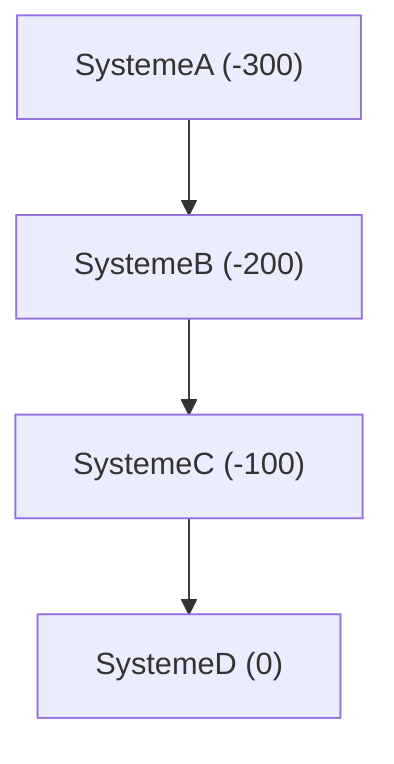
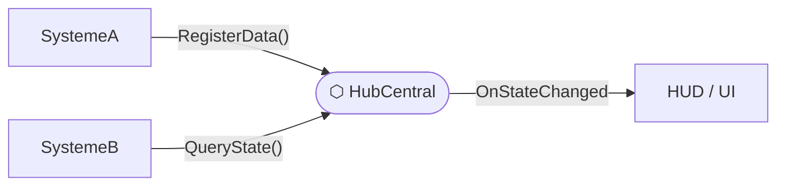
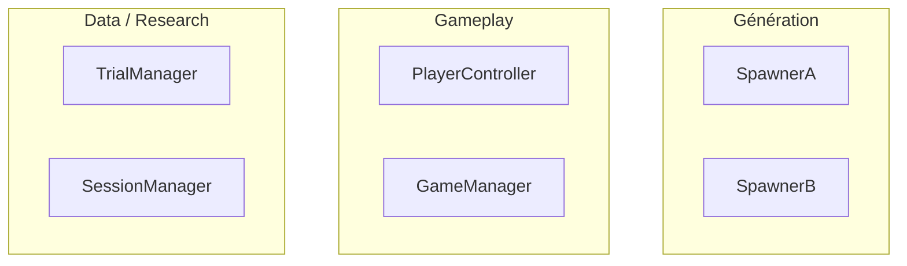

# Notice d'utilisation — Technical Design Document

> Ce document est le **guide de référence** pour créer et maintenir un TDD sur un projet Unity/C#.
> Pour chaque section, tu trouveras : son **rôle**, le **format attendu**, et un **exemple concret**.
> Le document à remplir est `TDD_Template_MockUp.md`.

---

## Table des matières

- [En-tête du document](#en-tête-du-document)
- [1. Vue d'ensemble du projet](#1-vue-densemble-du-projet)
- [2. Architecture globale](#2-architecture-globale-du-projet)
- [3. Systèmes de gameplay](#3-systèmes-de-gameplay)
- [4. Systèmes Core](#4-systèmes-core)
- [5. Gestion des données](#5-gestion-des-données)
- [6. Optimisations et performance](#6-optimisations-et-performance)
- [7. Pipeline et outils](#7-pipeline-et-outils)
- [8. Risques techniques](#8-risques-techniques-et-mitigations)
- [9. Roadmap technique](#9-roadmap-technique)
- [10. Références et ressources](#10-références-et-ressources)
- [Changelog](#changelog-du-document)

---

## En-tête du document

**Rôle :** Identifier le document en un coup d'œil. Doit être mis à jour à chaque modification majeure.

**Format :** Tableau à deux colonnes. La colonne gauche est fixe, la droite est à remplir.

**Règles :**

- `Version` : suit le format `MAJEUR.MINEUR` — incrémenter le mineur pour une mise à jour courante, le majeur pour une refonte structurelle
- `Dernière MAJ` : date au format `JJ/MM/AA`
- `Auteur(s)` : pseudos ou noms, séparés par une virgule si plusieurs

**Exemple :**

| Nom du projet :    | Dark Hollow           |
| :----------------- | :-------------------- |
| **Version :**      | 1.3                   |
| **Dernière MAJ :** | 17/02/26              |
| **Auteur(s) :**    | @alice, @bob          |
| **Moteur :**       | Unity 2022.3.12f1 LTS |
| **Langage :**      | C#                    |

---

## 1. Vue d'ensemble du projet

### 1.1 Résumé technique

**Rôle :** Donner le contexte technique global en 3 à 5 lignes. C'est la première chose que lit un nouveau collaborateur. Ne pas décrire le gameplay ici — uniquement la dimension technique.

**Format :** Texte libre, court. 3 à 5 phrases maximum.

**À inclure :** genre technique, plateforme(s) cible(s), moteur + version, caractéristiques techniques distinctives.

**Exemple :**

> Jeu de plateformes 2D en pixel art, multijoueur local 1-4 joueurs, ciblant PC et Nintendo Switch.
> Basé sur Unity 2022.3 LTS. Architecture orientée ScriptableObjects pour faciliter le travail des designers.
> Pas de réseau : toute la logique est locale.

---

### 1.2 Objectifs techniques prioritaires

**Rôle :** Définir les critères de succès technique du projet. Sert de boussole pour les décisions d'architecture.

**Format :** Liste à puces. Chaque item est court et mesurable si possible.

**Règle :** 4 à 6 objectifs maximum. Au-delà, tout devient prioritaire, donc rien ne l'est.

**Exemple :**

- Performance : 60 FPS stable sur Switch en mode portable
- Découplage : aucun système de gameplay ne référence directement un autre
- Itérabilité : les designers peuvent créer du contenu sans toucher au code
- Maintenabilité : conventions de code respectées et vérifiées en review

---

### 1.3 Contraintes techniques

**Rôle :** Documenter les limites non négociables imposées par la plateforme, l'éditeur ou le budget. Différent des objectifs : une contrainte s'impose, un objectif se vise.

**Format :** Liste à puces avec la contrainte en gras suivie de sa valeur.

**Exemple :**

- **Mémoire RAM :** 1 GB max (contrainte Switch)
- **Taille du build :** < 200 MB (contrainte eShop)
- **Compatibilité OS :** Windows 10+ / macOS 12+
- **Résolution :** 1920×1080 minimum, UI scalable jusqu'à 4K

---

## 2. Architecture globale du projet

### 2.1 Structure des dossiers

**Rôle :** Standardiser l'organisation des fichiers dans le projet Unity. Évite que chaque développeur range les assets à sa façon.

**Format :** Arborescence en texte avec des commentaires `#` pour expliquer le rôle de chaque dossier clé.

**Règles :**

- Préfixer le dossier principal du projet avec `_` pour qu'il remonte en haut dans l'explorateur Unity
- Séparer clairement les assets du projet (`_Project/`) des assets tiers (`Plugins/`)
- Un dossier = une responsabilité claire

**Exemple :**

```
Assets/
├── _Project/
│   ├── Scripts/
│   │   ├── Core/        # GameManager, EventSystem, SaveSystem
│   │   ├── Gameplay/    # Player, Enemies, Combat, Inventory
│   │   ├── UI/          # HUD, Menus, Popups
│   │   └── Utilities/   # Extensions, Helpers, Math
│   ├── Prefabs/
│   ├── ScriptableObjects/
│   └── Scenes/
├── Art/
├── Audio/
└── Plugins/             # Assets tiers (DOTween, etc.)
```

---

### 2.2 Diagramme d'architecture système

**Rôle :** Représenter visuellement l'architecture sous plusieurs angles complémentaires.
Un seul diagramme ne suffit pas à répondre à toutes les questions — chaque vue répond
à une question précise et s'adresse à un lecteur dans un contexte différent.

**Format :** Plusieurs blocs Mermaid organisés par vue, chacun précédé d'une ligne
`> Répond à :` qui explicite sa question d'orientation.

**Règles :**

- Les vues A et B sont obligatoires dès que l'architecture comporte plus de 3 systèmes
- La vue C est optionnelle — l'ajouter si le projet a des domaines fonctionnels clairement séparés
- Un diagramme qui dépasse 15 nœuds doit être découpé (voir règle de lisibilité ci-dessous)
- Ces diagrammes restent à un niveau macro — pas de classes individuelles, pas de méthodes
- Claude Code régénère ces vues à chaque mise à jour qui impacte l'architecture globale

---

**Vue A — Ordre d'initialisation**

> Répond à : _dans quel ordre les systèmes démarrent-ils ?_

Destinataire : un dev qui rejoint le projet ou qui debug un problème d'initialisation.
Doit montrer : tous les systèmes avec leur `[DefaultExecutionOrder]`, les dépendances
d'initialisation (A doit exister avant B pour que B puisse fonctionner).



---

**Vue B — Data Flow**

> Répond à : _qui communique avec qui, et via quoi ?_

Destinataire : un dev qui veut comprendre où transige une donnée ou quel système
appeler pour déclencher un comportement.
Doit montrer : le hub central du projet mis en évidence, les arêtes labelisées avec
le nom de la méthode ou de l'event, la direction du flux.



---

**Vue C — Ownership / Domaines** _(optionnelle)_

> Répond à : _qui est responsable de quoi ?_

Destinataire : un dev ou un lead qui veut comprendre la découpe fonctionnelle
du projet sans entrer dans les détails d'implémentation.
Doit montrer : des `subgraph` par domaine fonctionnel, chaque système rangé
dans son domaine.



---

**Règle de lisibilité**

Un diagramme qui dépasse 15 nœuds devient illisible. Stratégie de découpage
par ordre de préférence :

1. Extraire un sous-système dans un diagramme séparé avec une référence
   `→ voir section X.X`
2. Utiliser des `subgraph` pour regrouper visuellement sans multiplier les fichiers
3. Simplifier en ne montrant que les relations directes — pas les relations transitives

**Exemple :**

```
→ voir section 3.1 — BugCloudSpawner pour le détail du flux interne du spawn
```

### 2.3 Patterns utilisés

**Rôle :** Recenser les design patterns retenus pour le projet avec leur justification. Évite de les réexpliquer à chaque système et sert de référence pour les nouveaux membres.

**Format :** Tableau à 3 colonnes — Pattern / Utilisation concrète / Justification du choix.

**Règle :** Ne lister que les patterns effectivement utilisés dans le projet, pas une liste exhaustive de patterns connus.

**Exemple :**

| Pattern       | Utilisation                 | Justification                                                 |
| :------------ | :-------------------------- | :------------------------------------------------------------ |
| Singleton     | GameManager, AudioManager   | Accès global unique, cycle de vie indépendant des scènes      |
| Observer      | Event System (GameEventSO)  | Découplage fort entre émetteur et récepteur                   |
| Object Pool   | Projectiles, particules VFX | Évite le GC pressure en évitant Instantiate/Destroy fréquents |
| State Machine | États du joueur, IA ennemis | Transitions explicites, lisibles et extensibles               |

---

## 3. Systèmes de gameplay

> **Principe :** Chaque système de gameplay (Combat, Inventory, Dialogue...) est documenté avec la même structure de 7 sous-sections. Ajouter un bloc `## 3.X` par système.

### 3.X.1 Responsabilités

**Rôle :** Délimiter clairement ce que fait ce système — et implicitement, ce qu'il ne fait PAS. C'est le contrat du système.

**Format :** Liste à puces, verbes d'action à l'infinitif. 4 à 6 items maximum.

**Règle :** Si la liste dépasse 6 items, le système fait probablement trop de choses — envisager de le découper.

**Exemple :**

- Détecter les collisions entre hitbox d'attaque et hurtbox de cible
- Calculer les dégâts en appliquant les formules de résistance
- Déclencher les feedbacks visuels et audio associés au hit
- Gérer les invincibilité frames (i-frames) après réception d'un coup

---

### 3.X.2 Composants clés (Data Model)

**Rôle :** Documenter les classes principales du système avec leurs variables et méthodes publiques importantes. C'est la référence API du système.

**Format :**

1. Pour chaque fichier `.cs` concerné : `→ **NomFichier.cs** : description en une ligne`
2. Un extrait de code montrant la structure de la classe (pas l'implémentation)
3. Un tableau Variable/Méthode | Type | Description

**Règles :**

- Le code montré est une **signature**, pas une implémentation — pas de logique dans les exemples
- Le tableau ne liste que les membres **publics ou sérialisés** pertinents pour les autres systèmes
- Utiliser `MonoBehaviour`, `ScriptableObject` ou `[Serializable]` selon le cas d'usage

**Exemple :**

→ **HealthSystem.cs** : MonoBehaviour gérant les points de vie et la mort d'une entité.

```csharp
public class HealthSystem : MonoBehaviour
{
    [SerializeField] private int _maxHealth = 100;
    private int _currentHealth;
}
```

| Variable / Méthode     | Type      | Description                                   |
| :--------------------- | :-------- | :-------------------------------------------- |
| \_maxHealth            | int       | Points de vie maximum (défaut : 100)          |
| CurrentHealth          | int (get) | Points de vie actuels, lecture seule          |
| TakeDamage(int amount) | Méthode   | Applique des dégâts, déclenche OnDamaged      |
| Heal(int amount)       | Méthode   | Restaure des PV dans la limite de \_maxHealth |

---

### 3.X.3 Dépendances

**Rôle :** Cartographier les relations du système avec le reste du projet. Permet d'identifier l'impact d'une modification.

**Format :** 3 entrées fixes en liste à puces bold/valeur.

**Règle :** Être précis — nommer les classes ou events exacts, pas juste "le système X".

**Exemple :**

- **Nécessite :** `HealthSystem` (sur la cible), `Animator` (pour les animations de hit)
- **Communique avec :** `UIManager` (mise à jour health bar), `AudioManager` (sons de hit)
- **Déclenche :** `OnDamageDealt(int, GameObject)`, `OnEntityDeath(GameObject)`

---

### 3.X.4 Diagramme de flux (Data Flow)

**Rôle :** Montrer le chemin d'une action du joueur jusqu'à son résultat dans le système. Aide à comprendre l'ordre des opérations.

**Format :**

1. Lien Figma vers le diagramme détaillé
2. Version texte linéaire avec `→` pour les flux normaux et branches pour les conditions

**Règle :** Le flux texte doit tenir sur 3 à 5 lignes — si c'est plus long, le diagramme Figma est suffisant.

**Exemple :**

**🔗 Lien Figma :** [Combat Flow v1.1](https://figma.com/...)

**Backup texte :**

```
Player Input → Animation Attack → Hitbox Active
  → Hit Detected ?
    → [Oui] Calculate Damage → Apply to HealthSystem → Trigger Feedback
    → [Non] Miss SFX → End
```

---

### 3.X.5 Formules et règles métier

**Rôle :** Centraliser toutes les formules de calcul et les règles logiques du système. Source de vérité pour les valeurs numériques.

**Format :** Bloc de code pour les formules mathématiques. Texte pour les règles conditionnelles.

**Règles :**

- Nommer les variables avec les mêmes noms que dans le code
- Documenter les valeurs par défaut et les bornes min/max si elles existent
- Si une formule change suite à un playtest, mettre à jour ici ET dans le Journal

**Exemple :**

```
Dégâts finaux  = max(1, (ATK × ComboMultiplier) - DEF)
Chance critique = BASE_CRIT + (LUCK × 0.1)          -- en %
Durée i-frames  = 0.5s fixe après tout hit reçu
ComboMultiplier = 1.0 / 1.2 / 1.5 (hits 1 / 2 / 3+)
```

> Règle : les dégâts ne peuvent jamais être inférieurs à 1, même avec une DEF très haute.

---

### 3.X.6 Points d'attention

**Rôle :** Signaler les zones à risque connues — edge cases, problèmes de performance, dette technique identifiée. Évite que quelqu'un retombe dans un piège déjà repéré.

**Format :** Liste à puces avec un tag visuel :

- `⚠️ Edge case :` pour les cas limites à gérer
- `⚠️ Performance :` pour les risques de coût CPU/GPU
- `🔧 À optimiser :` pour la dette technique connue

**Exemple :**

- **⚠️ Edge case :** Deux attaques arrivant dans le même frame — actuellement le dernier hit l'emporte, à valider avec le GD
- **⚠️ Performance :** Les raycasts de détection sont limités à 3 par frame — ne pas augmenter sans profiling
- **🔧 À optimiser :** Les hitboxes sont des GameObjects actifs — migrer vers un pool si > 20 ennemis simultanés

---

### 3.X.7 Journal d'implémentation

**Rôle :** Tracer l'historique des décisions techniques sur ce système. Répond à la question "pourquoi c'est fait comme ça ?". Indispensable pour l'onboarding et le debug.

**Format :** Tableau chronologique Date | Développeur | Note.

**Règles :**

- Ajouter une entrée à chaque décision technique significative (pas pour chaque commit)
- Inclure les bugs importants et leur résolution
- Les entrées sont en ordre chronologique, la plus récente en bas

**Exemple :**

| Date     | Développeur | Note / Décision Technique                                                                                                    |
| :------- | :---------- | :--------------------------------------------------------------------------------------------------------------------------- |
| 10/01/26 | @alice      | Choix d'utiliser des OverlapCircle plutôt que des triggers — plus de contrôle sur le timing d'activation.                    |
| 28/01/26 | @bob        | Bug : les i-frames ne se réinitialisaient pas si le joueur mourait pendant leur durée. Corrigé via reset forcé dans OnDeath. |

---

## 4. Systèmes Core

> **Principe :** Les systèmes Core sont des fondations transversales (GameManager, EventSystem, InputSystem...). Leur structure est identique aux systèmes de Gameplay, à deux différences : ils n'ont pas de **Diagramme de flux** (leur logique est structurelle, pas séquentielle) ni de **Formules métier** (ils ne contiennent pas de règles de gameplay). En remplacement, ils ont une sous-section **Approche retenue & alternatives évaluées** qui trace la décision d'architecture.

### 4.X.1 Responsabilités

> Même format que `3.X.1`. Délimiter ce que fait le système Core.

**Exemple :**

- Maintenir l'état global du jeu (MainMenu, Gameplay, Paused, GameOver)
- Orchestrer les transitions entre scènes
- Servir de point d'entrée unique pour les autres systèmes

---

### 4.X.2 Composants clés (Data Model)

> Même format que `3.X.2`. Documenter les classes et leur API publique.

**Exemple :**

→ **GameManager.cs** : Singleton gérant le cycle de vie global du jeu.

```csharp
public class GameManager : MonoBehaviour
{
    public static GameManager Instance { get; private set; }
    private IGameState _currentState;
}
```

| Variable / Méthode      | Type             | Description                            |
| :---------------------- | :--------------- | :------------------------------------- |
| Instance                | GameManager      | Référence statique globale (Singleton) |
| CurrentState            | IGameState (get) | État actif en lecture seule            |
| ChangeState(IGameState) | Méthode          | Transition vers un nouvel état         |

---

### 4.X.3 Dépendances

> Même format que `3.X.3`. Pour les systèmes Core, le sens des dépendances est souvent inversé : ce sont les autres systèmes qui dépendent du Core, rarement l'inverse.

**Exemple :**

- **Est utilisé par :** Tous les systèmes (accès via `GameManager.Instance`)
- **Délègue à :** `SaveSystem` (persistance), `SceneLoader` (transitions)

---

### 4.X.4 Approche retenue & alternatives évaluées

**Rôle :** Documenter le choix d'architecture ou de technologie retenu pour ce système Core, ainsi que les alternatives considérées. C'est un **ADR** (Architecture Decision Record) — une trace de décision qui explique le "pourquoi" pour les futurs développeurs.

**Format :** Une ligne de décision + tableau comparatif des approches.

**Règle :** Toujours inclure au moins une alternative, même si elle était clairement sous-optimale — cela montre que le choix a été réfléchi et évite de reconsidérer les mêmes options plus tard.

**Exemple :**

**Pattern retenu :** Singleton + State Machine

| Approche                         | Avantages                                    | Inconvénients                             |
| :------------------------------- | :------------------------------------------- | :---------------------------------------- |
| ✅ **Singleton + State Machine** | Simple, accès global, transitions explicites | Difficile à tester unitairement           |
| ServiceLocator                   | Testable, moins de couplage global           | Complexité injustifiée pour ce projet     |
| SceneManager seul                | Zéro overhead                                | Pas de gestion d'état, logique éparpillée |

---

### 4.X.5 Journal d'implémentation

> Même format que `3.X.7`. Tracer les décisions et corrections sur ce système.

**Exemple :**

| Date     | Développeur | Note / Décision Technique                                                                    |
| :------- | :---------- | :------------------------------------------------------------------------------------------- |
| 05/01/26 | @alice      | Ajout d'un état `Loading` pour gérer l'async scene loading sans bloquer le thread principal. |

---

## 5. Gestion des données

### 5.1 ScriptableObjects utilisés

**Rôle :** Recenser tous les ScriptableObjects du projet avec leur rôle. Évite les doublons et aide les designers à trouver rapidement quel SO créer pour quel besoin.

**Format :** Tableau SO Type | Usage | Exemple d'instance.

**Règle :** Le nom du SO Type doit correspondre exactement au nom de la classe C#.

**Exemple :**

| SO Type      | Usage                                            | Exemple                        |
| :----------- | :----------------------------------------------- | :----------------------------- |
| WeaponData   | Définit les stats d'une arme                     | `SO_Sword_Iron`, `SO_Bow_Wood` |
| EnemyData    | Définit le comportement et les stats d'un ennemi | `SO_Goblin_Warrior`            |
| GameSettings | Paramètres globaux modifiables sans recompiler   | `SO_GameSettings_Default`      |

---

### 5.2 Système de sauvegarde

**Rôle :** Documenter le format, l'emplacement et la structure des données sauvegardées. Référence en cas de bug de save ou de migration de format.

**Format :**

- Format et emplacement en gras/valeur
- Structure JSON en bloc de code
- Liste des alternatives évaluées

**Règles :**

- Documenter la version du format de save (ex: `"saveVersion": 2`) pour gérer les migrations
- Si le format change, ajouter une entrée dans le Changelog du document

**Exemple :**

**Format :** JSON via `JsonUtility`
**Emplacement :** `Application.persistentDataPath/save.json`
**Version du format :** 2

```json
{
  "saveVersion": 2,
  "playerData": {
    "health": 80,
    "position": { "x": 12.5, "y": 0.0, "z": -3.2 }
  },
  "progression": {
    "currentLevel": "Level_03",
    "unlockedAbilities": ["dash", "wallJump"]
  }
}
```

**Alternatives évaluées :**

- **Binary :** Plus performant et moins lisible, protège légèrement contre la triche — écarté car debug difficile
- **PlayerPrefs :** Trop limité pour des données structurées complexes

---

## 6. Optimisations et performance

### 6.1 Profiling cibles

**Rôle :** Définir les seuils de performance acceptables. Ces valeurs sont les critères d'acceptance pour la livraison.

**Format :** Liste à puces avec la métrique en gras et sa valeur cible.

**Règle :** Ces valeurs doivent être mesurées sur la plateforme la moins puissante ciblée, pas sur la machine de dev.

**Exemple :**

- **CPU :** < 16.6ms par frame (60 FPS) sur Switch en mode portable
- **Mémoire :** < 800 MB allocated
- **Draw Calls :** < 300 par frame
- **Texture Memory :** < 400 MB

---

### 6.2 Stratégies d'optimisation

**Rôle :** Recenser les techniques d'optimisation appliquées ou planifiées, par domaine.

**Format :** Tableau Domaine | Technique | Implémentation concrète.

**Règle :** La colonne "Implémentation" doit être assez précise pour qu'un dev sache exactement quoi faire.

**Exemple :**

| Domaine   | Technique        | Implémentation                                                          |
| :-------- | :--------------- | :---------------------------------------------------------------------- |
| Rendering | Sprite Atlasing  | Tous les sprites UI packés par thème via Sprite Atlas                   |
| Code      | Object Pooling   | Pool de 30 projectiles initialisé au démarrage de la scène de jeu       |
| Physics   | Layer Matrix     | Collisions désactivées entre layers Enemy et Enemy                      |
| Audio     | AudioSource Pool | Maximum 8 sources audio simultanées, les plus anciennes sont recycléees |

---

### 6.3 LOD & Culling

**Rôle :** Documenter les stratégies de réduction de charge GPU selon la distance et la visibilité.

**Format :** Liste à puces avec la technique en gras et son statut/configuration.

**Exemple :**

- **Frustum Culling :** Actif par défaut dans Unity — rien à configurer
- **Occlusion Culling :** Baked sur les grandes scènes intérieures (> 50 objets statiques)
- **LOD Groups :** Non utilisé — projet 2D pixel art

---

## 7. Pipeline et outils

### 7.1 Outils de développement

**Rôle :** Lister les outils utilisés par l'équipe. Sert de référence pour l'onboarding d'un nouveau membre.

**Format :** Liste à puces avec l'outil en gras et sa version ou précision d'usage.

**Exemple :**

- **IDE :** JetBrains Rider 2024.1
- **Version control :** Git + GitHub — branches par feature, PR obligatoire pour merger sur `main`
- **Diagrammes :** Figma (architecture système), draw.io (flowcharts de gameplay)
- **Task tracking :** Notion — un ticket par feature ou bug

---

### 7.2 Conventions de code

**Rôle :** Standardiser le style de code pour que tous les fichiers soient lisibles par tous les membres de l'équipe.

**Format :** Bloc de code commenté avec un exemple par convention.

**Règle :** Ces conventions s'appliquent à tout le code du projet sans exception. En cas de désaccord, ouvrir une discussion et mettre à jour ce document — ne pas déroger silencieusement.

**Exemple :**

```csharp
// Classes et MonoBehaviours : PascalCase
public class PlayerController : MonoBehaviour { }

// Méthodes publiques : PascalCase, verbe d'action
public void TakeDamage(int amount) { }

// Variables privées : _camelCase avec underscore
private int _currentHealth;

// Variables sérialisées (visibles dans Inspector) : _camelCase
[SerializeField] private float _moveSpeed = 5f;

// Constantes : UPPER_SNAKE_CASE
private const int MAX_JUMP_COUNT = 2;

// Events : OnNomEvenement (passé ou nominal)
public event Action<int> OnHealthChanged;
public event Action OnPlayerDied;

// ScriptableObjects : préfixe SO_ pour les assets dans le projet
// Exemple de nom d'asset : SO_Goblin_Warrior, SO_Sword_Iron
```

---

### 7.3 Tests

**Rôle :** Définir la stratégie de test du projet — quoi tester, comment, avec quel outil.

**Format :** Liste à puces avec le type de test en gras et son périmètre.

**Exemple :**

- **Unit tests :** Toutes les formules de calcul (dégâts, progression XP, poids inventaire) — framework NUnit via Unity Test Framework
- **Play mode tests :** Séquences critiques (mort du joueur, chargement de save, transition de scène)
- **Tests manuels :** Sessions de playtest hebdomadaires, résultats consignés dans le tracker Notion

---

## 8. Risques techniques et mitigations

**Rôle :** Anticiper les problèmes techniques qui pourraient compromettre le projet. Chaque risque identifié est une opportunité de prévenir plutôt que de subir.

**Format :** Tableau Risque | Impact (Faible/Moyen/Élevé) | Probabilité | Mitigation concrète.

**Règle :** La mitigation doit être actionnable — une phrase qui décrit une action précise, pas un vœu pieux.

**Exemple :**

| Risque                              | Impact | Probabilité | Mitigation                                                                          |
| :---------------------------------- | :----- | :---------- | :---------------------------------------------------------------------------------- |
| Performance insuffisante sur Switch | Élevé  | Moyenne     | Profiling mensuel dès le prototype, budget draw calls défini section 6.1            |
| Corruption de fichier de save       | Élevé  | Faible      | Backup automatique de la save précédente + validation du JSON au chargement         |
| Refactoring majeur du GameManager   | Moyen  | Faible      | Architecture State Machine abstraite derrière `IGameState` pour limiter le couplage |

---

## 9. Roadmap technique

**Rôle :** Planifier le développement technique par phases cohérentes. Permet de s'assurer que les fondations sont posées avant de construire les systèmes de gameplay.

**Format :** Une section `##` par phase avec son nom, sa fenêtre temporelle et une liste des livrables techniques attendus.

**Règle :** Chaque phase doit avoir des livrables vérifiables — pas "faire le combat" mais "CombatSystem avec détection de hits et calcul de dégâts jouable".

**Exemple :**

## Phase 1 : Fondations (Semaines 1-3)

- GameManager avec State Machine (4 états : Menu, Gameplay, Paused, GameOver)
- InputReader configuré pour clavier/manette
- PlayerController : déplacement et saut basiques
- EventSystem (GameEventSO) opérationnel

## Phase 2 : Gameplay Core (Semaines 4-9)

- CombatSystem : attaque, hitbox, calcul de dégâts
- HealthSystem sur Player et Enemies
- InventorySystem avec stacking et persistance

---

## 10. Références et ressources

**Rôle :** Centraliser les liens vers la documentation externe, les ressources d'apprentissage et les assets tiers utilisés dans le projet.

**Format :** Sous-sections thématiques avec des listes de liens.

**Règle :** Vérifier que les liens sont valides lors de chaque revue mensuelle du TDD.

**Exemple :**

### Documentation Unity

- [New Input System](https://docs.unity3d.com/Packages/com.unity.inputsystem@latest)
- [ScriptableObjects - Best Practices](https://unity.com/how-to/architect-game-code-scriptable-objects)
- [Unity Profiler](https://docs.unity3d.com/Manual/Profiler.html)

### Références d'architecture

- [Game Programming Patterns — R. Nystrom](https://gameprogrammingpatterns.com/) _(lecture recommandée)_
- [Unite 2017 — Game Architecture with ScriptableObjects](https://www.youtube.com/watch?v=raQ3iHhE_Kk)

### Assets tiers utilisés

| Asset       | Version   | Usage                              |
| :---------- | :-------- | :--------------------------------- |
| DOTween Pro | 1.2.745   | Tweening animations UI et gameplay |
| [Nom asset] | [Version] | [Usage]                            |

### Glossaire technique

- **i-frames :** Invincibility frames — période d'invulnérabilité après réception d'un coup
- **GC Pressure :** Pression sur le Garbage Collector C# causée par des allocations mémoire fréquentes
- **SO :** ScriptableObject — asset Unity contenant des données sérialisées, sans cycle de vie de scène
- **ADR :** Architecture Decision Record — trace écrite d'une décision d'architecture et de son raisonnement
- **Pooling :** Réutilisation d'objets pré-instanciés plutôt que Instantiate/Destroy pour éviter le GC

---

## Changelog du document

**Rôle :** Tracer l'historique des modifications du TDD lui-même — pas du code, mais du document.

**Format :** Tableau chronologique Date | Version | Changements.

**Règles :**

- Incrémenter la version en en-tête à chaque entrée
- Une entrée = une session de travail sur le document, pas une modification par ligne
- La version majeure (ex: `2.0`) signale une restructuration du document

**Exemple :**

| Date     | Version | Changements                                                      |
| :------- | :------ | :--------------------------------------------------------------- |
| 17/02/26 | 1.0     | Création initiale du document                                    |
| 03/03/26 | 1.1     | Ajout section 3.3 (DialogueSystem) + mise à jour roadmap Phase 2 |
| 15/03/26 | 1.2     | Formules de dégâts révisées après playtest #2                    |
