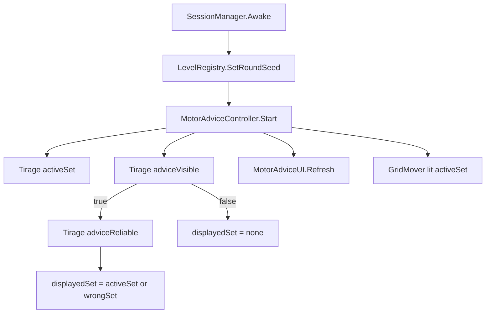

# Spec Technique — Motor Advice

> Produit par le Role 3 (Architecture Technique).
> Traduit la spec fonctionnelle en choix d implementation Unity/C#.

**Date :** 2026-03-12
**Statut :** draft
**Chantier :** Motor Advice
**Spec fonc associee :** Docs/specs/MotorAdvice/spec-fonc.md

---

## 1. Contexte technique

- Entree : spec fonc Motor Advice (tirage du set actif par essai, advice visible/fiable probabiliste).
- Contrainte : pipeline Research Parameter (SessionManager.Instance -> lecture directe par les scripts).
- Contrainte : pas de changement d architecture majeur, pas de dependance aux autres advisors.
- Le cycle de round est base sur reload de scene (RestartRound). Le set actif peut etre tire en Start.

Alertes :
- Le logging CSV n est pas specifie (colonnes TBD). On ne touche pas TrialData pour ce chantier.

---

## 2. Architecture

### 2.1 Nouveaux composants

1) **MotorAdviceController.cs** (Systeme gameplay)
- Responsabilite : tirer le set actif, tirer l advice visible/fiable, exposer le set affiche.
- Detient l etat par essai (activeSet, adviceVisible, adviceReliable, displayedSet).
- Source RNG : `LevelRegistry.Instance.CreateRng("MotorAdvice")` pour reproductibilite.

2) **MotorAdviceUI.cs** (UI)
- Responsabilite : afficher ou masquer le bloc de texte en bas a gauche.
- Depend de TMP_Text.

### 2.2 Modifications existantes

- **SessionManager.cs** : ajouter deux params recherche (float 0-1) :
  - `motorAdviceVisibleProbability` (CLI: `motorAdviceVisible=F`)
  - `motorAdviceReliableProbability` (CLI: `motorAdviceReliable=F`)
- **GridMover.cs** : remplacer la lecture des fleches par un mapping base sur le set actif (si MotorAdviceController present). Fallback sur fleches si composant absent.

### 2.3 Diagramme (flux local)



---

## 3. Contrats d interface (pseudo-code)

### 3.1 MotorAdviceController

```csharp
public enum MotorKeySet
{
    ZQSD,
    TFGH,
    IJKL,
    None
}

public class MotorAdviceController : MonoBehaviour
{
    public static MotorAdviceController Instance { get; private set; }

    public MotorKeySet ActiveSet { get; private set; }
    public MotorKeySet DisplayedSet { get; private set; }
    public bool AdviceVisible { get; private set; }
    public bool AdviceReliable { get; private set; }

    public event Action OnAdviceChanged;

    void Start(); // tirages + set event
    bool TryGetStep(out Vector2Int step); // lit Keyboard.current selon ActiveSet
}
```

### 3.2 MotorAdviceUI

```csharp
public class MotorAdviceUI : MonoBehaviour
{
    [SerializeField] TMP_Text _label;
    [SerializeField] GameObject _root;

    void Start(); // subscribe + refresh
    void OnDestroy(); // unsubscribe
    void Refresh(); // active/inactive + texte
}
```

### 3.3 GridMover (extrait)

```csharp
Vector2Int ReadStep()
{
    if (MotorAdviceController.Instance != null)
    {
        if (MotorAdviceController.Instance.TryGetStep(out var step))
            return step;
        return Vector2Int.zero;
    }

    // Fallback legacy (fleches) si pas de controller
    ...
}
```

---

## 4. Structures de donnees

### 4.1 SessionManager (params recherche)

| Champ | Type | Defaut | CLI | Description |
|---|---|---|---|---|
| motorAdviceVisibleProbability | float | 1.0 | motorAdviceVisible=F | Proba d affichage du motor advice |
| motorAdviceReliableProbability | float | 1.0 | motorAdviceReliable=F | Proba que l advice affiche le bon set |

### 4.2 MotorKeySet

- `ZQSD` : Haut=Z, Gauche=Q, Bas=S, Droite=D
- `TFGH` : Haut=T, Gauche=F, Bas=G, Droite=H
- `IJKL` : Haut=I, Gauche=J, Bas=K, Droite=L
- `None` : aucun set (utilise pour displayedSet quand adviceVisible=false)

---

## 5. Flux de donnees et sequences

### 5.1 Tirage par essai

1) `SessionManager.Awake` fixe la seed via `LevelRegistry.SetRoundSeed`.
2) `MotorAdviceController.Start` recupere un RNG via `LevelRegistry.CreateRng("MotorAdvice")`.
3) Tirage `ActiveSet` equiprobable parmi 3 sets.
4) Tirage `AdviceVisible = rng.NextDouble() < motorAdviceVisibleProbability`.
5) Si visible :
   - `AdviceReliable = rng.NextDouble() < motorAdviceReliableProbability`
   - `DisplayedSet = AdviceReliable ? ActiveSet : otherSet`
6) Emission `OnAdviceChanged` (UI se met a jour).

---

## 6. Gestion des erreurs

- Si `SessionManager.Instance` est null : log warning, fallback `motorAdviceVisibleProbability=1` et `motorAdviceReliableProbability=1`.
- Si `LevelRegistry.Instance` est null : fallback RNG `new System.Random()` (non seeded) + log warning.
- Si `Keyboard.current` est null : `TryGetStep` renvoie false.

---

## 7. Nettoyage et cycle de vie

- Scene reload => nouvel essai => `Start()` recalcule set + advice.
- Pas de cleanup specifique (pas de persistance inter-trial).

---

## 8. Strategie de test (manuelle)

1) Avec `motorAdviceVisible=1` et `motorAdviceReliable=1` : le set affiche doit etre le set actif et le mouvement doit correspondre.
2) Avec `motorAdviceVisible=0` : aucun UI affiche, mouvement uniquement via set actif (essai par tentative).
3) Avec `motorAdviceVisible=1` et `motorAdviceReliable=0` : UI affiche un set incorrect, mouvement fonctionnel sur un autre set.
4) Verifier que les fleches ne bougent pas si MotorAdviceController est present.

---

## 9. Conventions

- Scripts : `Assets/Game/Scripts/Systems/MotorAdviceController.cs`, `Assets/Game/Scripts/UI/MotorAdviceUI.cs`.
- Log format : `[MotorAdvice] ...`.
- Utiliser TMP_Text (coherent avec RoundUI).

---

## 10. Points en attente

- Mapping CSV V1 pour les donnees motor advice (non implemente).
- Texte exact d affichage (formatage) a valider si protocole impose un template.
