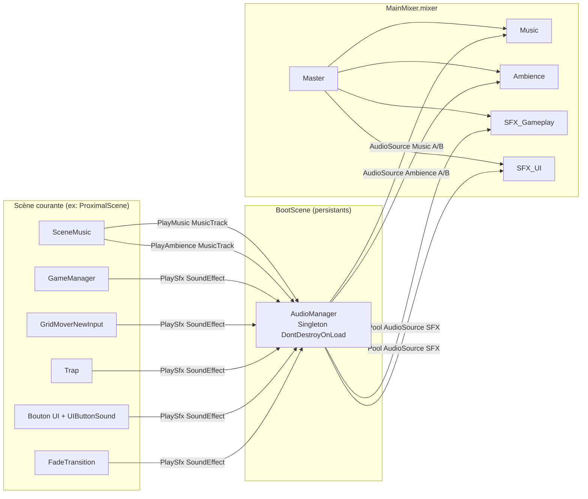
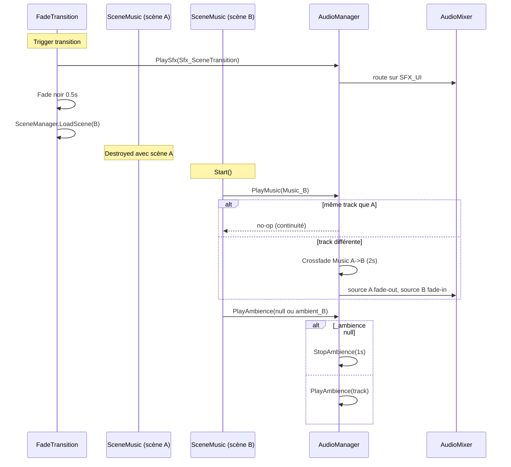
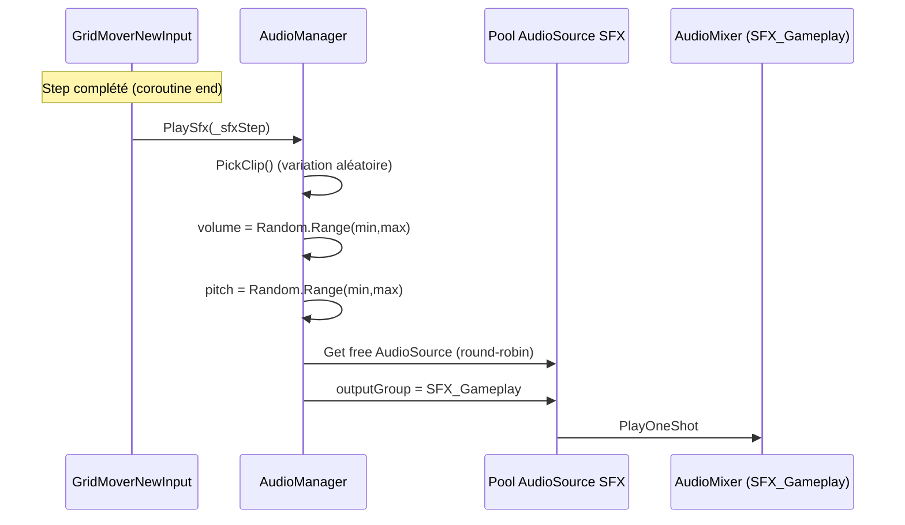

# Spec Technique — Sous-système Audio (Musique + SFX)

> Produit par le Rôle 3 (Architecture Technique).
> Traduit les décisions audio en plan d'implémentation Unity/C#.

**Date :** 2026-05-12
**Statut :** validé
**Chantier :** Audio (branche `system/bg-music`)
**Spec fonc en entrée :** _non produite_ — feature majoritairement infra. Le mapping musical/SFX est capturé directement dans cette spec (section 2.4) après dialogue de cadrage avec le développeur.
**Tickets associés :** `Docs/specs/audio/tickets.md` _(à produire par le Rôle 4)_

---

## 1. Contexte technique

### Spec fonctionnelle couverte

Le projet n'a **aucun audio** aujourd'hui (`Assets/Game/Audio/` vide, aucun `AudioSource` dans les 9 scènes, aucune référence `AudioClip` dans les 34 scripts). Le chantier introduit :

- **Musique** continue avec transitions propres sur les 9 scènes du flow.
- **SFX gameplay** : pas joueur, collecte bug vert/rouge, piège, ambient loop.
- **SFX UI** : clic bouton, transition de scène.
- **Infra settings** : volumes par groupe AudioMixer, persistance PlayerPrefs (sans UI dans ce chantier).

### Contraintes identifiées

- **Flow 9 scènes** orchestré par `FlowController` (persistant via `DontDestroyOnLoad`). Toute musique posée dans une scène se couperait au `SceneManager.LoadScene` → nécessite un manager persistant.
- **Pattern singleton** déjà standard dans le projet (`LevelRegistry`, `GameManager`, `FogController`, `FlowController`, `ApiClient`, `FadeTransition`). L'AudioManager doit suivre le même pattern pour la cohérence.
- **Aucun ScriptableObject** existant dans le projet — l'introduction de SO pour ce chantier inaugure le pattern data-driven et doit rester lisible/léger.
- **Aucun EventBus** centralisé — les couplages se font par `Action<T>` locaux ou références directes via `.Instance`. On ne crée pas d'EventBus juste pour l'audio (disproportionné).
- **WebGL cible probable** (cf. DEC-009) : compression Vorbis indispensable pour les musiques (.ogg streaming) et formats compatibles WebGL pour les SFX.
- **Ordre d'exécution** : l'AudioManager doit exister avant tout déclencheur de son. Valeur cible `[DefaultExecutionOrder(-350)]`, soit avant `LevelRegistry` (-300).

### Alertes

- **Pas de menu Settings dans ce chantier** : l'API `SetGroupVolume()` et le chargement PlayerPrefs sont prêts, mais l'UI sliders est reportée. Risque : si une démo a lieu avant les Settings, le volume reste figé sur les valeurs par défaut.
- **Assets audio non fournis** : la production sonore (musiques + SFX) est externe au scope code. Sans clips, la stack est testable mais silencieuse. Des placeholders peuvent être utilisés en dev.
- **Pas de FMOD/Wwise** : décision actée (DEC-016). Si la musique adaptative devient un besoin plus tard, la stack actuelle pourra être enrichie sans casser l'existant (vertical layering via plusieurs `AudioSource` empilés sur un même groupe).
- **Fallback dev hors BootScene** : si une scène est lancée directement depuis l'Editor sans passer par Boot, l'AudioManager n'existe pas. Stratégie retenue : `[RuntimeInitializeOnLoadMethod]` qui charge Boot si AudioManager absent en Editor (à confirmer en implémentation).

---

## 2. Architecture

### 2.1 Nouveaux composants

| Composant | Responsabilité | Type |
|:---|:---|:---|
| `AudioManager` | Singleton persistant. Joue musique/ambience/SFX via AudioMixer. Gère crossfade et volumes. | MonoBehaviour |
| `MusicTrack` | Données d'une piste musicale ou ambient (clip, volume cible, fades). | ScriptableObject |
| `SoundEffect` | Données d'un SFX one-shot (clip(s), channel, ranges volume/pitch). | ScriptableObject |
| `SceneMusic` | Déclencheur posé dans chaque scène. Appelle `AudioManager.PlayMusic/PlayAmbience` au Start. | MonoBehaviour |
| `UIButtonSound` | Composant `[RequireComponent(Button)]`. Joue un SFX UI au clic. | MonoBehaviour |
| `MainMixer.mixer` | AudioMixer avec 5 groupes (Master, Music, Ambience, SFX_Gameplay, SFX_UI). | Asset Unity |
| `AudioManager.prefab` | Prefab contenant l'`AudioManager` + ses `AudioSource` internes + mixer assigné. | Prefab |

### 2.2 Modifications de l'existant

| Composant existant | Modification | Impact |
|:---|:---|:---|
| `GameManager.cs` | Appels `AudioManager.Instance.PlaySfx(_sfxBugGreen / _sfxBugRed / _sfxTrap)` aux points d'événement existants (fin de round / collision piège). Champs `[SerializeField] SoundEffect` ajoutés. | Aucun changement de logique. Couplage sortant unique vers AudioManager. |
| `GridMoverNewInput.cs` | Appel `AudioManager.Instance.PlaySfx(_sfxStep)` à la fin de la coroutine de step. Champ `[SerializeField] SoundEffect _sfxStep`. | Aucun. SFX optionnel (si SO non assigné → no-op). |
| `Trap.cs` | Si la collision est gérée ici plutôt que dans `GameManager`, appel `AudioManager.Instance.PlaySfx(_sfxTrap)` dans `OnTriggerEnter`. | À arbitrer lors de l'implémentation : un seul des deux fichiers doit déclencher pour éviter le double-son. |
| `FadeTransition.cs` (persistant) | Appel `AudioManager.Instance.PlaySfx(_sfxSceneTransition)` au début du fade-out. | Aucun. Le SFX UI accompagne chaque transition. |
| Les 9 scènes `.unity` | Ajout d'un GameObject `[SceneMusic]` avec composant `SceneMusic` + références SO. | Modification scènes uniquement, pas de prefab partagé (chaque scène a sa config). |
| `BootScene.unity` | Ajout du prefab `AudioManager.prefab` instancié au démarrage, à côté de `FlowController` / `ApiClient` / `FadeTransition`. | AudioManager devient disponible globalement après Boot. |
| Boutons UI (Welcome, Consent, Intro, AdvisorChoice, DistalChoice, Questionnaire, EndSession) | Ajout du composant `UIButtonSound` + référence `Sfx_UI_Click`. | Tous les boutons gagnent un retour sonore. |

### 2.3 Diagramme d'architecture



### 2.4 Mapping musical et SFX (décisions actées)

**MusicTrack assets (3) :**

| Asset | Scènes utilisatrices |
|:---|:---|
| `Music_Pregame` | BootScene, WelcomeScene, ConsentScene, IntroScene, **EndSessionScene** (reprise) |
| `Music_Choice` | AdvisorChoiceScene, DistalChoiceScene |
| `Music_Gameplay` | ProximalScene, QuestionnaireScene |

**Ambient assets (1) :** `Ambience_Gameplay` (loop, posé sur ProximalScene uniquement).

**SoundEffect assets (gameplay) :**

| Asset | Déclencheur |
|:---|:---|
| `Sfx_PlayerStep` | Fin de coroutine step de `GridMoverNewInput` (variation pitch) |
| `Sfx_BugGreen` | Comptage bug vert dans `GameManager` (fin de round) |
| `Sfx_BugRed` | Comptage bug rouge dans `GameManager` (fin de round) |
| `Sfx_Trap` | Collision piège (`Trap.OnTriggerEnter` ou `GameManager`, à arbitrer) |

**SoundEffect assets (UI) :**

| Asset | Déclencheur |
|:---|:---|
| `Sfx_UI_Click` | Tous les boutons via `UIButtonSound` |
| `Sfx_SceneTransition` | Début du fade-out dans `FadeTransition` |

---

## 3. Contrats d'interface

### 3.1 `MusicTrack` (ScriptableObject)

```csharp
[CreateAssetMenu(menuName = "Audio/Music Track", fileName = "Music_")]
public class MusicTrack : ScriptableObject
{
    public AudioClip clip;
    [Range(0f, 1f)] public float targetVolume = 1f;
    public float fadeInDuration = 2f;
    public float fadeOutDuration = 2f;
    public bool loop = true;
}
```

**Dépendances :** aucune. Asset autonome.
**Utilisé par :** `AudioManager.PlayMusic/PlayAmbience`, `SceneMusic` (référence Inspector).

### 3.2 `SoundEffect` (ScriptableObject)

```csharp
public enum SfxChannel { Gameplay, UI }

[CreateAssetMenu(menuName = "Audio/Sound Effect", fileName = "Sfx_")]
public class SoundEffect : ScriptableObject
{
    public AudioClip[] clips;            // Une variation tirée aléatoirement à chaque PlaySfx
    public SfxChannel channel = SfxChannel.Gameplay;
    [Range(0f, 1f)] public float volumeMin = 0.9f;
    [Range(0f, 1f)] public float volumeMax = 1f;
    [Range(0.5f, 1.5f)] public float pitchMin = 0.95f;
    [Range(0.5f, 1.5f)] public float pitchMax = 1.05f;

    public AudioClip PickClip();         // Retourne un clip au hasard
}
```

**Note :** deux floats min/max plutôt qu'un attribut custom `MinMaxSlider` pour rester natif Unity.
**Dépendances :** aucune.
**Utilisé par :** `AudioManager.PlaySfx`, hooks dans scripts existants, `UIButtonSound`.

### 3.3 `AudioManager` (singleton persistant)

```csharp
[DefaultExecutionOrder(-350)]
public class AudioManager : MonoBehaviour
{
    public static AudioManager Instance { get; private set; }

    [Header("AudioMixer")]
    [SerializeField] private AudioMixer _mixer;
    [SerializeField] private AudioMixerGroup _musicGroup;
    [SerializeField] private AudioMixerGroup _ambienceGroup;
    [SerializeField] private AudioMixerGroup _sfxGameplayGroup;
    [SerializeField] private AudioMixerGroup _sfxUiGroup;

    [Header("Pool SFX")]
    [SerializeField] private int _sfxPoolSize = 8;

    // Précondition : appelée après Awake. AudioManager auto-créé via Boot ou fallback Editor.
    // Postcondition : si track est null ou identique à la track en cours -> no-op.
    //                 Sinon -> fade-out source A + fade-in source B (crossfade).
    public void PlayMusic(MusicTrack track);

    public void StopMusic(float fadeDuration = 1f);

    // Idem mais sur les sources Ambience, indépendant de Music.
    public void PlayAmbience(MusicTrack track);
    public void StopAmbience(float fadeDuration = 1f);

    // Précondition : sfx non null.
    // Postcondition : un AudioSource du pool joue le clip avec variation aléatoire vol/pitch.
    //                 Routage automatique sur le groupe correspondant au channel.
    public void PlaySfx(SoundEffect sfx);

    // Précondition : param exposé dans le mixer ("MasterVolume", "MusicVolume", etc.).
    // Postcondition : linear01 converti en dB (log10*20) et appliqué.
    public void SetGroupVolume(string param, float linear01);
    public float GetGroupVolume(string param);
}
```

**Dépendances :** `AudioMixer` Unity, `MusicTrack`, `SoundEffect`, `PlayerPrefs`.
**Utilisé par :** `SceneMusic`, `UIButtonSound`, `GameManager`, `GridMoverNewInput`, `Trap`, `FadeTransition`.

### 3.4 `SceneMusic` (par scène)

```csharp
public class SceneMusic : MonoBehaviour
{
    [SerializeField] private MusicTrack _music;
    [SerializeField] private MusicTrack _ambience;  // Optionnel

    private void Start()
    {
        if (AudioManager.Instance == null) return;   // Fallback dev silencieux
        if (_music != null) AudioManager.Instance.PlayMusic(_music);
        if (_ambience != null) AudioManager.Instance.PlayAmbience(_ambience);
        // Pas de StopAmbience si _ambience est null : le fade-out se fait au scène suivante via PlayAmbience(null) ?
        // À trancher : soit SceneMusic appelle StopAmbience() explicitement quand son champ est null,
        //              soit AudioManager garde l'ambient en cours jusqu'au prochain Play.
        // Décision : SceneMusic appelle StopAmbience() si _ambience est null pour éviter une persistance non voulue.
    }
}
```

**Dépendances :** `AudioManager.Instance`, `MusicTrack`.
**Utilisé par :** chaque scène du flow possède exactement une instance.

### 3.5 `UIButtonSound`

```csharp
[RequireComponent(typeof(UnityEngine.UI.Button))]
public class UIButtonSound : MonoBehaviour
{
    [SerializeField] private SoundEffect _clickSound;

    private void Awake()
    {
        if (_clickSound == null) return;
        GetComponent<UnityEngine.UI.Button>().onClick.AddListener(OnClick);
    }

    private void OnClick()
    {
        if (AudioManager.Instance != null)
            AudioManager.Instance.PlaySfx(_clickSound);
    }
}
```

**Dépendances :** `Button` (UnityEngine.UI), `AudioManager.Instance`.
**Utilisé par :** chaque bouton interactif des scènes du flow.

---

## 4. Structures de données

### Enums

```csharp
public enum SfxChannel
{
    Gameplay,    // Routé sur AudioMixerGroup "SFX_Gameplay"
    UI           // Routé sur AudioMixerGroup "SFX_UI"
}
```

### Constantes (params AudioMixer exposés)

```csharp
public static class AudioMixerParams
{
    public const string MasterVolume       = "MasterVolume";
    public const string MusicVolume        = "MusicVolume";
    public const string AmbienceVolume     = "AmbienceVolume";
    public const string SfxGameplayVolume  = "SfxGameplayVolume";
    public const string SfxUiVolume        = "SfxUIVolume";
}
```

### PlayerPrefs keys (persistance volumes)

| Clé PlayerPrefs | Type | Défaut |
|:---|:---|:---|
| `audio.master` | float (0-1) | 1.0 |
| `audio.music` | float (0-1) | 0.8 |
| `audio.ambience` | float (0-1) | 0.7 |
| `audio.sfx_gameplay` | float (0-1) | 1.0 |
| `audio.sfx_ui` | float (0-1) | 1.0 |

### Mapping CSV

**Hors scope.** Le sous-système audio n'écrit aucune donnée dans `trial_responses` (cf. DEC-011). Aucune colonne CSV à ajouter.

---

## 5. Flux de données et séquences

### 5.1 Séquence : changement de scène avec crossfade



### 5.2 Séquence : SFX gameplay



### 5.3 DefaultExecutionOrder

| Ordre | Système | Raison |
|:---|:---|:---|
| **-350** | `AudioManager` (nouveau) | Avant tout système gameplay susceptible de jouer un son. Crée Instance et charge volumes PlayerPrefs. |
| -300 | `LevelRegistry` (existant) | Inchangé. |
| -250 | `FogController` (existant) | Inchangé. |
| ... | ... | ... |
| 0 (défaut) | `SceneMusic` (nouveau) | Start() s'exécute après l'initialisation des managers. `AudioManager.Instance` garanti non-null. |

---

## 6. Gestion des erreurs

| Situation | Stratégie | Fallback |
|:---|:---|:---|
| `AudioManager.Instance == null` (scène lancée hors Boot en Editor) | Détection au `Start()` de `SceneMusic` / `UIButtonSound` | Return silencieux. Pas d'exception. Stratégie complémentaire : `[RuntimeInitializeOnLoadMethod]` qui force le chargement de Boot en Editor si AudioManager absent. |
| `MusicTrack.clip == null` | Test dans `AudioManager.PlayMusic` | Log warning + return. Pas de crash. |
| `SoundEffect.clips.Length == 0` | Test dans `AudioManager.PlaySfx` | Log warning + return. |
| Pool SFX saturé (tous les AudioSource occupés) | Round-robin : la nouvelle requête écrase la plus ancienne | Comportement standard. Si le pool est trop petit, augmenter `_sfxPoolSize` dans l'Inspector. |
| `_mixer` non assigné dans l'Inspector | Test à `Awake()` | Log erreur. Le manager continue mais aucun routage mixer (volume direct sur AudioSource). |
| PlayerPrefs corrompus / clés manquantes | Try/catch lors du Load | Valeurs par défaut appliquées. |

---

## 7. Nettoyage et cycle de vie

### Entre trials (rechargement ProximalScene)

| Composant | Ce qui est détruit | Ce qui est reset | Ordre |
|:---|:---|:---|:---|
| `AudioManager` (persistant) | Rien | Rien — la musique continue (no-op crossfade car track identique) | N/A |
| `SceneMusic` (local) | Détruit avec la scène | Recréé au reload, son `Start()` rappelle `PlayMusic(Music_Gameplay)` → no-op | 1 |
| AudioSources internes du pool SFX | Rien | Inchangés (persistants) | N/A |

**Conséquence importante :** la musique gameplay ne se coupe **jamais** entre trials. C'est précisément l'effet recherché.

### Cycle de vie d'une session complète

```
BootScene.Start
  └─ AudioManager.Awake (DontDestroyOnLoad + Load PlayerPrefs + Init pool)
  └─ SceneMusic[Boot].Start → PlayMusic(Music_Pregame) — démarrage froid, fade-in
[transitions...]
EndSessionScene
  └─ SceneMusic[End].Start → PlayMusic(Music_Pregame) — no-op si déjà cette track
  └─ Quit / Reload
```

### Pattern recommandé

Pas d'`ICleanable` ici. L'AudioManager est conçu pour être **stateless entre scènes** côté API publique : chaque scène redéclare ce qu'elle veut entendre, le manager calcule la différence et fade en conséquence.

---

## 8. Stratégie de test

### Scénarios de validation

| Scénario | Vérification | Données CSV attendues |
|:---|:---|:---|
| Lancer BootScene en Play Mode | `Music_Pregame` démarre avec fade-in 2s. AudioMixer "Music" meter actif. | N/A (audio sans logging CSV) |
| Welcome → Consent → Intro | Aucune coupure audio entre les 3 scènes (même track) | N/A |
| Intro → AdvisorChoice | Crossfade audible vers `Music_Choice` sur 2s | N/A |
| AdvisorChoice → DistalChoice | Pas de coupure (même track) | N/A |
| DistalChoice → ProximalScene | Crossfade vers `Music_Gameplay` + `Ambience_Gameplay` démarre simultanément sur le groupe Ambience | N/A |
| Step joueur dans ProximalScene | `Sfx_PlayerStep` joue avec variation pitch perceptible | N/A |
| Collecte bug vert / rouge | `Sfx_BugGreen` ou `Sfx_BugRed` joue à la fin du round | N/A |
| Collision piège | `Sfx_Trap` joue une seule fois (pas de double-déclenchement Trap + GameManager) | N/A |
| Reload ProximalScene (next trial) | Musique gameplay continue sans coupure. Ambient continue. | N/A |
| ProximalScene → QuestionnaireScene | Pas de coupure (même track gameplay) | N/A |
| Questionnaire → EndSession | Crossfade vers `Music_Pregame` | N/A |
| Clic sur n'importe quel bouton UI | `Sfx_UI_Click` joue immédiatement (latence < 50ms) | N/A |
| Lancement ProximalScene seule en Editor | Soit Boot se charge auto, soit Start passe en silencieux sans crash | N/A |
| Fermeture + relance | Volumes PlayerPrefs restaurés (vérifiable via `PlayerPrefs.GetFloat("audio.music")`) | N/A |

### Tests techniques

- En Play Mode, ouvrir `MainMixer.mixer` → vérifier les meters des 5 groupes pendant les déclenchements
- Modifier en runtime `_mixer.SetFloat("MusicVolume", -10f)` → effet immédiat audible
- Inspecter l'AudioManager dans la Hierarchy → 2+2+8 AudioSources visibles (Music A/B, Ambience A/B, Pool)
- Profiler audio : nombre de voix utilisées < 16 à tout moment

---

## 9. Conventions

### Nommage

- **Assets MusicTrack :** `Music_<Phase>` (ex: `Music_Pregame`, `Music_Choice`, `Music_Gameplay`)
- **Assets Ambient :** `Ambience_<Contexte>` (ex: `Ambience_Gameplay`)
- **Assets SoundEffect :** `Sfx_<Catégorie>_<Variante>` (ex: `Sfx_BugGreen`, `Sfx_UI_Click`)
- **Fichiers audio source :** `Music_*.ogg`, `Sfx_*.wav` (extensions : ogg pour streaming/musique, wav pour SFX courts)
- **Champs sérialisés audio :** préfixe `_sfx` ou `_music` (ex: `_sfxStep`, `_musicMain`)

### Organisation fichiers

```
Assets/Game/
├── Audio/
│   ├── Mixers/
│   │   └── MainMixer.mixer
│   ├── Music/
│   │   ├── Music_Pregame.asset
│   │   ├── Music_Choice.asset
│   │   ├── Music_Gameplay.asset
│   │   └── Clips/
│   │       └── *.ogg
│   ├── Ambience/
│   │   ├── Ambience_Gameplay.asset
│   │   └── Clips/
│   │       └── *.ogg
│   └── Sfx/
│       ├── Sfx_PlayerStep.asset
│       ├── Sfx_BugGreen.asset
│       ├── Sfx_BugRed.asset
│       ├── Sfx_Trap.asset
│       ├── Sfx_UI_Click.asset
│       ├── Sfx_SceneTransition.asset
│       └── Clips/
│           └── *.wav
├── Prefabs/
│   └── AudioManager.prefab
└── Scripts/
    └── Audio/
        ├── AudioManager.cs
        ├── MusicTrack.cs
        ├── SoundEffect.cs
        ├── SceneMusic.cs
        └── UIButtonSound.cs
```

### Import settings

| Type d'asset | Load Type | Compression Format | Force To Mono |
|:---|:---|:---|:---|
| Music / Ambience (`.ogg`) | Streaming | Vorbis q70-100 | false (stéréo) |
| SFX gameplay (`.wav`) | Decompress On Load | PCM ou ADPCM | true (mono OK) |
| SFX UI (`.wav`) | Decompress On Load | PCM ou ADPCM | true |

### Patterns à utiliser

- **Singleton avec `Instance` statique** (cohérent avec `GameManager`, `LevelRegistry`, etc.)
- **`DontDestroyOnLoad`** pour la persistance entre scènes
- **`[DefaultExecutionOrder]`** pour garantir l'ordre d'init
- **`[SerializeField]`** + `[Header]` + `[Tooltip]` pour les champs Inspector
- **ScriptableObject** pour toutes les données audio (premier pattern data-driven du projet)
- **`Mathf.Log10(value) * 20f`** pour la conversion linéaire → dB (échelle perceptive)

### Anti-patterns à éviter

- **Pas de `AudioSource.PlayClipAtPoint`** : court-circuite l'AudioMixer (volume non contrôlé)
- **Pas d'`AudioListener` multiple** : un seul par scène (Camera principale ou EventSystem)
- **Pas d'`AudioSource` posé en dur dans une scène** pour la musique : casse la continuité au reload
- **Pas de couplage gameplay → audio par event statique** : on garde le pattern direct `AudioManager.Instance.PlaySfx(sfx)` car AudioManager est passif et terminal (jamais lu en sens inverse)
- **Pas de FMOD/Wwise** dans ce chantier (cf. DEC-016)

---

## 10. Hors scope (chantiers futurs)

- Menu Options UI (sliders Master/Music/Ambience/SFX) — l'infra est prête, manque l'UI
- Snapshots AudioMixer pour pause / game-over
- Musique adaptative (vertical layering ou horizontal re-sequencing)
- Spatialisation 3D des SFX
- Voix-off / narration localisée
- Ducking automatique (musique baissée pendant un SFX important)
