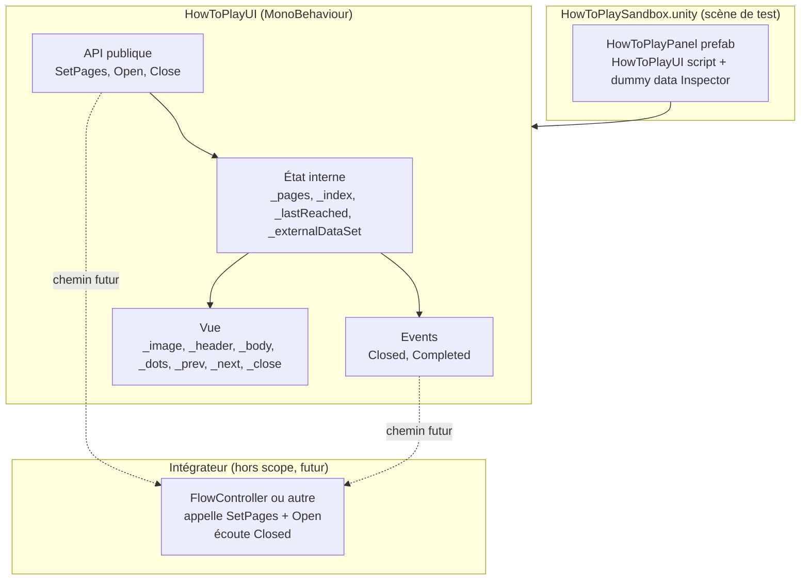
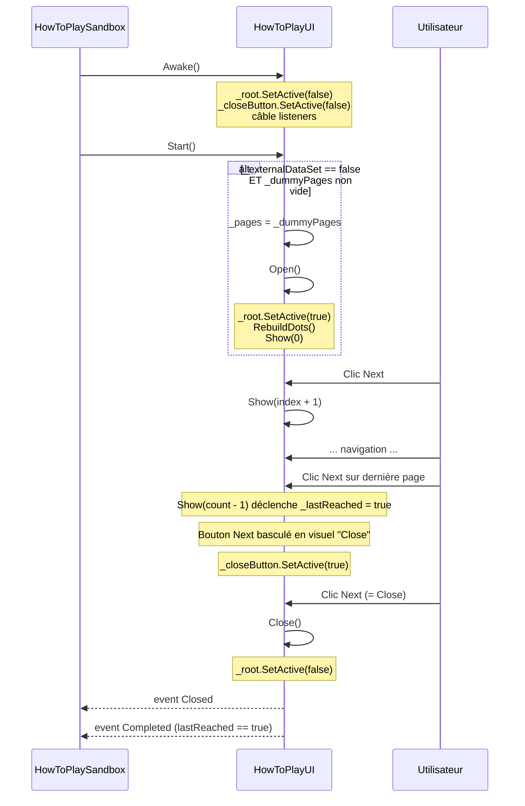
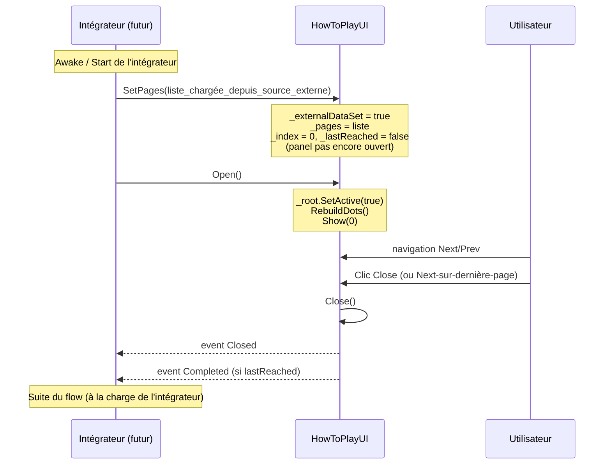

# Spec Technique — Composant UI "How To Play"

> Produit par le Rôle 3 (Architecture Technique).
> Traduit la spec fonctionnelle en plan d'implémentation Unity/C#.

**Date :** 2026-05-28
**Statut :** `draft`
**Chantier :** UI — Composant "How To Play"
**Spec fonc en entrée :** `Docs/specs/how-to-play/spec-fonc.md`
**Tickets associés :** _(à produire par le Rôle 4 si nécessaire — le chantier est suffisamment petit pour être exécuté en un seul ticket)_

---

## 1. Contexte technique

### Spec fonctionnelle couverte

Composant UI autonome de type tutoriel paginé. Affiche une liste de pages (image + header + body), navigation Next/Prev, dots dynamiques, bouton Close sticky activé après vue complète. API publique `SetPages` / `Open` / `Close` + events `Closed` / `Completed`. Mode auto-show avec dummy data Inspector pour test en isolation. Aucune référence à un système externe du projet.

### Contraintes identifiées

- **Conventions UI projet** : TextMeshPro pour tout texte, sprites SCI-FI UI Pack Pro pour les visuels, `UIButtonSound` pour les SFX au clic (cf. `Assets/Game/Scripts/UI/SettingsPanelUI.cs` comme référence la plus récente).
- **Pas de ScriptableObject** pour la data UI — les seuls SO du projet sont audio (`MusicTrack`, `SoundEffect`). Les pages sont sérialisées directement en Inspector (`[Serializable]`).
- **Pas d'Animator UI ni de DOTween** — transitions par swap de contenu (`SetActive` / réassignation de texte/sprite), cohérent avec tous les autres écrans UI du projet.
- **Pas de singleton, pas de `DontDestroyOnLoad`** — composant local à la scène, instancié et détruit avec elle.
- **WebGL** cible probable (cf. DEC-009) — aucun appel à des API non WebGL-compatibles (pas d'I/O fichier synchrone, pas de réflexion lourde).
- **Composant agnostique** (cf. TR1 spec fonc) — zéro référence à `FlowController`, `GameManager`, `SessionManager`, `LevelRegistry`, `ApiClient`, `TrialManager`, ni à aucune scène ou prefab du flow.
- **EventSystem standard** pour l'input clavier/manette — pas d'`InputAction.performed` listener custom, on s'appuie sur la map UI existante (`Submit`, `Cancel`, `Navigate`) de `InputSystem_Actions.inputactions`.

### Alertes sur la spec fonctionnelle

- **Sticky du flag `lastReached`** (R2 / R5) : la spec fonc précise que `Completed` est en pratique toujours émis car la seule façon de fermer est d'avoir vu la dernière page. La distinction `Closed` vs `Completed` reste utile **si** l'intégrateur ajoute un futur scénario de fermeture forcée externe (`Close()` appelé par programme sans avoir atteint la fin). Cette éventualité justifie de garder les deux events, même si en V1 ils se déclenchent ensemble systématiquement.
- **Auto-show au Start** (R6) : la logique "si dummy data non vide ET pas de `SetPages` préalable" suppose un ordre temporel précis. Si un intégrateur appelle `SetPages()` depuis l'`Awake` d'un autre composant de la même scène, et que `HowToPlayUI.Start()` s'exécute ensuite, le composant doit détecter que `SetPages` a été appelé et **ne pas** basculer en mode dummy. Implémentation : flag interne `_externalDataSet` mis à `true` dans `SetPages()`, testé dans `Start()`.
- **Génération dynamique des dots** : pour rester simple et conforme aux patterns projet, on instancie depuis un prefab `Dot.prefab` enfant du `DotsContainer` (HorizontalLayoutGroup). Pas de pool : la liste de pages reste petite (~10 max attendus), et un `SetPages` runtime détruit/recrée les dots — négligeable.

---

## 2. Architecture

### 2.1 Nouveaux composants

| Composant | Responsabilité | Type |
|:---|:---|:---|
| `HowToPlayUI` | Contrôleur du composant : tient la liste, gère l'index, l'état `lastReached`, l'affichage de la page courante, les transitions de bouton (Next ↔ Close) et l'émission des events. | MonoBehaviour |
| `HowToPlayPage` | Modèle d'une page : `Sprite image`, `string header`, `string body`. | Classe `[Serializable]` (POCO sérialisable Inspector) |
| `HowToPlayPanel.prefab` | Prefab Unity : hiérarchie UI complète (panel + content + footer + boutons + dots container + dot template). | Prefab |
| `HowToPlayDot.prefab` (optionnel) | Prefab d'un dot unitaire, instancié N fois par `HowToPlayUI` dans `DotsContainer`. Peut être un simple `Image` avec deux états visuels (actif/inactif). | Prefab |
| `HowToPlaySandbox.unity` | Scène de test en isolation : pose le prefab `HowToPlayPanel` avec dummy data Inspector. | Scène Unity |

### 2.2 Modifications de l'existant

**Aucune.** Le composant est strictement isolé. Aucun script existant n'est touché. Le chantier "intégration onboarding" (à venir, par l'intégrateur) modifiera `IntroScene.unity` et éventuellement `FlowContinueScreenUI.cs`, mais cela ne fait pas partie de ce livrable.

### 2.3 Diagramme d'architecture



---

## 3. Contrats d'interface

### 3.1 `HowToPlayPage` (data class)

```csharp
[Serializable]
public class HowToPlayPage
{
    public Sprite image;
    public string header;
    [TextArea(3, 6)] public string body;
}
```

**Dépendances :** aucune.
**Utilisé par :** `HowToPlayUI` (champ `_dummyPages` Inspector, paramètre de `SetPages`, élément interne de la liste courante).

### 3.2 `HowToPlayUI` (MonoBehaviour)

```csharp
public class HowToPlayUI : MonoBehaviour
{
    // ----- Inspector -----
    [SerializeField] private List<HowToPlayPage> _dummyPages;  // mode dev — auto-show si non vide et aucun SetPages externe

    [Header("Refs vue")]
    [SerializeField] private GameObject _root;          // racine activée/désactivée par Open/Close
    [SerializeField] private Image _image;
    [SerializeField] private TMP_Text _headerText;
    [SerializeField] private TMP_Text _bodyText;
    [SerializeField] private Button _prevButton;
    [SerializeField] private Button _nextButton;        // bascule visuellement en "Close" à la dernière page
    [SerializeField] private Button _closeButton;       // top-right, caché tant que lastReached == false
    [SerializeField] private Transform _dotsContainer;
    [SerializeField] private GameObject _dotPrefab;

    [Header("Visuels Next/Close (bascule dernière page)")]
    [SerializeField] private Sprite _nextIcon;
    [SerializeField] private Sprite _closeIcon;
    [SerializeField] private string _nextLabel = "Next";
    [SerializeField] private string _closeLabel = "Close";

    // ----- Events -----
    /// <summary> Émis à chaque fermeture du panel (Close button, Next-on-last-page, ou Close() externe). </summary>
    public event Action Closed;

    /// <summary> Émis à la fermeture uniquement si la dernière page a été atteinte au moins une fois. </summary>
    public event Action Completed;

    // ----- API publique -----

    /// <summary>
    /// Remplace la liste interne par <paramref name="pages"/>, reset index et lastReached.
    /// Si null ou vide, log warning + ferme le panel s'il était ouvert (cf. R7).
    /// Si le panel est ouvert, affiche immédiatement la nouvelle page 0.
    /// Marque _externalDataSet = true pour désactiver le fallback dummy au prochain Start().
    /// </summary>
    public void SetPages(IList<HowToPlayPage> pages);

    /// <summary>
    /// Active le panel et affiche la page 0.
    /// Précondition : une liste de pages doit avoir été fournie (par SetPages OU par dummyPages Inspector).
    /// Postcondition : _root.SetActive(true), index = 0, état des boutons cohérent.
    /// Si aucune data disponible → log warning, no-op (cf. R8).
    /// </summary>
    public void Open();

    /// <summary>
    /// Désactive le panel, émet Closed (et Completed si _lastReached).
    /// Si le panel est déjà fermé, no-op silencieux.
    /// </summary>
    public void Close();
}
```

**Dépendances :** `UnityEngine.UI.Image`, `UnityEngine.UI.Button`, `TMPro.TMP_Text`. Indirectement `UIButtonSound` (composant posé sur chaque bouton dans le prefab, joue le SFX au clic via `AudioManager`).
**Utilisé par :** posé sur le prefab `HowToPlayPanel`. Pour les tests : instance dans `HowToPlaySandbox.unity`. Pour la prod : sera instancié dans `IntroScene` par l'intégrateur.

### 3.3 Comportements internes (non publics, pour information)

```csharp
// Méthodes privées principales du composant (pseudo-code)

private void Awake();
// - Câble les listeners sur _prevButton, _nextButton, _closeButton
// - _root.SetActive(false) par défaut (sera activé par Open())
// - _closeButton.SetActive(false)

private void Start();
// - Si _externalDataSet == false ET _dummyPages != null ET _dummyPages.Count > 0
//   → _pages = _dummyPages ; Open()
// - Sinon : attend un appel externe (rien à faire)

private void Show(int i);
// - Clamp i dans [0, _pages.Count - 1]
// - _index = i ; met à jour _image / _headerText / _bodyText
// - Met à jour l'état des boutons : Prev.interactable = (i > 0)
// - Si i == _pages.Count - 1 : _lastReached = true ; bascule Next en visuel "Close"
//   Sinon : restore Next en visuel "Next"
// - Si _lastReached == true : _closeButton.SetActive(true)
// - Met à jour les dots (le dot[i] devient actif, les autres inactifs)

private void OnNextClicked();
// - Si _index == _pages.Count - 1 → Close()
// - Sinon Show(_index + 1)

private void OnPrevClicked();
// - Si _index > 0 → Show(_index - 1)

private void OnCloseClicked();
// - Close()

private void RebuildDots();
// - Détruit tous les enfants de _dotsContainer
// - Instancie _pages.Count copies de _dotPrefab dans _dotsContainer
// - Stocke les références pour mise à jour du dot actif dans Show()
```

---

## 4. Structures de données

### Enums

**Aucun.** Le composant n'a pas d'enum interne.

### DTOs / Data classes

```csharp
[Serializable]
public class HowToPlayPage
{
    public Sprite image;             // visuel principal de la page ; peut être null (Image rendue invisible)
    public string header;            // titre court (1 ligne) ; peut être vide
    [TextArea(3, 6)] public string body;  // texte explicatif (multi-lignes) ; peut être vide
}
```

### Constantes

Aucune constante exposée.

### Mapping CSV

**N/A.** Le composant n'écrit aucune donnée dans `trial_responses` (cf. D6 spec fonc).

---

## 5. Flux de données et séquences

### 5.1 Cycle de vie en mode dev (auto-show sandbox)



### 5.2 Cycle de vie en mode prod (pilotage externe)



### 5.3 `DefaultExecutionOrder`

**Non requis.** Le composant n'a aucune dépendance d'ordre avec les autres systèmes du projet. Il n'a pas besoin de s'exécuter avant ou après un autre composant spécifique. Ordre par défaut Unity.

Si un intégrateur futur a besoin de garantir que son code (`SetPages` dans `Awake`) s'exécute avant le `Start()` de `HowToPlayUI`, c'est le code intégrateur qui devra porter un `[DefaultExecutionOrder]` négatif, pas le composant.

---

## 6. Gestion des erreurs

| Situation | Stratégie | Fallback |
|:---|:---|:---|
| `SetPages(null)` ou `SetPages(emptyList)` | Log warning. `_pages` mis à liste vide. `_externalDataSet = true`. Si panel ouvert → `Close()` silencieux (sans events ? à arbitrer en implémentation — cohérent : pas d'events si rien n'a été affiché). | Panel fermé, état remis à zéro. |
| `Open()` appelé sans data disponible (ni dummy Inspector, ni `SetPages` préalable) | Log warning : "HowToPlayUI: Open() appelé sans pages — no-op". | Panel reste fermé. |
| `Close()` appelé alors que panel déjà fermé | No-op silencieux (pas d'events ré-émis). | — |
| `page.image == null` | Aucune exception. `_image.sprite = null` → l'`Image` est rendue transparente (comportement Unity natif). | Page affichée sans visuel ; header et body restent. |
| `page.header == null` ou vide | `_headerText.text = page.header ?? string.Empty`. | TMP_Text affiche vide, layout reste stable. |
| `page.body == null` ou vide | Idem. | — |
| `_dotPrefab == null` | Log warning au premier `RebuildDots()`. Aucun dot rendu. | Navigation toujours fonctionnelle, juste sans indicateur visuel. |
| Référence Inspector manquante (`_image`, `_headerText`, etc.) | `null` check au `Awake()` + log error explicite ("Composant HowToPlayUI : _image non assigné"). Le composant continue mais l'affichage sera incomplet. | À détecter en dev via la sandbox. |
| `SetPages` appelé pendant que le panel est ouvert | Comportement défini (R6) : reset complet + affiche immédiatement page 0 de la nouvelle liste. Aucune erreur. | — |

---

## 7. Nettoyage et cycle de vie

### Entre trials

**N/A.** Le composant ne participe pas au cycle de vie inter-trial du projet. Il est local à sa scène hôte et détruit avec elle. Aucun reset ne lui est demandé entre les trials.

### Cycle de vie d'une instance

1. **Instanciation** : au chargement de la scène hôte (sandbox ou IntroScene par l'intégrateur), le prefab `HowToPlayPanel` est instancié.
2. **`Awake()`** : câblage des listeners boutons, masquage du panel (`_root.SetActive(false)`) et du bouton Close.
3. **`Start()`** : décision mode dev (auto-show avec dummy) vs mode prod (attente d'un appel externe).
4. **Cycle interactif** : navigation utilisateur, mise à jour de l'état interne et de la vue.
5. **Fermeture** : `Close()` désactive le panel et émet les events. L'instance reste en mémoire (réactivable par un futur `Open()`).
6. **Destruction** : lors de la transition de scène, l'instance est détruite avec sa scène hôte. Pas de nettoyage particulier requis.

### Pattern recommandé

Pas de pattern `ICleanable` ni `ResetForNewTrial()` ici — le composant est éphémère par scène et n'a aucun état à propager au-delà de sa scène.

---

## 8. Stratégie de test

### 8.1 Scène sandbox dédiée

`Assets/Game/Scenes/Sandboxes/Florian/HowToPlaySandbox.unity` : scène vide hormis :
- Un `Canvas` standard (Screen Space - Overlay) avec EventSystem.
- Une instance du prefab `HowToPlayPanel` posée dans le Canvas, avec `_dummyPages` renseignées (6 pages représentatives, cf. proposition de dummy data §V1 du plan).
- Éventuellement un `AudioManager.prefab` instancié si on veut vérifier les SFX (sinon `UIButtonSound` détectera son absence et restera silencieux sans erreur — cf. spec audio §6).

### 8.2 Scénarios de validation

| Scénario | Vérification | Données CSV attendues |
|:---|:---|:---|
| Lancer `HowToPlaySandbox` en Play Mode | Le panel s'auto-affiche immédiatement sur la page 0 (image, header, body de la 1ʳᵉ dummy). | N/A |
| À la page 0 | Bouton `Prev` non-interactif (grisé). Bouton `Next` interactif. Bouton `Close` (top-right) **invisible**. | N/A |
| Cliquer `Next` jusqu'à la dernière page (page 5 dans la dummy à 6 pages) | Navigation linéaire fluide. Le dot actif suit `index`. À la page 5, bouton `Next` change de label/icône (devient "Close"). Bouton `Close` (top-right) devient **visible**. | N/A |
| Cliquer `Prev` depuis la dernière page | Retour à la page 4. Le bouton `Next` redevient "Next". Le bouton `Close` (top-right) **reste visible** (sticky). | N/A |
| Cliquer `Close` (top-right) après être revenu en arrière | Panel se ferme, events `Closed` et `Completed` émis. | N/A |
| Cliquer `Next` (devenu "Close") sur la dernière page | Même comportement : ferme + émet `Closed` + `Completed`. | N/A |
| SFX au clic | Chaque clic de Prev/Next/Close joue le `Sfx_UI_Click` (visible dans l'AudioMixer meter du groupe SFX_UI). | N/A |
| Test API `SetPages` à chaud | Depuis un autre composant de la sandbox (ex : un petit script test avec `[ContextMenu]`), appeler `SetPages(autreListe_de_3_pages)` puis `Open()`. → Le panel affiche la nouvelle liste de 3 pages. Dots = 3. Navigation s'adapte. | N/A |
| Test `SetPages(null)` | Log warning visible dans la console. Panel se ferme si ouvert. Pas d'exception. | N/A |
| Test `Open()` sans data ni dummy | Log warning. Panel reste fermé. | N/A |
| Lancer la sandbox **directement** (sans BootScene, sans FlowController, sans GameManager) | Le composant fonctionne intégralement. Pas d'exception, pas de référence null à un singleton externe. | N/A |
| WebGL build | Pas de régression : le panel s'auto-affiche, navigation fluide, SFX joués, fermeture OK. | N/A |

### 8.3 Tests techniques complémentaires

- Inspecter le prefab `HowToPlayPanel` en mode édition : toutes les références Inspector assignées, `UIButtonSound` présent sur chaque bouton avec un `SoundEffect` assigné.
- Vérifier en runtime via l'Hierarchy : `DotsContainer` contient bien N enfants après `RebuildDots()`.
- Profiler : aucune allocation suspecte à chaque navigation (la mise à jour est un simple texte/sprite swap).

---

## 9. Conventions

### Nommage

- **Classes :** `HowToPlayUI`, `HowToPlayPage` (PascalCase, préfixe `HowToPlay` pour le namespace logique du chantier).
- **Prefabs :** `HowToPlayPanel.prefab`, `HowToPlayDot.prefab`.
- **Scène sandbox :** `HowToPlaySandbox.unity`.
- **Champs sérialisés :** préfixe `_` (cohérent projet), `[SerializeField] private` (pas de public field).
- **Events :** `Closed`, `Completed` (PascalCase, pas de préfixe `On` car ce sont des notifications passées — convention `Action`).

### Organisation fichiers

```
Assets/Game/
├── Scripts/UI/
│   ├── HowToPlayUI.cs          (contrôleur + classe HowToPlayPage dans le même fichier — c'est un POCO étroitement couplé)
│   └── (autres scripts UI existants inchangés)
├── Prefabs/UI/
│   ├── HowToPlayPanel.prefab   (le prefab principal)
│   ├── HowToPlayDot.prefab     (template de dot, instancié N fois)
│   └── (autres prefabs UI inchangés)
└── Scenes/Sandboxes/Florian/
    └── HowToPlaySandbox.unity  (scène de test isolation)
```

**Note :** la classe `HowToPlayPage` peut vivre dans le même fichier que `HowToPlayUI.cs` (POCO court, fortement couplé, conforme aux conventions de plusieurs autres UI du projet — ex : `FlowContinueScreenUI.cs` qui contient son enum interne). Un fichier séparé reste acceptable si le porteur préfère.

### Patterns à utiliser

- **`[SerializeField] private` + `[Header]` + `[Tooltip]`** pour tous les champs Inspector (pattern projet).
- **TextMeshPro (`TMP_Text`)** pour tout texte (pas de `Text` Legacy).
- **`UIButtonSound`** posé sur chaque bouton interactif, avec un `SoundEffect` assigné (pattern existant, cf. `Assets/Game/Scripts/UI/UIButtonSound.cs`).
- **`SetActive(true/false)`** pour ouvrir/fermer le panel (pattern existant : `SettingsPanelUI._root.SetActive(...)`).
- **Sprites SCI-FI UI Pack Pro** pour les visuels (background panel, boutons), cohérent avec `SettingsPanelUI` (commits `cecfd32b` / `de20b43c`).
- **`Action` (event)** pour les notifications sortantes, conformément aux autres UI du projet (`FlowContinueScreenUI`, `ConsentUI`).

### Anti-patterns à éviter

- ❌ **`ScriptableObject`** pour la data des pages. Le projet n'utilise des SO que pour l'audio. Inspector sérialisé suffit largement pour le scope dev, et `SetPages` couvre le scope prod.
- ❌ **Pattern Provider / Strategy interne** au composant pour multiplexer Inspector vs JSON vs API. Hors scope : c'est à l'intégrateur de fournir la data via `SetPages`. Garder le composant simple.
- ❌ **`Animator` UI ou DOTween** pour les transitions de page. Aucun autre UI du projet ne les utilise ; un simple swap de contenu est cohérent et suffisant.
- ❌ **Référence à `FlowController`, `GameManager`, `LevelRegistry`, etc.** Le composant doit être strictement agnostique (cf. TR1 spec fonc).
- ❌ **`Time.timeScale = 0` ou `GameManager.SetInputLocked(true)`** depuis le composant. Si l'intégrateur souhaite pause/lock, il l'orchestre lui-même autour de `Open()` / `Closed`.
- ❌ **Singleton statique** (`HowToPlayUI.Instance`). Le composant est instancié par scène, sans accès global.
- ❌ **`DontDestroyOnLoad`**.
- ❌ **`InputAction.performed` listener custom**. EventSystem standard suffit pour Submit/Cancel/Navigate via la map UI existante.
- ❌ **Pré-instancier les dots à la main dans le prefab** (au lieu d'un `RebuildDots` dynamique). On respecte le principe "N est variable" jusque dans la structure.

---

## 10. Hors scope (rappel)

Pour éviter toute confusion à la lecture, les éléments suivants ne font **pas** partie de cette livraison :

- **Intégration dans `IntroScene.unity`** : à la charge de l'intégrateur, qui posera le prefab dans la scène, branchera la source data via `SetPages(...)` et écoutera `Closed` pour appeler `FlowController.OnPhaseComplete()`.
- **Source de données réelle** (JSON externe, API, endpoint chercheur) : le composant accepte n'importe quelle `IList<HowToPlayPage>` via `SetPages`. La construction de cette liste depuis une source externe est hors composant (cf. Q-HTP-1 spec fonc).
- **Modification de `FlowController` ou `FlowContinueScreenUI`** : aucune. Le chantier d'intégration décidera si `FlowContinueScreenUI(Intro)` doit être remplacé ou non.
- **Tracking de la consultation** dans `trial_responses` : aucune colonne ajoutée, aucun event de tracking interne (cf. Q-HTP-3).
- **Localisation multilingue** : non implémentée (cf. Q-HTP-4).
- **Accès depuis `MenuBtn`** ou autre déclencheur en cours de jeu : hors scope (cf. Q-HTP-2). Un éventuel accès passera par un appel à `Open()` côté intégrateur.
- **Contenu final des pages** : la dummy data Inspector V1 est représentative pour le test visuel mais n'est pas le contenu validé (cf. Q-HTP-5 et Q-HTP-6 spec fonc).
