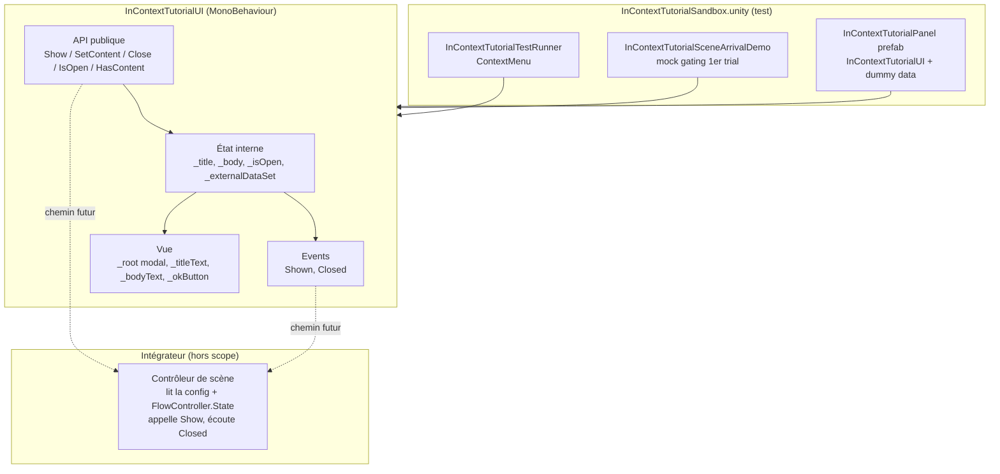
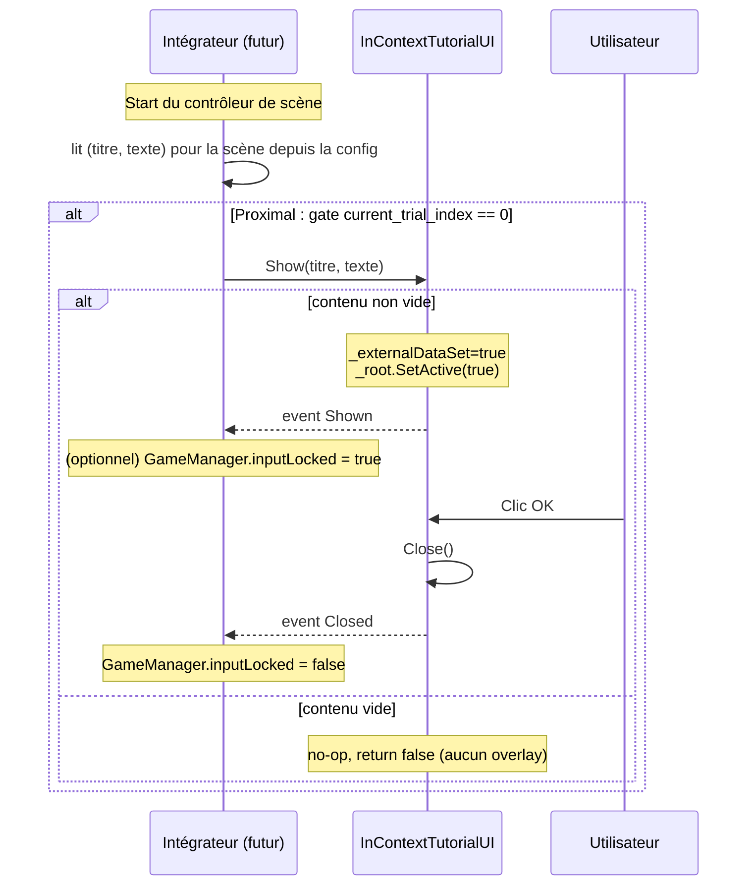

# Spec Technique — Composant UI "In-Context Tutorial"

> Produit par le Rôle 3 (Architecture Technique).
> Traduit la spec fonctionnelle en plan d'implémentation Unity/C#.

**Date :** 2026-05-29
**Statut :** `draft`
**Chantier :** UI — Composant "In-Context Tutorial"
**Spec fonc en entrée :** `Docs/specs/in-context-tutorial/spec-fonc.md`
**Guide d'intégration :** `Docs/specs/in-context-tutorial/integration-guide.md`
**Tickets associés :** _(chantier suffisamment petit pour un seul ticket)_

---

## 1. Contexte technique

### Spec fonctionnelle couverte

Composant UI autonome de type **overlay modal d'instructions** (titre + corps + bouton OK),
affiché à l'arrivée sur une scène de jeu. API publique `Show(title, body)` / `Show()` /
`SetContent(title, body)` / `Close()` + propriétés `IsOpen` / `HasContent` + events `Shown` /
`Closed`. Mode auto-show avec dummy data Inspector pour le test en isolation. Aucune référence à
un système externe du projet. Version simplifiée du composant `HowToPlayUI` (panneau unique, non
paginé, sans image).

### Contraintes identifiées

- **Conventions UI projet** : TextMeshPro pour tout texte, sprites SCI-FI UI Pack Pro, `UIButtonSound`
  pour le SFX au clic (réf. `HowToPlayUI` / `SettingsPanelUI`).
- **Pas de ScriptableObject** pour la data UI. Le contenu = 2 `string` sérialisés Inspector (dummy)
  et/ou passés par l'API.
- **Pas d'Animator UI ni de DOTween** — affichage par `SetActive` + réassignation de texte.
- **Pas de singleton, pas de `DontDestroyOnLoad`** — composant local à la scène.
- **WebGL** cible probable (DEC-009) — aucune API non WebGL-compatible.
- **Composant agnostique** (TR1) — zéro référence à `FlowController`, `GameManager`,
  `SessionManager`, `LevelRegistry`, `ApiClient`, `TrialManager`, ni à une scène/prefab du flow.
- **EventSystem standard** pour l'input — pas d'`InputAction.performed` custom.

### Alertes sur la spec fonctionnelle

- **Gating hors composant (TR2).** Le « 1er trial du bloc seulement » sur Proximal n'est pas porté
  par le composant. Risque si l'intégrateur ne gère pas l'état : l'overlay pourrait se ré-afficher
  à chaque rechargement de la scène Proximal. Mitigation : recette précise dans
  `integration-guide.md` (test sur `FlowController.State.current_trial_index == 0`).
- **Modalité souris vs clavier.** Le fond modal (`Image` raycast target) bloque la souris mais
  **pas** les inputs clavier gameplay (`GridMover` lit `Keyboard.current`, hors EventSystem). Sur
  Proximal, l'intégrateur **doit** verrouiller le clavier (`GameManager.inputLocked`) autour de
  `Show()`/`Closed`, sinon le joueur peut bouger pendant la lecture.
- **Auto-show au Start.** Même logique que `HowToPlayUI` : flag `_externalDataSet` mis à `true`
  dans `SetContent`/`Show(title,body)`, testé dans `Start()` pour ne pas écraser un pilotage externe.

---

## 2. Architecture

### 2.1 Nouveaux composants

| Composant | Responsabilité | Type |
|:---|:---|:---|
| `InContextTutorialUI` | Contrôleur du composant : tient le contenu (titre/corps), l'état ouvert/fermé, l'affichage et l'émission des events. | MonoBehaviour |
| `InContextTutorialPanel.prefab` | Prefab Unity : hiérarchie UI (fond modal + content [titre, corps] + bouton OK). | Prefab |
| `InContextTutorialSandbox.unity` | Scène de test en isolation : Canvas + EventSystem + prefab avec dummy data. | Scène Unity |
| `InContextTutorialTestRunner` | (sandbox-only) Composant de test : ContextMenu pour exercer l'API + log des events. | MonoBehaviour (Sandboxes/) |
| `InContextTutorialSceneArrivalDemo` | (sandbox-only) Contrôleur *mock* rejouant la décision d'affichage de l'intégrateur (`tutorial && firstTrial && hasContent`) avec des toggles Inspector, sans référencer `FlowController`. | MonoBehaviour (Sandboxes/) |

Pas de classe de données dédiée (à la différence de `HowToPlayPage`) : le contenu est deux
`string`, inutile d'introduire un POCO.

### 2.2 Modifications de l'existant

**Aucune.** Le composant est strictement isolé. Le chantier d'intégration (par l'intégrateur)
touchera `BlockConfig`, les 3 scènes et le boot — hors de ce livrable.

### 2.3 Diagramme d'architecture



---

## 3. Contrats d'interface

### 3.1 `InContextTutorialUI` (MonoBehaviour)

```csharp
public class InContextTutorialUI : MonoBehaviour
{
    // ----- Dummy data (mode dev) -----
    [SerializeField] private string _dummyTitle;
    [SerializeField, TextArea(3, 6)] private string _dummyBody;

    // ----- Refs vue -----
    [SerializeField] private GameObject _root;       // racine modale (inclut le fond bloquant)
    [SerializeField] private TMP_Text  _titleText;
    [SerializeField] private TMP_Text  _bodyText;
    [SerializeField] private Button    _okButton;

    // ----- Events -----
    /// <summary> Émis à chaque ouverture effective de l'overlay. </summary>
    public event Action Shown;
    /// <summary> Émis à chaque fermeture (clic OK ou Close() externe). </summary>
    public event Action Closed;

    // ----- Propriétés -----
    public bool IsOpen     { get; }                  // overlay actuellement affiché
    public bool HasContent { get; }                  // true si titre OU corps non vide

    // ----- API publique -----

    /// <summary>
    /// Définit le contenu (title, body) puis affiche. Marque _externalDataSet = true.
    /// Retourne true si réellement affiché, false si contenu vide (no-op, cf. R4).
    /// </summary>
    public bool Show(string title, string body);

    /// <summary>
    /// Affiche le contenu déjà défini (dummy Inspector ou SetContent préalable).
    /// Retourne false (no-op + warning) si aucun contenu (cf. R4).
    /// </summary>
    public bool Show();

    /// <summary>
    /// Définit le contenu sans afficher. Marque _externalDataSet = true
    /// (désactive le fallback dummy au Start). Si l'overlay est ouvert, rafraîchit les textes ;
    /// si le nouveau contenu est vide, ferme silencieusement.
    /// </summary>
    public void SetContent(string title, string body);

    /// <summary>
    /// Ferme l'overlay et émet Closed. No-op silencieux si déjà fermé (cf. R5).
    /// </summary>
    public void Close();
}
```

**Dépendances :** `UnityEngine.UI.Button`, `TMPro.TMP_Text`. Indirectement `UIButtonSound`
(posé sur le bouton OK dans le prefab, joue le SFX via `AudioManager`).
**Utilisé par :** posé sur le prefab `InContextTutorialPanel`. Tests : `InContextTutorialSandbox`.
Prod : instancié dans les 3 scènes par l'intégrateur.

### 3.2 Comportements internes (non publics, pour information)

```csharp
private void Awake();
// - Câble le listener du bouton OK -> OnOkClicked
// - _root.SetActive(false)

private void Start();
// - Si _externalDataSet == false ET dummy non vide
//   -> _title = _dummyTitle ; _body = _dummyBody ; ShowInternal()

private bool ShowInternal();
// - Si HasContent == false -> log warning, return false
// - Sinon : remplit _titleText/_bodyText, _root.SetActive(true), _isOpen = true,
//   émet Shown, return true

private void OnOkClicked();
// - Close()
```

---

## 4. Structures de données

### Enums

**Aucun.**

### DTOs / Data classes

**Aucune.** Le contenu = deux `string` (`title`, `body`). Le dummy est sérialisé directement en
Inspector (`_dummyTitle`, `_dummyBody`).

### Constantes

Aucune exposée.

### Mapping CSV

**N/A.** Le composant n'écrit aucune donnée dans `trial_responses` (D6 spec fonc).

---

## 5. Flux de données et séquences

### 5.1 Mode dev (auto-show sandbox)

```mermaid
sequenceDiagram
    participant Scene as InContextTutorialSandbox
    participant UI as InContextTutorialUI
    participant User as Utilisateur

    Scene->>UI: Awake()
    Note over UI: _root.SetActive(false)<br/>câble OK
    Scene->>UI: Start()
    alt _externalDataSet == false ET dummy non vide
        UI->>UI: _title=_dummyTitle ; _body=_dummyBody
        UI->>UI: ShowInternal()
        Note over UI: _root.SetActive(true)<br/>remplit textes
        UI-->>Scene: event Shown
    end
    User->>UI: Clic OK
    UI->>UI: Close()
    Note over UI: _root.SetActive(false)
    UI-->>Scene: event Closed
```

### 5.2 Mode prod (pilotage externe par l'intégrateur)



### 5.3 `DefaultExecutionOrder`

**Non requis.** Aucune dépendance d'ordre avec les autres systèmes. Si l'intégrateur appelle
`Show`/`SetContent` depuis l'`Awake` d'un autre composant, le flag `_externalDataSet` garantit
que `Start()` ne basculera pas en dummy.

---

## 6. Gestion des erreurs

| Situation | Stratégie | Fallback |
|:---|:---|:---|
| `Show(title, body)` / `Show()` avec titre ET corps vides | Log warning. `return false`. Aucun overlay. | Overlay reste fermé. |
| `SetContent(null, null)` | Stocke vide. `_externalDataSet = true`. Si ouvert → `Close()` silencieux. | Overlay fermé / état remis à zéro. |
| `Close()` alors que déjà fermé | No-op silencieux, aucun event. | — |
| `_titleText` / `_bodyText` null (réf. Inspector manquante) | Null-check à l'affectation ; log error explicite au `Awake`. Le composant continue, affichage incomplet. | À détecter via la sandbox. |
| `_root` null | Log error au `Awake`. `Show`/`Close` deviennent no-op sûrs (null-check). | — |
| `_okButton` null | Log warning au `Awake` ; aucune fermeture possible par clic (fallback : `Close()` externe). | — |
| `title`/`body` = `null` (et l'autre non vide) | `text = value ?? string.Empty`. Overlay affiché avec le champ vide. | — |

---

## 7. Nettoyage et cycle de vie

### Entre trials

**N/A.** Composant local à sa scène, détruit avec elle. Aucun reset inter-trial demandé. Le
ré-affichage éventuel au trial suivant est décidé par l'intégrateur (qui n'appellera pas `Show`
si `current_trial_index != 0` sur Proximal).

### Cycle de vie d'une instance

1. Instanciation au chargement de la scène hôte (sandbox ou scène réelle).
2. `Awake()` : câblage OK, masquage (`_root.SetActive(false)`).
3. `Start()` : mode dev (auto-show dummy) vs mode prod (attente d'un appel externe).
4. Cycle interactif : affichage, clic OK.
5. Fermeture : `Close()` désactive + émet `Closed`. L'instance reste réactivable.
6. Destruction avec la scène hôte.

### Pattern recommandé

Pas de `ICleanable` ni `ResetForNewTrial()` — composant éphémère par scène, sans état propagé.

---

## 8. Stratégie de test

### 8.1 Scène sandbox dédiée

`Assets/Game/Scenes/Sandboxes/Florian/InContextTutorialSandbox.unity` :
- Un `Canvas` (Screen Space - Overlay) + `EventSystem`.
- Une instance de `InContextTutorialPanel` avec `_dummyTitle` / `_dummyBody` renseignés.
- Un GameObject portant `InContextTutorialTestRunner` (réf. vers l'UI).
- Un GameObject portant `InContextTutorialSceneArrivalDemo` (réf. vers l'UI + toggles mock).
- (Optionnel) `AudioManager.prefab` pour vérifier le SFX.

### 8.2 Scénarios de validation

| Scénario | Vérification |
|:---|:---|
| Lancer `InContextTutorialSandbox` en Play | L'overlay s'auto-affiche avec la dummy (titre + corps). |
| Clic `OK` | L'overlay se ferme, event `Closed` loggé. |
| `Show(contenu)` (TestRunner) | L'overlay s'ouvre avec le contenu fourni, event `Shown` loggé, retour `true`. |
| `Show(vide)` (TestRunner) | Aucun overlay, warning loggé, retour `false`. |
| `Close()` x2 (TestRunner) | 1er ferme + `Closed` ; 2e no-op (pas de 2e `Closed`). |
| Fond modal | Cliquer hors panel ne ferme pas ; clics souris ne traversent pas vers le dessous. |
| Mock gating (Demo) `tutorial=true, firstTrial=true, contenu` | « Simuler arrivée » → overlay affiché. |
| Mock gating `firstTrial=false` | « Simuler arrivée » → aucun overlay. |
| Mock gating contenu vide | « Simuler arrivée » → aucun overlay. |
| Lancer la sandbox **seule** (sans BootScene/FlowController) | Fonctionne intégralement, aucune réf. null à un singleton externe. |
| WebGL build (optionnel) | Pas de régression : auto-show, fermeture OK, SFX. |

---

## 9. Conventions

### Nommage

- **Classes :** `InContextTutorialUI` (+ sandbox : `InContextTutorialTestRunner`,
  `InContextTutorialSceneArrivalDemo`).
- **Prefab :** `InContextTutorialPanel.prefab`. **Scène :** `InContextTutorialSandbox.unity`.
- **Champs sérialisés :** préfixe `_`, `[SerializeField] private`.
- **Events :** `Shown`, `Closed` (PascalCase, convention `Action`, pas de préfixe `On`).

### Organisation fichiers

```
Assets/Game/
├── Scripts/UI/
│   └── InContextTutorialUI.cs
├── Prefabs/UI/InContextTutorial/
│   └── InContextTutorialPanel.prefab
└── Scenes/Sandboxes/Florian/
    ├── InContextTutorialSandbox.unity
    ├── InContextTutorialTestRunner.cs
    └── InContextTutorialSceneArrivalDemo.cs
```

### Patterns à utiliser

- `[SerializeField] private` + `[Header]` pour les champs Inspector.
- TextMeshPro (`TMP_Text`) pour tout texte.
- `UIButtonSound` sur le bouton OK avec un `SoundEffect` assigné.
- `SetActive(true/false)` pour ouvrir/fermer.
- Sprites SCI-FI UI Pack Pro pour les visuels (cohérent `HowToPlayPanel`).
- `Action` (event) pour les notifications sortantes.

### Anti-patterns à éviter

- ❌ `ScriptableObject` / pattern Provider interne pour le contenu.
- ❌ `Animator` UI / DOTween.
- ❌ Référence à `FlowController`, `GameManager`, etc. (TR1).
- ❌ `Time.timeScale = 0` ou `GameManager.inputLocked` **depuis le composant** (l'intégrateur l'orchestre).
- ❌ Logique de gating « 1er trial » **dans le composant** (TR2 — c'est l'intégrateur).
- ❌ Singleton statique / `DontDestroyOnLoad`.
- ❌ `InputAction.performed` listener custom.

---

## 10. Hors scope (rappel)

- **Intégration dans les 3 scènes** : pose du prefab, lecture config, décision d'affichage,
  gating 1er trial, verrou input — à la charge de l'intégrateur (cf. `integration-guide.md`).
- **Extension de `BlockConfig`** + désérialisation back-end : aucune dans ce livrable.
- **Tracking** dans `trial_responses` : aucun.
- **Localisation multilingue** : non implémentée.
- **Contenu final des instructions** : la dummy data V1 est représentative, pas le contenu validé.
- **Test offline du vrai flux** (parcours réel des scènes sans back-end) : recette documentée
  pour l'intégrateur dans `integration-guide.md` — non implémentée ici.
