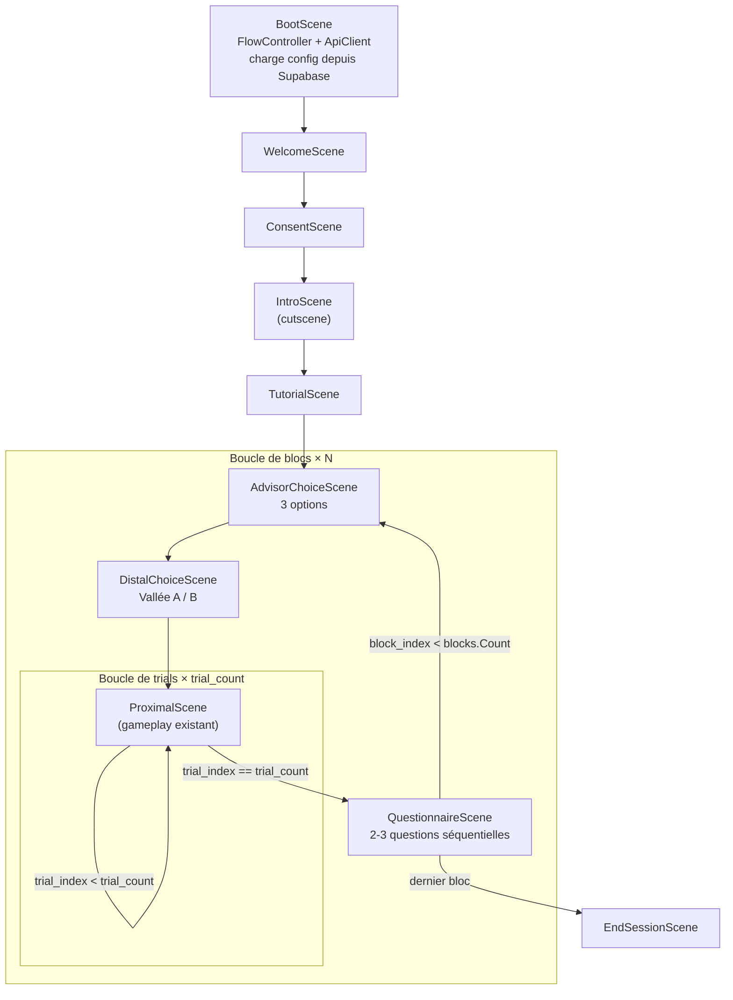
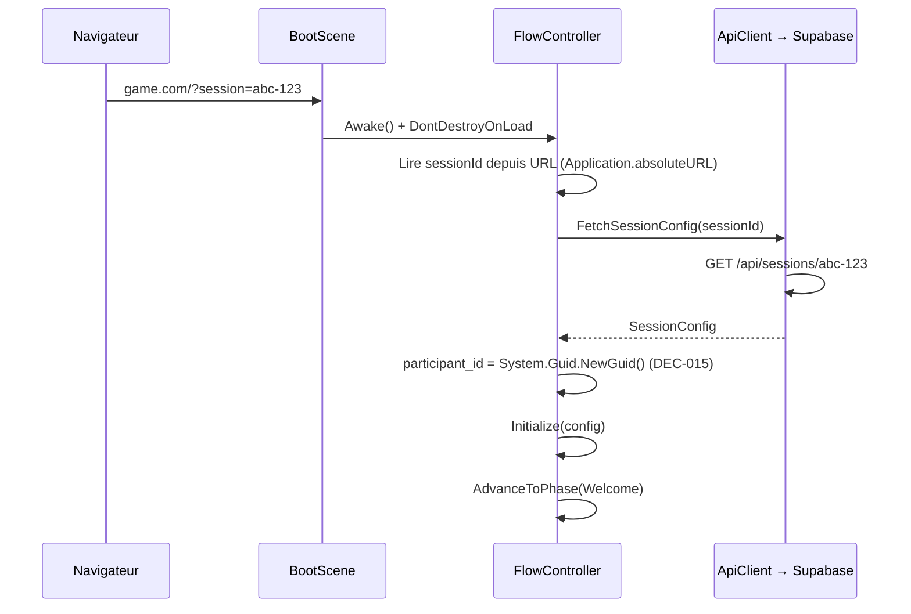
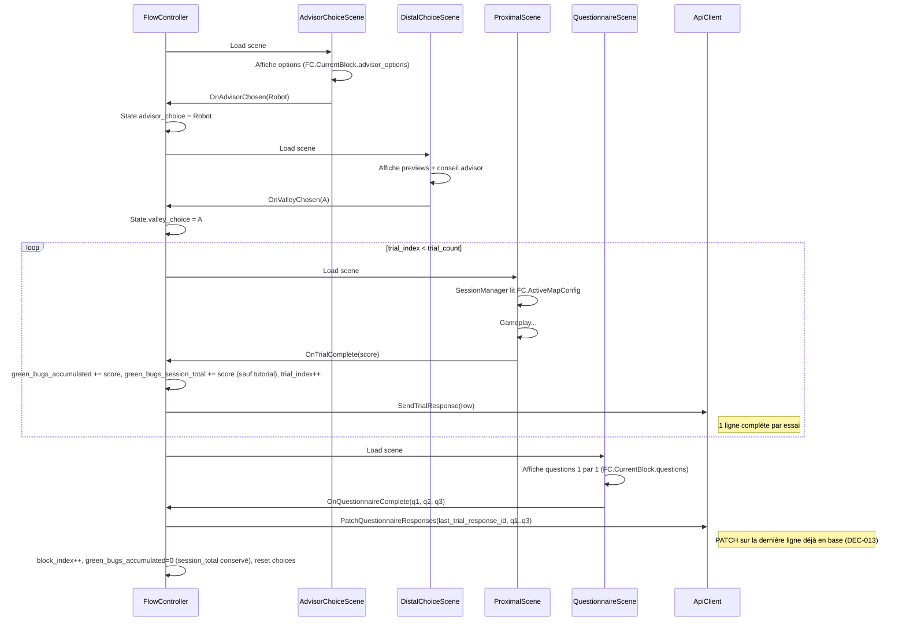
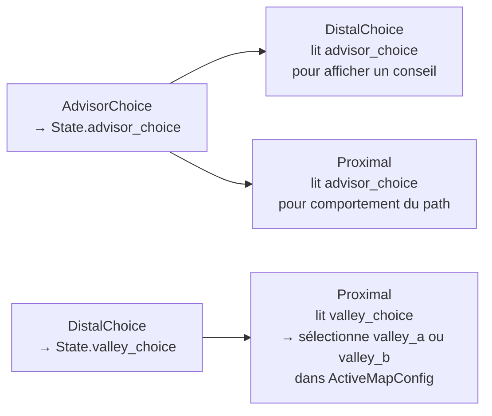

# Spec technique — Multi-screen flow & Data model

> **Chantier :** Multi-screen flow  
> **Spec fonc en entrée :** Demande directe du développeur (session du 16/03/26)  
> **Auteur :** Architecture technique (Rôle 3)  
> **Date :** 2026-03-16  
> **Décisions associées :** DEC-002, DEC-004, DEC-008, DEC-009, DEC-010, DEC-011, DEC-012, DEC-013, DEC-014, DEC-015

---

## 1. Contexte technique

### 1.1 Contraintes identifiées

- **WebGL** : pas de `System.Environment.GetCommandLineArgs()` en production → config via URL param + API (DEC-009)
- **State leaking** : le rechargement de scène Proximal détruit tous les singletons sauf le FlowController (DontDestroyOnLoad)
- **Supabase** : base SQL, les chercheurs configurent via un dashboard web séparé
- **Score cumulé** : le score persiste entre les trials d'un même bloc (DEC-010)
- **Table plate** : toutes les données d'un essai dans une seule ligne `trial_responses`, exportable en CSV sans jointure (DEC-011)
- **Consent = gate** : pas de tracking en base. Si le joueur refuse → le jeu ne se lance pas, point final.

### 1.2 Alertes

- ⚠️ La preview floue sur le distal screen est REPORTÉE côté design. La structure de données (`ValleyPreview`) est prête mais le rendu n'est pas spécifié.
- ⚠️ Le tutorial est modélisé comme un `BlockConfig` avec `is_tutorial: true`. Config hardcodée, pas d'envoi API, parcourt le flow complet d'un bloc (Advisor → Distal → Proximal ×N). À implémenter plus tard mais l'architecture le supporte (DEC-014).
- ⚠️ Le ConsentScene est un gate client-side uniquement. Rien n'est envoyé à Supabase.
- ⚠️ `participant_id` généré client-side (`System.Guid.NewGuid()`), pas d'appel serveur (DEC-015).
- ⚠️ Seeds auto-générées par trial (timestamp), logées dans `trial_responses.trial_seed` pour reproductibilité a posteriori.

---

## 2. Architecture

### 2.1 Vue macro — Enchaînement des scènes



### 2.2 Composants — Nouveaux et modifiés

| Composant | Type | Scène | Rôle | Ce qu'il NE FAIT PAS |
|:--|:--|:--|:--|:--|
| **FlowController** | Nouveau — Singleton DDOL | BootScene | Porte `SessionConfig` + `PlayerSessionState`. Orchestre transitions inter-scènes. Calcule `ActiveMapConfig`. Accumule `green_bugs_accumulated` (par bloc) et `green_bugs_session_total` (sur la session, tutoriels exclus). | Pas de gameplay, pas de HTTP |
| **ApiClient** | Nouveau — Singleton DDOL | BootScene | Point unique HTTP : fetch config, POST trial, PATCH questionnaire, retry, auth. | Ne sait pas assembler les données |
| **FadeTransition** | Nouveau — MonoBehaviour DDOL | BootScene | Fade to/from black (DEC-002) | — |
| **SessionManager** | Modifié | ProximalScene | Façade locale. Copie `FlowController.ActiveMapConfig` dans ses champs en Awake. Les spawners lisent `SessionManager.Instance`. Lance `GameManager.BeginFirstRound()`. | Plus de parsing CLI (sauf fallback debug), plus de HTTP |
| **GameManager** | Modifié | ProximalScene | Orchestre le gameplay d'un round. Signale `TrialManager.EndCurrentTrial()` avec les résultats. Appelle `FlowController.OnTrialComplete(score)`. | Ne connaît pas Supabase, pas de HTTP |
| **TrialManager** | Modifié | ProximalScene | Collecte les données au fil du round. Sur `EndCurrentTrial`, assemble la `TrialResponseRow` complète (lit GameManager + FlowController + ses propres données). Passe la row à `ApiClient.SendTrialResponse()`. | **Plus de HTTP** (perd URL, token, coroutine réseau) |
| **ConsentUI** | Nouveau | ConsentScene | UI consentement (gate, pas de tracking) | — |
| **AdvisorChoiceUI** | Nouveau | AdvisorChoiceScene | UI choix d'advisor | — |
| **DistalChoiceUI** | Nouveau | DistalChoiceScene | UI choix de vallée | — |
| **QuestionnaireUI** | Nouveau | QuestionnaireScene | UI questions séquentielles | — |

*(DDOL = DontDestroyOnLoad)*

### 2.3 Hiérarchie des objets persistants

```
[DontDestroyOnLoad]
├── FlowController          → SessionConfig, PlayerSessionState
├── ApiClient               → HTTP, auth token
└── FadeTransition          → CanvasGroup overlay noir
```

### 2.4 Matrice de responsabilités

| Action | FlowController | ApiClient | TrialManager | GameManager | SessionManager |
|:--|:--:|:--:|:--:|:--:|:--:|
| Porte SessionConfig + State | **✓** | | | | |
| Orchestre transitions inter-scènes | **✓** | | | | |
| Calcule ActiveMapConfig | **✓** | | | | |
| Accumule green_bugs_accumulated | **✓** | | | | |
| Accumule green_bugs_session_total | **✓** | | | | |
| Stocke last_trial_response_id (PATCH) | **✓** | | | | |
| Génère participant_id (UUID) | **✓** | | | | |
| HTTP : fetch config | | **✓** | | | |
| HTTP : POST trial | | **✓** | | | |
| HTTP : PATCH questionnaire | | **✓** | | | |
| HTTP : retry + auth | | **✓** | | | |
| Assemble TrialResponseRow | | | **✓** | | |
| Collecte path log (RecordMove) | | | **✓** | | |
| Passe row à ApiClient | | | **✓** | | |
| Orchestre gameplay d'un round | | | | **✓** | |
| Détecte cloud collecté / trap hit | | | | **✓** | |
| Appelle TrialManager.EndCurrentTrial() | | | | **✓** | |
| Appelle FlowController.OnTrialComplete() | | | | **✓** | |
| Façade config pour les spawners | | | | | **✓** |
| Lance GameManager.BeginFirstRound() | | | | | **✓** |

> **Chaîne d'appel fin de trial :**
> `BugCloud.OnTriggerEnter` → `GameManager.OnCloudCollected()` → `TrialManager.EndCurrentTrial(résultats)`
> → `ApiClient.SendTrialResponse(row)` → callback UUID → `State.last_trial_response_id`
> → RoundUI affiché → joueur clique Continuer → `FlowController.OnTrialComplete(score)`

---

## 3. Contrats d'interface

### 3.1 FlowController

```csharp
public class FlowController : MonoBehaviour
{
    public static FlowController Instance { get; private set; }
    
    // ── Données ──
    public SessionConfig Config { get; private set; }
    public PlayerSessionState State { get; private set; }
    
    // ── Accesseurs calculés ──
    public BlockConfig CurrentBlock => Config.blocks[State.current_block_index];
    public MapGenConfig ActiveMapConfig => State.valley_choice == ValleyChoice.A 
        ? CurrentBlock.valley_a 
        : CurrentBlock.valley_b;
    public bool IsLastBlock => State.current_block_index >= Config.blocks.Count - 1;
    public bool IsLastTrial => State.current_trial_index >= CurrentBlock.trial_count - 1;
    
    // ── Score cumulé du bloc (DEC-010) ──
    public int BlockScore { get; private set; }
    
    // ── Événement ──
    public event Action<GamePhase> OnPhaseChanged;
    
    // ── API publique ──
    
    /// Précondition: config non null. Postcondition: State initialisé, phase = Welcome.
    public void Initialize(SessionConfig config);
    
    /// Précondition: phase == Consent. Postcondition: avance à Intro. Rien n'est enregistré.
    public void OnConsentGiven();
    
    /// Précondition: phase == Intro ou Tutorial. Postcondition: avance à la phase suivante.
    public void OnPhaseComplete();
    
    /// Précondition: phase == AdvisorChoice. Postcondition: State.advisor_choice écrit, avance à Distal.
    public void OnAdvisorChosen(AdvisorType type);
    
    /// Précondition: phase == DistalChoice. Postcondition: State.valley_choice écrit, avance à Proximal.
    public void OnValleyChosen(ValleyChoice valley);
    
    /// Précondition: phase == Proximal. Postcondition: trial_index++ ; boucle ou avance à Questionnaire.
    /// Accumule le score passé dans BlockScore.
    public void OnTrialComplete(int trialScore);
    
    /// Précondition: phase == Questionnaire. Postcondition: bloc suivant ou EndSession. BlockScore remis à 0.
    public void OnQuestionnaireComplete(List<QuestionResponse> responses);
    
    // ── Interne ──
    private void AdvanceToPhase(GamePhase next);
    private IEnumerator TransitionToScene(string sceneName);
}
```

### 3.2 ApiClient

```csharp
public class ApiClient : MonoBehaviour
{
    public static ApiClient Instance { get; private set; }
    
    [Header("Config")]
    public string supabaseUrl;
    public string supabaseAnonKey;
    
    /// Charge la config complète depuis GET /api/sessions/{sessionId}
    /// Précondition: sessionId non vide. Postcondition: callback avec SessionConfig ou erreur.
    public void FetchSessionConfig(string sessionId, Action<SessionConfig> onSuccess, Action<string> onError);
    
    /// Envoie une ligne trial_responses complète (1 essai = 1 POST).
    /// Appelé par TrialManager après assemblage de la row.
    /// Retourne l'UUID de la ligne créée (pour le PATCH questionnaire).
    public void SendTrialResponse(TrialResponseRow row, Action<string> onSuccess, Action<string> onError);
    
    /// PATCH les réponses questionnaire sur la dernière ligne du bloc (DEC-013).
    /// Appelé par FlowController après le questionnaire.
    public void PatchQuestionnaireResponses(string trialResponseId, 
        string q1Text, string q1Response,
        string q2Text, string q2Response,
        string q3Text, string q3Response,
        Action onSuccess, Action<string> onError);
    
    /// Marque la session comme terminée (optionnel).
    public void CompleteSession(string participantId);
}
```

> **Responsabilité HTTP unique :** TrialManager n'a plus de logique réseau.
> Il assemble la `TrialResponseRow` et la passe à `ApiClient.SendTrialResponse()`.
> `ApiClient` gère URL, auth, retry, erreurs réseau pour TOUT le projet.
> Les réponses questionnaire sont patchées via `PatchQuestionnaireResponses` sur la
> dernière ligne du bloc (celle dont on a conservé l'UUID).

### 3.3 Scènes UI — Pattern commun

Chaque scène UI légère suit le même pattern :

```csharp
// Pattern type pour une scène UI
public class [SceneName]UI : MonoBehaviour
{
    void Start()
    {
        // Lire les données depuis FlowController.Instance
        var fc = FlowController.Instance;
        // Peupler l'UI
    }
    
    // Bouton → callback
    public void OnContinue()
    {
        // Écrire le résultat dans FlowController
        FlowController.Instance.OnXxxComplete(...);
        // FlowController gère la transition
    }
}
```

---

## 4. Structures de données

### 4.1 Enums

```csharp
public enum GamePhase
{
    Boot,           // Chargement config
    Welcome,        // Écran d'accueil
    Consent,        // Consentement éclairé
    Intro,          // Cutscene
    Tutorial,       // Tutoriel interactif
    AdvisorChoice,  // Choix de l'advisor
    DistalChoice,   // Choix de la vallée
    Proximal,       // Gameplay (map + collecte)
    Questionnaire,  // Questions post-bloc
    EndSession      // Fin, redirect
}

public enum AdvisorType
{
    None,           // Pas d'aide
    Human,          // Aide humaine
    Robot           // Aide du robot
}

public enum ValleyChoice
{
    None,           // Pas encore choisi
    A,              // Vallée A
    B               // Vallée B
}
```

### 4.2 Config (désérialisée depuis l'API)

```csharp
[Serializable]
public class SessionConfig
{
    public string session_template_id;
    public string consent_text;
    public bool tutorial_enabled;
    public List<BlockConfig> blocks;         // déjà triés par le backend (block_order ASC)
}

[Serializable]
public class BlockConfig
{
    public string block_template_id;
    public int block_order;                  // ordre backend, conservé pour logs/debug
    public int trial_count;
    public bool is_tutorial;                 // true = bloc tuto (pas d'envoi API, config hardcodée)
    public string[] advisor_options;
    public MapGenConfig valley_a;
    public MapGenConfig valley_b;
    public ValleyPreview valley_a_preview;
    public ValleyPreview valley_b_preview;
    public List<QuestionConfig> questions;    // vide pour le bloc tuto
}

[Serializable]
public class MapGenConfig
{
    public int trap_count;
    public int min_distance;
    public int max_distance;
    public int grid_width;
    public int grid_height;
    public int min_total_bugs;
    public int max_total_bugs;
    public float min_green_ratio;
    public float max_green_ratio;
    public float gap_min;
    public float gap_max;
    public float path_visible;
    public float suboptimal_path_probability;
    public float detour_probability;
    public float proximal_advice_reliable_probability;
    public float motor_advice_visible_probability;
    public float motor_advice_reliable_probability;
    public float suboptimal_trap_probability;
    public int min_suboptimal_traps;
    public int max_suboptimal_traps;
    public float fog_probability;
    public long seed;
}

[Serializable]
public class ValleyPreview
{
    // Structure prête, contenu à définir avec le design
    public float left_cloud_size;
    public float right_cloud_size;
    public float left_green_hint;
    public float right_green_hint;
}

[Serializable]
public class QuestionConfig
{
    public int order;
    public string text;
    public string type;           // "scale", "multiple_choice", "free_text"
    public string[] options;      // pour multiple_choice
    public int min_value;         // pour scale
    public int max_value;
    public string min_label;
    public string max_label;
}
```

### 4.3 State runtime

```csharp
[Serializable]
public class PlayerSessionState
{
    public string participant_id;            // UUID généré client-side (System.Guid.NewGuid) (DEC-015)
    public string session_template_id;
    public string last_trial_response_id;    // UUID de la dernière row envoyée (pour PATCH questionnaire)
    
    public GamePhase current_phase;
    public int current_block_index;          // 0-based
    public int current_trial_index;          // 0-based
    
    public AdvisorType advisor_choice;
    public ValleyChoice valley_choice;
    
    public int green_bugs_accumulated;       // cumulé entre trials, reset par bloc (DEC-010)
}
```

### 4.4 TrialResponseRow — La ligne complète envoyée à Supabase

C'est la structure C# qui correspond 1:1 à la table `trial_responses` en base.
Chaque essai terminé produit un `TrialResponseRow` complet.

```csharp
[Serializable]
public class TrialResponseRow
{
    // ── Identification ──
    public string participant_id;
    public string session_template_id;
    public string build_version;
    public int block_index;                 // 1-based
    public int trial_index;                 // 1-based
    
    // ── Paramètres du bloc ──
    public int trial_count;
    public string[] advisor_options;
    
    // ── Choix du joueur (bloc) ──
    public string advisor_choice;           // "none" | "human" | "robot"
    public string valley_choice;            // "A" | "B"
    
    // ── Paramètres de génération de la map ──
    public int grid_width;
    public int grid_height;
    public int trap_count;
    public int min_distance;
    public int max_distance;
    public int min_total_bugs;
    public int max_total_bugs;
    public float min_green_ratio;
    public float max_green_ratio;
    public float gap_min;
    public float gap_max;
    public float fog_probability;
    public long trial_seed;
    
    // ── Paramètres advisor ──
    public float path_visible_probability;
    public float suboptimal_path_probability;
    public float detour_probability;
    public float proximal_advice_reliable_probability;
    public float motor_advice_visible_probability;
    public float motor_advice_reliable_probability;
    public float suboptimal_trap_probability;
    public int min_suboptimal_traps;
    public int max_suboptimal_traps;
    
    // ── Résultat de la génération ──
    public string map_config;               // JSONB sérialisé
    public int optimal_path_length;
    public int cloud_distance;
    public bool optimal_path_visible;
    public bool path_is_suboptimal;
    
    // ── Résultats du joueur ──
    public string proximal_choice;          // "left" | "right"
    public bool choice_correct;
    public string true_cloud;               // "left" | "right" | "none"
    public int green_bugs_collected;        // bugs verts sur CET essai
    public int green_bugs_accumulated;      // score cumulé du bloc APRÈS cet essai
    public int green_bugs_session_total;    // score cumulé de la session APRÈS cet essai (tutoriels exclus)
    public int traps_hit;
    public int steps;
    public int overtime_steps;
    public bool followed_advisor_path;
    public string player_path_log;          // JSONB sérialisé: [{x,y,t}, ...]
    
    // ── Questionnaire post-bloc (rempli uniquement sur le dernier essai du bloc) ──
    public string q1_text;
    public string q1_response;
    public string q2_text;
    public string q2_response;
    public string q3_text;
    public string q3_response;
    
    // ── Timestamps ──
    public string started_at;               // ISO 8601
    public string ended_at;
}
```

> **Règle :** `q1_text`..`q3_response` sont `null` sur tous les essais sauf le dernier du bloc.
> `green_bugs_accumulated` est mis à jour par FlowController à chaque essai.
> `green_bugs_collected` est le score de l'essai courant uniquement.

---

## 5. Flux de données et séquences

### 5.1 Séquence de boot



### 5.2 Séquence d'un bloc complet



### 5.3 Propagation des choix du joueur



---

## 6. Gestion des erreurs

| Scénario | Comportement |
|:--|:--|
| API timeout au boot | Retry 3x avec backoff. Écran d'erreur si 3 échecs. |
| Session ID absent de l'URL | Mode debug : charge une config par défaut depuis l'Inspector. Production : écran d'erreur. |
| Fermeture navigateur mid-session | Trials envoyés sont déjà en base. Trials non envoyés sont perdus. `participant_session.status` reste `in_progress` (cleanup côté dashboard). |
| Échec d'envoi de trials | Les trials restent en mémoire. Retry au prochain `OnTrialComplete`. |
| Config invalide (bloc sans questions, trial_count=0) | Validation au boot, log d'erreur, skip du bloc problématique. |

---

## 7. Nettoyage et cycle de vie

| Objet | Durée de vie | Nettoyage |
|:--|:--|:--|
| FlowController | Toute la session | Jamais détruit. State reset par bloc. |
| ApiClient | Toute la session | Jamais détruit. |
| FadeTransition | Toute la session | Jamais détruit. |
| SessionManager | 1 scène Proximal | Détruit au reload. Relit config au Awake suivant. |
| GameManager | 1 scène Proximal | Détruit au reload. |
| LevelRegistry | 1 scène Proximal | Détruit au reload. |
| TrialManager | 1 scène Proximal | Détruit au reload. Trials envoyés avant destruction. |

**Pattern recommandé pour le Proximal :**
```
Scène chargée → SessionManager.Awake() copie FlowController.ActiveMapConfig dans ses champs
              → Spawners lisent SessionManager.Instance (inchangé)
              → Gameplay normal
              → Cloud collecté → GameManager.OnCloudCollected()
              → GameManager signale TrialManager.EndCurrentTrial(résultats gameplay)
              → TrialManager assemble TrialResponseRow (lit FlowController + GameManager + ses données)
              → TrialManager passe la row à ApiClient.SendTrialResponse()
              → ApiClient retourne l'UUID de la ligne créée → stocké dans State.last_trial_response_id
              → RoundUI affiche le panneau de résultats → joueur clique Continuer
              → GameManager appelle FlowController.OnTrialComplete(score)
              → FlowController recharge la scène ou avance au questionnaire
```

**Pattern pour le bloc tutorial (is_tutorial == true) :**
```
Même flow que ci-dessus SAUF :
  - TrialManager ne passe PAS la row à ApiClient (skip l'envoi)
  - FlowController n'accumule PAS green_bugs_accumulated
  - Pas de questionnaire en fin de bloc tuto
```

---

## 8. Stratégie de test

| Scénario | Validation |
|:--|:--|
| Boot sans URL param | FlowController charge config debug par défaut |
| Flow complet 1 bloc, 2 trials | 2 lignes dans `trial_responses`, mêmes `participant_id`/`block_index`, `advisor_choice`/`valley_choice` identiques |
| Transition bloc 1 → bloc 2 | `green_bugs_accumulated` repart à 0, `advisor_choice` change, `block_index` incrémenté |
| Score cumulé | Après 3 trials du même bloc : `green_bugs_accumulated` sur la 3e ligne == somme des `green_bugs_collected` des 3 lignes |
| Questionnaire | Dernière ligne du bloc : `q1_text`/`q1_response` remplis. Lignes précédentes : `q1_text` = NULL |
| Consent refusé | Le jeu ne dépasse pas le ConsentScene. Rien en base. |
| Export CSV | `SELECT * FROM trial_responses WHERE participant_id = X` → CSV lisible sans jointure, toutes les colonnes présentes |

---

## 9. Conventions

### Dossiers Unity

```
Assets/Game/Scripts/
├── Systems/          # FlowController, GameManager, SessionManager, TrialManager
├── Data/             # TrialData, PlayerStep, SessionConfig, BlockConfig, MapGenConfig, etc.
├── Network/          # ApiClient
├── UI/               # ConsentUI, AdvisorChoiceUI, DistalChoiceUI, QuestionnaireUI
├── Controllers/      # FadeTransition, FogController, MotorAdviceController
├── Entities/         # BugCloud, Trap, GridMover
├── Spawners/         # Tous les spawners existants
└── EditorMapGenerator/
```

### Nommage des scènes

```
Assets/Game/Scenes/GameScenes/
├── BootScene
├── WelcomeScene
├── ConsentScene
├── IntroScene
├── TutorialScene
├── AdvisorChoiceScene
├── DistalChoiceScene
├── ProximalScene        ← scène existante renommée
├── QuestionnaireScene
└── EndSessionScene
```

---

## 10. Schéma SQL Supabase complet

### 10.1 Tables de configuration (remplies par les chercheurs via le dashboard)

```sql
-- ═══════════════════════════════════════════
-- ÉTUDES
-- ═══════════════════════════════════════════
CREATE TABLE studies (
    id          UUID PRIMARY KEY DEFAULT gen_random_uuid(),
    name        TEXT NOT NULL,
    description TEXT,
    created_at  TIMESTAMPTZ DEFAULT now()
);

-- ═══════════════════════════════════════════
-- TEMPLATES DE SESSION
-- Un template = une config complète d'expérience.
-- Chaque participant reçoit un template via l'URL.
-- ═══════════════════════════════════════════
CREATE TABLE session_templates (
    id                UUID PRIMARY KEY DEFAULT gen_random_uuid(),
    study_id          UUID NOT NULL REFERENCES studies(id),
    label             TEXT NOT NULL,
    consent_text      TEXT NOT NULL,
    tutorial_enabled  BOOLEAN DEFAULT true,
    created_at        TIMESTAMPTZ DEFAULT now()
);

-- ═══════════════════════════════════════════
-- TEMPLATES DE BLOC
-- Un bloc = advisor_choice → distal_choice → N trials → questionnaire
-- ═══════════════════════════════════════════
CREATE TABLE block_templates (
    id                  UUID PRIMARY KEY DEFAULT gen_random_uuid(),
    session_template_id UUID NOT NULL REFERENCES session_templates(id),
    block_order         INT NOT NULL,
    trial_count         INT NOT NULL DEFAULT 5,
    advisor_options     TEXT[] NOT NULL DEFAULT '{none,human,robot}',
    
    -- Config vallée A
    valley_a            JSONB NOT NULL,     -- MapGenConfig
    valley_a_preview    JSONB,              -- ValleyPreview (distal screen)
    
    -- Config vallée B
    valley_b            JSONB NOT NULL,
    valley_b_preview    JSONB,
    
    -- Questions post-bloc (max 3)
    questions           JSONB NOT NULL DEFAULT '[]',
    
    created_at          TIMESTAMPTZ DEFAULT now(),
    UNIQUE(session_template_id, block_order)
);
```

### 10.2 Table runtime — `trial_responses` (1 ligne = 1 essai, table unique)

```sql
CREATE TABLE trial_responses (
    id                                  UUID PRIMARY KEY DEFAULT gen_random_uuid(),
    
    -- ═══ Identification ═══
    participant_id                      UUID NOT NULL,
    session_template_id                 UUID NOT NULL,
    build_version                       TEXT,
    block_index                         INT NOT NULL,       -- 1-based
    trial_index                         INT NOT NULL,       -- 1-based
    
    -- ═══ Paramètres du bloc ═══
    trial_count                         INT NOT NULL,
    advisor_options                     TEXT[],
    
    -- ═══ Choix du joueur (bloc) ═══
    advisor_choice                      TEXT,               -- 'none' | 'human' | 'robot'
    valley_choice                       TEXT,               -- 'A' | 'B'
    
    -- ═══ Paramètres de génération de la map ═══
    grid_width                          INT,
    grid_height                         INT,
    trap_count                          INT,
    min_distance                        INT,
    max_distance                        INT,
    min_total_bugs                      INT,
    max_total_bugs                      INT,
    min_green_ratio                     REAL,
    max_green_ratio                     REAL,
    gap_min                             REAL,
    gap_max                             REAL,
    fog_probability                     REAL,
    trial_seed                          BIGINT,
    
    -- ═══ Paramètres advisor ═══
    path_visible_probability            REAL,
    suboptimal_path_probability         REAL,
    detour_probability                  REAL,
    proximal_advice_reliable_probability REAL,
    motor_advice_visible_probability    REAL,
    motor_advice_reliable_probability   REAL,
    suboptimal_trap_probability         REAL,
    min_suboptimal_traps                INT,
    max_suboptimal_traps                INT,
    
    -- ═══ Résultat de la génération ═══
    map_config                          JSONB,
    optimal_path_length                 INT,
    cloud_distance                      INT,
    optimal_path_visible                BOOLEAN,
    path_is_suboptimal                  BOOLEAN,
    
    -- ═══ Résultats du joueur ═══
    proximal_choice                     TEXT,               -- 'left' | 'right'
    choice_correct                      BOOLEAN,
    true_cloud                          TEXT,               -- 'left' | 'right' | 'none'
    green_bugs_collected                INT,                -- score de CET essai
    green_bugs_accumulated              INT,                -- score cumulé du bloc APRÈS cet essai
    green_bugs_session_total            INT NOT NULL DEFAULT 0, -- score cumulé de la session APRÈS cet essai (tutoriels exclus)
    traps_hit                           INT,
    steps                               INT,
    overtime_steps                      INT,
    followed_advisor_path               BOOLEAN,
    player_path_log                     JSONB,              -- [{x, y, t}, ...]
    
    -- ═══ Questionnaire post-bloc (NULL sauf dernier essai du bloc) ═══
    q1_text                             TEXT,
    q1_response                         TEXT,
    q2_text                             TEXT,
    q2_response                         TEXT,
    q3_text                             TEXT,
    q3_response                         TEXT,
    
    -- ═══ Timestamps ═══
    started_at                          TIMESTAMPTZ DEFAULT now(),
    ended_at                            TIMESTAMPTZ
);

-- Index pour les requêtes courantes du dashboard
CREATE INDEX idx_trial_responses_participant ON trial_responses(participant_id);
CREATE INDEX idx_trial_responses_session ON trial_responses(session_template_id);
```

### 10.3 Export CSV

Les chercheurs exportent depuis le dashboard avec :
```sql
SELECT * FROM trial_responses
WHERE session_template_id = '<uuid>'
ORDER BY participant_id, block_index, trial_index;
```

Chaque ligne est auto-suffisante. Aucune jointure nécessaire.

### 10.4 Structure JSONB `valley_a` / `valley_b` (MapGenConfig)

```jsonc
{
    "trap_count": 10,
    "min_distance": 3,
    "max_distance": 0,
    "grid_width": 15,
    "grid_height": 15,
    "min_total_bugs": 20,
    "max_total_bugs": 80,
    "min_green_ratio": 0.4,
    "max_green_ratio": 0.8,
    "gap_min": 0.1,
    "gap_max": 0.3,
    "path_visible_probability": 1.0,
    "suboptimal_path_probability": 0.0,
    "detour_probability": 0.0,
    "proximal_advice_reliable_probability": 1.0,
    "motor_advice_visible_probability": 1.0,
    "motor_advice_reliable_probability": 1.0,
    "suboptimal_trap_probability": 0.0,
    "min_suboptimal_traps": 1,
    "max_suboptimal_traps": 3,
    "fog_probability": 0.0,
    "seed": 0
}
```

### 10.5 Structure JSONB `questions` (QuestionConfig[])

```jsonc
[
    {
        "order": 1,
        "text": "Sur une échelle de 1 à 7, à quel point étiez-vous confiant ?",
        "type": "scale",
        "min_value": 1,
        "max_value": 7,
        "min_label": "Pas du tout",
        "max_label": "Totalement"
    },
    {
        "order": 2,
        "text": "Quelle stratégie avez-vous adoptée ?",
        "type": "multiple_choice",
        "options": ["Toujours le plus vert", "Suivre le chemin", "Explorer"]
    }
]
```
