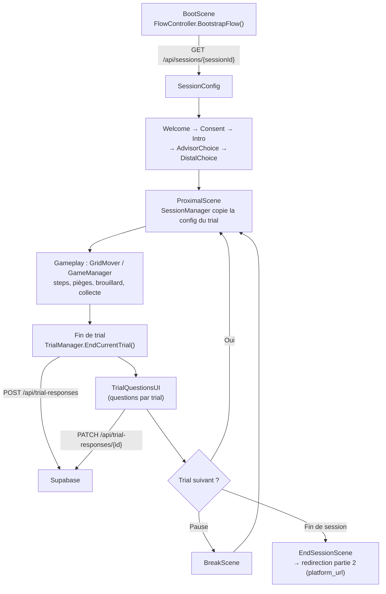

# BUGS — jeu de collecte de bugs sur grille (étude de recherche)

Unity **6000.3.5f2** · URP 17.3.0 · New Input System · WebGL. Version build : `BuildInfo.Version` (**1.1.0**).

Le participant se déplace sur une grille pour collecter des nuages de bugs en évitant des pièges,
dans un flow expérimental multi-écrans piloté par une configuration de session distante.
La documentation détaillée vit dans `Docs/` (`Docs/TDD.md`, specs, dictionnaire de données).

## Flow actuel

- **Boot** : `BootScene` → `FlowController.BootstrapFlow()` lit le seul argument supporté,
  `sessionId=<id>` (URL param en WebGL, fallback éditeur), puis charge la config de session
  via `GET {root}/api/sessions/{id}`.
- **Scènes** : Boot → Welcome → Consent → Intro → AdvisorChoice → DistalChoice → Proximal
  (trials) → Break (pauses) → EndSession (redirection vers la partie 2 via `platform_url`).
  `QuestionnaireScene` est présente au build mais non câblée dans le flow.
- **Données** : une ligne par trial non-tutorial, envoyée par `TrialManager`/`ApiClient` en
  `POST /api/trial-responses`, complétée par `PATCH /api/trial-responses/{id}` (questionnaire
  de fin de bloc). Codebook : `Docs/validation/dictionnaire-donnees.md`.

